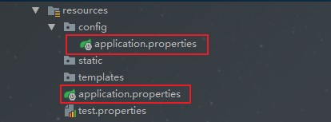

## 介绍

Spring Boot使用了一个全局的配置文件application.properties，放在src/main/resources目录下或者类路径的/config下。Sping Boot的全局配置文件的作用是对一些默认配置的配置值进行修改。比如自定义应用端口号(比较在机器比较少的情况下，一台机器还是需要部署多个应用的，当然利用docker的话，是可避免的，这是后话了)、mq的服务地址、缓存服务的服务地址、数据库的配置等，都或多或少的需要一些外部的配置项等。

<!-- more -->

springboot默认的全局配置文件名为application.properties或者application.yml（spring官方推荐使用的格式是.yml格式），除此之外还有一个bootstrap的全局文件，它的加载顺序在application配置文件之前，主要是用于在应用程序上下文的引导阶段，springCloudCofnig主要是利用此特性，进行配置文件的动态修改。

### 自定义配置

application.properties提供自定义属性的支持，这样我们就可以把一些常量配置在这里：

~~~java
server.port = 8989
com.dodd.name = "dodd"
com.dodd.want = "learn spring boot!"
~~~

然后直接在要使用的地方通过注解`@Value(value="${config.name}")`就可以绑定到你想要的属性上面：

~~~java
@RestController
public class UserController {

    @Value("${com.dodd.name}")
    private  String name;
    @Value("${com.dodd.want}")
    private  String want;

    @RequestMapping("/")
    public String hexo(){
        return name+","+want;
    }
}
~~~

有时候属性太多了，一个个绑定到属性字段上太累，官方提倡绑定一个对象的bean，这里我们建一个ConfigBean.java类，顶部需要使用注解`@ConfigurationProperties(prefix = "com.dodd")`来指明使用哪个：

~~~java
//前缀.属性 com.dodd是properties属性com.dodd.name的前缀
@ConfigurationProperties(prefix = "com.dodd")
public class ConfigBean {
    private String name;
    private String want;

    // 省略getter和setter
}
~~~

这里配置完还需要在spring Boot入口类加上`@EnableConfigurationProperties`并指明要加载哪个bean，如果不写ConfigBean.class，在bean类那边添加：bean类这里可直接加入@Component使其在启动时被自动扫描到，或者使用@EnableConfigurationProperties注解注册此实体bean. 

~~~java
@SpringBootApplication
@EnableConfigurationProperties({ConfigBean.class})
public class DemoApplication {

    public static void main(String[] args) {
        SpringApplication.run(DemoApplication.class, args);
    }
}
~~~

最后在Controller中引入ConfigBean使用即可，如下：

~~~java
@RestController
public class UserController {
    @Autowired
    ConfigBean configBean;

    @RequestMapping("/")
    public String hexo(){
        return configBean.getName()+configBean.getWant();
    }
}
~~~

这里需要注意，由于springboot在读取properties文件时，使用的是PropertiesPropertySourceLoader类进行读取，默认读取的编码是ISO 8859-1，故在默认的配置文件中使用中文时，会出现乱码，此时可以将中文转成Unicode编码或者使用yml配置格式（默认就支持utf-8），再不济可以将作为配置写入到一个自定义配置文件，利用@PropertySource注解的encoding属性指定编码。下面是中文乱码的一种解决方法：

1. 添加配置

   ~~~java
   #设置spring-boot 编码格式
   banner.charset=UTF-8
   server.tomcat.uri-encoding=UTF-8
   spring.http.encoding.charset=UTF-8
   spring.http.encoding.enabled=true
   spring.http.encoding.force=true
   spring.messages.encoding=UTF-8
   ~~~

2. 设置文件类型

   将`application.properites`的文件类型修改为UTF-8的编码类型。 通过以上方法测试获取出来的值还是乱码。

3. 解决方法

   IDEA：依次点击 File -> Settings -> Editor -> File Encodings 将Properties Files (*.properties)下的Default encoding for properties files设置为UTF-8，将Transparent native-to-ascii conversion前的勾选上。

### 参数间调用

在application.properties中的各个参数之间也可以直接引用来使用，就像下面的设置：

~~~java
com.dodd.name="dodd"
com.dodd.want="learn spring boot!"
com.dodd.message=${com.dodd.name}want${com.dodd.want}
~~~

### 自定义配置文件

定义一个名为test.properties，路径跟也放在src/main/resources下面：

~~~java
com.dodd.name = "dodd"
com.dodd.want = "learn spring boot!"
~~~

新建一个bean类，如下：

~~~java
@Configuration
@ConfigurationProperties(prefix = "com.dodd") 
@PropertySource("classpath:test.properties")
public class ConfigTestBean {
    private String name;
    private String want;
    // 省略getter和setter
}
~~~

或者在主类手动引入：

~~~java
@SpringBootApplication
@PropertySource(value="classpath:test.properties",encoding="utf-8")
public class Chapter3Application {
    public static void main(String[] args) {
        SpringApplication.run(Chapter3Application.class, args);
    }
}
~~~

利用@PropertySource注解既可以引入配置文件，需要引入多个时，可使用@PropertySources设置数组，引入多个文件。

这里要注意有一个问题，如果你使用的是1.5以前的版本，那么可以通过locations指定properties文件的位置，这样：

~~~java
@ConfigurationProperties(prefix = "com.dodd",locations="classpath:test.properties")
~~~

但是1.5版本后就没有这个属性了，添加`@Configuration`和`@PropertySource("classpath:test.properties")`后才可以读取。

### 随机值配置

配置文件中${random} 可以用来生成各种不同类型的随机值，从而简化了代码生成的麻烦，例如 生成 int 值、long 值或者 string 字符串：

~~~java
#随机字符串
dodd.secret=${random.value}
dodd.number=${random.int}
dodd.bignumber=${random.long}
dodd.uuid=${random.uuid}
dodd.number.less.than.ten=${random.int(10)}
dodd.number.in.range=${random.int[1024,65536]}
~~~

### 数组形式

配置文件：

~~~java
dodd.name="dodd"
dodd.hobby[0]="看电影"
dodd.hobby[1]="桌游"
~~~

实体类：

~~~java
@Component
//@EnableConfigurationProperties(value= {DoddConfig.class}) 注解注册此实体bean
@ConfigurationProperties(prefix="dodd")
@Data
public class DoddConfig {
    String name;
    List<String> hobby;
    // 省略getter和setter
}
~~~

测试类：

~~~java
@RestController
public class DemoController {

    @Autowired
    DoddConfig doddConfig;

    @RequestMapping("/hobby")
    public String hobby(){
        return doddConfig.getName() + " 爱好是：" + doddConfig.getHobby();
    }
}
// dodd 爱好是：[看电影, 桌游]
~~~

### 外部配置

Spring Boot是基于jar包运行的，打成jar包的程序可以直接通过下面命令运行：

~~~java
java -jar xx.jar
//可以以下命令修改tomcat端口号：
java -jar xx.jar --server.port=9090
//命令行中连续的两个减号--就是对application.properties中的属性值进行赋值的标识
~~~

实际上，Spring Boot应用程序有多种设置途径，Spring Boot能从多重属性源获得属性，包括如下几种：

- 根目录下的开发工具全局设置属性（当开发工具激活时为`~/.spring-boot-devtools.properties`）
- 测试中的@TestPropertySource注解
- 测试中的@SpringBootTest#properties注解特性
- 命令行参数
- `SPRING_APPLICATION_JSON`中的属性（环境变量或系统属性中的内联JSON嵌入）
- `ServletConfig`初始化参数
- `ServletContext`初始化参数
- java:comp/env里的JNDI属性
- JVM系统属性
- 操作系统环境变量
- 随机生成的带random.* 前缀的属性（在设置其他属性时，可以应用他们，比如${random.long}）
- 应用程序以外的application.properties或者appliaction.yml文件
- 打包在应用程序内的application.properties或者appliaction.yml文件
- 通过@PropertySource标注的属性源
- 默认属性（通过`SpringApplication.setDefaultProperties`指定）

这里列表按组优先级排序，也就是说，任何在高优先级属性源里设置的属性都会覆盖低优先级的相同属性，例如我们上面提到的命令行属性就覆盖了application.properties的属性。

### 配置文件优先级

application.properties和application.yml文件可以放在以下四个位置：

- 外置，在相对于应用程序运行目录的/congfig子目录里。
- 外置，在应用程序运行的目录里
- 内置，在config包内
- 内置，在Classpath根目录

以上按照优先级排序，也就是说，src/main/resources/config下application.properties覆盖src/main/resources下application.properties中相同的属性，如图：

此外，如果你在相同优先级位置同时有application.properties和application.yml，那么application.properties里的属性里面的属性就会覆盖application.yml。

### 多环境配置

在Spring Boot中多环境配置文件名需要满足`application-{profile}.properties`的格式，其中`{profile}`对应你的环境标识，比如：

- application-dev.properties：开发环境
- application-prod.properties：生产环境

想要使用对应的环境，只需要在application.properties中使用spring.profiles.active属性来设置，值对应上面提到的{profile}，这里就是指dev、prod这2个。
当然你也可以用命令行启动的时候带上参数：

~~~java
java -jar xxx.jar --spring.profiles.active=dev
~~~

除了可以用profile的配置文件来分区配置我们的环境变量，在代码里，我们还可以直接用@Profile注解来进行配置，例如数据库配置，这里我们先定义一个接口：

~~~java
public  interface DBConnector { 
    void  configure(); 
}
~~~

分别定义俩个实现类来实现它：

~~~java
/**
  * 测试数据库
  */
@Component
@Profile("testdb")
public class TestDBConnector implements DBConnector {
    @Override
    public void configure() {
        System.out.println("testdb");
    }
}
/**
 * 生产数据库
 */
@Component
@Profile("devdb")
public class DevDBConnector implements DBConnector {
    @Override
    public void configure() {
        System.out.println("devdb");
    }
}
~~~

通过在配置文件激活具体使用哪个实现类：

~~~java
spring.profiles.active=testdb
~~~

然后就可以这么用了：

~~~java
@RestController
@RequestMapping("/task")
public class TaskController {

    @Autowired DBConnector connector ;

    @RequestMapping(value = {"/",""})
    public String hellTask(){

        connector.configure(); //最终打印testdb     
        return "hello task !! myage is " + myage;
    }
}
~~~

除了spring.profiles.active来激活一个或者多个profile之外，还可以用spring.profiles.include来叠加profile：

~~~java
spring.profiles.active: testdb  
spring.profiles.include: proddb,testdb
~~~

### 参考

[springboot常用属性汇总](https://docs.spring.io/spring-boot/docs/current/reference/html/common-application-properties.html)