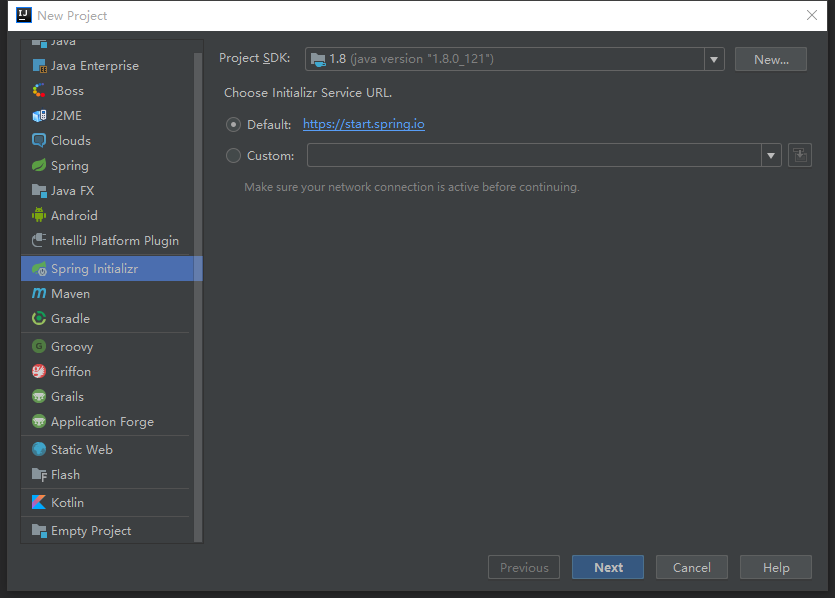
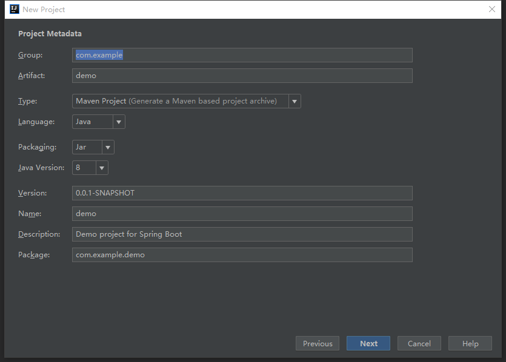
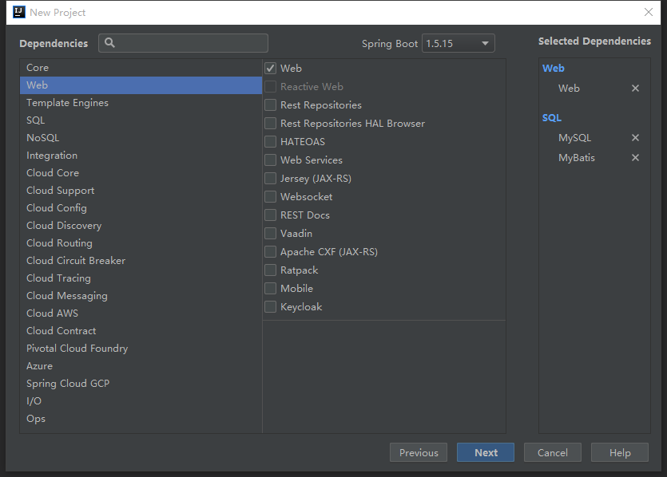
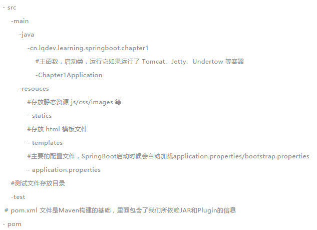
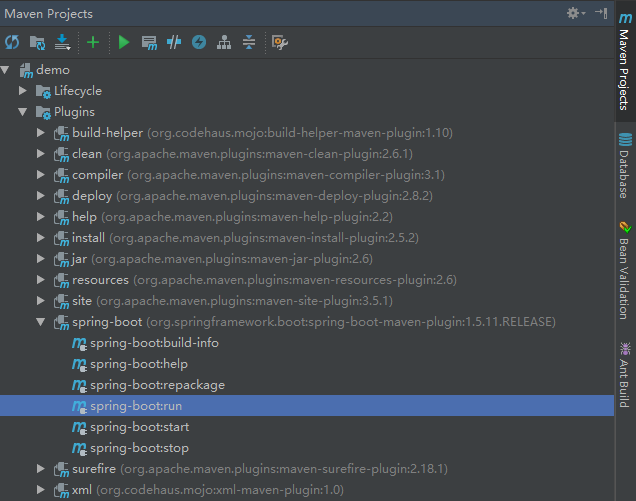
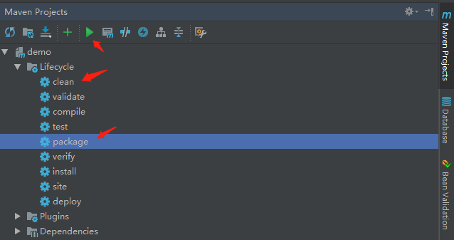
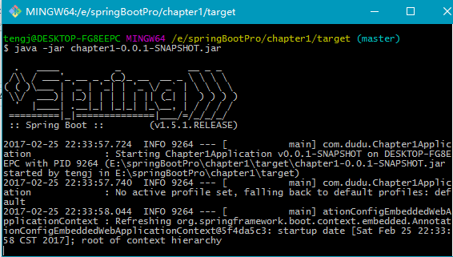

### 介绍

从本质上来说，Spring Boot就是Spring，它做了那些没有它你也会去做的Spring Bean配置。它使用`习惯优于配置`（项目中存在大量的配置，此外还内置了一个习惯性的配置，让你无需手动进行配置）的理念让你的项目快速运行起来。使用Spring Boot很容易创建一个独立运行（运行jar，内嵌Servlet容器）、准生产级别的基于Spring框架的项目，使用Spring Boot你可以不用或者只需要很少的Spring配置。

<!-- more -->

### Spring Boot的核心功能

1. 独立运行的Spring项目

   Spring Boot可以以jar包的形式独立运行，运行一个Spring Boot项目只需要通过`java -jar xx.jar`。

2. 内置Servlet容器

   Spring Boot可选择内嵌Tomcat、Jetty或者Undertow，这样无须以war包形式部署。

3. 提供starter简化maven配置

   Spring提供了一系列的starter pom来简化maven依赖加载，例如：当你使用了spring-boot-starter-web时，会自动加入相关依赖，无需你手动一个一个的添加坐标依赖。

4. 自动配置Spring

   Spring Boot会根据在类路径中的jar包、类，为jar包里的类自动配置Bean，这样会极大地减少我们要使用的配置。当然，Spring Boot只是考虑了大多数的开发场景，并不是所有场景，若在实际开发中，我们需要自动配置bean，而Spring Boot没有提供支持，则可以自定义自动配置。

5. 无代码生成和xml配置

   Spring Boot的神奇的不是借助于代码生成来实现的，而是通过条件注解来实现的，这是Spring 4.x提供的新特性，Spring 4.x提倡使用java配置和注解配置相结合，而Spring Boot不需要任何xml配置即可实现Sping Boot的所有配置。

### 项目搭建

1. 利用**Spring Initializr**进行快速创建项目

   选择file–>new–>project，打开创建面板，这里url建议选择默认(默认是http方式)

   

2. 填写项目信息

   

   maven相关命名说明:

   - Group：一般为逆向域名格式，如com.dodd开头。
   - Artifact：唯一标识，一般为项目名称。

3. 选择依赖包和版本

   

   springBoot版本建议选择非最新版本，太新的版本在搭建springcloud项目时可能会出现问题。

4. 项目结构

   

5. pom依赖

   由于使用了Spring Initializr直接创建项目，相关依赖自动添加好了。pom解析：

   - Spring Boot父级依赖

     ~~~java
     <parent>
             <groupId>org.springframework.boot</groupId>
             <artifactId>spring-boot-starter-parent</artifactId>
             <version>1.5.11.RELEASE</version>
             <relativePath/> <!-- lookup parent from repository -->
     </parent>
     ~~~

     有了这个，当前的项目就是Spring Boot项目了，spring-boot-starter-parent是一个特殊的starter,它用来提供相关的Maven默认依赖，使用它之后，常用的包依赖可以省去version标签。

     如果你不想使用某个依赖默认的版本，可以通过覆盖自己的项目中的属性来覆盖各个依赖项，例如，要升级到另一个Spring Data版本系列，可以将以下内容添加到pom.xml中：

     ~~~java
     <properties><!-- 原来版本是Fowler-SR1 -->
         <spring-data-releasetrain.version>Fowler-SR2</spring-data-releasetrain.version>
     </properties>
     ~~~

     如果你不想使用spring-boot-starter-parent，可以通过使用scope = import依赖关系来保持依赖关系管理：

     ~~~java
     <dependencyManagement>
          <dependencies>
             <dependency>
                 <!-- Import dependency management from Spring Boot -->
                 <groupId>org.springframework.boot</groupId>
                 <artifactId>spring-boot-dependencies</artifactId>
                 <version>1.5.11.RELEASE</version>
                 <type>pom</type>
                 <scope>import</scope>
             </dependency>
         </dependencies>
     </dependencyManagement>
     ~~~

     说明：该设置不允许使用如上所述的属性(properties)覆盖各个依赖项，要实现相同的结果，需要在spring-boot-dependencies项之前的项目的dependencyManagement中添加一个配置，例如：

     ~~~java
     <dependencyManagement>
         <dependencies>
             <!-- Override Spring Data release train provided by Spring Boot -->
             <dependency>
                 <groupId>org.springframework.data</groupId>
                 <artifactId>spring-data-releasetrain</artifactId>
                 <version>Fowler-SR2</version>
                 <scope>import</scope>
                 <type>pom</type>
             </dependency>
             <dependency>
                 <groupId>org.springframework.boot</groupId>
                 <artifactId>spring-boot-dependencies</artifactId>
                 <version>1.5.11.RELEASE</version>
                 <type>pom</type>
                 <scope>import</scope>
             </dependency>
         </dependencies>
     </dependencyManagement>
     ~~~

   - 起步依赖 spring-boot-starter-xx

     Spring Boot提供了很多**开箱即用 **的依赖模块，都是以**spring-boot-starter-xx**作为命名的。自动给你封装好了你想要实现的功能的依赖。就比如要实现web功能，引入了spring-boot-starter-web这个起步依赖。Spring Boot通过提供众多起步依赖降低项目依赖的复杂度。起步依赖本质上是一个Maven项目对象模型（**Project Object Model，POM **），定义了对其他库的传递依赖，这些东西加在一起即支持某项功能。很多起步依赖的命名都暗示了它们提供的某种或者某类功能。

   - Spring Boot Maven插件

     ~~~java
     <build>
          <plugins>
                 <plugin>
                     <groupId>org.springframework.boot</groupId>
                     <artifactId>spring-boot-maven-plugin</artifactId>
                 </plugin>
           </plugins>
     </build>
     ~~~

     Spring Boot Maven插件提供了许多方便的功能：

     - 把项目打包成一个可执行的超级JAR（uber-JAR）,包括把应用程序的所有依赖打入JAR文件内，并为JAR添加一个描述文件，其中的内容能让你用java -jar来运行应用程序。
     - 搜索public static void main()方法来标记为可运行类。

### 项目运行

1. 主入口

   ~~~java
   /**
    * 启动类
    * @author dodd
    */
   @SpringBootApplication
   @MapperScan("com.dodd.demo.mapper")
   public class DemoApplication {

       public static void main(String[] args) {
           SpringApplication.run(DemoApplication.class, args);
       }
   }
   ~~~

   - **@SpringBootApplication **是Sprnig Boot项目的核心注解，主要目的是开启自动配置。
   - main方法这是一个标准的Java应用的main的方法，主要作用是作为项目启动的入口。

2. controller

   Controller类主要与前台交互，返回json数据

   ~~~java
   @RestController
   public class DemoController {
       private Logger logger = LoggerFactory.getLogger(DemoController.class);

       @Autowired
       private DemoService demoService;

       @RequestMapping("/hello")
       public DemoResponse hello() {
           logger.info("输出Hello World!");
           String message = demoService.getMessage(); // String message = "Hello World!";
           DemoResponse response = DemoResponse.sussess(message);
           logger.info("输出Hello World!, 返回结果: {}", JacksonUtil.toJSONString(response));
           return response;
       }
   }
   ~~~

   - **@RestController **注解等价于**@Controller **+**@ResponseBody **的结合，使用这个注解的类里面的方法都以**json **格式输出。

3. service

   Service类主要实现业务逻辑

   ~~~java
   @Service
   public class DemoService {
       @Autowired
       private DemoMapper demoMapper;

       public String getMessage() {
          return demoMapper.getMessage();
       }
   ~~~

4. mapper

   Mapper类定义相关接口

   ~~~java
   @Repository
   public interface DemoMapper {
       //mapper的insert不能使用前端VO，要使用实体类
     	//注解当时需要在类上加@Mapper注解
       @Insert("insert into dodd(MESSAGE, STATUS) values(#{message},#{status})")
       void insertDodd(Dodd dodd);

       String getMessage(DoddRequest doddRequest);
   }
   ~~~

5. mapper.xml

   springBoot使用mybatis的两种方式：一种是注解方式，使用与简单的sql；还有一种是xml方式，xml方式比较强大，使用更多灵活性。

   ~~~java
   <mapper namespace="com.dodd.demo.DemoMapper">
       <resultMap id="dodd" type="com.dodd.demo.entity.Dodd">
           <result column="ID" property="id"/>
           <result column="MESSAGE" property="message"/>
           <result column="STATUS" property="status"/>
       </resultMap>

       <select id="dodd" parameterType="com.dodd.demo.entity.request.DoddRequest" resultMap="dodd">
           select * from dodd where 1 = 1
           <if test="status != null">
               AND STATUS = #{status}
           </if>
           ORDER BY status;
       </select>
   </mapper>
   ~~~

6. application.properties

   一个空的properties文件，你可以根据需要添加配置属性。

   ~~~java
   #服务信息
   spring.application.name=dodd-pc
   server.port=8080

   #关闭安全限制，可以通过actuator提供的接口看到更多信息
   management.security.enabled=false

   #数据源相关配置
   spring.datasource.url=jdbc:mysql://127.0.0.1:3306/dodd?useUnicode=true&characterEncoding=utf8&useSSL=false
   spring.datasource.username=***
   spring.datasource.password=***
   spring.datasource.driver-class-name=com.mysql.jdbc.Driver
   ~~~

   **注意：**数据源相关配置同上，是以`spring.datasource`开头，而不是`jdbc`开头，踩过的坑之一，项目启动失败，找到原因是数据源这里配置是以jdbc开头导致。

7. 项目启动

   - 方式一：Application的main方法：

     > Run 'Application' 或 Debug 'Application'

   - 方式二：使用命令 mvn spring-boot:run”在命令行启动该应用，IDEA中该命令在如下位置：

     

   - 方式三：运行“mvn package”进行打包时，会打包成一个可以直接运行的 JAR 文件，使用“java -jar”命令就可以直接运行：

     

     

   打开浏览器访问[http://localhost:8080](http://localhost:8080/), 就能看到页面显示Hello World!，一个简单的spring boot项目创建成功。