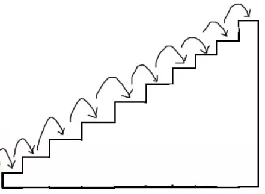
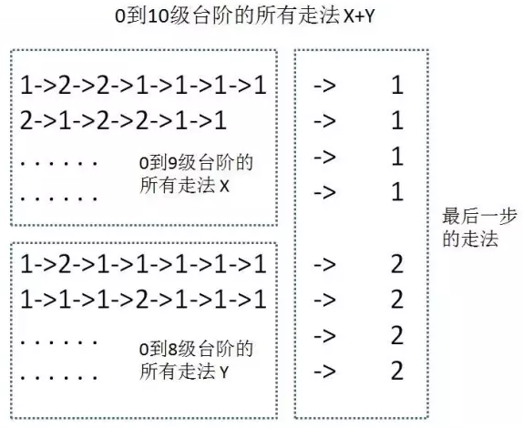
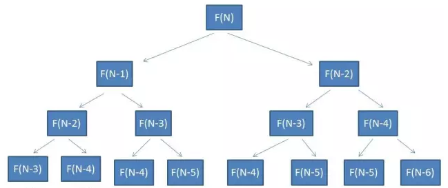
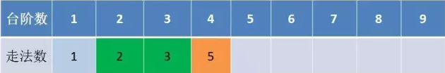
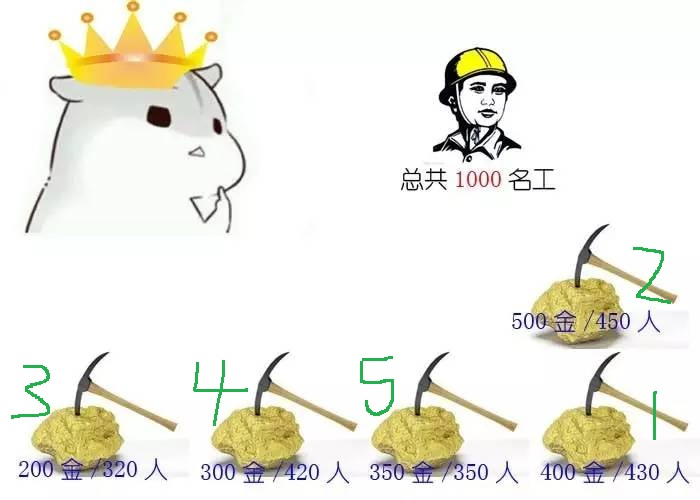

# 初识动态规划

有一座高度是**10**级台阶的楼梯，从下往上走，每跨一步只能向上**1**级或者**2**级台阶。要求用程序来求出一共有多少种走法。

比如，每次走1级台阶，一共走10步，这是其中一种走法。我们可以简写成 1,1,1,1,1,1,1,1,1,1。



<!-- more -->

## 思路

1. 可以利用排列组合的思想，写一个多层嵌套循环遍历出所有的可能性，没遍历出一个组合，计数器加一

   > 这是暴力枚举，时间复杂度是指数级的

2. 要不找个楼梯走一下，正好可以减肥

   > 你走下试试，捂脸

3. 使用动态规划思想

## 动态规划简介

动态规划Dynamic Programming，是一种分阶段求解决策问题的数学思想。不止用于编程领域，也应用于管理学、经济学、生物学。总结起来就是大事化小，小事化了。动态规划中的三个重要概念：[最优子结构]、[边界]、[状态转移公式]。这些后续再更新

## 动态规划解决思路

1. 我们先不管前面怎么走，要想走到第10级台阶，最后一步必然是从第8级或者第9级开始

   > 设从0到9级台阶的走法有X种，0到8级台阶的走法有Y种

2. 10级台阶的所有走法可以根据最后一步的不同分成两部分，8级台阶的走法和9级台阶的走法

   > 所以总的走法数量就是X+Y : F(10)=F(9)+F(8)

   

3. 所以可以得出结论：

   > F(1)=1 (n=1);
   >
   > F(2)=2 (n=2); 
   >
   > F(n)=F(n-1)+F(n-2)  (n>=3)

4. 所以F[9]和F[8]是F[10]的【最优子结构】，F[1]和F[2]是问题的【边界】，F[n]=F[n-1]+F[n-2]是阶段间的【状态转移方程】

5. 方法一：递归求解

   ```java
   int getPaceCount(int n){
       if(n < 1){
   		return 0;
       }
       if(n == 1){
             return 1;
         }
       if(n == 2){
             return 2;
         }
     	
     	return getPaceCount(n-1) + getPaceCount(n-2);
   }
   ```

   * 时间复杂度

     

     要计算F[n]就得先计算F[n-1]和F[n-2]，以此类推，树的节点个数就是递归方法需要计算的次数。这颗树的高度是n-1，节点个数接近2的n-1次方，所以方法的时间复杂度约为O(2^N)。

6. 方法二：备忘录算法

   - 从上面的递归图可以看出相同的参数被重复计算了，所以优化的话我们可以用缓存，先建一个哈希表，每次把不同参数的计算结果存入哈希表，当遇到相同参数时，再从哈希表里取出就不用重复计算了。这种暂存计算的方式叫做【备忘录算法】

     ```java
     int getPaceCount(int n, HashMap<Integer, Integer> result){
         if(n < 1){
     		return 0;
         }
         if(n == 1){
             return 1;
           }
         if(n == 2){
             return 2;
           }
       	if(result.contains(n)){
          	return result.get(n);
       	}else{
           	int value = getPaceCount(n-1) + getPaceCount(n-2);
          	result.put(n,value);
           	return value;
       	}
     }
     ```

   - 从F[1]到F[n]一共有n个不同输入，在哈希表中存了n-2个结果，所以这种算法的时间复杂度和空间复杂度都是O(N)

7. 方法三：动态规划算法

   * 上面的备忘录算法时间复杂度已经不能再小了，而且上面两个方法都是自顶向下的。

   * 下面是自底向上的动态规划思想求解过程：

     

     第一次迭代时，台阶数是3，走法是3，走法F[3]只依赖于F[1]和F[2]；第二次迭代时，台阶是4，走法是5，走法F[4]只依赖于F[3]和F[2]。由此可见，每次迭代过程中，只要保留之前的两个状态，就可以推导出新的状态，而不需要像备忘录算法那样保留全部的子状态。

   * 动态规划代码实现：

     ```java
     int getPaceCount(int n){
         if(n < 1){
     		return 0;
         }
         if(n == 1){
             return 1;
           }
         if(n == 2){
             return 2;
           }
       	int a = 1;
       	int b = 2;
       	int temp = 0;
       	for(int i=3; i<=n; i++){
           	temp = a + b;
           	a = b;
           	b = temp;
       	}
       	return temp;
     }
     ```

     程序从 i=3 开始迭代，一直到 i=n 结束。每一次迭代，都会计算出多一级台阶的走法数量。迭代过程中只需保留两个临时变量a和b，分别代表了上一次和上上次迭代的结果。 为了便于理解，我引入了temp变量。temp代表了当前迭代的结果值。

   * 这样动态规划时间复杂度是O(N)，由于只引入了两三个变量，所以空间复杂度只有O(1)，利用简介的自底向上的递推方式，实现了时间和空间的最优化

## 国王和金矿问题

有一个国家发现了5座金矿，每座金矿的黄金储量不同，需要参与挖掘的工人数也不同。参与挖矿工人的总数是10人。每座金矿要么全挖，要么不挖，不能派出一半人挖取一半金矿。要求用程序求解出，要想得到尽可能多的黄金，应该选择挖取哪几座金矿？



### 最优子结构


## 总结

