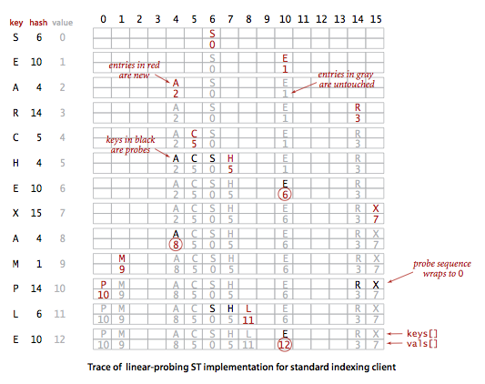
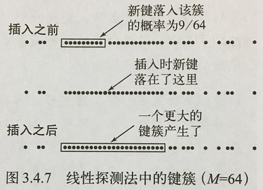

## 介绍

用一个数组来实现无序的符号表，将键作为数组的索引而数组中键i处存储的就是它对应的值。这样我们就可以快速访问任意键的值。**散列表**就是这种简易方法的扩展并能够处理更加复杂的类型的键。我们需要用算术操作将键转化为数组的索引来访问数组中的键值对。

使用散列的查找算法分为两步。第一步是用**散列函数**将被查找的键转化为数组的一个索引。第二步是一个**处理碰撞冲突**的过程。两种解决碰撞的方法：**拉链法** 和 **线性探测法** 。散列表的核心问题碰撞冲突如下图：

<!-- more -->

散列表是算法在**时间** 和 **空间上作出权衡** 的经典例子。如果没有内存限制，我们可以直接将键作为数组的索引，那么所有查找操作只需要访问内存一次即可完成。另一方面，如果没有时间限制，我们可以使用无序数组并进行顺序查找，这样就只需要很少的内存。事实上，只需要调整散列表的参数就可以在空间和时间之间做出取舍。

## 散列函数

散列函数能够将键转化为数组的索引。散列函数和键的类型有关。严格来说，**对于每种类型的键我们都需要一个与之对应的散列函数** 。如果键是一个数，那我们就可以直接使用这个数；如果键是一个字符串，我们就需要将这个字符串转化为一个数；如果键含有多个部分，比如邮件地址，我们需要用某种方法将这些部分结合起来。

### 1. 正整数

将整数散列最常用的方法是**除留余数法** 。我们选择大小为素数M的数组，对于任意正整数k，计算k除以M的余数 。这个计算能够有效地将键散布在0到M-1的范围内。除留余数法如下图：

### 2. 浮点数

如果键是0到1之间的实数，我们可以将它乘以M并四舍五入得到一个0至M-1之间的索引值。但这个方法是有缺陷的，因为这种情况下键的高位起的作用更大，最低位对散列的结果没有影响。修正这个问题的办法是将键表示为二进制数然后再使用除留余数法（java是这么做的）。

### 3. 字符串

除留余数法可以处理较长的键，例如字符串，我们只需将它们当作大整数即可。下面代码是用除留余数法计算String s的散列值：

~~~java
int hash = 0;
for(int i = 0; i < s.length(); i++){
  	hash = (R * hash + s.charAt(i)) % M;
}
~~~

java的charAt()函数能够返回一个char值，即一个非负16位整数。如果R比任何字符的值都大，这种计算相当于将字符串当作一个N位的R进制值，将它除以M并取余。一种叫Horner方法的经典算法用N次乘法、加法和取余来计算一个字符串的散列值。只要R足够小，不造成溢出，那么结果就能够如我们所愿，落在0至M-1内。使用一个较小的素数，例如31，可以保证字符串中的所有字符都能发挥作用。java的String的默认实现使用了一个类似的方法。

### 4. 组合键

如果键的类型含有多个整形变量，我们可以和String类型一样将它们混合起来。例如，假设被查找的键的类型是Date，其中含有几个整形的域：day，month和year。我们可以这样计算它的散列值：

~~~java
int hash = (((day * R + month) % M) * R + year) % M;
~~~

### 5. java的约定

每种数据类型都需要相应的散列函数，于是java令所有数据类型都继承了一个能够返回一个32比特整数的hashCode()方法。每一种数据类型的hashCode()方法都必须和equals()方法一致。这说明如果你要为自定义的数据类型定义散列函数，你需要同时重写hashCode()和equals()两个方法。默认散列函数会返回对象的内存地址，但这只适用于很少的情况。java为很多常用的数据类型重写了hashCode()方法（包括String、Integer、Double、File和URL）。

### 6. 将hashCode()的返回值转化为一个数组索引

因为我们需要的是数组的索引而不是一个32位整数，我们在实现中会将默认的hashCode()方法和除留余数法结合起来产生一个0到M-1的整数。方法如下：

~~~java
private int hash(Key x){
  	return (x.hashCode() & 0x7fffffff) % M;
}
~~~

这段代码会将符号位屏蔽（将一个32位整数变为一个31位非负整数），然后用除留余数法计算它除以M的余数。

### 7. 自定义的hashCode()方法

散列表的用例希望hashCode()方法能够将键平均地散布为所有可能的32位整数。在java中所有数据类型都继承了hashCode()方法，因此我们可以将对象中的每个变量的hashCode()返回值转化为32位整数并计算得到散列值。如下：

~~~java
public class Transaction{
  	private final String who;
  	private final Date when;
  	private final double amount;
  
  	public int hashCode(){
      	int hash = 17;
      	hash = 31 * hash + who.hashCode();
      	hash = 31 * hash + when.hashCode();
      	hash = 31 * hash + ((Double) amount).hashCode();
      	return hash;
  	}
}
~~~

对于原始类型的对象，可以将其转化为对应的数据类型然后再调用hashCode()方法。

### 8. 软缓存

如果散列值的计算很耗时，可以将每个键的散列值缓存起来，即在每个键中使用一个hash变量来保存它的hashCode()的返回值。java中的String对象的hashCode()方法就是使用了这种缓存方法来减少计算量。总的来说，要为一个数据类型实现一个优秀的散列方法需要满足三个条件：

- 一致性：等价的键必然产生相等的散列值；
- 高效性：计算简便；
- 均匀性：均匀地散列所有的键。

## 基于拉链法的散列表

散列算法的第二步是碰撞处理，也就是处理两个或多个键的散列值相同的情况。一种直接的办法是将大小为M的数组中的每个元素指向一条链表，链表中的每个结点都存储了散列值为该元素的索引的键值对。这种方法称为**拉链法** 。查找分两步：首先根据散列值找到对应的链表，然后沿着链表顺序查找相应的键。

基于拉链法的散列表SeparateChainingHashST使用了一个SequentialSearchST对象的数组，在put()和get()的实现中先计算散列函数来选定被查找的SequentialSearchST对象，然后使用符号表的put()和get()方法来完成相应的任务。

标准索引用例使用基于拉链法的散列表如下图所示：

基于拉链法的散列表：

~~~java
public class SeparateChainingHashST<Key, Value> {
    private static final int INIT_CAPACITY = 997;
    private int n;                                // 键值对总数
    private int m;                                // 散列表的大小
    private SequentialSearchST<Key, Value>[] st;  // 存放链表对象的数组

    public SeparateChainingHashST() {
        this(INIT_CAPACITY);
    } 
    //创建m条链表
    public SeparateChainingHashST(int m) {
        this.m = m;
        st = (SequentialSearchST<Key, Value>[]) new SequentialSearchST[m];
        for (int i = 0; i < m; i++)
            st[i] = new SequentialSearchST<Key, Value>();
    } 

    // hash value between 0 and m-1
    private int hash(Key key) {
        return (key.hashCode() & 0x7fffffff) % m;
    } 
  
  	public Value get(Key key) {
        int i = hash(key);
        return (Value)st[i].get(key);
    } 
  
  	public void put(Key key, Value val) {
        if (val == null) {
            delete(key);
            return;
        }
        // double table size if average length of list >= 10
        if (n >= 10*m) resize(2*m);
        int i = hash(key);
        if (!st[i].contains(key)) n++;
        st[i].put(key, val);
    }
  
   	public Iterable<Key> keys() {
        Queue<Key> queue = new Queue<Key>();
        for (int i = 0; i < m; i++) {
            for (Key key : st[i].keys())
                queue.enqueue(key);
        }
        return queue;
    } 
}
~~~

这段符号表的实现维护着一条链表的数组，用散列函数来为每个键选择一条链表。在创建st[]时需要进行类型转换，因为java不允许泛型的数组。默认的构造函数使用了997条链表，当能够预知所需要的符号表的大小时，这种方案能够得到不错的性能，一种更可靠的方案是动态调整链表数组的大小。**在一张含有M条链条和N个键的散列表中，未命中查找和插入操作所需的比较次数为~N/M** 。

### 散列表的大小

在实习拉链法的散列表时，我们的目标是选择适当的数组大小M，既不会因为空链表而浪费大量内存，也不会因为链表太长而在查找上浪费太多时间。而拉链法的一个好处就是这不是关键性的选择。如果存入的键多于预期，查找所需的时间只会比选择更大的数组稍长；如果少于预期，虽然有些浪费空间但查找会非常快。当内存不是很紧张时，可以选择一个足够大的M，使得查找变为常数；当内存紧张时，选择尽量大的M仍然能将性能提高M倍。

###  动态调整数组大小

对于拉链法，如果能准确地估计用例所需的散列表大小N，调整数组大小的工作并不是必须的，只需要根据查找耗时和（1+N/M）成正比来选取一个适当的M即可。

~~~java
private void resize(int chains) {
      SeparateChainingHashST<Key, Value> temp = new SeparateChainingHashST<Key, Value>(chains);
      for (int i = 0; i < m; i++) {
          for (Key key : st[i].keys()) {
              temp.put(key, st[i].get(key));
          }
      }
      this.m  = temp.m;
      this.n  = temp.n;
      this.st = temp.st;
}
~~~

### 删除操作

要删除一个键值对，先用散列值找到含有该键的SequentialSearchST对象，然后调用该对象的delete()方法。

~~~java
public void delete(Key key) {
      int i = hash(key);
      if (st[i].contains(key)) n--;
      st[i].delete(key);

      // halve table size if average length of list <= 2
      if (m > INIT_CAPACITY && n <= 2*m) resize(m/2);
} 
~~~

### 有序性相关操作

散列最主要的饿目的在于均匀地将键散布开来，因此在计算散列后键的顺序信息就丢失了。所以要实现有序符号表的有序性相关操作，散列表不是合适的选择。在键的顺序不重要的应用中，它可能是最快的（也是使用最广泛的）符号表实现。当使用java的内置数据类型作为键，或是在使用含有经过完善测试的hashCode()方法的自定义类型作为键时，基于拉链法散列表算法能够提供快速而方便的查找和插入操作。

## 基于线性探测法的散列表

实现散列表的另一种方式是用大小为M的数组保存N个键值对，其中M>N。我们需要依靠数组汇中的**空位**解决碰撞冲突。基于这种策略的所有方法被统称为**开放地址散列表** 。开放地址散列表中最简单的方法叫做**线性探测法** ：当碰撞发生时（当一个键的散列值已经被另一个不同的键占用），我们直接检查散列表中的下一个位置（将索引值加1）。这样的线性探测可能产生三种结果：

- 命中，该位置的键和被查找的键相同；
- 未命中，键为空（该位置没有键）；
- 继续查找，该位置的键和被查找的键不同。

我们用散列函数找到键在数组中的索引，检查其中的键和被查找的键是否相同。如果不同则继续查找（将索引增大，到达数组结尾时折回数组的开头），直到找到该键或者遇到一个空元素。如下图所示：

开放地址类的散列表的核心思想是与其将内存用作链表，不如将它们作为在散列表的空元素。这些空元素可以作为查找结束的标志。我们在实现中使用了并行数组，一条保存键，一条保存值，并像前面讨论那样使用散列函数产生访问数据所需的数组索引。

~~~java
public class LinearProbingHashST<Key, Value> {
    private int n;           // 符号表中键值对的总数
    private int m;           // 线性探测表的大小
    private Key[] keys;      // 键
    private Value[] vals;    // 值
  
    public LinearProbingHashST(int capacity) {
        m = capacity;
        n = 0;
        keys = (Key[])   new Object[m];
        vals = (Value[]) new Object[m];
    }
  
    private int hash(Key key) {
        return (key.hashCode() & 0x7fffffff) % m;
    }
  
   public void put(Key key, Value val) {
        if (val == null) {
            delete(key);
            return;
        }
        // double table size if 50% full
        if (n >= m/2) resize(2*m);
        int i;
        for (i = hash(key); keys[i] != null; i = (i + 1) % m) {
            if (keys[i].equals(key)) {
                vals[i] = val;
                return;
            }
        }
        keys[i] = key;
        vals[i] = val;
        n++;
    }
  
    public Value get(Key key) {
        for (int i = hash(key); keys[i] != null; i = (i + 1) % m)
            if (keys[i].equals(key))
                return vals[i];
        return null;
    }
  
    public Iterable<Key> keys() {
        Queue<Key> queue = new Queue<Key>();
        for (int i = 0; i < m; i++)
            if (keys[i] != null) queue.enqueue(keys[i]);
        return queue;
    }
}
~~~

这段符号表的实现使用空（null）来表示一簇键的结束。如果一个新键的散列值是一个空元素，那么就将它保存在那里；如果不是，我们就顺序查找一个空元素来保存它。要查找一个键，我们从它的散列值开始顺序查找，如果找到则命中，如果遇到空元素则未命中。

### 删除操作

从基于线性探测的散列表中删除一个键，直接将该键所在的位置设为null是不行的，这样会导致此位置之后的元素无法被查找。因此，我们需要将被删除键的右侧的所有键重现插入散列表。

~~~java
public void delete(Key key) {
    if (!contains(key)) return;

    // find position i of key
    int i = hash(key);
    while (!key.equals(keys[i])) {
      i = (i + 1) % m;
    }

    // delete key and associated value
    keys[i] = null;
    vals[i] = null;

    // rehash all keys in same cluster
    i = (i + 1) % m;
    while (keys[i] != null) {
      // delete keys[i] an vals[i] and reinsert
      Key   keyToRehash = keys[i];
      Value valToRehash = vals[i];
      keys[i] = null;
      vals[i] = null;
      n--;
      put(keyToRehash, valToRehash);
      i = (i + 1) % m;
    }
    n--;
    // halves size of array if it's 12.5% full or less
    if (n > 0 && n <= m/8) resize(m/2);
}
~~~

和拉链法一样，开放地址类的散列表的性能也依赖于&= N/M，我们将&称为散列表的**使用率** 。对于基于拉链法的散列表，&是每条链表的长度，因此一般大于1；对于基于线性探测法的散列表，&是表中已经被占用的空间的比例，它是不可能大于1（散列表被占满）的，因为此时未命中的查找会导致无限循环。为了保证性能，我们会动态调整数组的大小来保证使用率在1/8到1/2之间。

### 键簇

线性探测的平均成本取决于元素在插入数组后聚集成的一组连续的条目，叫做**键簇** 。短小的键簇能保证较高的效率。如下图：

### 动态调整数组大小

对于线性探测法，调整数组的大小是必需的，因为当用例插入的键值对数量超过预期时它的查找时间不仅会变得非常长，还会在散列表被填满时进入无限循环。

~~~java
private void resize(int capacity) {
      LinearProbingHashST<Key, Value> temp = new LinearProbingHashST<Key, Value>(capacity);
      for (int i = 0; i < m; i++) {
          if (keys[i] != null) {
              temp.put(keys[i], vals[i]);
          }
      }
      keys = temp.keys;
      vals = temp.vals;
      m    = temp.m;
}
~~~

## 内存使用

符号表的内存使用：

|     方法     | N个元素所需的内存（引用类型） |
| :--------: | :-------------: |
| 基于拉链法的散列表  |    ~48N+32M     |
| 基于线性探测的散列表 |  在~32N和~128N之间  |
|  各种二叉查找树   |      ~56N       |

拉链法和线性探测法的性能差别主要是因为拉链法为每个键值对都分配了一块内存而线性探测则为整张表使用了两个很大的数组。