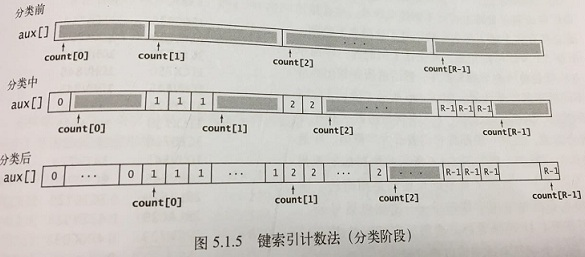

## 介绍

**低位优先（Least-Significant-DigitFirst，LSD）** 的字符串排序：从右到左检查键中的字符。如果将一个字符串看作一个256进制的数字，那么从右向左检查字符串就等价于先检查数字的最低位。这种方法最适合用于键的长度都相同的字符串排序应用。

**高位优先（MSD）** 的字符串排序：从左到右检查键中的字符，首先查看的是最高位的字符。高位优先的字符串排序的吸引人之处在于。它们不一定需要检查所有的输入就能够完成排序。高位优先的字符串排序和快速排序类似，因为它们都会将需要排序的数组切分为独立的部分并递归地用相同的方法处理子数组来完成排序。**区别在于** 高位优先的字符串排序算法在切分时仅使用键的第一个字符，而快速排序的比较会涉及键的全部。

低位优先方法会为每个字符创建一个切分，而高位优先方法总会产生三个切分，分别对应被搜素键的第一个字符小于、等于或大于切分键的第一个字符的情况。

<!-- more -->

## 字母表

在分析字符串排序算法时，字母表的大小是一个重要因素。我们的重点是基于扩展的ASCII字符集的字符串（R=256），但也会分析来自较小字母表的字符串（例如基因排序列）和来自较大字母表的字符串（例如含有65535个字符的Unicode字母表，它是自然语言编码的国际标准）。

### java中表示字符串的两种方法

|    操作    |       字符数组        |     java字符串     |
| :------: | :---------------: | :-------------: |
|    声明    |     char[] a      |    String s     |
| 根据索引访问字符 |       a[i]        |   s.charAt(i)   |
| 获取字符串长度  |     a.length      |   s.length()    |
|  表示方法转换  | a=s.toCharArray() | s=new String(a) |

### 字母表API

|     public class Alphabet     |                      |
| :---------------------------: | :------------------: |
|      Alphabet(String s)       |   根据s中的字符创建一张新的字母表   |
|    char toChar(int index)     |    获取字母表中索引位置的字符     |
|      int toIndex(char c)      |   获取c的索引，在0到R-1之间    |
|   boolean contains(char c)    |        是否包含c         |
|            int R()            |    基数（字母表中的字符数量）     |
|           INT lgR()           |     表示一个索引所需的比特数     |
|   int[] toIndices(String s)   |     将S转换为R进制的整数      |
| String toChars(int[] indices) | 将R进制的整数转换为基于该字母表的字符串 |

### 标准字母表

|       名称       |  R()  | lgR() |         字符集          |
| :------------: | :---: | :---: | :------------------: |
|     BINARY     |   2   |   1   |          01          |
|      DNA       |   4   |   2   |         ACTG         |
|     OCTAL      |   8   |   3   |       01234567       |
|    DECIMAL     |  10   |   4   |      0123456789      |
|  HEXADECIMAL   |  16   |   4   |   0123456789ABCDEF   |
|    PROTEIN     |  20   |   5   | ACDEFGHIKLMNPQRSTVWY |
|   LOWERCASE    |  26   |   5   |         a~z          |
|   UPPERCASE    |  26   |   5   |         A~Z          |
|     BASE64     |  64   |   6   |     A~Za~z0~9+/      |
|     ASCII      |  128  |   7   |       ASCII字符集       |
| EXTENDED_ASCII |  256  |   8   |      扩展ASCII字符集      |
|   UNICODE16    | 65536 |  16   |      Unicode字符集      |

### Alphabet实现

~~~java
public class Alphabet {
    public static final Alphabet BINARY = new Alphabet("01");
    public static final Alphabet OCTAL = new Alphabet("01234567");
    public static final Alphabet DECIMAL = new Alphabet("0123456789");
    public static final Alphabet HEXADECIMAL = new Alphabet("0123456789ABCDEF");
    public static final Alphabet DNA = new Alphabet("ACGT");
    public static final Alphabet LOWERCASE = new Alphabet("abcdefghijklmnopqrstuvwxyz");
    public static final Alphabet UPPERCASE = new Alphabet("ABCDEFGHIJKLMNOPQRSTUVWXYZ");
    public static final Alphabet PROTEIN = new Alphabet("ACDEFGHIKLMNPQRSTVWY");
    public static final Alphabet BASE64 = new 		       Alphabet("ABCDEFGHIJKLMNOPQRSTUVWXYZabcdefghijklmnopqrstuvwxyz0123456789+/");
    public static final Alphabet ASCII = new Alphabet(128);
    public static final Alphabet EXTENDED_ASCII = new Alphabet(256);
    public static final Alphabet UNICODE16      = new Alphabet(65536);

    private char[] alphabet;     // the characters in the alphabet
    private int[] inverse;       // indices
    private final int R;         // the radix of the alphabet

    public Alphabet(String alpha) {
        // check that alphabet contains no duplicate chars
        boolean[] unicode = new boolean[Character.MAX_VALUE];
        for (int i = 0; i < alpha.length(); i++) {
            char c = alpha.charAt(i);
            if (unicode[c])
                throw new IllegalArgumentException("Illegal alphabet: repeated character = '" + c + "'");
            unicode[c] = true;
        }

        alphabet = alpha.toCharArray();
        R = alpha.length();
        inverse = new int[Character.MAX_VALUE];
        for (int i = 0; i < inverse.length; i++)
            inverse[i] = -1;

        // can't use char since R can be as big as 65,536
        for (int c = 0; c < R; c++)
            inverse[alphabet[c]] = c;
    }
    //Initializes a new alphabet using characters 0 through R-1.
    private Alphabet(int radix) {
        this.R = radix;
        alphabet = new char[R];
        inverse = new int[R];

        // can't use char since R can be as big as 65,536
        for (int i = 0; i < R; i++)
            alphabet[i] = (char) i;
        for (int i = 0; i < R; i++)
            inverse[i] = i;
    }
    //Initializes a new alphabet using characters 0 through 255.
    public Alphabet() {
        this(256);
    }
    public boolean contains(char c) {
        return inverse[c] != -1;
    }
    @Deprecated
    public int R() {
        return R;
    }
    public int lgR() {
        int lgR = 0;
        for (int t = R-1; t >= 1; t /= 2)
            lgR++;
        return lgR;
    }
    public int toIndex(char c) {
        if (c >= inverse.length || inverse[c] == -1) {
            throw new IllegalArgumentException("Character " + c + " not in alphabet");
        }
        return inverse[c];
    }
    public int[] toIndices(String s) {
        char[] source = s.toCharArray();
        int[] target  = new int[s.length()];
        for (int i = 0; i < source.length; i++)
            target[i] = toIndex(source[i]);
        return target;
    }
    public char toChar(int index) {
        if (index < 0 || index >= R) {
            throw new IllegalArgumentException("index must be between 0 and " + R + ": " + index);
        }
        return alphabet[index];
    }
    public String toChars(int[] indices) {
        StringBuilder s = new StringBuilder(indices.length);
        for (int i = 0; i < indices.length; i++)
            s.append(toChar(indices[i]));
        return s.toString();
    }
}
~~~

## 键索引计数法

**键索引计数** 是一种适用于小整数键的简单排序方法。例如将全班学生按组好分类。这种方法有四个步骤：

### 1. 频率统计

使用int数组count[]计算每个键出现的频率。对于数组中的每个元素，都使用它的键访问count[]中的相应元素并将其加1。如果键为r，则将count[r+1]加1。注：count[0]的值总是0，count[1]表示第零组（没有学生）。

### 2. 将频率转换为索引

一般来说，任意给定的键的起始索引均为所有较小的键所对应的出现频率之和。对于每个键值r，小于r+1的键的频率之和为小于r的键的频率之和加上count[r]。示例中，第一组有3个人，第二组有5个人，因此第三组的起始位置是8。如下图：

### 3. 数据分类

将所有元素（学生）移动到一个辅助数组aux[]中进行排序。每个元素在aux[]中的位置是由它的键（组别）对应的count[]值决定的，在移动之后将count[]中对应元素的值加1，以保证count[r]总是下一个键为r的元素在aux[]中的索引位置。这个过程只需要遍历一遍数据即可产生排序结果。如下图：

注意：这种实现方式的稳定性是很关键的，键相同的元素在排序后会被聚集到一起，但相对顺序没有变化。如下图：

### 4. 回写

我们在将元素移动到辅助数组的过程中完成了排序，所以最后一步就是将排序的结果复制回原数组。

键索引计数法（a[].key()为[0,R)之间的一个整数）：

~~~java
int N = a.length;
String[] aux = new String[N];
int[] count = new int[R+1];
//计算出现频率
for(int i = 0; i < N; i++){
  	count[a[i].key() + 1]++;
}
//将频率转换为索引
for(int r = 0; r < R; r++){
  	count[r+1] += count[r];
}
//将元素分类
for(int i = 0; i < N; i++){
  	aux[count[a[i].key()]++] = a[i];
}
//回写
for(int i = 0; i < N; i++){
  	a[i] = aux[i];
}
~~~

## 低位优先的字符串排序

**低位优先的字符串排序算法能够稳定地将定长字符串排序** 。如果字符串的长度均为W，那就从右向左以每个位置的字符作为键，用索引计数法将字符串排序W遍。

~~~java
public class LSD{
  	public static void sort(String[] a, int w) {
        //通过前W个字符将a[]排序  
        int n = a.length;
        int R = 256;   // extend ASCII alphabet size
        String[] aux = new String[n];

        for (int d = w-1; d >= 0; d--) {
            // 根据第d个字符用键索引计数法排序
            int[] count = new int[R+1];
            // 计算出现频率
            for (int i = 0; i < n; i++)
                count[a[i].charAt(d) + 1]++;

            // 将频率转换为索引
            for (int r = 0; r < R; r++)
                count[r+1] += count[r];

            // 将元素分类
            for (int i = 0; i < n; i++)
                aux[count[a[i].charAt(d)]++] = a[i];

            // 回写
            for (int i = 0; i < n; i++)
                a[i] = aux[i];
        }
    }
}
~~~

要将每个元素均为含有W个字符的字符串数组a[]排序，要进行W次键索引计数排序：从右向左，以每个位置的字符为键排序一次。

从理论上说，低位优先的字符串排序算法是一种适用于一般应用的线性时间排序算法。无论N有多大，它都只遍历W次数据。N个长为W的字符串的输入总共含有WN个字符，因此低位优先的字符串排序的运行时间与输入的规模成正比。

## 高位优先的字符串排序

首先用键索引计数法将所有字符串按照首字母排序，然后（递归地）再将每个首字母所对应的子数组排序。和快速排序一样，高位优先的字符串排序会将数组切分为能够独立排序的子数组来完成排序任务，但它的切分会为每个首字母得到一个子数组，而不是像快速排序中那样产生固定的两个或三个切分。如下图：

### 1. 对字符串末尾的约定

在高位优先的字符串排序算法中，要特别注意到达字符串末尾的情况。在排序中，合理的做法是将所有字符都已被检查过的字符串所在的子数组排在所有子数组的前面，这样就不需要递归地将该子数组排序，如下图所示：

为了简化这两步计算，我们使用了一个接受两个参数的私有方法charAt()来将字符串中字符索引转化为数组索引，当指定的位置超过了字符串的末尾时方法返回-1。然后将所有返回值加1，得到一个非负的int值并用它作为count[]的索引。这种转化意味着字符串中的每个字符都可能产生R+1种不同的值：0表示**字符串的结尾** ，1表示字母表的第一个字符，2表示字母表第二个字符，等等。因为键索引计数法本来就需要一个额外的位置，所以使用代码int count[] = new int[R+2]创建记录统计频率的数组。

### 2. 指定的字母表

高位优先的字符串排序的成本与字母表中的字符数量有很大关系 。改进基于较小的字母表的字符串排序程序的性能需要进行如下改动：

- 在构造函数中用一个alpha对象保存字母表；
- 在构造函数中将R设为alpha.R()；
- 在charAt()方法中将s.charAt(d)替换为alpha.toIndex(s.charAt(d))。

高位优先的字符串排序中count[]数组的意义：

高位优先的字符串排序：

~~~java
public class MSD {
    private static final int R             = 256;   // 基数
    private static final int CUTOFF        =  15;   // 小数组的切换阈值
	private static String[] aux;                    //数据分类的辅助数组
    private static int charAt(String s, int d){
      	if(d < s.length()){
          	return s.charAt(d);
      	}else{
          	return -1;
      	}
    }
    public static void sort(String[] a) {
        int n = a.length;
        aux = new String[n];
        sort(a, 0, n-1, 0);
    }
    private static void sort(String[] a, int lo, int hi, int d) {
        // 以第d个字符为键将a[lo]至a[hi]排序
        if (hi <= lo + CUTOFF) {
            insertion(a, lo, hi, d);
            return;
        }
        int[] count = new int[R+2];  	// 计算频率
        for (int i = lo; i <= hi; i++) {
            int c = charAt(a[i], d);
            count[c+2]++;
        }
        for (int r = 0; r < R+1; r++)   // 将频率转换为索引
            count[r+1] += count[r];
        for (int i = lo; i <= hi; i++) {// 数据分类
            int c = charAt(a[i], d);
            aux[count[c+1]++] = a[i];
        }
        for (int i = lo; i <= hi; i++)   // 回写
            a[i] = aux[i - lo];     
        for (int r = 0; r < R; r++)      // 递归的以每个字符为键进行排序
            sort(a, lo + count[r], lo + count[r+1] - 1, d+1);
    }

    /*************************** MSD辅助方法 *************************/
    private static void insertion(String[] a, int lo, int hi, int d) {
        for (int i = lo; i <= hi; i++)
            for (int j = i; j > lo && less(a[j], a[j-1], d); j--)
                exch(a, j, j-1);
    }
    // exchange a[i] and a[j]
    private static void exch(String[] a, int i, int j) {
        String temp = a[i];
        a[i] = a[j];
        a[j] = temp;
    }
    // is v less than w, starting at character d
    private static boolean less(String v, String w, int d) {
        // assert v.substring(0, d).equals(w.substring(0, d));
        for (int i = d; i < Math.min(v.length(), w.length()); i++) {
            if (v.charAt(i) < w.charAt(i)) return true;
            if (v.charAt(i) > w.charAt(i)) return false;
        }
        return v.length() < w.length();
    }
}
~~~

在将一个字符串数组a[]排序时，首先根据它们的首字母用键索引计数法进行排序，然后（递归地）根据子数组中的字符串的首字母将子数组排序。

### 3. 小型子数组

高位优先的字符串排序只需要检查若干个字符就能完成所有字符串的排序。换句话说，这种方法能够快速地将需要排序的数组切分为较小的数组。**小型子数组对于高位优先的字符串排序的性能至关重要** 。因此，将小数组切换到插入排序对于高位优先的字符串排序算法是必须的。为了避免重复检查已知相同的字符所带来的成本，我们对前d个字符均相同的字符串执行插入排序。

### 4. 等值键

对于含有大量等值键的子数组的排序会较慢。如果相同的子字符串出现的过多，切换排序方法的条件将不会出现，那么递归方法就会检查所有相同键中的每一个字符。另外，键索引计数法无法有效判断字符串中的字符是否全部相同：它不仅需要检查每个字符和移动每个字符串，还需要初始化所有的频率统计并将它们转换为索引等。因此，高位优先的字符串排序的最坏的情况就是所有键均相同。

### 5. 性能

高位优先的字符串排序算法的性能取决于数据 。对于基于比较的方法，我们主要关注的是键的顺序；对于高位优先的字符串排序算法，键的顺序并不重要，我们关注的是键所对应的值。如下图：

- 对于随机输入，高位优先的字符串排序算法只会检查足以区别字符串所需的字符，相对于输入数据中的字符总数，算法的运行时间是**亚线性** 的（只会检查字符串中的一部分）。
- 对于非随机的输入，高位优先的字符串排序算法可能仍然是亚线性的，但需要检查的字符可能比随机情况下更多。
- 在最坏情况下，高位优先的字符串排序算法会检查所有键中的所有字符串，所以相对于数据中的所有字符它所需的运行时间是线性的（和低位优先的字符串排序算法相同）。

## 三向字符串快速排序

**三向字符串快速排序**是根据高位优先的字符串排序算法改进快速排序，根据键的首字母进行三向切分，仅在中间子数组中的下一个字符（因为键的首字母都与切分字符相等）继续递归排序。对于字符串的排序，这个方法比普通的快速排序和高位优先的字符串排序更友好，实际上它是这两个算法的结合。三向字符串快速排序的示意图如下：

高位优先的字符串排序可能会创建大量（空）子数组，而三向字符串快速排序的切分总是只有三个。因此三向字符串排序能够很好处理等值键、有较长公共前缀的键、取值范围较小的键和小数组---所有高位优先的字符串排序算法不擅长的各种情况，重要的是这种切分方法能够适应键的不同部分的不同结构，和快速排序一样，三向字符串快速排序也不需要额外的空间。适用于三向字符串快速排序的典型情况如下：

三向字符串快速排序实现：

~~~java
public class Quick3string {
    public static void sort(String[] a) {      
        sort(a, 0, a.length-1, 0);
    }
  
    // 3-way string quicksort a[lo..hi] starting at dth character
    private static void sort(String[] a, int lo, int hi, int d) { 
        if (hi <= lo) return;
        int lt = lo, gt = hi;
        int v = charAt(a[lo], d);
        int i = lo + 1;
        while (i <= gt) {
            int t = charAt(a[i], d);
            if      (t < v) exch(a, lt++, i++);
            else if (t > v) exch(a, i, gt--);
            else              i++;
        }

        sort(a, lo, lt-1, d);
        if (v >= 0) sort(a, lt, gt, d+1);
        sort(a, gt+1, hi, d);
    }
}
~~~

在将字符串数组a[]排序时，根据它们的首字母进行三向切分，然后（递归地）将得到三个子数组排序：一个含有所有首字母小于切分字符的字符串子数组，一个含有所有首字母等于切分字符的字符串的子数组（排序时忽略它们的首字母），一个含有所有首字母大于切分字符的字符串的子数组。该算法的实现只是为**快速排序**算法中的递归方法添加了一个参数来保存当前的切分字母并令三向切分的代码使用该字符，然后适当修改递归调用。

### 1. 小型子数组

通过对小型子数组进行特殊处理：**对前d个字符均相同的字符串执行插入排序**来提高效率，这样能够跳过已知相等的字符。

### 2. 随机化

和快速排序一样，最好在排序之前将数组打乱或是将第一个元素和一个随机位置的元素交换以得到一个随机的切分元素。这么做主要是为了预防数组已经有序或是接近有序的最坏情况。

### 3. 性能

要将含有N个随机字符串的数组排序，三向字符串快速排序平均需要比较字符~2NlnN次。

### 4. 举例：网站日志

分析网站所有活动，每项活动都含有发起者的域名，这种排序结果中的很多字符串都有很长的公共前缀，所以这种算法不会重复检查他们。

## 字符串排序算法的选择

各种字符串排序算法的性能特点：

