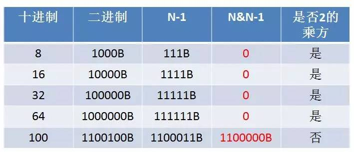

## 题目

实现一个方法，判断一个正整数是否是2的乘方（比如16是2的4次方，返回True；18不是2的乘方，返回False）。要求性能尽可能高。

### 解法一：

创建一个中间变量Temp，初始值是1。然后进入一个循环，循环中每次让Temp和目标整数比较，如果相等，则说明目标整数是2的乘方；如果不相等，则让Temp增大一倍，继续循环比较。当Temp大于目标整数时，说明目标整数不是2的乘方。

如果目标整数的大小是N，则此方法的时间复杂度是O（LogN）。

~~~java
public static boolean isPowerOf2(int number){
  	int temp = 1;
  	while(temp <= number){
      	if(temp == number){
          	return true;
      	}
      	//temp = temp * 2;
      	//优化点：乘以2操作改成左移1位
      	temp = temp << 1;
  	}
  	return false;
}
~~~

<!-- more -->

### 解法二：

因为2的乘方都符合一个规律，即 N&N-1 等于 0，所以直接用这个规律判断即可。该算法时间复杂度是O（1）。

~~~java
public static boolean isPowerOf2(int number){
	   return (number & number -1) == 0;
   }
~~~

