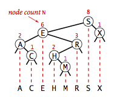
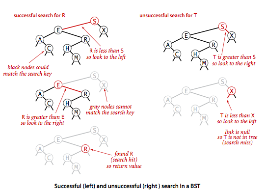
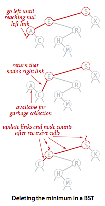

## 介绍

**定义：**一颗二叉查找树（BST）是一颗二叉树，其中每个结点都含有一个Comparable的键（以及相关联的值）且每个结点的键都大于其左子树中的任意结点的键而小于右子树的任意结点的键。二叉查找树如下图：

在二叉树中，每个结点只能有一个父结点（根结点没有父结点），每个结点包含的链接可以为空或者只有左右两个链接，分别指向自己的左子结点和右子结点。因此可以将二叉查找树定义为一个空链接，或者是一个有左右两个链接的结点，每个链接都指向一颗独立的子二叉树。二叉查找树是一种能够将链表插入的灵活性和有序数组查找的高效性结合起来的符号表实现。具体来说，就是使用每个结点含有**两个链接** （链表中每个结点只含有一个链接）的二叉查找树来高效的实现符号表。

<!-- more -->

## 二叉查找树的实现

用二叉查找树实现有序符号表。采用递归实现。

### 1. 数据类型

和链表一样，我们嵌套定义了一个私有类来表示二叉查找树上的一个结点。每个结点都含有一个键、一个值、一条左链接、一条右链接和一个结点计数器。左链接指向一颗由小于该结点的所有键组成的二叉查找树，右链接指向一颗由大于该结点的所有键组成的二叉查找树。变量N给出以该结点为根的子树的结点总数。二叉查找树表示一条有序的键列图：

基于二叉查找树的符号表：

~~~java
public class BST<Key extends Comparable<Key>, Value> {
    private Node root;             // 二叉查找树的根结点

    private class Node {
        private Key key;           // 键
        private Value val;         // 值
        private Node left, right;  // 指向子树的链接
        private int size;          // 以该结点为根的子树中的结点总数

        public Node(Key key, Value val, int size) {
            this.key = key;
            this.val = val;
            this.size = size;
        }
    }
  
    public int size() {
        return size(root);
    }

    private int size(Node x) {
        if (x == null) {
            return 0;
        }else {
            return x.size;
        }
    }
}
~~~

### 2. 查找

在二叉查找树中查找一个键的递归算法：如果树是空的，则查找未命中；如果被查找的键和根结点的键相等，查找命中，否则我们就递归地在子树中继续查找。如果被查找的键较小就选择左子树，较大则选择右子树。当找到一个含有被查找的键的结点（命中）或者当前子树变为空（未命中）时结束。如图：

二叉查找树的查找方法的实现：

~~~java
 public Value get(Key key) {
     return get(root, key);
 }

 private Value get(Node x, Key key) {
     //在以x为根结点的子树中查找并返回key所对应的值
     if (x == null) return null;
     int cmp = key.compareTo(x.key);
     if      (cmp < 0) return get(x.left, key);
     else if (cmp > 0) return get(x.right, key);
     else              return x.val;
 }
~~~

### 3. 插入

插入的实现逻辑和递归查找很相似：如果树是空的，就返回一个含有该键值对的新结点；如果被查找的键小于根结点，我们会继续在左子树中插入该键，否则在右子树中插入该键。二叉查找树的插入操作：

二叉查找树的插入方法的实现：

~~~java
public void put(Key key, Value val) {
     if (val == null) {
         delete(key);
         return;
     }
     root = put(root, key, val);
}

private Node put(Node x, Key key, Value val) {
     if (x == null) return new Node(key, val, 1);
     int cmp = key.compareTo(x.key);
     if      (cmp < 0) x.left  = put(x.left,  key, val);
     else if (cmp > 0) x.right = put(x.right, key, val);
     else              x.val   = val;
     x.size = 1 + size(x.left) + size(x.right);
     return x;
}
~~~

### 4. 查找和插入的递归实现

可以将递归调用前的代码想象成沿着树向下走：它会将给定的键和每个结点的键相比较并根据结果向左或者向右移动到下一个结点。然后将递归调用后的代码想象成沿着树向上爬，对于get()方法，这对应着一系列的返回指令（return），但是对于put()方法，新结点会链接到树底层的空结点上，这意味着重置搜索路径上每个父结点指向子结点的链接，并增加路径上每个结点中的计数器的值。如图：一个二叉树的成长：

### 5. 分析

使用二叉查找树的算法的运行时间取决于树的形状，而树的形状取决于键被插入的先后顺序。在最好的情况下，一颗含有N个结点的树是完全平衡的，每条空链接和根结点的距离都为~lgN。在最坏的情况下搜索路径上可能有N个结点。如图所示：

如下图3.2.8所示的简单模型：键的分布是均匀随机的，或者说它们插入的顺序是随机的。对这个模型的分析而言，二叉查找树和快速排序几乎就是双胞胎。树的根结点就是快速排序中的第一个切分元素（左侧的键都比它小，右侧的键都比它大），这对于所有的子树同样适用，这和快速排序中对子数组的递归排序完全对应。

说明：

- 在由N个随机键构造的二叉查找树中，查找命中平均所需的比较次数为~2lnN（约1.39lgN）。
- 在由N个随机键构造的二叉查找树中插入操作和查找未命中平均所需的比较次数为~2lnN（约1.39lgN）。
- 第二条说明插入一个新键的成本是对数级别的，这是基于二分查找的有序数组所不具备的灵活性，因为它的插入操作所需访问数组的次数是线性级别的。

### 6. 有序性相关的方法

#### 最大键和最小键

如果根结点的左链接为空，那么一颗二叉查找树中最小的键就是跟结点；如果左链接非空，那么树中的最小键就是左树中的最小键。采用递归实现：

~~~java
 	public Key min() {
        return min(root).key;
    } 
    private Node min(Node x) { 
        if (x.left == null) return x; 
        else return min(x.left); 
    } 

    public Key max() {
        return max(root).key;
    } 
    private Node max(Node x) {
        if (x.right == null) return x; 
        else return max(x.right); 
    } 
~~~

#### 向上取整和向下取整

如果给定的键key小于二叉查找树的根结点的键，那么小于等于key的最大建floor(key)一定在根结点的左子树中；如果给定的键key大于二叉查找树的根结点，那么只有当根结点右子树中存在小于等于key的结点时，小于等于key的最大键才会出现在右子树中，否则根结点就是小于等于key的最大键。向下取整函数的计算如下图：

~~~java
public Key floor(Key key) {
     Node x = floor(root, key);
     if (x == null) return null;
     else return x.key;
} 
private Node floor(Node x, Key key) {
     if (x == null) return null;
     int cmp = key.compareTo(x.key);
     if (cmp == 0) return x;
     if (cmp <  0) return floor(x.left, key);
     Node t = floor(x.right, key); 
     if (t != null) return t;
     else return x; 
}

public Key ceiling(Key key) {
     Node x = ceiling(root, key);
     if (x == null) return null;
     else return x.key;
}

private Node ceiling(Node x, Key key) {
     if (x == null) return null;
     int cmp = key.compareTo(x.key);
     if (cmp == 0) return x;
     if (cmp < 0) { 
         Node t = ceiling(x.left, key); 
         if (t != null) return t;
         else return x; 
     } 
     return ceiling(x.right, key); 
} 
~~~

#### 选择和排名

二叉查找树中的选择操作和基于切分的数组选择操作类似。在二叉查找树的每个结点中维护的子树结点计数器变量N就是用来支持此操作的。比如要找到排名为K的键（即树中正好有K个小于它的键）。如果左子树中的结点树t大于k，那就继续递归地在左子树中查找排名为K的键；如果t等于k，就返回根结点中的键；如果t小于k，就递归地在右子树中查找排名为

（k-t-1）的键。二叉查找树中的select操作：

排名rank()是select()的逆方法，它会返回给定键的排名。如果给定键和根结点相等，就返回左子树中的结点总数t；如果给定的键小于根结点，就返回该键在左子树中的排名（递归计算）；如果给定的键大于根结点，就返回t+1（根结点）加上它在右子树中的排名。

~~~java
public Key select(int k) {
    Node x = select(root, k);
    return x.key;
} 
private Node select(Node x, int k) {
    if (x == null) return null; 
    int t = size(x.left); 
    if      (t > k) return select(x.left,  k); 
    else if (t < k) return select(x.right, k-t-1); 
    else            return x; 
} 

public int rank(Key key) {
    return rank(key, root);
} 

private int rank(Key key, Node x) {
    if (x == null) return 0; 
    int cmp = key.compareTo(x.key); 
    if      (cmp < 0) return rank(key, x.left); 
    else if (cmp > 0) return 1 + size(x.left) + rank(key, x.right); 
    else              return size(x.left); 
} 
~~~

### 7. 删除操作

#### 删除最大键和最小键

和put()方法一样，我们的递归方法接受一个指向结点的链接，并返回一个指向结点的链接。这样我们就能方便地改变树的结构，将返回的链接赋给作为参数的链接。对于deleteMin()，我们要不断深入根结点的左子树中直至遇到一个空链接，然后将指向该结点的链接指向该结点的右子树。此时已经没有任何链接指向要被删除的结点，因此它会被垃圾收集器清理掉。在删除结点后正确的设置它的父结点并更新它到根结点的路径上的所有结点的计数器的值。

~~~java
public void deleteMin() {
    root = deleteMin(root);

}
private Node deleteMin(Node x) {
    if (x.left == null) return x.right;
    x.left = deleteMin(x.left);
    x.size = size(x.left) + size(x.right) + 1;
    return x;
}

public void deleteMax() {
    root = deleteMax(root);
}
private Node deleteMax(Node x) {
    if (x.right == null) return x.left;
    x.right = deleteMax(x.right);
    x.size = size(x.left) + size(x.right) + 1;
    return x;
}
~~~

#### 删除操作

删除操作之后我们要处理两颗子树，但被删除结点的父结点只有一条空出来的链接。T.Hibbard在1962年提出了解决这个难题的第一个方法，在删除结点X后用它的**后继结点**补它的位置。因为X有一个右子结点，因此它的后继结点就是其右子树中的最小结点，这样的替换仍然能够保证树的有序性。可以用4个步骤完成X替换为它的后继结点的任务：如下图。

- 将指向即将被删除的结点的链接保存为t；
- 将X指向它的后继结点min（t.right）；
- 将X的右链接指向deleteMin（t.right），也就是在删除后所有结点仍然都大于x.key的子二叉树；
- 将X的左链接（本为空）设为t.left（其下所有的键都小于被删除的结点和它的后继结点）。

在递归调用后，我们会修正被删除的结点和父结点的链接，并将由此结点到根结点的路径上的所有结点的计数器减1（这里计数器的值仍然会被设为其所有子树中的结点总数加一）。

~~~java
public void delete(Key key) {
    root = delete(root, key);   
}
private Node delete(Node x, Key key) {
    if (x == null) return null;

    int cmp = key.compareTo(x.key);
    if      (cmp < 0) x.left  = delete(x.left,  key);
    else if (cmp > 0) x.right = delete(x.right, key);
    else { 
        if (x.right == null) return x.left;
        if (x.left  == null) return x.right;
        Node t = x;
        x = min(t.right);  //上面二叉查找树最小键方法
        x.right = deleteMin(t.right);
        x.left = t.left;
    } 
    x.size = size(x.left) + size(x.right) + 1;
    return x;
}

~~~

该方法的缺陷在于选用后继结点时一个随意的决定，并且没有考虑树的对称性，在某些实际应用中可能产生性能问题。所以实际上，**前趋结点**和后继结点的选择应该是随机的。

### 8. 范围查找

要实现能够返回给定范围内键的keys()方法，我们首先需要一个遍历二叉查找树的基本方法，叫做**中序遍历** 。先打印出根结点的左子树中的所有键，再打印出根结点的键，最后打印出根结点的右子树中的所有键。为了实现接受两个参数并能够将给定范围内的键返回给用例的Keys()方法，我们将所有落在给定范围以内的键加入一个队列Queue并跳过那些不可能含有所查找键的子树。

二叉查找树的范围查找操作：

~~~java
public Iterable<Key> keys() {
    if (isEmpty()) return new Queue<Key>();
    return keys(min(), max());
}

public Iterable<Key> keys(Key lo, Key hi) {
    Queue<Key> queue = new Queue<Key>();
    keys(root, queue, lo, hi);
    return queue;
} 

private void keys(Node x, Queue<Key> queue, Key lo, Key hi) { 
    if (x == null) return; 
    int cmplo = lo.compareTo(x.key); 
    int cmphi = hi.compareTo(x.key); 
    if (cmplo < 0) keys(x.left, queue, lo, hi); 
    if (cmplo <= 0 && cmphi >= 0) queue.enqueue(x.key); 
    if (cmphi > 0) keys(x.right, queue, lo, hi); 
} 
~~~

## 性能分析

**在一颗二叉查找树中，所有操作在最坏情况下所需的时间都和树的高度成正比** 。我们可以认为二叉查找树是符合**随机构造的树** 。对于构造树的键不是随机的可以使用**平衡二叉查找树** ，它能保证无论键的插入顺序如何，树的高度都将是总键数的对数。简单的符号表实现的成本总结如下图：

