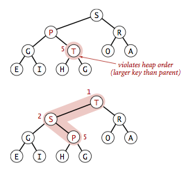

## 介绍

数据结构**二叉堆**能够很好地实现优先队列的基本操作。在二叉堆数组中，每个元素都要保证大于等于另两个特定位置的元素。

## 堆的定义

**堆有序**：当一个二叉树的每个结点都大于等于它的两个子节点时，称为堆有序。根结点是堆有序的二叉树中的最大结点。

**完全二叉树**：在根结点下一层一层地由上向下、从左至右，在每个结点的下方连接两个更小的结点，直至将N个结点全部连接完毕。一棵堆有序的完全二叉树如图：

**树的高度**：一棵大小为N的完全二叉树的高度为lgN。

<!-- more -->

**二叉堆**是一组能够用堆有序的完全二叉树排序的元素，并在数组中按照层级存储（不使用数组的第一个位置）。具体方法就是将二叉树的节点按照层级顺序放入数组中，根结点在位置1，它的子结点在位置2和3，子结点的子结点分别在位置4,5,6和7...

在一个堆中，位置k的结点的父结点的位置为[k/2]，而它的两个子结点的位置则分别为2k和2k+1。这样可以通过计算数组的索引在树中上下移动：从a[k]向上一层就令k等于k/2，向下一层则令k等于2k或2k+1。堆的表示如图：

## 堆的算法

用长度为N+1的私有数组pq[]表示堆，堆元素放在pq[1]至pq[N]中，在排序算法中只通过私有辅助函数less（）和exch（）来访问元素。接下来堆操作不再将数组作为参数传递。

~~~java
private boolean less(int i, int j){
  	return pq[i].compareTo(pq[j]) < 0;
}

private void exch(int i, int j){
  	Key t = pq[i];
  	pq[i] = pq[j];
  	pq[j] = t;
}
~~~

### 堆的有序化（reheapifying）

堆的操作会首先进行一些简单地改动，打破堆的状态，然后再遍历堆并按照要求将堆的状态恢复。这个过程叫做**堆的有序化**。有序化过程中的两种情况：

1. 当某个结点的优先级上升（或是在堆底加入一个新的元素）时，我们需要由下至上恢复堆的顺序；
2. 当某个结点的优先级下降（例如，将根结点替换为一个较小的元素）时，我们需要由上至下恢复堆的顺序。

### 由下至上的堆有序化（上浮）

如果堆的有序状态因为某个结点变得比它的父结点更大而被打破，那么我们需要通过交换它和他的父节点来修复堆。交换后，这个结点仍然可能比它现在的父节点大，我们一遍一遍地用同样的方法恢复秩序，将这个结点不断向上移动直到遇到了一个比它大的父结点。只需要记住位置k的结点的父结点的位置是[k/2]。swim（）方法中循环可以保证只有位置k上的结点大于它的父结点时堆的有序状态才会打破，因此只要该结点不再大于它的父结点，堆的有序状态就恢复了。

~~~java
private void swim(int k){
  	while(k > 1 && less(k/2, k)){
      	exch(k/2, k);
      	k = k/2;
  	}
}
~~~

由下至上的堆有序化示意图：

### 由上至下的堆有序化（下沉）

如果堆的有序状态因为某个结点变得比它两个子结点或是其中之一更小了而被打破，那么我们可以通过将它和它的两个子结点中的较大者交换来恢复堆。同样，不断用相同的方法将其修复。位置k的结点的子结点位于2k和2k+1。

~~~java
private void sink(int k){
  	while(2*k <= N){
      	int j = 2*k;
      	if(j < N && less(j, j+1)){
          	j++;
      	}
      	if(!less(k, j)){
          	break;
      	}
      	exch(k, j);
      	k = j;
  	}
}
~~~

由上至下的堆有序化示意图：

### 堆的操作

**插入元素**：将新元素加到数组末尾，增加堆的大小并让这个新元素上浮到合适的位置。

**删除最大元素**：从数组顶端删除去最大的元素并将数组的最后一个元素放到顶端，减小堆的大小并让这个元素下沉到合适位置。

堆操作示意图：

## 基于堆的优先队列

根据堆的算法实现优先队列。

~~~java
public class MaxPQ<Key extends Comparable<Key>>{
  	private Key[] pq;//基于堆的完全二叉树
   	private int N = 0;//存储于pq[1...N]中，pq[0]没有使用
  	
  	public MaxPQ(int maxN) {
        pq = (Key[]) new Comparable[maxN + 1];
    }
  
  	public boolean isEmpty() {
        return N == 0;
    }
  
  	public int size() {
        return N;
    }
  
  	public void insert(Key x) {
        if (n == pq.length - 1) {
          	resize(2 * pq.length);
        } 
        pq[++n] = x;
        swim(n);
    }
  
  	public Key delMax() {
        if (isEmpty()) {
          	throw new NoSuchElementException("Priority queue underflow");
        }
        Key max = pq[1]; //从根结点得到最大元素
        exch(1, n--);    //将其和最后一个结点交换
        pq[n+1] = null;  //防止对象游离
      	sink(1);         //恢复堆的有序性
        if ((n > 0) && (n == (pq.length - 1) / 4)) {
          	resize(pq.length / 2);
        }
        return max;
    }
  
  	/***************************************************************************
    * Helper functions to restore the heap invariant.
    * 动态调整数组大小，其他辅助函数省略
    ***************************************************************************/
  	private void resize(int capacity) {
        assert capacity > n;
        Key[] temp = (Key[]) new Comparable[capacity];
        for (int i = 1; i <= n; i++) {
            temp[i] = pq[i];
        }
        pq = temp;
    }
}
~~~

说明：

1. 对于一个含有N个元素的基于堆的优先队列，插入元素操作只需要不超过（lgN+1）次比较，删除最大元素的操作需要不超过2lgN次比较。

   > 证明：两种操作都需要在根结点和堆底之间移动元素，而路径的长度不超过lgN。对于路径上的每个结点，删除最大元素需要两次比较（除了堆底元素），一次用来找出较大的子结点，一次用来确定该子结点是否需要上浮。

2. 使用有序或是无序数组的优先队列的初级实现总是需要线性时间来完成其中一种操作，但基于堆的实现则能保证在对数时间内完成它们。

3. 多叉堆

   > 基于用数组表示的完全三叉堆：对于数组中1至N的N个元素，位置k的结点大于等于位于3k-1、3k、3k+1的结点，小于等于位于(k+1)/3的结点。

4. 调整数组大小

   > 同前面动态调整数组大小。