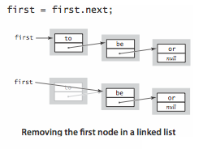
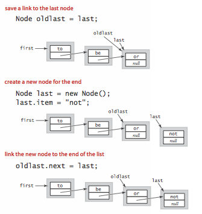

## 介绍

定义：**链表**是一种递归的数据结构，它或者为空（null），或者是指向一个结点（node）的引用，该结点含有一个泛型的元素和一个指向另一条链表的引用。

结点是一个可能包含任意类型数据的抽象实体，它所包含的指向结点的应用显示了它在构造链表之中的作用。

<!-- more -->

## 结点

~~~java
private class Node{
  	Item item;
  	Node next;
}
~~~

一个Node对象含有两个实例变量，类型分别为Item（参数类型）和Node。

- Item是一个占位符，表示我们希望用链表处理的任意数据类型；
- Node类型的实例变量显示了这种数据结构的链式本质，调用的结果是一个指向Node对象的引用。

## 构造链表

根据递归定义，我们需要一个Node类型的变量就能表示一条链表，只要保证它的值是null或者指向另一个Node对象并且该对象的next域指向了另一条链表即可。用链接构造一条链表如下图：

例：构造一条含有元素：to、be和or的链表：

~~~java
//首先为每个元素创造一个结点
Node first = new Node();
Node second = new Node();
Node third = new Node();
//将每个结点的item域设为所需的值
first.item = "to";
second.item = "be";
third.item = "or";
//设置next域来构造链表
first.next = second;
second.next = third; //注：third.next = null 
~~~

first，second，third都是一条链表，都是对应的一个结点的引用，third该结点指向null，是一个空链表。

### 在表头插入结点

先将first保存在oldfirst中，再将一个新结点赋予first，并将它的item设为将要添加的值，next域设为oldfirst。在链表的开头插入一个新结点如图：

例：给链表开头插入字符串not：

~~~java
//先将first保存在oldfirst中
Node oldfirst = first;
//再将一个新结点赋予first
first = new Node();
//设置新结点的实例变量
first.item = "not";
first.next = "oldfirst";
~~~

在链表开头插入一个结点只需要几行赋值语句，所以它所需的时间和链表的长度无关。

### 从表头删除结点

执行要将first指向first.next即可。删除链表的首结点如图：

例：删除链表的首结点：

~~~java
//只需将first指向first.next
first = first.next;
~~~

该操作只含有一条赋值语句，因此运行时间和链表的长度无关。删除链表首结点有可能改变指向链表尾结点的引用，因为当链表中只有一个结点时，它既是首结点，又是尾结点。

### 在链表尾部插入结点

先将last保存在oldlast中，再将一个新结点赋予last，并将它的item设为将要添加的值，再将oldlast的next域设为last。在链表尾部插入新结点如图：

例：在链表尾部插入结点：

~~~java
//保存指向尾结点的链接
Node oldlast = last;
//创建新的尾结点
last = new Node();
//设置新的尾结点的实例变量
last.item = "not";
//将尾链接指向新的尾结点
oldlast.next = last;
~~~

这段代码无法处理链表为空的情况，它会使用空链接，所以修改链表的操作需要添加检查。

### 其他操作

- 删除指定的结点；
- 在指定结点前插入一个新结点等。

这些情况就不那么容易，例如删除链表的尾结点，现有的解决方法就是遍历整条链表，找到指向尾结点的结点链接，将它的值设为null。该操作所需的时间与链表的长度成正比。**实现任意插入和删除操作的标准解决方案是使用双向链表**。

## 链表遍历

将循环的索引变量x初始化为链表的首结点，然后通过x.item访问和x相关联的元素，并将x设为x.next来访问链表中的下一个结点，直到x为null为止。

~~~java
for(Node x = first; x != null; x = x.next){
  	//处理x.item;
}
~~~

## 链表实现栈

将栈保存为一条链表，栈的顶部即为表头，实例变量first指向栈顶，当push（）压入一个元素，将该元素添加在表头，当pop（）删除一个元素时，将该元素从表头删除。该链表的使用达到最优的设计目标：

- 它可以处理任意类型的数据；
- 所需的空间总是和集合的大小成正比；
- 操作所需的时间总是和集合的大小无关。

~~~java
//链表实现下压栈
public class Stack<Item> implements Iterable<Item>{
  	private Node first;
  	private int N;
  	//定义了结点的内嵌类
  	private class Node{
      	Item item;
      	Node next;
  	}
  	public boolean isEmpty(){
      	return first == null;//或：N == 0；
  	}
  	public int size(){
      	return N;
  	}
  	public void push(Item item){
      	//向栈顶添加元素
      	Node oldfirst = first;
      	first = new Node();
      	first.item = item;
      	first.next = oldfirst;
      	N++;
  	}
  	public Item pop(){
      	//从栈顶删除元素
      	Item item = first.item;
      	first = first.next;
      	N--;
      	return item;
  	}
  	public Iterator<Item> iterator(){
      	return new ListIterator();
  	}
  	public class ListIterator implements Iterator<Item>{
      	private Node current = first;
      	public boolean hasNext(){
          	return current != null;
      	}
      	public Item next(){
          	Item item = current.item;
          	current = current.next;
          	return item;
      	}
        public void remove(){

        }
  	}
}
~~~

这份泛型的Stack实现的基础是链表数据结构，它可以用于创建任意数据类型的栈，并支持迭代。

## 链表实现队列

将队列表示为一条从最早插入元素到最近插入的元素的链表，first指向队列的开头，last指向队列的结尾，入列操作enqueue（）将元素添加到表尾（当链表为空时，需要将first和last都指向新结点），出列操作dequeue（）将表头元素删除（只是当链表为空时需要更新last的值）。同栈一样，也达到了最优设计目标。

~~~java
//链表实现队列
public class Queue<Item> implements Iterable<Item>{
  	private Node first;//指向最早添加的结点的链接
 	private Node last;//指向最近添加的结点的链接
  	private int N;
  	//定义了结点的内嵌类
  	private class Node{
      	Item item;
      	Node next;
  	}
  	public boolean isEmpty(){
      	return first == null;//或：N == 0；
  	}
  	public int size(){
      	return N;
  	}
  	public void enqueue(Item item){
      	//向表尾添加元素
      	Node oldlast = last;
      	last = new Node();
      	last.item = item;
      	last.next = null;
      	if(isEmpty()){
          	first = last;
      	}else{
          	oldlast.next = last;
      	}
      	N++;
  	}
  	public Item dequeue(){
      	//从表头删除元素
      	Item item = first.item;
      	first = first.next;
      	if(isEmpty()){
          	last = null;
      	}
      	N--;
      	return item;
  	}
  	public Iterator<Item> iterator(){
      	return new ListIterator();
  	}
  	public class ListIterator implements Iterator<Item>{
      	private Node current = first;
      	public boolean hasNext(){
          	return current != null;
      	}
      	public Item next(){
          	Item item = current.item;
          	current = current.next;
          	return item;
      	}
        public void remove(){

        }
  	}
}
~~~

这份泛型的Queue实现的基础是链表数据结构，它可以用于创建任意数据类型的队列，并支持迭代。

## 链表实现背包

用链表实现背包只需将栈的push（）改名为add（），并去掉pop（）方法即可。

~~~java
//链表实现下压栈
public class Bag<Item> implements Iterable<Item>{
  	private Node first;
  	private int N;
  	//定义了结点的内嵌类
  	private class Node{
      	Item item;
      	Node next;
  	}
  	public boolean isEmpty(){
      	return first == null;//或：N == 0；
  	}
  	public int size(){
      	return N;
  	}
  	public void add(Item item){
      	//向包中添加元素
      	Node oldfirst = first;
      	first = new Node();
      	first.item = item;
      	first.next = oldfirst;
      	N++;
  	}
  	public Iterator<Item> iterator(){
      	return new ListIterator();
  	}
  	public class ListIterator implements Iterator<Item>{
      	private Node current = first;
      	public boolean hasNext(){
          	return current != null;
      	}
      	public Item next(){
          	Item item = current.item;
          	current = current.next;
          	return item;
      	}
        public void remove(){

        }
  	}
}
~~~

