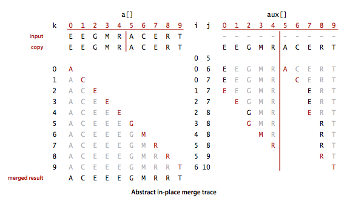

## 介绍

**归并**：将两个有序的数组归并成一个更大的有序数组。**归并排序**：排序一个数组，先递归地将它分成两半分别排序，然后将结果归并起来。归并排序的优点是能够保证将任意长度为N的数组排序所需时间和NlogN成正比；主要缺点是它需要的额外空间和N成正比。

<!-- more -->

## 原地归并的抽象方法

实现归并的一种方法是将两个不同的有序数组归并到第三个大数组中，两个子数组的元素都应该实现了Comparable接口。但当归并排序一个大数组时，需要很多次归并，每次归并都会创建一个新数组来存储排序结果会有问题。所以这里引入**原地归并排序**方法，可以先将前半部分排序，再将后半部分排序，然后再数组中移动元素而不需要使用额外的空间。

~~~java
public static void merge(Comparable[] a, int lo, int mid, int hi){
    //将a[lo...mid] 和 a[mid+1...hi]归并
    int i = lo, j = mid + 1;
    //将a[lo...hi]复制到aux[lo...hi]
    for(int k = lo; k <= hi; k++){
      	aux[k] = a[k];
    }
    //归并回到a[lo...hi]
    for(int k = lo; k <= hi; k++){
        if(i > mid){
          	a[k] = aux[j++];
        }else if(j > hi){
          	a[k] = aux[i++];
        }else if(less(aux[j], aux[i])){
          	a[k] = aux[j++];
        }else{
          	a[k] = aux[i++];
        }
    }
}
~~~

说明：

该方法先将元素复制到aux[]中，然后再归并回a[]中。方法在归并时进行了4个条件判断：

- 左半边用尽：取右半边的元素；
- 右半边用尽：取左半边的元素；
- 右半边的当前元素小于左半边的当前元素：取右半边的元素；
- 右半边的当前元素大于等于左半边的当前元素：取左半边的元素。

原地归并的轨迹：

## 自顶向下的归并排序

自顶向下的归并排序是基于原地归并的抽象实现的另一种递归归并，这是应用高效算法设计中**分治思想**的最典型的一个例子。这段递归代码是归纳证明算法能够正确地将数组排序的基础：如果它能将两个子数组排序，它就能通过归并两个子数组来将整个数组排序。

~~~java
public static void sort(Comparable[] a){
    aux = new Comparable[a.length]; //一次性分配空间
    sort(a, 0, a.length-1);
}

private static void sort(Comparable[] a, int lo, int hi){
    //将数组a[lo...hi]排序
    if(hi <= lo){
      	return;
    }
    int mid = lo + (hi - lo)/2;
    sort(a, lo, mid); //将左半边排序
    sort(a, mid+1, hi);//将右半边排序
    merge(a, lo, mid, hi);//归并排序
}
~~~

说明：

- aux[]数组最好的处理方式是设为sort方法的局部变量，将它作为参数传给merge方法。

- 对数组a[lo...hi]进行排序，先将它分为a[lo...mid]和a[mid+1...hi]两部分，分别通过递归调用将他们单独排序，最后将有序的子数组归并为最终的排序结果。

- 自顶向下的归并排序的调用轨迹

  

- 如图2.2.2中的轨迹所示。要将a[0...15]排序，sort方法会调用自己将a[0...7]排序，再在其中调用自己将a[0...3]和a[0...1]排序。在将a[0]和a[1]分别排序之后，终于才会开始将a[0]和a[1]归并（轨迹中把对单个元素的数组进行排序的调用省略了）。第二次归并是a[2]和a[3]，然后是a[0...1]和a[2...3]，以此类推。从这段轨迹可以看到，sort方法的作用其实在于安排多次merge方法调用的正确顺序。

- 对于长度为N的任意数组，自顶向下的归并排序需要1/2NlgN至NlgN次比较。用树状图说明：

  

  每个节点都表示一个sort方法通过merge方法归并而成的子数组这棵树正好有N层。对于0到N-1之间的任意k，自顶向下的第k层有2^k个子数组，每个数组的长度为2^(n-k)，归并最多需要2^(n-k)次比较。因此每层的比较次数为2^k * 2^(n-k)等于2^n，n层总共需要n2^n等于NlgN。

- 对于长度为N的任意数组，自顶向下的归并排序最多需要访问数组6NlgN次。证明：每次归并最多需要访问数组6N次（2N次用来复制，2N次用来将排好序的元素移动回去，另外最多比较2N次），由上面一条可得。

自顶向下的归并轨迹：

改进：

- 用不同的方法处理小规模问题能改进大多数递归算法的性能。对排序来说，插入排序和选择排序可能在小数组上比归并排序更快。使用插入排序处理小规模的子数组（比如长度小于15）一般可以将归并排序的运行时间缩短10%~15%。
- 添加一个判断条件，如果a[mid]小于等于a[mid+1]，我们就认为数组已经是有序的并跳过merge方法。
- 可以节省将数组复制到用于归并的辅助数组所用的时间。要做到这一点需要调用两种排序方法，一种将数据从输入数组排序到辅助数组，一种将数据从辅助数组排序到输入数组。

总结：

归并排序所需的时间和NlgN成正比，这表明只需要比遍历整个数组多个对数因子的时间就能将一个庞大的数组排序。可以用归并排序处理数百万甚至更大规模的数组，这是插入排序或者选择排序做不到的。归并排序的主要缺点是辅助数组所使用的额外空间和N的大小成正比。

## 自底向上的归并排序

实现归并排序的另一种方法是先归并那些微型数组，然后再成对归并得到的子数组，如此这般，直到将整个数组归并在一起。首先是两两归并（把每个元素想象成大小为1的数组），然后是四四归并，然后是八八归并...

~~~java
public static void sortfromdown(Comparable[] a){
    //进行lgN次两两归并
    int N = a.length;
    aux = new Comparable[N];
    for(int sz = 1; sz < N; sz = sz+sz){//sz子数组大小
        for(int lo = 0; lo < N-sz; lo += sz+sz){//lo：子数组索引
         	 merge(a, lo, lo+sz-1, Math.min(lo+sz+sz-1, N-1));
        }
    }
}
~~~

说明：

- aux[]数组最好的处理方式是设为sortfromdown方法的局部变量，将它作为参数传给merge方法。
- 自底向上的归并排序会多次遍历整个数组，根据子数组的大小进行两两归并。子数组的大小sz的初始值为1，每次加倍。
- 对于长度为N的任意数组，自底向上的归并排序需要1/2NlgN至NlgN次比较，最多访问数组6NlgN次。
- 当数组长度为2的幂时，自顶向下和自底向上的归并排序所用的比较次数和数组访问次数正好相同，只是顺序不同。
- 自底向上的归并排序比较适合用链表组织的数据（只需要重新组织链表链接就能将链表原地排序，不需要创建任何新的链表结点）。

自底向上的归并轨迹：

## 排序算法的复杂度

- 没有任何基于比较的算法能够保证使用小于lg（N!）~ NlgN次比较将长度为N的数组排序；
- 由上归并排序是一种渐进最优的基于比较排序的算法；
- 归并排序的空间复杂度不是最优的。