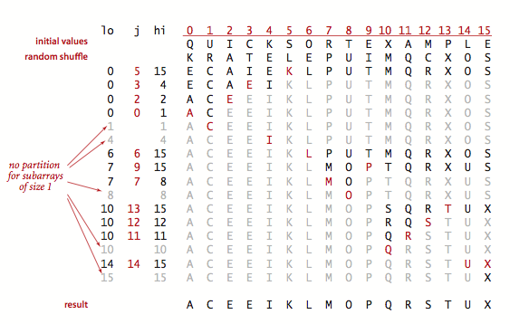
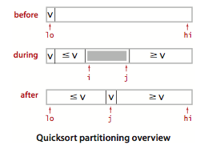
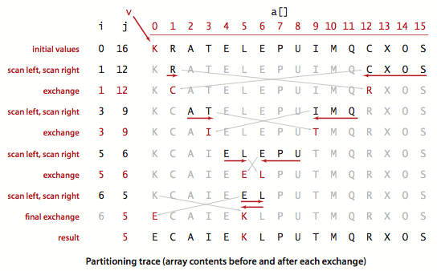

## 介绍

**快速排序**是一种分治的排序算法。它将一个数组分成两个子数组，将两部分独立地排序，当两个子数组都有序时整个数组也就有序了。快速排序和归并排序是互补的：归并排序将数组分成两个子数组分别排序，并将有序的子数组归并以将整个数组排序。归并排序将一个数组等分成两半，递归调用发生在处理整个数组之前；快速排序切分（partition）的位置取决于数组的内容，递归调用发生在处理整个数组之后。快速排序示意图：

<!-- more -->

## 快速排序

~~~java
public static void sort(Comparable[] a){
  	StdIn.shuffle(a);//消除对输入的依赖
  	sort(a, 0, a.length-1);
}

private static void sort (Comparable[] a, int lo, int hi){
  	if(hi <= lo){
    	return;
  	}
 	 int j = partition(a, lo, hi);//切分
  	sort(a, lo, j-1);//将左半部分a[lo...j-1]排序
  	sort(a, j+1, hi);//将右半部分a[j+1...hi]排序
}
~~~

快速排序递归地将子数组a[lo...hi]排序，先用partition（）方法将a[j]放到一个合适位置，然后再用递归调用将其他位置的元素排序。该方法的关键在于切分，这个过程使得数组满足下面三个条件：

1. 对于某个j，a[j]已经排定；
2. a[lo]到a[j-1]中的所有元素都不大于a[j]；
3. a[j+1]到a[hi]中的所有元素都不小于a[j]。

快速排序的结果轨迹：

## 切分

要实现快速排序，需要实现切分方法。一般策略是先随意地取a[lo]作为切分元素，然后从数组的左端开始向右扫描直到找到一个大于等于它的元素，再从数组的右端开始向左扫描直到找到一个小于等于它的元素。这两个元素显然是没有排定的，因此交换它们的位置。如此继续，就可以保证左指针i的左侧元素都不大于切分元素，右指针j的右侧元素都不小于切分元素。当两个指针相遇时，只需要将切分元素a[lo]和左子数组最右侧的元素a[j]交换后返回j即可。切分方法的大致过程如图：

快速排序的切分：

~~~java
private static int partition(Comparable[] a, int lo, int hi){
  	//将数组切分为a[lo...i-1],a[i],a[i+1...hi]
 	int i = lo, j = hi+1;//左右扫描指针
  	Comparable v = a[lo];//切分元素
  	while(true){
    	//扫描左右，检查扫描是否结束并交换元素
   		 while(less(a[++i],v)){
     	 	if(i == hi){
       	 		break;
      		}
     	}
    	while(less(v,a[--j])){
      		if(j == lo){
        		break;
      		}
    	}
    	if(i >= j){
      		break;
   	 	}
   		exch(a, i, j);
  	}
  	exch(a, lo, j);//将v = a[j]放入正确的位置
  	return j;      //a[lo...j-1] <= a[j] <= a[j+1...hi]达成
}
~~~

说明：

这段代码按照a[lo]的值v进行切分。当指针i和j相遇时主循环退出。在循环中，a[i]小于v时增大i，a[j]大于v时减小j，然后交换a[i]和a[j]来保证i左侧的元素都不大于v，j右侧的元素都不小于v。当指针相遇时交换a[lo]和a[j]，切分结束（切分值留在a[j]中）。

切分的轨迹：

性能特点：

- 优点一：快速排序切分方法的内循环会用一个递增的索引将数组元素和一个定值比较。内循环很简介。
- 优点二：比较次数很少。最多需要N^2/2次比较，平均需要~2NlnN次比较。
- 缺点：在切分不平衡时效率极低。解决方法是排序前数组随机乱序。
- 上面算法与归并排序比较是：快速排序更快（快速排序比归并排序比较次数多，但移动数据次数少）

## 算法改进

### 切换到插入排序

和大多数递归排序算法一样，改进快速排序性能的一个简单办法基于以下两点：

1. 对于小数组，快速排序比插入排序慢；

2. 因为递归，快速排序的sort方法在小数组中也会调用自己。因此在排序小数组时应该切换到插入排序。

   ~~~java
   private static void sort (Comparable[] a, int lo, int hi){
     	/*	
     	if(hi <= lo){
       	return;
     	}
     	*/
      //在排序小数组时切换到插入排序,M的最佳值与系统有关，但是5~15之间的任意值在大多数情况下令人满意
     	if(hi <= lo + M){
         	Insertion.sort(a, lo, hi);
         	return;
     	}
    	int j = partition(a, lo, hi);//切分
     	sort(a, lo, j-1);//将左半部分a[lo...j-1]排序
     	sort(a, j+1, hi);//将右半部分a[j+1...hi]排序
   }
   ~~~

### 三向切分的快速排序

它从左到右遍历数组一次，维护一个指针It使得a[lo...It-1]中的元素都小于v，一个指针gt使得a[gt+1...hi]中的元素都大于v，一个指针i使得a[it...i-1]中的元素都等于v，a[i...gt]中的元素还未确定。一开始i和lo相等，我们使用Comparable接口（而非less()）对a[i]进行三向比较直接处理下面情况：

- a[i]小于v，将a[It]和a[i]交换，将It和i加1；
- a[i]大于v，将a[gt]和a[i]交换，将gt减1；
- a[i]等于v，将i加1。

除非和切分元素相等，其他元素都会被交换。

三向切分示意图：

三向切分的快速排序

~~~java
public static void sort(Comparable[] a){
    StdIn.shuffle(a);//消除对输入的依赖
    sort3way(a, 0, a.length-1); //三向切分的快速排序
}

private static void sort3way(Comparable[] a, int lo, int hi){
    if(hi <= lo){
      	return;
    }
    int it = lo, i = lo+1, gt = hi;
    Comparable v = a[lo];
    while(i <= gt){
        int cmp = a[i].compareTo(v);

        if(cmp < 0){
          	exch(a, it++, i++);
        }else if(cmp > 0){
          	exch(a, i, gt--);
        }else{
          	i++;
        }
    }//现在a[lo...it-1] < v = a[it...gt] < a[gt+1...hi]成立
    sort3way(a, lo, it-1);
    sort3way(a, gt+1, hi);
}
~~~

说明：

这段代码的切分能够将和切分元素相等的元素归位，这样它们就不会被包含在递归调用处理的子数组中，对于存在大量重复元素的数组，这种方法比标准的快速排序效率高很多。

三向切分的快速排序的轨迹：

总结：

- 对于只有若干不同主键的随机数组，归并排序的时间复杂度是线性对数的，而三向切分快速排序则是线性的。
- 对于大小为N的数组，三向切分的快速排序需要~（2ln2）NH次比较。H为由主键值出现频率定义的香浓信息量。