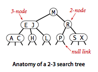
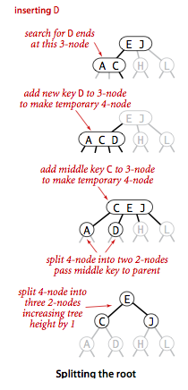
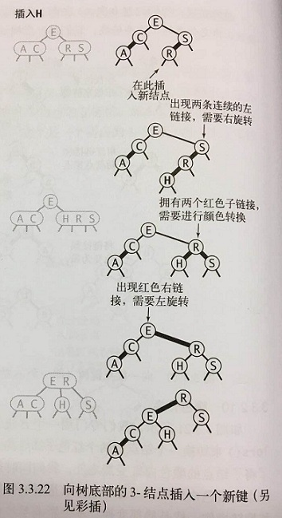

## 介绍

在一颗含有N个结点的树中，我们希望树高为~lgN，这样就能保证所有查找都能在~lgN次比较内结束，就和二分查找一样。但是在动态插入中保持树的完美平衡的代价太高了。

<!-- more -->

## 2-3查找树

**定义：**一颗2-3查找树或为一颗空树，或由以下结点组成：

- 2-结点：含有一个键（及其对应的值）和两条链接，左链接指向的2-3树中的键都小于该结点，右链接指向的2-3树中的键都大于该结点。
- 3-结点：含有两个键（及其对应的值）和三条链接，左链接指向的2-3树中的键都小于该结点。中链接指向的2-3树中的键都位于该结点的两个键之间，右链接指向的2-3树中的键都大于该结点。

2-3查找树示意图：

一颗完美平衡的2-3查找树中的所有空链接到根结点的距离都是相同的。

### 1. 查找

要判断一个键是否在树中，我们先将它和根结点中的键比较，如果它和其中任意一个相等，查找命中；否则就根据比较的结果找到指向相应区间的链接，并在其指向的子树中递归地继续查找。如果这是个空链接，查找未命中。具体查找过程如下：

### 2. 向2-结点中插入新键

在2-3树中插入一个新结点，可以先和二叉查找树一样进行一次未命中的查找，如果未命中的查找结束于一个2-结点，我们只要把这个2-结点替换为一个3-结点，将要插入的键保存在其中即可。如下图：

如果未命中的查找结束于一个3-结点，事情就麻烦了。

### 3. 向一颗只含有一个3-结点的树中插入新键

我们需要向一颗只含有一个3-结点的树中插入一个新键，这颗树有两个键，所以在它唯一的结点中已经没有可插入新键的空间了。为了将新键插入，我们先临时将新键存入该结点中，使之成为一个4-结点。它很自然地扩展了以前的结点并含有3个键和4条链接。然后很容易将它转换为一颗由3个2-结点组成的2-3树，其中一个结点（根）含有中键，一个结点含有3个键中的最小者（和根结点的左链接相连），一个结点含有3个键中的最大者（和根结点的右链接相连）。这棵树既是一颗含有3个结点的二叉查找树，又是一颗完美平衡的2-3树。如下图：

### 4. 向一个父结点为2-结点的3-结点中插入新键

假设未命中的查找结束于3-结点，而它的父结点是一个2-结点，在这种情况下我们需要**在维持树的完美平衡的前提下为新键腾出空间** 。我们可以想刚才一样构造一个临时 的4-结点并将其分解，但此时我们不会为中键创建一个新结点，而是将其移动至原来的父结点中。根据我们的假设，父结点中是有空间的：父结点是一个2-结点，插入后变成一个3-结点。另外，这次转换也不影响2-3树的主要性质。树仍然是有序的，因为中键被移动到父结点中去了，树仍然是完美平衡的，插入后所有的空链接到根结点的距离仍然相同。其过程如下图：

### 5. 向一个父结点为3-结点的3-结点中插入新键

现在假设未命中的查找结束于一个父结点为3-结点的结点，我们再次和刚才一样构造一个临时的4-结点并分解它，然后将它的中键插入到它的父结点中，但父结点也是一个3-结点，因此需要再用这个中键构造一个临时4-结点，然后**在这个结点上进行相同的变换** ，即分解这个父结点并将它的中键插入到更高层次的父结点，直到遇到一个2-结点并将它替换为一个不需要继续分解的3-结点，或者是到达3-结点的根。该过程如下：

### 6. 分解根结点

如果从插入结点到根结点的路径上全都是3-结点，我们的根结点最终变成一个临时的4-结点。此时我们可以按照向一颗只有一个3-结点的树中插入新键的方法处理这个问题。我们将临时的4-结点分解为3个2-结点，使树的高度加1。这次最后的变换仍然保持了树的完美平衡性，因为它变换的是根结点。其过程如下图：

### 7. 局部变换

将一个4-结点分解为一颗2-3树可能有6中情况，如下图。

这个4-结点可能是根结点，可能是一个2-结点的左子结点或者右子结点，也可能是一个3-结点的左子结点、中子结点或者右子结点。2-3树插入算法的根本在于这些变换都是局部的：除了相关的结点和链接之外不必修改或者检查树的其他部分。树中的任何地方只有符合相应的模式，变换都可以进行。每个变换都会将4-结点中的一个键送入它的父结点中，并重构相应的链接而不必涉及树的其他部分。这些局部变换不会影响树的全局有序性和平衡性。

### 8. 全局性质

如下图所示的是当一个4-结点是一个3-结点的中子结点时的完整变换情况。如果在变换之前根结点到所有空链接的路径长度为h，那么变换后该长度仍然为h。所有的变换都具有这个性质，即使是将一个4-结点分解为两个2-结点并将其父结点由2-结点变为3-结点，或是由3-结点变为一个临时的4-结点时也是如此。当根结点被分解为3个2-结点时，所有空链接到根结点的路径长度才会加1。

### 9. 总结

和标准的二叉查找树由上向下生长不同，2-3树的生长是由下向上的。**在一颗大小为N的2-3树中，查找和插入操作访问的结点必然不超过lgN个** 。因此我们可以确定2-3树在最坏情况下仍然有较好的性能。上面我们理解了2-3树的插入算法，下面我们要学习一种名为**红黑二叉查找树**的简单数据结构来实现它。

## 红黑二叉查找树

红黑二叉查找树背后的基本思想是用标准的二叉查找树（完全由2-结点构成）和一些额外的信息（替换3-结点）来表示2-3树。

### 1.替换3-结点 

我们将树中的链接分为两种类型：**红链接**将两个2-结点连接起来构成一个3-结点，**黑链接**则是2-3树中的普通链接。确切地说，我们将3-结点表示为由一条**左斜**的红色链接（两个2-结点其中之一是另一个的左子结点）相连的两个2-结点。如图所示：

这种表示法的一个优点是，我们无需修改就可以直接使用标准二叉查找树的get()方法。对于任意的2-3树，只要对结点进行转换，我们都可以立即派生出一颗对应的二叉查找树。我们将用这种方式表示的2-3树的二叉查找树称为**红黑二叉查找树** ，简称**红黑树** 。

### 2. 一种等价的定义

红黑树的另一种**定义**是含有红黑链接并满足下列条件的二叉查找树：

- 红链接均为左链接；
- 没有任何一个结点同时和两条红链接相连；
- 该树是**完美黑色平衡**的，即任意空链接到根结点的路径上的黑链接数量相同。

满足这样定义的红黑树和相应的2-3树是一一对应的。

### 3. 一一对应

如果我们将一颗红黑树中的红链接画平，那么所有的空链接到根结点的距离都将是相同的。如下图：

如果我们将由红链接相连的结点合并，得到的就是一颗2-3树。无论选择何种方式定义，红黑树都既是二叉查找树，也是2-3树。如下图：

因此我们能够在保持一一对应关系的基础上实现2-3树的插入算法，那么我们就能够将两个算法的优点结合起来：二叉查找树中简洁高效的查找方法和2-3树中高效的平衡插入算法。

### 4. 颜色表示

因为每个结点都只会有一条指向自己的链接（从它的父结点指向它），我们将链接的颜色保存在表示结点的Node数据类型的布尔变量中。红色表示true，黑色表示false，约定空链接为黑色。当我们提到一个结点的颜色时，我们指的是指向该结点的链接的颜色。如下图：

~~~java
private static final boolean RED = true;
private static final boolean BLACK = false;
private boolean isRed(Node x){
  	if(x == null) return false;
  	return x.color == RED;
}
~~~

### 5. 旋转

旋转操作会改变红链接的指向。首先，假设我们有一条红色的右链接需要被转化为**左链接** ，这个操作叫做**左旋转** ，它对应的方法接受一条指向红黑树中的某个结点的链接作为参数。假设被指向的结点的右链接是红色的，这个方法会对树进行必要的调整并返回一个指向包含同一组键的子树且其左链接为红色的根结点的链接。操作很容易理解：我们只是将用两个键中的较小者作为根结点变为将较大者作为根结点。实现将一个红色左链接转换为一个红色右链接的一个**右旋转**的代码完全相同，只需要将left和right互换即可。其操作如下图：

### 6. 在旋转后重置父结点的链接

无论左旋转还是右旋转，旋转操作都会返回一条链接。我们总是会用rotateRight()或rotateLeft()的返回值重置父结点（或根结点）中相应的链接。这个链接可能是红色也可能是黑色，rotateRight()和rotateLeft()都通过将x.color设为h.color保留它原来的颜色。这可能会产生两条连续的红链接，但我们的算法会继续用旋转操作修正这种情况。这种简洁的代码是我们使用递归实现二叉查找树的各种方法的主要原因。它使得旋转操作成为了普通插入操作的一个简单补充。

在插入新键时我们可以使用旋转操作保证2-3树和红黑树之间的一一对应关系，因为旋转操作可以保持红黑树的两个重要性质：**有序性** 和 **完美平衡性** 。

### 7. 向单个2-结点中插入新键

一颗只含有一个键的红黑树只含有一个2-结点。插入另一个键之后，我们马上就需要将它们旋转。如果新键小于老键，我们只需要新增一个红色的结点即可，新的红黑树和单个3-结点完全等价。如果新键大于老键，那么新增的红色结点将会产生一条红色的右链接。我们需要使用root = rotateLeft(root) 来将其旋转为红色左链接并修正根结点的链接，插入操作才算完成。两种情况的结果均为一颗和单个3-结点等价的红黑树，其中含有两个键，一条红链接，树的黑链接高度为1，如下图所示：

### 8. 向树底部的2-结点插入新键

用和二叉查找树相同的方式向一颗红黑树中插入一个新键会在树的底部新增一个结点（为了保证有序性），但总是用红链接将新结点和它的父结点相连。如果它的父结点是一个2-结点，那么上面的两种处理方法仍然适用。如果指向新结点的是父结点的左链接，那么父结点就直接成为了一个3-结点；如果指向新结点的是父结点的右链接，这需要一次左旋转去修正它。其操作如下图所示：

### 9. 向一颗双键树（即一个3-结点）中插入新键

分三种情况：新键小于树中的两个键，在两者之间，新键大于树中的两个键。每种情况中都会产生一个同时连接到两条红链接的结点，我们需要修正这一点。

- 三者中最简单的情况是新键大于原树中的两个键，因此它被连接到3-结点的右链接。此时树是平衡的，根结点是中间大小的键，它有两条红链接分别和较小和较大的结点相连。如果我们将两条链接的颜色都由红变黑，那么我们就得到了一颗由三个结点组成、高为2的平衡树。它正好能够对应一颗2-3树。其他两种情况也会转化为这种情况。
- 如果新键小于原树中的两个键，它会被连接到最左边的空链接，这样就产生了两条连续的红链接，此时我们只需要将上层的红链接右旋转即可得到第一种情况（中间键为根节点并和其他两个结点用红链接相连）。
- 如果新键介于原树中的两个键之间，这又会产生两条连续的红链接，一条红色左链接接一条红色右链接，此时我们只需要将下层的红链接左旋转即可得到第二种情况（两条连续的红色左链接）。

总的来说，我们通过0次、1次和2次旋转以及颜色的变化得到了期望的结果。整个操作如下图：

### 10. 颜色转换

我们专门用一个方法flipColors()来转换一个结点的两个红色子结点的颜色。除了将子结点的颜色由红变黑，同时还要将父结点的颜色由黑变红。这项操作最重要的性质在于它和旋转操作一样是局部变换，不会影响**整颗树的黑色平衡性** 。如下图所示：

### 11. 根结点总是黑色

由9所述的情况中，颜色转换会使根结点变为红色。这也可能出现在很大的红黑树中。严格地说，红色的根结点说明根结点是一个3-结点的一部分，但实际情况是我们每次插入后都会将根结点设为黑色。注意：**每当根结点由红变黑时树的黑链接高度就会加1** 。

### 12. 向树底部的3-结点插入新键

同9所述的三种情况：指向新结点的链接可能是3-结点的右链接（此时我们只需要转换颜色即可），或是左链接（此时我们需要进行右旋转再转换颜色），或是中链接（此时我们需要先左旋转下层链接然后右旋转上层链接，最后再转换颜色）。颜色转换会使的中结点的链接变红，相当于将它送入了父结点。这意味着在父结点中继续插入一个新键，我们也会继续用相同的办法解决。其操作如下图：

### 13. 将红链接在树中向上传递

2-3树中的插入算法需要我们分解3-结点，将中间键插入父结点，如此这般直到遇到一个2-结点或是根结点。为了达成这个目标：每次必要的旋转之后我们都会进行颜色转换，这使得中结点变红。在父结点看来，处理这样一个红色结点的方式和处理一个新插入的红色结点完全相同，即继续把红链接转移到中结点上去。在红黑树中实现2-3树的插入算法的关键操作所需的步骤：**要在一个3-结点下插入新键，先创建一个临时的4-结点，将其分解并将红链接由中间键传递给它的父结点。重复这个过程，我们就能将红链接在树中向上传递，直至遇到一个2-结点或者根结点** 。其操作如下图所示：

在沿着插入点到根结点的路径向上移动时所经过的每个结点中顺序完成以下操作，我们就能完成插入操作：

- 如果右子结点是红色的而左子结点是黑色的，进行左旋转；
- 如果左子结点是红色的且它的左子结点也是红色的，进行右旋转；
- 如果左右子结点均为红色，进行颜色转换。

## 实现

因为保持树的平衡所需的操作是由下向上在每个所经过的结点中进行的，将它们植入我们已有的实现中十分简单：只需要在递归调用后完成这些操作即可，上一段中列出的三种操作都可以通过一个检测两个结点的颜色的if语句完成。

~~~java
public class RedBlackBST<Key extends Comparable<Key>, Value> {
  	private Node root;
  	private class Node{            //含有color变量的Node对象
      	private Key key;           // key
        private Value val;         // associated data
        private Node left, right;  // links to left and right subtrees
        private boolean color;     // color of parent link
        private int size;          // subtree count

        public Node(Key key, Value val, boolean color, int size) {
            this.key = key;
            this.val = val;
            this.color = color;
            this.size = size;
        }
  	}
  
  /*
   * 红黑树的插入算法
   */
    public void put(Key key, Value val) {
        if (val == null) {
            delete(key);
            return;
        }
        root = put(root, key, val);
        root.color = BLACK;
    }

    private Node put(Node h, Key key, Value val) { 
        if (h == null) return new Node(key, val, RED, 1);

        int cmp = key.compareTo(h.key);
        if      (cmp < 0) h.left  = put(h.left,  key, val); 
        else if (cmp > 0) h.right = put(h.right, key, val); 
        else              h.val   = val;

        if (isRed(h.right) && !isRed(h.left))      h = rotateLeft(h);
        if (isRed(h.left)  &&  isRed(h.left.left)) h = rotateRight(h);
        if (isRed(h.left)  &&  isRed(h.right))     flipColors(h);
        h.size = size(h.left) + size(h.right) + 1;

        return h;
    }
  /************************辅助方法start********************************/
  	private boolean isRed(Node x) {
        if (x == null) return false;
        return x.color == RED;
    }
  
  	private int size(Node x) {
        if (x == null) return 0;
        return x.size;
    } 
    public int size() {
        return size(root);
    }
  
  	private Node rotateLeft(Node h) {
        Node x = h.right;
        h.right = x.left;
        x.left = h;
        x.color = x.left.color;
        x.left.color = RED;
        x.size = h.size;
        h.size = size(h.left) + size(h.right) + 1;
        return x;
    }
  
  	private Node rotateRight(Node h) {
        Node x = h.left;
        h.left = x.right;
        x.right = h;
        x.color = x.right.color;
        x.right.color = RED;
        x.size = h.size;
        h.size = size(h.left) + size(h.right) + 1;
        return x;
    }
  
    private void flipColors(Node h) {
        h.color = !h.color;
        h.left.color = !h.left.color;
        h.right.color = !h.right.color;
    }
/***************************辅助方法end********************************/
}
~~~

除了递归调用后的三条if语句，红黑树中put()的递归实现和二叉查找树中put()的实现完全相同。它们在查找路径上保证了红黑树和2-3树的一一对应关系，使得树的平衡性接近完美。第一条if语句会将任意含有红色右链接的3-结点（或临时的4-结点）向左旋转；第二条if语句会将临时的4-结点中两条连续红链接中的上层链接向右旋转；第三条if语句会进行颜色转换并将红链接在树中向上传递。下图是用标准索引测试用例和用同一组键按升序构造一颗红黑树的轨迹：

## 删除操作

删除操作比插入操作更加复杂，不仅要在（为了删除一个结点而）构造临时4-结点时沿着查找路径**向下**进行变换，还要在分解遗留的4-结点时沿着查找路径**向上**进行变换（同插入操作）。

### 1. 自顶向下的2-3-4树

我们先学习一个沿查找路径既能向上也能向下进行变换的稍简单得算法：**2-3-4树的插入算法** ，2-3-4树中允许存在我们以前见过的4-结点。它的插入算法沿查找路径向下进行变换是为了保证当前结点不是4-结点（这样树底才有空间来插入新的键），沿查找路径向上进行变换是为了将之前创建的4-结点配平，如下图所示：

向下的变换和我们在2-3树中分解4-结点所进行的变换完全相同。如果根结点是4-结点，我们就将它分解成三个2-结点，使得树的高度加1。在向下查找的过程中，如果遇到一个父结点为2-结点的4-结点，我们将4-结点分解为两个2-结点并将中间键传递给它的父结点，使得父结点变成一个3-结点；如果遇到一个父结点为3-结点的4-结点，我们将4-结点分解为两个2-结点并将中间键传递给它的父结点，使得父结点变为一个4-结点；我们不必担心会遇到父结点为4-结点的4-结点，因为插入算法本身保证了这一情况不会出现。到达树底后，我们也只会遇到2-结点或者3-结点，所以我们可以插入新的键。要用红黑树实现这个算法，我们需要：

- 将4-结点表示为由三个2-结点组成的一颗平衡的子树，根结点和两个子结点都用红链接相连；
- 在向下的过程中分解所有4-结点并进行颜色转换；
- 和插入操作一样，在向上的过程中用旋转将4-结点配平（因为4-结点可以存在，所以允许一个结点同时连接到两条链接）。

只需要将上面put方法移动一行就能实现2-3-4树的插入操作：**将flipColors语句（及其if语句）移动到递归调用前（null测试和比较操作之间）** 。

### 2. 删除最小键

从树底部的3-结点中删除键是简单的，但2-结点删除一个键会留下一个空结点，一般我们会将它替换为一个空链接，但这样会破坏树的完美平衡性所以我们需要这样做：为了保证我们不会删除一个2-结点，我们沿着左链接向下进行变换，确保当前结点不是2-结点。分下面几种情况：

- 如果当前结点的左子结点不是2-结点，完成；
- 如果当前结点的坐子结点是2-结点而它的亲兄弟结点不是2-结点，将左子结点的兄弟结点中的一个键移动到左子结点中；
- 如果当前结点的左子结点和它的亲兄弟结点都是2-结点，将左子结点、父结点中的最小键和左子结点最近的兄弟结点合并为合并为一个4-结点，使父结点由3-结点变为2-结点或者由4-结点变为3-结点。

在遍历的过程中执行这个过程，最后能够得到一个含有最小键的3-结点或者4-结点，然后我们就可以直接从中将其删除，将3-结点变成2-结点，或者将4-结点变为3-结点。然后我们再回头向上分解所有临时的4-结点。删除最小键操作如下图所示：

### 3. 删除操作

在查找路径上进行和删除最小键相同的变换同样可以保证在查找过程中任意当前结点均不是2-结点。如果被查找的键在树的底部，我们可以直接删除它。如果不在，我们需要将它和它的后继结点交换，就和二叉查找树一样。因为当前结点必然不是2-结点，问题已经转换为在一颗根结点不是2-结点的子树中删除最小的键，我们可以在这颗树中使用前面所说的算法。和以前一样，删除之后我们需要向上回溯并分解余下的4-结点。

## 红黑树的性质

结论：**所有基于红黑树的符号表实现都能保证操作的运行时间为对数级别（范围查找除外，它所需的额外时间和返回的键的数量成正比）** 。

1. 一颗大小为N的红黑树的高度不会超过2lgN。
2. 一颗大小为N的红黑树中，根节点到任意结点的平均路径长度为~1.00lgN。
3. 红黑树**能够保证对数级别的查找和插入操作的实现** 。

红黑树最吸引人的一点是它的实现中最复杂的代码仅限于put方法和删除方法。二叉查找树中的查找最大键和最小键、select、rank、floor、ceiling和范围查找方法不会做任何改动即可继续使用，因为红黑树也是二叉查找树而这些操作也不会涉及结点的颜色。各种符号表实现的性能总结：

