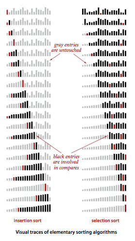

## 介绍

排序就是将一组对象按照某种逻辑顺序重新排列的过程。排序算法的目标是将所有元素的主键按照某种方式排列。在java中，元素通常都是对象，对主键的描述则是通过一种内置的机制---Comparable接口。

排序算法类的模板：

~~~java
/**
 * 排序算法类的模板
 * @author guangguang_duan
 *
 */
public class SortExample {

	public static void sort(Comparable[] a){
		//各种排序算法
	}
	
	private static boolean less(Comparable v, Comparable w){
		return v.compareTo(w) < 0;
	}
	
	private static void exch(Comparable[] a, int i, int j){
		Comparable t = a[i];
		a[i] = a[j];
		a[j] = t;
	}
	
	private static void show(Comparable[] a){
		//单行中打印数组
		for(int i = 0; i < a.length; i++){
			System.out.print(a[i] + " ");
		}
		System.out.println();
	}
	
	public static boolean isSorted(Comparable[] a){
		//测试数组元素是否有序
		for(int i = 1; i < a.length; i++){
			if(less(a[i],a[i-1])){
				return false;
			}
		}
		return true;
	}
	
	public static void main(String[] args) {
		//从标准输入读取字符串，将他们排序并输出
		String[] a = StdIn.readStrings();
		sort(a);
		assert isSorted(a);//确认排序后数组元素都是有序的
		show(a);
	}
}
~~~

<!-- more -->

可比较的数据类型：

java中封装了许多数据类型例：Integer、Double、String、File、URL等都实现了Comparable接口，具有比较方法。在创建自己的数据类型是，我们只要实现Comparable接口就能保证用例代码可以将其排序，再实现一个compareTo方法来定义目标数据类型的自然次序。

~~~java
/**
 * 定义可比较的数据类型
 * @author guangguang_duan
 *
 */
public class DateCompareto implements Comparable<DateCompareto>{

	private final int day;
	private final int month;
	private final int year;
	
	public DateCompareto(int d, int m, int y){
		day = d;
		month = m;
		year = y;
	}
	
	public int day(){
		return day;
	}
	
	public int month(){
		return month;
	}
	
	public int year(){
		return year;
	}
	
	@Override
	public int compareTo(DateCompareto that) {
		if(this.year > that.year) return 1;
		if(this.year < that.year) return -1;
		if(this.month > that.month) return 1;
		if(this.month > that.month) return -1;
		if(this.day > that.day) return 1;
		if(this.day > that.day) return -1;
		return 0;
	}
	
	public String toString(){
		return month + "/" + day + "/" + year;
	}
}
~~~

排序的成本模型：

在研究排序算法时，我们需要计算**比较**和**交换**的数量，对于不交换元素的算法，我们会计算**访问数组的次数**。

## 选择排序

**选择排序**：先找到数组中最小的那个元素，将它和数组的第一个元素交换位置，然后在剩下的元素中找到最小的元素，将它和数组的第二个元素交换位置，如此反复，直到将整个数组排序。

~~~java
public static void selectSort(Comparable[] a){
    //将a[]按升序排列
    int N = a.length;
    for(int i = 0; i < N; i++){
        int min = i; //最小元素索引
        for(int j = i+1; j < N; j++){
            if(less(a[j],a[min])){
              	min = j;
            }
        }
        exch(a,i,min);
	}
}
~~~

说明：

- 运行时间和输入无关。选择排序会一遍遍扫描数组，一个有序数组和无序数组用选择排序时间一样
- 数据移动是最少的。对于长度为N的数组，选择排序需要大约N^2/2次比较和N次交换。交换次数和数组大小是线性关系
- 该算法在第I个元素排好序后，I前面的元素不会再被访问（数组扫描）。
- 算法的时间效率取决于比较的次数。

选择排序的轨迹：

## 插入排序

**插入排序**：将每个元素插入到合适的位置，我们需要在插入元素时将其余所有元素向右移动一位。与选择排序一样，当前索引左边的所有元素都是有序的，当索引到达数组的右端时，数组排序就完成了。和选择排序不同的是，插入排序所需要的时间取决于输入中元素的初识位置。

~~~java
public static void insertSort(Comparable[] a){
    //将a[]按升序排列
    int N = a.length;
    for(int i = 1; i < N; i++){
        for(int j = i; j > 0 && less(a[j],a[j-1]); j--){
         	 exch(a,j,j-1);
        }
			
	}
}
~~~

说明：

- 插入排序对部分有序数组很有效，选择排序则都一样。
- 对于有序数组，插入排序能够立即发现每个元素都已经在合适的位置上，它的运行时间是线性的。
- 对于随机排列的长度为N且主键不重复的数组，平均情况下插入排序需要~N^2/4次比较以及~N^2/4次交换；最坏情况下需要~N^2/2次比较和~N^2/2次交换；最好情况下需要N-1次比较和0次交换。
- 大幅度提高插入排序的速度，只需要在内循环中将较大的元素都向右移动而不总是交换。

插入排序轨迹：

## 两种排序算法比较

插入排序不会访问索引右侧的元素，选择排序不会访问索引左侧的元素。两种算法的可视轨迹图：

比较两种排序算法

~~~java
/**
 * 排序算法比较
 * @author guangguang_duan
 *
 */
public class SortCompare {

	//针对输入，为该算法计时
	public static double time(String alg, Double[] a){
		CuurentTime timer = new CuurentTime();
		if(alg.equals("Insertion")) Insertion.sort(a);
		if(alg.equals("Selection")) Selection.sort(a);
		if(alg.equals("Shell")) Shell.sort(a);
		if(alg.equals("Merge")) Merge.sort(a);
		if(alg.equals("Quick")) Quick.sort(a);
		if(alg.equals("Heap")) Heap.sort(a);
		return timer.endTime();
	}
	
	public static double timeRandomInput(String alg, int N, int T){
		//使用算法alg将T个长度为N的数组排序
		double total = 0.0;
		Double[] a = new Double[N];
		for(int t = 0; t < T; t++){
			//生成一个数组并排序
			for(int i = 0; i < N; i++){
				a[i] = StdRandom.uniform();
			}
			total += time(alg, a);
		}
		return total;
	}
	public static void main(String[] args) {
		String alg1 = args[0];
		String alg2 = args[1];
		int N = Integer.parseInt(args[2]);
		int T = Integer.parseInt(args[3]);
		double t1 = timeRandomInput(alg1, N, T);
		double t2 = timeRandomInput(alg2, N, T);

		System.out.println("t2/t1 :" + t2/t1);
	}
	
	// % java SortCompare Insertion Selection 1000 100

}
~~~

说明：

对于随机排序的无重复主键的数组，插入排序和选择排序的运行时间是平方级别的，两者之比应该是一个较小的常数。