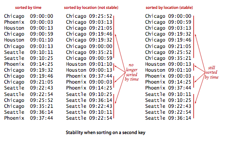

## 介绍

 排序之所以很有用是因为在一个有序的数组中查找一个元素要比在一个无序的数组中查找简单得多。

<!-- more -->

## 二分查找法

算法使用两个变量lo和hi，并保证如果该键在数组中则它一定在a[lo...hi]中，方法在循环中不断将数组的中间键（索引为mid）和被查找的键比较，如果被查找的键等于a[mid]，则返回mid，否则算法就将查找范围缩小一半。

~~~java
public class BinarySearch {

    private BinarySearch() { }

  	public static int rank(int key, int[] a) {
        return indexOf(a, key);
    }
  
    public static int indexOf(int[] a, int key) {
        int lo = 0;
        int hi = a.length - 1;
        while (lo <= hi) {
            // Key is in a[lo..hi] or not present.
            int mid = lo + (hi - lo) / 2;
            if      (key < a[mid]) hi = mid - 1;
            else if (key > a[mid]) lo = mid + 1;
            else return mid;
        }
        return -1;
    }

    public static void main(String[] args) {

        // read the integers from a file
        In in = new In(args[0]);
        int[] whitelist = in.readAllInts();

        // sort the array
        Arrays.sort(whitelist);

        // read integer key from standard input; print if not in whitelist
        while (!StdIn.isEmpty()) {
            int key = StdIn.readInt();
            if (BinarySearch.indexOf(whitelist, key) == -1)
                StdOut.println(key);
        }
    }
}
~~~

## 多种排序方法

1. Comparable接口

   实现Comparable接口只需要定义一个compareTo()方法并在其中定义该数据类型的中大小关系即可。

2. Comparator接口

   比较器Comparator接口允许我们在一个类中实现多种排序方法。它只有一个compare()方法来比较两个对象。如果一种数据类型实现了这个接口，我们就可以将将另一个实现了Comparator接口的对象传递给sort()方法，sort()方法再传递给less()方法。

   Comparator接口允许我们为任意数据类型定义多种排序方法。用Comparator接口来替代Comparable接口能够更好地将数据类型的定义和两个该类型的对象应该如何比较的定义区分开来。

一个元素的多种属性都可能被用作排序的键。例如：

### 使用了Comparator的插入排序

~~~java
public static void sort(Object[] a, Comparator comparator) {
        int n = a.length;
        for (int i = 0; i < n; i++) {
            for (int j = i; j > 0 && less(a[j], a[j-1], comparator); j--) {
                exch(a, j, j-1);
            }
        }
}

private static boolean less(Object v, Object w, Comparator comparator) {
        return comparator.compare(v, w) < 0;
}

private static void exch(Object[] a, int i, int j) {
        Object swap = a[i];
        a[i] = a[j];
        a[j] = swap;
}
~~~

### 使用比较器实现优先队列

sort()方法每次比较中都会回调Transaction类中用例指定的compare()方法，为了避免每次排序都会创建一个新的Comparator对象，使用final来定义这些比较器。

~~~java
public class Transaction  {
  	//...
    private final String  who;      // customer
    private final Date    when;     // date
    private final double  amount;   // amount

  	//...
  
    public static class WhoOrder implements Comparator<Transaction> {

        @Override
        public int compare(Transaction v, Transaction w) {
            return v.who.compareTo(w.who);
        }
    }

    public static class WhenOrder implements Comparator<Transaction> {

        @Override
        public int compare(Transaction v, Transaction w) {
            return v.when.compareTo(w.when);
        }
    }

    public static class HowMuchOrder implements Comparator<Transaction> {

        @Override
        public int compare(Transaction v, Transaction w) {
            if(v.amout < w.amout) return -1;
          	if(v.amout > w.amout) return 1;
          	return 0;
        }
    }
}
~~~

要将Transaction对象的数组按照时间排序可以调用：

- > Insertion.sort(a, new Transaction.WhenOrder());

或者按照金额排序：

- > Insertion.sort(a, new Transaction.HowMuchOrder());

### 稳定性

如果一个排序算法能够保留数组中重复元素的相对位置则可以被称为是稳定的。从另一个键上排序的稳定性如图：

## 各种排序算法的性能特定

> 1. 取决于输入元素的排列情况；2. 运行效率由概率提供保证

快速排序是最快的通用排序算法。在大多数实际情况中，快速排序是最佳选择，但如果稳定性很重要而空间又不是问题，归并排序可能是最好的。