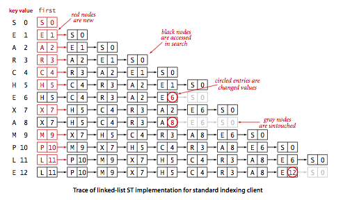
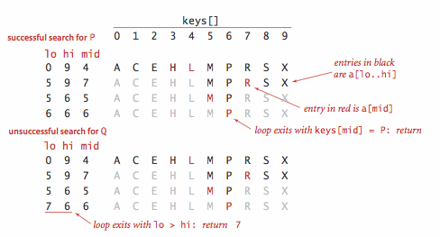
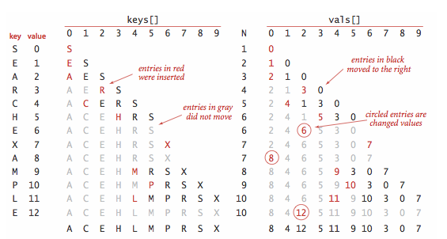

## 介绍

**定义：**符号表是一种存储键值对的数据结构，支持两种操作：插入（put），即将一组新的键值对存入表中；查找（get），即根据给定的键得到相应的值。

一种简单得泛型符号表API：

| public class ST<Key, Value>  |             描述              | 默认实现                    |
| :--------------------------: | :-------------------------: | ----------------------- |
|             ST()             |           创建一张符号表           |                         |
| void put(Key key, Value val) |  将键值对存入表中（若值为空则将键key从表中删除）  |                         |
|      Value get(Key key)      | 获取键key对应的值（若键key不存在则返回null） |                         |
|     void delete(Key key)     |      从表中删除键key（及其对应的值）      | put(key, null)          |
|  boolean contains(key key)   |       键key在表中是否有对应的值        | return get(key) != null |
|      boolean isEmpty()       |            表是否为空            | return size() == 0      |
|          int size()          |           表中键值对数量           |                         |
|     Iterable<Key> keys()     |          表中所有键的集合           |                         |

说明：

- 不允许存在重复的键，并且键不为空；
- 新值会替代旧值，并且值不为空；
- 两种删除：延时删除，即将键对应的值置为空，某个时候删除所有值为空的键；即时删除，立刻从表中删除指定的键。

<!-- more -->

## 有序符号表

许多符号表的实现都利用了Comparable接口带来的键的有序性来更好地实现put()和get()方法。一种有序的泛型符号表的API：

| public class ST<Key extends Comparable<key>, Value> |            描述             | 默认实现                     |
| :--------------------------------------: | :-----------------------: | ------------------------ |
|                   ST()                   |         创建一张有序符号表         |                          |
|       void put(Key key, Value val)       | 将键值对存入表中（若值为空则将键key从表中删除） |                          |
|            Value get(Key key)            | 获取键key对应的值（若键key不存在则返回空）  |                          |
|           void delete(Key key)           |     从表中删除键key（及其对应的值）     | put(key, null)           |
|        boolean contains(key key)         |        键key是否存在于表中        | return get(key) != null  |
|            boolean isEmpty()             |           表是否为空           | return size() == 0       |
|                int size()                |         表中的键值对数量          |                          |
|                Key min()                 |           最小的键            |                          |
|                key max()                 |           最大的键            |                          |
|            key floor(Key key)            |        小于等于key的最大键        |                          |
|           key ceiling(key key)           |        大于等于key的最小键        |                          |
|            int rank(key key)             |        小于key的键的数量         |                          |
|            key select(int k)             |          排名为k的键           |                          |
|             void deleteMin()             |          删除最小的键           | delete(min())            |
|             void deleteMax()             |          删除最大的键           | delete(max())            |
|         int size(key lo, key hi)         |      [lo...hi]之间键的数量      |                          |
|    Iterable<key> keys(key lo, key hi)    |    [lo...hi]之间的所有键，已排序    | return keys(min(),max()) |
|           Iterable<key> keys()           |       表中所有键的集合，已排序        |                          |

说明：

- 最大键最小键类似优先队列的IndexMinPQ()，主要区别在于优先队列中可以存在重复的键，但符号表不可以。

- 排名的选择：对于0到size()-1的所有i都有i==rank(select(i))，且所有的键都满足key==select(rank(key))。

- int size(key lo, key hi)的默认实现：

  > if(hi.compareTo(lo)<0) {return 0;}else if(contains(hi)){return rank(hi)-rank(lo)+1;}else{return rank(hi)-rank(lo);}

- 键的等价性：java维护所有Comparable类型中compareTo()方法和equals()方法的一致性，即（a.compareTo(b)==0）和（a.equals(b)）返回值相同。和排序算法一样，java为许多经常作为键的数据类型提供了标准的compareTo方法。为避免二义性，有序符号表中只使用compareTo方法比较两个键，而不使用equals方法。

- 查找的成本模型：在学习符号表的实现时，我们会统计比较的次数。在内循环不进行比较（极少）的情况下，我们统计数组的访问次数。

下面是两种初级的符号表的实现：

## 无序链表中的顺序查找

符号表使用的数据结构的一个简单选择是链表，每个结点存储一个键值对。get()的实现即为遍历链表，用equals()方法比较需要被查找的键和每个结点中的键。如果匹配成功我们就返回相应的值，否则我们返回null。put()的实现也是遍历链表，用equals()方法比较需被查找的键和每个结点中的键。如果匹配成功我们就用第二个参数指定的值更新和该键相关联的值，否则我们就用给定的键值对创造一个新的结点并将其插入到链表的开头。这种方法称为**顺序查找：**在查找中一个一个地顺序遍历符号表中的所有键并使用equals方法来寻找与被查找的键匹配的键。

**算法：顺序查找**（基于无序链表）：

~~~java
public class SequentialSeqrchST<Key, Value> {

  	private int N;
	private Node first; //链表首结点
	private class Node{ //链表结点的定义
		Key key;
		Value val;
		Node next;
		public Node(Key key, Value val, Node next){
			this.key = key;
			this.val = val;
			this.next = next;
		}
	}
	
	//查找给定的键，返回相关联的值
	public Value get(Key key){
		for(Node x = first; x != null; x = x.next){
			if(key.equals(x.key)){
				return x.val; //命中
			}
		}
		return null; //未命中
	}
	
	//查找给定的键，找到则更新其值，否则在表中新建结点
	public void put(Key key, Value val){
		for(Node x = first; x != null; x = x.next){
			if(key.equals(x.key)){  
				x.val = val;  //命中，更新
				return;
			}
		}
		first = new Node(key, val, first); //未命中，新建结点
	}

    public int size() {
          return N;
    }
  
    //即时型的delete()方法
    public void delete(Key key) {
        first = delete(first, key);
    }
    private Node delete(Node x, Key key) {
        if (x == null) return null;
        if (key.equals(x.key)) {
             n--;
             return x.next;
         }
         x.next = delete(x.next, key);
         return x;
    }
  
  	//表中所有键的集合
  	public Iterable<Key> keys()  {
        Queue<Key> queue = new Queue<Key>();
        for (Node x = first; x != null; x = x.next){
          	queue.enqueue(x.key);
        }   
        return queue;
    }
}
~~~

说明：

- 符号表的实现使用了一个私有内部类Node来在链表中保存键和值；
- 在含有N对键值的基于（无序）链表的符号表中，未命中的查找和插入 操作都需要N次比较。命中的查找在最坏情况下需要N次比较。特别地，向一个空表中插入N个不同的键需要~N^2/2次比较；
- 查找一个已经存在的键并不需要线性级别的时间。一种度量方法是查找表中的每个键，并将总时间除以N。在查找表中的每个键的可能性都相同的情况下，这个结果就是一次查找平均所需的比较数。我们称为**随机命中** 。

使用基于链表的符号表的索引用例的轨迹：

## 有序数组中的二分查找

下面是有序符号表API的完整实现。它使用的数据结构是一对平行的数组，一个存储键一个存储值。该实现的核心是rank()方法，它返回表中小于给定键的键的数量。我们将所有更大的键向后移动一格来腾出位置（从后向前移动）并将给定的键值对分别插入到各自数组中的合适位置。

~~~java
public class BinarySearchST<Key extends Comparable<Key>, Value> {
    private static final int INIT_CAPACITY = 2;
    private Key[] keys;
    private Value[] vals;
    private int n = 0;

    public BinarySearchST(int capacity) { 
        keys = (Key[]) new Comparable[capacity]; 
        vals = (Value[]) new Object[capacity]; 
    }   

    //动态调整数组大小
    private void resize(int capacity) {
        assert capacity >= n;
        Key[]   tempk = (Key[])   new Comparable[capacity];
        Value[] tempv = (Value[]) new Object[capacity];
        for (int i = 0; i < n; i++) {
            tempk[i] = keys[i];
            tempv[i] = vals[i];
        }
        vals = tempv;
        keys = tempk;
    }

    public int size() {
        return n;
    }

    public boolean isEmpty() {
        return size() == 0;
    }

    public boolean contains(Key key) {
        return get(key) != null;
    }

    public Value get(Key key) {
        if (isEmpty()) return null;
        int i = rank(key); 
        if (i < n && keys[i].compareTo(key) == 0) return vals[i];
        return null;
    } 
    //二分查找
    public int rank(Key key) {
        int lo = 0, hi = n-1; 
        while (lo <= hi) { 
            int mid = lo + (hi - lo) / 2; 
            int cmp = key.compareTo(keys[mid]);
            if      (cmp < 0) hi = mid - 1; 
            else if (cmp > 0) lo = mid + 1; 
            else return mid; 
        } 
        return lo;
    } 
  
    public void put(Key key, Value val)  { 
        if (val == null) {
            delete(key);
            return;
        }

        int i = rank(key);

        // key is already in table
        if (i < n && keys[i].compareTo(key) == 0) {
            vals[i] = val;
            return;
        }

        // insert new key-value pair
        if (n == keys.length) resize(2*keys.length);

        for (int j = n; j > i; j--)  {
            keys[j] = keys[j-1];
            vals[j] = vals[j-1];
        }
        keys[i] = key;
        vals[i] = val;
        n++;

        assert check();
    } 

    public void delete(Key key) { 
        if (isEmpty()) return;

        // compute rank
        int i = rank(key);
        // key not in table
        if (i == n || keys[i].compareTo(key) != 0) {
            return;
        }
        for (int j = i; j < n-1; j++)  {
            keys[j] = keys[j+1];
            vals[j] = vals[j+1];
        }
        n--;
        keys[n] = null;  // to avoid loitering
        vals[n] = null;

        // resize if 1/4 full
        if (n > 0 && n == keys.length/4) resize(keys.length/2);

        assert check();
    } 
  
    public void deleteMin() {
        delete(min());
    }

    public void deleteMax() {
        delete(max());
    }

    public Key min() {
        return keys[0]; 
    }

    public Key max() {
        return keys[n-1];
    }

    public Key select(int k) {
        if (k < 0 || k >= size()) {
            throw new IllegalArgumentException("called select() with invalid argument: " + k);
        }
        return keys[k];
    }

    public Key floor(Key key) {
        if (key == null) throw new IllegalArgumentException("argument to floor() is null"); 
        int i = rank(key);
        if (i < n && key.compareTo(keys[i]) == 0) return keys[i];
        if (i == 0) return null;
        else return keys[i-1];
    }

    public Key ceiling(Key key) {
        if (key == null) throw new IllegalArgumentException("argument to ceiling() is null"); 
        int i = rank(key);
        if (i == n) return null; 
        else return keys[i];
    }

    public int size(Key lo, Key hi) {
        if (lo == null) throw new IllegalArgumentException("first argument to size() is null"); 
        if (hi == null) throw new IllegalArgumentException("second argument to size() is null"); 

        if (lo.compareTo(hi) > 0) return 0;
        if (contains(hi)) return rank(hi) - rank(lo) + 1;
        else              return rank(hi) - rank(lo);
    }

    public Iterable<Key> keys() {
        return keys(min(), max());
    }

    public Iterable<Key> keys(Key lo, Key hi) {
        if (lo == null) throw new IllegalArgumentException("first argument to keys() is null"); 
        if (hi == null) throw new IllegalArgumentException("second argument to keys() is null"); 

        Queue<Key> queue = new Queue<Key>(); 
        if (lo.compareTo(hi) > 0) return queue;
        for (int i = rank(lo); i < rank(hi); i++) 
            queue.enqueue(keys[i]);
        if (contains(hi)) queue.enqueue(keys[rank(hi)]);
        return queue; 
    }

    private boolean check() {
        return isSorted() && rankCheck();
    }

    private boolean isSorted() {
        for (int i = 1; i < size(); i++)
            if (keys[i].compareTo(keys[i-1]) < 0) return false;
        return true;
    }

    // check that rank(select(i)) = i
    private boolean rankCheck() {
        for (int i = 0; i < size(); i++)
            if (i != rank(select(i))) return false;
        for (int i = 0; i < size(); i++)
            if (keys[i].compareTo(select(rank(keys[i]))) != 0) return false;
        return true;
    }
}

~~~

我们使用有序数组存储键的原因是，二分查找法能够根据数组的索引大大减小每次查找所需的比较次数。在有序数组中使用二分查找排名的轨迹：

这段符号表的实现用两个数组保存键和值，使用二分查找方法实现rank()方法，递归地rank()保留了以下性质：

- 如果表中存在该键，rank()应该返回该键的位置，也就是表中小于它的键的数量；
- 如果表中不存在该键，rank()还是应该返回表中小于它的键的数量。

使用基于有序数组的符号表实现的索引用例的轨迹：

对二分查找的分析：

- 在N个键的有序数组中进行二分查找最多需要（lgN+1）次比较（无论成功与否）；
- 向大小为N的有序数组中插入一个新的元素在最坏情况下需要访问~2N次数组，因此向一个空符号表中插入N个元素在最坏情况下需要访问~N^2次数组
- 二分查找减少了比较的次数，但无法减少运行所需的时间，put()方法的效率还是太慢了，无法处理大数量。
- 它无法处理Leipzing Corpora数据库，因为查找和插入操作是混合进行的，而且符号表也太大了。

## 总结

简单得符号表实现的成本总结：

|    情况     | 顺序查找 | 二分查找 |
| :-------: | :--: | :--: |
| 最坏情况下的查找  |  N   | lgN  |
| 最坏情况下的插入  |  N   |  2N  |
| 平均情况下的查找  | N/2  |  N   |
| 平均情况下的插入  | lgN  |  N   |
| 是否高效支持有序性 |  否   |  是   |

查找算法的核心问题是能够保证同事查找和插入操作都是对数级别的算法和数据结构。要支持高效的插入，我们需要一种链式结构，可以将二分查找的效率和链表的灵活性结合起来的数据结构就是**二叉查找树** 。下面是符号表的各种实现的优缺点：

|    数据结构    |                    实现                    |            优点             |                    缺点                    |
| :--------: | :--------------------------------------: | :-----------------------: | :--------------------------------------: |
|  链表（顺序查找）  |            SequentialSearchST            |          适用于小型问题          |                对于大型符号表很慢                 |
| 有序数组（二分查找） |              BinarySearchST              | 最优的查找效率和空间需求，能够进行有序性相关的操作 |                  插入操作很慢                  |
|   二叉查找树    |                   BST                    |     实现简单，能够进行有序性相关的操作     |           没有性能上界的保证，链接需要额外的空间            |
|  平衡二叉查找树   |               RedBlackBST                |  最优的查找和插入效率，能够进行有序性相关的操作  |                链接需要额外的空间                 |
|    散列表     | SeparateChainHashST  LinearProbingHashST |     能够快速地查找和插入常见类型的数据     | 需要计算每种类型的数据的散列，无法进行有序性相关的操作，链接和空结点需要额外的空间 |

