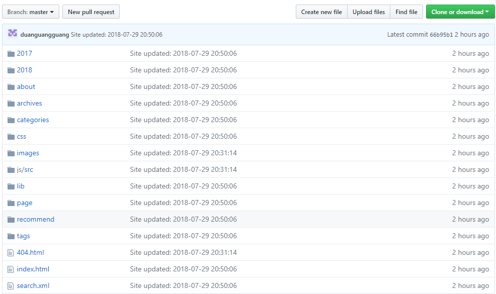
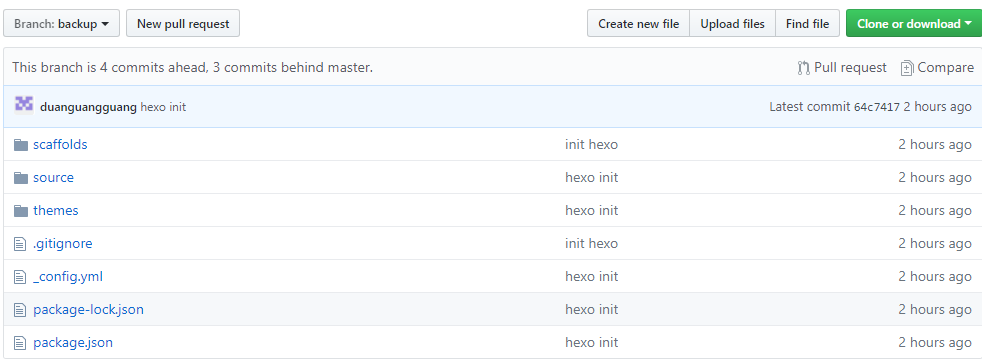

##  Hexo+Github个人博客多地备份

个人博客家里和公司各有一份环境，随时编辑更新，之前是这么做的，最近在新公司电脑上配置hexo环境的时候，发现还是遇到了很多坑，很多细节操作忘记了，现在趁热做下笔记

#### 一、环境安装

- node.js

- git

- hexo

  hexo安装参考这个：[Hexo](https://hexo.io/zh-cn/docs/index.html)

#### 二、操作步骤

1. 拉backup分支到本地并做一备份；
2. 新建文件夹初始化hexo;
3. 将初始化完成的hexo文件内容覆盖到backup中；
4. 将backup备份内容除了node_modules文件覆盖到backup中

这么做的原因是需要更新本地的hexo jar包，因为node_modules文件在.gitgnore忽略掉了

注意：node_modules在从hexo拷贝到backup的过程中因为文件名太长导致失败，需要使用命令拷贝

> cp -a ...命令

#### 三、插件安装

- 将hexo与git关联起来

  > npm install hexo-deployer-git --save

- 可能会遇到图片无法显示的问题

  > npm install https://github.com/CodeFalling/hexo-asset-image --save

#### 四、ssh配置

将生成的公有密钥添加到github上即可

#### 五、github分支管理策略

1. master分支

   - master分支存储的是博客生成的可以直接在浏览器上显示的静态文件

   - `hexo generate` 生成静态文件（）

   - `hexo deploy ` 将生成的静态文件部署到master上

   - 我们在_config.yml配置了hexo关联的master分支，`hexo deploy` 命令会自动将生成的静态文件推送到master分支，除此之外master分支切勿自己提交内容，切记！！！

   - master分支内容就是backup分支中的public文件内容

   - 正确的master分支内容如下图：

     

2. backup分支

   - backup分支是对我们的博客文件包括主题配置等做的一个远程备份

   - `git add --all` 将修改的文件添加到git

   - `git commit -m "description"` 文件提交

   - `git push origin backup` 文件推送到远程backup分支

   - 正确的backup分支内容如下图：

     

   ​