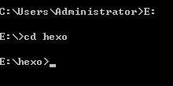
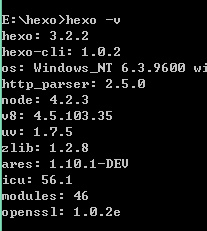

## Hexo+Github搭建个人博客

​        hexo是一个简洁、高效且开源的博客框架，是用node.js开发的。Hexo 使用 Markdown（或其他渲染引擎）解析文章，在几秒内，即可利用靓丽的主题生成静态网页。

### 环境

- win10 64位旗舰版

- node.js

- git

- github账户

  <!-- more -->

### 安装hexo

1. 在本地磁盘创建文件夹，例E : /hexo,并以命令行进入该目录

   

   在命令行输入：

   > npm install hexo-cli -g

   > npm install hexo --save

   > hexo -v

2. 看到下图信息，表示hexo安装成功

   

3. 初始化hexo

   > hexo init

   > npm install

4. 首次体验hexo

   > hexo g

   > hexo s

   然后看到提示：

   > INFO Hexo is running at [http://0.0.0.0:4000/](http://0.0.0.0:4000/). Press Ctrl+C to stop.

   在浏览器中打开[http://localhost:4000/](http://localhost:4000/)

   ​

### 关联Hexo与Github Page

1. 设置git的username和useremail

   > git config --global user.name "username"

   > git config --global user.email "useremail"

2. 生成密钥

   > ssh-keygen -t rsa -C "useremail"

   连续3个回车。如果不需要密码的话。

   - 检查是否已经有SSH Key

     > cd ~/.ssh

     > ls

     列出该文件下的文件，看是否存在 id_isa 和 id_isa.pub 文件，如果存在的话，证明已经存在 ssh key了。这两文件默认的存储路径是：

     > C:\Users\Administrator\.ssh

   ​

   - 将公钥添加到Github账户

   - 测试

     > ssh -T git@github.com

     看到下面则说明成功：

     > Hi humingx! You’ve successfully authenticated, but GitHub does not provide shell access.

   ​

3. 配置Deployment

   在站点配置文件_config.yml中，找到Deployment：

   > deploy:
   >   type: git
   >   repo: git@github.com:yourname/yourname.github.io.git
   >   branch: master

4. 踩坑提醒

   如果此时你写博客发布时，需要提前安装一个扩展：

   > npm install hexo-deployer-git --save

   否则将会提醒：

   > deloyer not found:git

### Next主题

1. 安装主题：

   > cd your-hexo-site

   > git clone https://github.com/iissnan/hexo-theme-next themes/next

2. 启用主题：

   修改站点配置文件：

   > theme: next

3. 验证主题：

   > hexo s

   > [http://localhost:4000](http://localhost:4000/)

4. 主题设定：

   修改主题配置文件：

   > Muse - 默认 Scheme，这是 NexT 最初的版本，黑白主调，大量留白

   > Mist - Muse 的紧凑版本，整洁有序的单栏外观

   > Pisces - 双栏 Scheme，小家碧玉似的清新

   不选择的主题#注释即可。

5. 语言设置：

   修改主题配置文件：

   > language: zh-Hans

6. 菜单设置：

   修改主题配置文件：

   > menu:
   >   home: /
   >   archives: /archives
   >
   >   about: /about
   >
   >   categories: /categories
   >
   >   tags: /tags
   >
   >   commonweal: /404.html

   若你的站点运行在子目录中，请将链接前缀的 / 去掉。

   翻译文本放置在NexT 主题目录下的 languages/{language}.yml 。

7. 头像设置：

   编辑 站点配置文件， 新增字段 avatar， 值设置成头像的链接地址。

   将头像放在source/image/目录下（或在source下新建uploads文件夹）

    avatar: /images/avatar.png

    当然值也可以是URL地址。

8. 作者设置：

   修改站点配置文件：

   > author : dodd

### 备份库

这里采用新建一个新的分支backup来做备份。

1. 在github上面新建分支backup

2. 拉分支：

   > git clone -b backup git@ git@github.com:yourname/yourname.github.io.git

3. 将hexo文件内的内容替换新拉下来的分支内容（注意需要删除掉hexo根目录和next目录下的.git）

4. hexo s 开服务，本地查看校验

5. git add --all

6. git commit -m "commit instruction"

7. git push origin backup (将本地文件推到远程库备份，防止多地提交文件互冲)

   > 注意：第一次拉下来的分支，提交备份库需要git push -u origin backup

8. hexo g(生成)

9. hexo d(部署)

### 插件以及第三方服务

### 遇到的问题

1. 文章头标题设定：

   需要在最上一行：- - -三个-进入设定头标题、日期、分类、标签等。

2. 图片的显示问题：

   使用[CodeFalling/hexo-asset-image](https://github.com/CodeFalling/hexo-asset-image)的插件来加载本地图片

   - 修改站点配置文件post_asset_folder:true

   - 在hexo的目录下执行`npm install https://github.com/CodeFalling/hexo-asset-image --save`

   - 完成安装后用`hexo`新建文章的时候会发现`_posts`目录下面会多出一个和文章名字一样的文件夹

   - 使用 `` 就可以插入图片。其中`[]`里面不写文字则没有图片标题。

   - 新建文章时使用hexo命令：

     > hexo new post "article title"    系统会自动生成一个同名文件夹可以用来放图片

   ​

### 多地使用配置

之前是家里电脑一份，公司电脑一份，今天突然想在新公司的电脑上配置一份hexo环境，发现有些细节操作已经忘记了，趁热做个笔记记录下来

#### 1. 环境安装

- node.js
- git

#### 2. 安装hexo

同上，效果图如下：

#### 3. 将github的backup分支拉下来

`git clone -b backup ... `

效果图如下：

将此内容覆盖到hexo文件夹中

#### 4. 一些插件的安装

- 将hexo与git关联起来

  > npm install hexo-deployer-git --save

- 可能会遇到图片无法显示的问题，同上处理

- 注意：此时千万不要使用git push -u origin backup，会将master分支的静态文件替换掉，导致整个文件无法显示

  > 解决方式：将另一台机器上好的版本执行一次git push -u origin backup即可

#### 5. ssh配置

同上。

