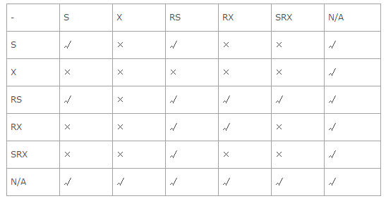
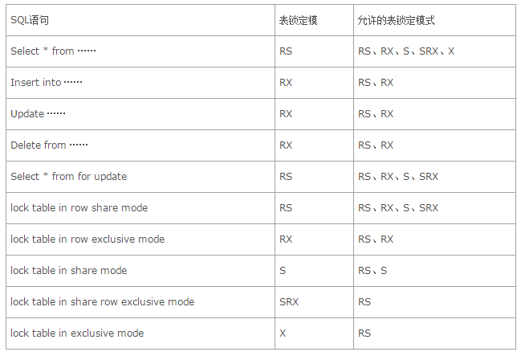

## 数据库之事务

### 一、事务

**事务**是一组原子操作单元，从数据库角度说，就是一组SQL指令，要么全部执行成功，若因为某个原因其中一条指令执行有错误，则撤销先前执行过的所有指令。**要么全部执行成功，要么撤销不执行**。例：网上转帐就是典型的要用事务来处理，用以保证数据的一致性

#### 1. ACID原则

- 原子性（atomicity）：事务执行过程中的任何失败都将导致事务所做的任何修改失效
- 一致性（consistency）：当事务执行失败时，所有被该事务影响的数据都应该恢复到事务执行前的状态
- 隔离性（isolation）：在事务执行过程中对数据的修改，在事务提交之前对其他事务不可见
- 持久性（durability）：已提交的数据在事务执行失败时，数据的状态都应该正确

<!--more -->

#### 2. 数据异常

因为Oracle中支持多个事务并发执行，所以会出现下面的数据异常

1. 脏读

   当一个事务修改数据时，另一事务读取了该数据，但是第一个事务由于某种原因取消对数据修改，使数据返回了原状态，这是第二个事务读取的数据与数据库中数据不一致，这就叫脏读。如：

   > 事务T1修改了一条数据，但是还未提交，事务T2恰好读取到了这条修改后了的数据，此时T1将事务回滚，这个时候T2读取到的数据就是脏数据。

2. 不可重复读

   是指一个事务读取数据库中的数据后，另一个事务则更新了数据，当第一个事务再次读取其中的数据时，就会发现数据已经发生了改变，这就是不可重复读取。不可重复读取所导致的结果就是一个事务前后两次读取的数据不相同。如：

   > 事务T1读取一行记录，紧接着事务T2修改了T1刚刚读取的记录，然后T1再次查询，发现与第一次读取的记录不同。

3. 幻读

   如果一个事务基于某个条件读取数据后，另一个事务则更新了同一个表中的数据，这时第一个事务再次读取数据时，根据搜索的条件返回了不同的行，这就是幻读。如：

   > 事务T1读取一条指定where条件的语句，返回结果集。此时事务T2插入一行新记录，恰好满足T1的where条件。然后T1使用相同的条件再次查询，结果集中可以看到T2插入的记录，这条新纪录就是幻读。

事务中遇到的这些异常与事务的隔离性设置有关，事务的隔离性设置越多，异常就出现的越少，但并发效果就越低，事务的隔离性设置越少，异常出现的越多，并发效果越高

#### 3.事务隔离级别 

针对读取数据时可能产生的不一致现象，在SQL92标准中定义了4个事务的隔离级别：

| 隔离级别                   | 脏读   | 不可重复读 | 幻读   |
| ---------------------- | ---- | ----- | ---- |
| Read uncommitted(读未提交) | 是    | 是     | 是    |
| Read committed（读已提交）   | 否    | 是     | 是    |
| Repeatable read（可重复读）  | 否    | 否     | 是    |
| Serializable（串行读）      | 否    | 否     | 否    |

1. oracle事务隔离级别

   - Oracle默认的隔离级别是read committed
   - Oracle支持上述四种隔离级别中的两种:read committed 和serializable。除此之外，Oralce中还定义Read only和Read write隔离级别
   - Read only：事务中不能有任何修改数据库中数据的操作语句，是Serializable的一个子集
   - Read write：它是默认设置，该选项表示在事务中可以有访问语句、修改语句，但不经常使用

2. 设置隔离级别

   - 设置一个事务的隔离级别：

     ~~~plsql
     SQL> SET TRANSACTION ISOLATION LEVEL READ COMMITTED;
     SET TRANSACTION ISOLATION LEVEL SERIALIZABLE;
     SET TRANSACTION READ ONLY;
     SET TRANSACTION READ WRITE;
     --这些语句是互斥的，不能同时设置两个或两个以上的选项
     ~~~

   - 设置单个会话的隔离级别：

     ~~~plsql
     SQL> ALTER SESSION SET TRANSACTION ISOLATION LEVEL READ COMMITTED;
     ALTER SESSION SET TRANSACTION ISOLATION SERIALIZABLE;
     ~~~

#### 4. 管理事务

1. 管理事务

   ~~~plsql
   SQL> BEGIN TRANSACTION;--开始事务
   	 COMMIT TRANSACTION;--提交事务
   	 ROLLBACK TRANSACTION;--回滚（撤销）事务
   --一旦事务提交或回滚，则事务结束
   ~~~

2. 判断某条语句执行是否出错

   ~~~plsql
   /*
   1.使用全局变量@@ERROR
   2.@@ERROR只能判断当前一条T-SQL语句执行是否有错，为了判断事务中所有T-SQL语句是否有错，我们需要对错误进行累计
   */
   SQL> SET @errorSum = @errorSum + @@error;
   ~~~

3. 提交事务

   ~~~plsql
   /*
   在执行使用COMMIT语句可以提交事务，当执行了COMMIT语句后，会确认事务的变化，结束事务，删除保存点，释放锁。当使用COMMIT语句结束事务之后，其他会话将可以查看到事务变化后的新数据
   */
   ~~~

4. 回滚事务

   保存点（savepoint）：是事务中的一点，用于取消部分事务，当结束事务时，会自动的删除该事务所定义的所有保存点。当执行ROLLBACK时，通过指定保存点可以回退到指定的点

   ~~~plsql
   --设置保存点
   SQL> Savepoint a;
   --删除保存点
   SQL> Release Savepoint a;
   --回滚部分事务
   SQL> Rollback To a;
   --回滚全部事务
   SQL> Rollback;
   ~~~

#### 5. 事务分类

- 显示事务：用BEGIN TRANSACTION明确指定事务的开始，这是最常用的事务类型
- 隐性事务：通过设置SET IMPLICIT_TRANSACTIONS ON 语句，将隐性事务模式设置为打开，下一个语句自动启动一个新事务。当该事务完成时，再下一个 T-SQL 语句又将启动一个新事务
- 自动提交事务：这是 SQL Server 的默认模式，它将每条单独的 T-SQL 语句视为一个事务，如果成功执行，则自动提交；如果错误，则自动回滚

### 二、 数据库锁

数据库是一个多用户使用的共享资源。当多个用户并发地存取数据时，在数据库中就会产生多个事务同时存取同一数据的情况。若对并发操作不加控制就可能会读取和存储不正确的数据，破坏数据库的一致性。

在数据库中有两种基本的锁类型：排它锁（Exclusive Locks，即X锁）和共享锁（Share Locks，即S锁）。当数据对象被加上排它锁时，其他的事务不能对它读取和修改；加了共享锁的数据对象可以被其他事务读取，但不能修改。

1. 锁分类

   根据保护对象的不同，Oracle数据库锁可分为：

   - DML lock（data locks，数据锁）：用于保护数据的完整性
   - DDL lock（dictionary locks，字典锁）：用于保护数据库对象的结构（例如表、视图、索引的结构定义）
   - Internal locks 和latches（内部锁与闩）：保护内部数据库结构
   - Distributed locks（分布式锁）：用于OPS（并行服务器）中
   - PCM locks（并行高速缓存管理锁）：用于OPS（并行服务器）中

   在Oracle中最主要的锁是DML锁，DML锁的目的在于保证并发情况下的数据完整性。在Oracle数据库中，DML锁主要包括TM锁和TX锁，其中TM锁称为表级锁，TX锁称为事务锁或行级锁

   锁出现在数据共享的场合，用来保证数据的一致性。当多个会话同时修改一个表时，需要对数据进行相应的锁定。

   锁有**共享锁**、**排它锁**，**共享排它锁**等多种类型，而且每种类型又有**行级锁** (一次锁住一条记录)，**页级锁** (一次锁住一页，即数据库中存储记录的最小可分配单元)，**表级锁** (锁住整个表)

2. 共享锁（S锁）

   > 可通过lock table in share mode命令添加该S锁。在该锁定模式下，不允许任何用户更新表。但是允许其他用户发出select …from for update命令对表添加RS锁

3. 排他锁（X锁）

   > 可通过lock table in exclusive mode命令添加X锁。在该锁定模式下，其他用户不能对表进行任何的DML和DDL操作，该表上只能进行查询

4. 行级共享锁（RS锁）

   > 通常是通过select … from for update语句添加的，同时该方法也是我们用来手工锁定某些记录的主要方法。比如，当我们在查询某些记录的过程中，不希望其他用户对查询的记录进行更新操作，则可以发出这样的语句。当数据使用完毕以后，直接发出rollback命令将锁定解除。当表上添加了RS锁定以后，不允许其他事务对相同的表添加排他锁，但是允许其他的事务通过DML语句或lock命令锁定相同表里的其他数据行

5. 行级排他锁（RX锁）

   > 当进行DML操作时会自动在被更新的表上添加RX锁，或者也可以通过执行lock命令显式的在表上添加RX锁。在该锁定模式下，允许其他的事务通过DML语句修改相同表里的其他数据行，或通过lock命令对相同表添加RX锁定，但是不允许其他事务对相同的表添加排他锁（X锁）

6. 共享行级排他锁（SRX锁）

   > 通过lock table in share row exclusive mode命令添加SRX锁。该锁定模式比行级排他锁和共享锁的级别都要高，这时不能对相同的表进行DML操作，也不能添加共享锁。

7. 锁之间的兼容关系

   述几种锁模式中，RS锁是限制最少的锁，X锁是限制最多的锁

   

8. DDL和DML锁

   基本上所有的锁都可以由Oracle内部自动创建和释放，但是其中的DDL和DML锁是可以通过命令进行管理的，命令语法：

   ~~~plsql
   SQL> LOCK table_name IN 
       [row share][row exclusive][share][share row exclusive][exclusive] MODE 
   [NOWAIT];
   ~~~

9. 产生锁定模式的SQL语句

   

当程序对所做的修改进行提交(Commit)或回滚(Rollback)后，锁住的资源便会得到释放，从而允许其他用户进行操作。如果两个事务，分别锁定一部分数据，而都在等待对方释放锁才能完成事务操作，这种情况下就会发生死锁

### 三、数据库事务实现机制

几乎所有的数据库管理系统中，事务管理的机制都是通过使用日志文件来实现的，简单介绍一下日志的工作方式。

当用户执行一条修改数据库的DML语句时，DBMS自动在日志文件中写一条记录，显示被这条语句影响的每一条记录的两个副本。一个副本显示变化前的记录，另一个副本显示变化后的记录。当日志写完之后，DBMS才实际对磁盘中的记录进行修改。

如果用户随后执行COMMIT语句，事务结束也被记录在事务日志中。如果用户执行ROLLBACK语句，DBMS检查日志，找出自事务开始以来被修改的记录“以前”的样子，然后使用这些信息恢复它们以前的状态，有效地撤销事务期间对数据库所做的修改。

如果系统出错，系统操作员通常通过运行DBMS提供的特殊恢复程序来复原数据库。恢复程序检查到事务日志末尾，查找故障之前没有被提交的事务。恢复程序回滚没有完全完成的事务，以便仅有被提交的事务反映到数据库中，而故障中正处理的事务被回滚。

事务日志的使用明显增加了更新数据库的开销。在实际中，主流商用DBMS产品使用的日志技术比上述描述的方案更复杂，用以减小这种开销。此外，事务日志通常被存储在高速磁盘驱动器中，不同于存储数据库的磁盘，以减小磁盘访问竞争。某些个人计算机DBMS产品允许关闭事务日志性能，以提高DBMS的性能。

### 四、银行转账示例

用户把钱从一个银行账号转账至另一个银行账号，需要将资金从一个银行账号中取出，然后再存入另一个银行账号中。理想来说，这两次操作都应该成功。但是，如果有错误发生，则两次操作都应该失败，否则的话，操作之后其中一个账号中的金额将会是错误的，整个操作过程应该是原子性的，两个操作都是一个原子事务操作的一部分

~~~plsql
-- 从账户一向账户二转账
SQL> DECLARE
  v_money NUMBER(8, 2); -- 转账金额
  v_balance account.balance%TYPE; -- 账户余额
BEGIN
  v_money := &转账金额; -- 输入转账金额
  -- 从账户一减钱  
  UPDATE account SET balance = balance - v_money WHERE id=&转出账户
  RETURNING balance INTO v_balance;
  IF SQL%NOTFOUND THEN
    RAISE_APPLICATION_ERROR(-20001, '没有该账户：'||&转出账户);
  END IF;
  IF v_balance < 0 THEN
    RAISE_APPLICATION_ERROR(-20002, '账户余额不足');
  END IF;

  -- 向账户二加钱
  UPDATE account SET balance = balance + v_money WHERE id=&转入账户;
  IF SQL%NOTFOUND THEN
    RAISE_APPLICATION_ERROR(-20001, '没有该账户：'||&转入账户);
  END IF;

  -- 如果没有异常，则提交事务
  COMMIT;
  DBMS_OUTPUT.PUT_LINE('转账成功');

  EXCEPTION
    WHEN OTHERS THEN 
      ROLLBACK; -- 出现异常则回滚事务
      DBMS_OUTPUT.PUT_LINE('转账失败：');
      DBMS_OUTPUT.PUT_LINE(SQLERRM);
END;
~~~

### 五、Java调用数据库事务

JavaBean中使用JDBC方式进行事务处理 :

~~~java
public int delete(int sID) { 
　 dbc = new DataBaseConnection(); 
　 Connection con = dbc.getConnection(); 
　 try { 
　　 con.setAutoCommit(false);// 更改JDBC事务的默认提交方式 
　　 dbc.executeUpdate("delete from xiao where ID=" + sID); 
　　 dbc.executeUpdate("delete from xiao_content where ID=" + sID); 
　　 dbc.executeUpdate("delete from xiao_affix where bylawid=" + sID); 
　　 con.commit();//提交JDBC事务 
　　 con.setAutoCommit(true);// 恢复JDBC事务的默认提交方式 
　　 dbc.close(); 
　　 return 1; 
　 } 
　 catch (Exception exc) { 
　　 con.rollBack();//回滚JDBC事务 
　　 exc.printStackTrace(); 
　　 dbc.close(); 
　　 return -1; 
　 } 
} 
~~~

[参考链接](http://blog.csdn.net/mukun060/article/details/11064097)
