## 一、优化SQL语句的一般步骤

### 1. 通过 show status 命令了解各种 SQL 的执行频率

MySQL 客户端连接成功后，通过**show [session|global] status **命令可以提供服务器状态信息，也可以在操作系统上使用 **mysqladmin extended-status **命令获得这些消息。**show [session|global] status **可以根据需要加上参数**session**或者**global**来显示 session 级（当前连接）的统计结果和 global 级（自数据库上次启动至今）的统计结果。如果不写默认使用参数是**session**。

Com_xxx 表示每个 xxx 语句执行的次数,我们通常比较关心的是以下几个统计参数：

- Com_select：执行 select 操作的次数,一次查询只累加 1。
- Com_insert：执行 INSERT 操作的次数,对于批量插入的 INSERT 操作，只累加一次。
- Com_update：执行 UPDATE 操作的次数。
- Com_delete：执行 DELETE 操作的次数。

上面这些参数对于所有存储引擎的表操作都会进行累计。

<!-- more -->

下面这几个参数只是针对InnoDB 存储引擎的,累加的算法也略有不同。

- Innodb_rows_read:select 查询返回的行数。
- Innodb_rows_inserted:执行 INSERT 操作插入的行数。
- Innodb_rows_updated:执行 UPDATE 操作更新的行数。
- Innodb_rows_deleted:执行 DELETE 操作删除的行数。

通过以上几个参数，可以很容易地了解当前数据库的应用是以插入更新为主还是以查询操作为主，以及各种类型的 SQL 大致的执行比例是多少。对于更新操作的计数,是对执行次数的计数，不论提交还是回滚都会进行累加。

对于事务型的应用，通过 Com_commit 和 Com_rollback 可以了解事务提交和回滚的情况，对于回滚操作非常频繁的数据库，可能意味着应用编写存在问题。

此外，以下几个参数便于用户了解数据库的基本情况。

-  Connections:试图连接 MySQL 服务器的次数。
-  Uptime:服务器工作时间。
-  Slow_queries:慢查询的次数。

### 2. 定位执行效率较低的 SQL 语句

可以通过以下两种方式定位执行效率较低的 SQL 语句：

-  通过慢查询日志定位那些执行效率较低的 SQL 语句，用**log-slow-queries[=file_name]**选项启动时，mysqld 写一个包含所有执行时间超过 long_query_time 秒的 SQL 语句的日志文件。具体可以学习日志管理的相关部分。
- 慢查询日志在查询结束以后才纪录，所以在应用反映执行效率出现问题的时候查询慢查询日志并不能定位问题，可以使用 **show processlist **命令查看当前 MySQL 在进行的线程，包括线程的状态、是否锁表等，可以实时地查看 SQL 的执行情况，同时对一些锁表操作进行优化。

### 3. 通过 EXPLAIN 分析低效 SQL 的执行计划

通过以上步骤查询到效率低的 SQL 语句后，可以通过 EXPLAIN 或者 DESC 命令获取 MySQL如何执行 SELECT 语句的信息，包括在 SELECT 语句执行过程中表如何连接和连接的顺序，比如想计算 2006 年所有公司的销售额，需要关联 sales 表和 company 表，并且对 moneys 字段做求和(sum)操作，相应 SQL 的执行计划如下：

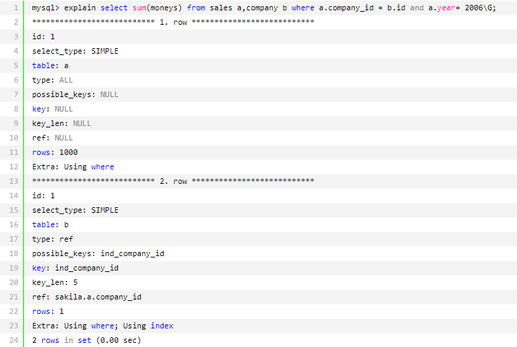

每个列的简单解释如下:

-  select_type：表示 SELECT 的类型，常见的取值有 SIMPLE（简单表，即不使用表连接或者子查询）、PRIMARY（主查询,即外层的查询）、UNION（UNION 中的第二个或者后面的查询语句）、SUBQUERY（子查询中的第一个 SELECT）等。
-  table：输出结果集的表。
-  type：表示表的连接类型，性能由好到差的连接类型为：
  - system（表中仅有一行，即常量表）
  - const（单表中最多有一个匹配行，例如 primary key 或者 unique index）
  - eq_ref（对于前面的每一行，在此表中只查询一条记录,简单来说，就是多表连接中使用 primary key 或者 unique index）
  - ref（与 eq_ref 类似，区别在于不是使用 primary key 或者 unique index,而是使用普通的索引）
  - ref_or_null（与 ref 类似,区别在于条件中包含对 NULL 的查询）
  - index_merge（索引合并优化）
  - unique_subquery（in的后面是一个查询主键字段的子查询）
  - index_subquery （与 unique_subquery 类似，区别在于 in 的后面是查询非唯一索引字段的子查询）
  - range （单表中的范围查询）
  - index （对于前面的每一行,都通过查询索引来得到数据）
  - all （对于前面的每一行,都通过全表扫描来得到数据）
- possible_keys：表示查询时,可能使用的索引。
- key：表示实际使用的索引。
- key_len：索引字段的长度。
- rows：扫描行的数量。
- Extra：执行情况的说明和描述。

### 4. 确定问题并采取相应的优化措施

经过以上步骤，基本就可以确认问题出现的原因。此时用户可以根据情况采取相应的措施，进行优化提高执行的效率。在上面的例子中，已经可以确认是对 a 表的全表扫描导致效率的不理想，那么对 a 表的year 字段创建索引：


创建索引后，再看一下这条语句的执行计划：

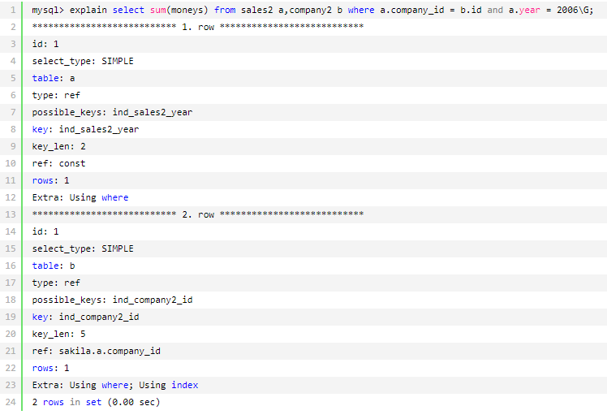

可以发现建立索引后对 a 表需要扫描的行数明显减少（从 1000 行减少到 1 行），可见索引的使用可以大大提高数据库的访问速度，尤其在表很庞大的时候这种优势更为明显。

## 二、索引问题

### 1. 索引的存储分类

**MyISAM 存储引擎**的表的数据和索引是自动分开存储的，各自是独立的一个文件；**InnoDB存储引擎**的表的数据和索引是存储在同一个表空间里面，但可以有多个文件组成。

MySQL 中索引的存储类型目前只有两种（BTREE 和 HASH），具体和表的存储引擎相关：**MyISAM **和**InnoDB 存储引擎**都只支持 **BTREE 索引**；**MEMORY/HEAP 存储引擎**可以支持**HASH**和**BTREE 索引**。

MySQL 目前不支持函数索引，但是能对列的前面某一部分进索引（前缀索引），例如 name 字段，可以只取 name 的前 4 个字符进行索引，这个特性可以大大缩小索引文件的大小，用户在设计表结构的时候也可以对文本列根据此特性进行灵活设计。下面是创建前缀索引的一个例子:

~~~plsql
mysql> create index ind_company2_name on company2(name(4));
~~~

### 2. MySQL如何使用索引

查询要使用索引最主要的条件是查询条件中需要使用索引关键字，如果是多列索引，那么只有查询条件使用了多列关键字最左边的前缀时，才可以使用索引，否则将不能使用索引。

#### 使用索引

在 MySQL 中，下列几种情况下有可能使用到索引：

- 对于创建的多列索引，只要查询的条件中用到了最左边的列，索引一般就会被使用：

  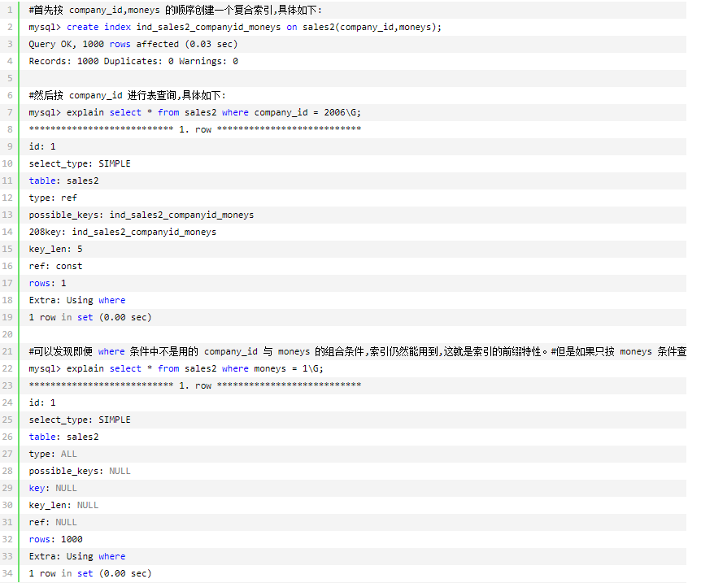

- 对于使用 like 的查询，后面如果是常量并且只有%号不在第一个字符，索引才可能会被使用：

  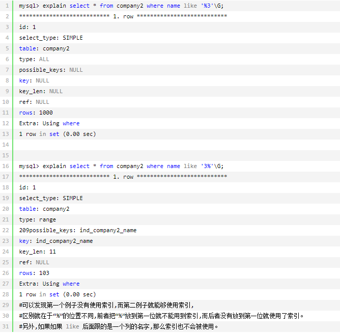

- 如果对大的文本进行搜索,使用全文索引而不用使用 like ‘%...%’。

- 如果列名是索引，使用 column_name is null 将使用索引：

  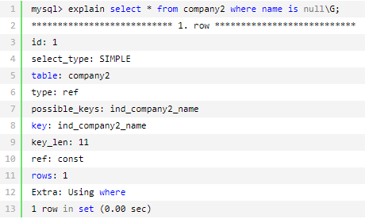

#### 存在索引但不使用索引

在下列情况下，虽然存在索引,但是 MySQL 并不会使用相应的索引。

- 如果 MySQL 估计使用索引比全表扫描更慢，则不使用索引。例如，如果列key_part1 均匀分布在 1 和 100 之间，下列查询中使用索引就不是很好：

  ~~~plsql
  select * from table_name where key_part1 > 1 and key_part1 < 90;
  ~~~

- 如果使用 MEMORY/HEAP 表并且 where 条件中不使用“=”进行索引列，那么不会用到索引。heap 表只有在“=”的条件下才会使用索引。

- 用 or 分割开的条件，如果 or 前的条件中的列有索引，而后面的列中没有索引，那么涉及到的索引都不会被用到，例如:

  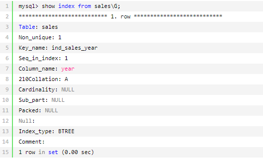

  从上面可以发现只有 year 列上面有索引，来看如下的执行计划:

  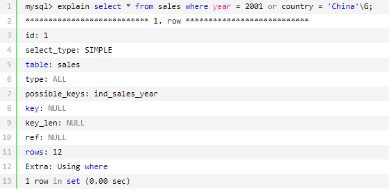

  可见虽然在 year 这个列上存在索引 ind_sales_year，但是这个 SQL 语句并没有用到这个索引，原因就是 or 中有一个条件中的列没有索引。

- 如果不是索引列的第一部分，如下例子:

  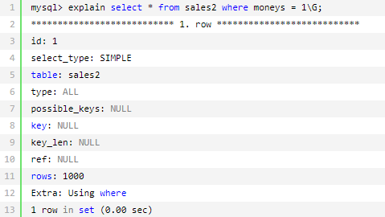

  可见虽然在 money 上面建有复合索引，但是由于 money 不是索引的第一列，那么在查询中这个索引也不会被 MySQL 采用。

- 如果 like 是以%开始，例如:

  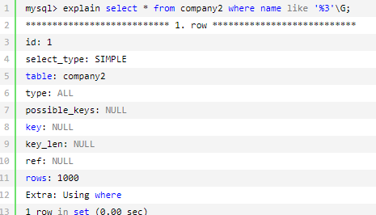

  可见虽然在 name 上建有索引，但是由于 where 条件中 like 的值的“%”在第一位了，那么MySQL 也不会采用这个索引。

- 如果列类型是字符串，那么一定记得在 where 条件中把字符常量值用引号引起来，否则的话即便这个列上有索引，MySQL 也不会用到的，因为MySQL 默认把输入的常量值进行转换以后才进行检索。如下面的例子中 company2 表中的 name 字段是字符型的，但是 SQL 语句中的条件值是一个数值型值,因此即便在 name 上有索引,，MySQL 也不能正确地用上索引，而是继续进行全表扫描。

  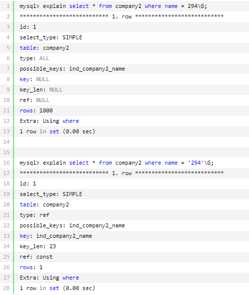

  从上面的例子中可以看到，第一个 SQL 语句中把一个数值型常量赋值给了一个字符型的列name，那么虽然在 name 列上有索引，但是也没有用到；而第二个 SQL 语句就可以正确使用索引。

### 3. 查看索引的情况

如果索引正在工作，Handler_read_key 的值将很高，这个值代表了一个行被索引值读的次数，很低的值表明增加索引得到的性能改善不高，因为索引并不经常使用。
**Handler_read_rnd_next **的值高则意味着查询运行低效，并且应该建立索引补救。这个值的含义是在数据文件中读下一行的请求数。如果正进行大量的表扫描，Handler_read_rnd_next 的值较高，则通常说明表索引不正确或写入的查询没有利用索引，具体如下：

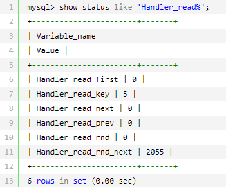

从上面的例子中可以看出，目前使用的 MySQL 数据库的索引情况并不理想。

## 三、两个简单实用的优化方法

### 1. 定期分析表和检查表

分析表的语法如下：

~~~plsql
analyze [local | NO_WRITE_TO_BINLOG] TABLE tbl_name [, tbl_name] ...
~~~

本语句用于分析和存储表的关键字分布，分析的结果将可以使得系统得到准确的统计信息，使得 SQL 能够生成正确的执行计划。如果用户感觉实际执行计划并不是预期的执行计划，执行一次分析表可能会解决问题。在分析期间,使用一个读取锁定对表进行锁定。这对于 MyISAM,，BDB 和 InnoDB 表有作用。对于 MyISAM 表，本语句与使用 myisamchk -a 相当，下面对表 sales 做了表分析:

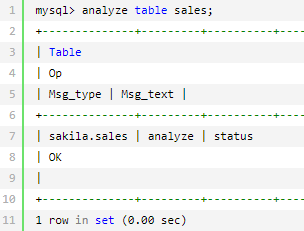

检查表的语法如下：

~~~plsql
check table tbl_name [, tbl_name] ... [option] ... option={QUICK | FAST | MEDIUM | EXTENDED | CHANGED}
~~~

检查表的作用是检查一个或多个表是否有错误。 CHECK TABLE 对 MyISAM 和 InnoDB 表有作用。对于 MyISAM 表，关键字统计数据被更新，例如:

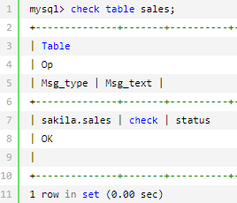

CHECK TABLE 也可以检查视图是否有错误，比如在视图定义中被引用的表已不存在，举例如下。

1. 首先我们创建一个视图。

   ~~~plsql
   mysql> create view sales_view3 as select * from sales3;
   --Quick ok, 0 rows affected (0.00sec)
   ~~~

2. 然后 CHECK 一下该视图,发现没有问题。

   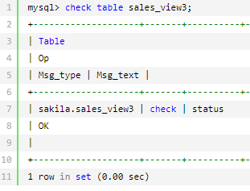

3. 现在删除掉视图依赖的表。

   ~~~plsql
   mysql> drop table sales3;
   --Quick ok, 0 rows affected (0.00sec)
   ~~~

4. 再来 CHECK 一下刚才的视图,发现报错了。

   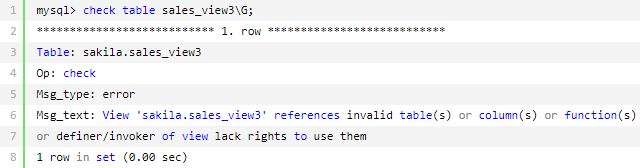

### 2. 定期优化表

优化表的语法如下:

~~~plsql
optimize [local | NO_WRITE_TO_BINLOG] TABLE tbl_name [, tbl_name] ...
~~~

如果已经删除了表的一大部分，或者如果已经对含有可变长度行的表（含有 VARCHAR、BLOB 或 TEXT 列的表）进行了很多更改，则应使用 OPTIMIZE TABLE 命令来进行表优化。这个命令可以将表中的空间碎片进行合并，并且可以消除由于删除或者更新造成的空间浪费，但OPTIMIZE TABLE 命令只对 MyISAM、BDB 和 InnoDB 表起作用。

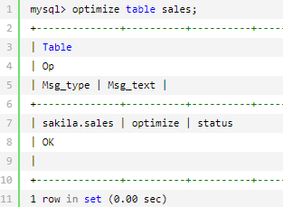

注意：ANALYZE、CHECK、OPTIMIZE 执行期间将对表进行锁定，因此一定注意要在数据库不繁忙的时候执行相关的操作。

## 四、常用SQL的优化

###  1. 大批量插入数据

当用 load 命令导入数据的时候，适当的设置可以提高导入的速度。对于 MyISAM 存储引擎的表，可以通过以下方式快速的导入大量的数据：

~~~plsql
ALTER TABLE tbl_name DISABLE KEYS;
loading the data
ALTER TABLE tbl_name ENABLE KEYS;
~~~

DISABLE KEYS 和 ENABLE KEYS 用来打开或者关闭 MyISAM 表非唯一索引的更新。在导入大量的数据到一个非空的 MyISAM 表时，通过设置这两个命令，可以提高导入的效率。对于导入大量数据到一个空的 MyISAM 表，默认就是先导入数据然后才创建索引的，所以不用进行设置。

```plsql
mysql> alter table film_test2 disable keys;
--Query OK, 0 rows affected (0.00 sec)

mysql> load data infile '/home/mysql/film_test.txt' into table film_test2;
--Query OK, 529056 rows affected (6.34 sec)
--Records: 529056 Deleted: 0 Skipped: 0 Warnings: 0

mysql> alter table film_test2 enable keys;
--Query OK, 0 rows affected (12.25 sec)
```

上面是对MyISAM表进行数据导入时的优化措施，对于InnoDB类型的表，这种方式并不能提高导入数据的效率，可以有以下几种方式提高InnoDB表的导入效率。

- 因为 InnoDB 类型的表是按照主键的顺序保存的，所以将导入的数据按照主键的顺序排列，可以有效地提高导入数据的效率。

- 在导入数据前执行 SET UNIQUE_CHECKS=0，关闭唯一性校验，在导入结束后执行SET UNIQUE_CHECKS=1，恢复唯一性校验，可以提高导入的效率。

  ```plsql
  SET UNIQUE_CHECKS=0;
  #loading the data

  load data infile '/home/mysql/film_test.txt' into table film_test2;
  SET UNIQUE_CHECKS=1;
  ```

- 如果应用使用自动提交的方式，建议在导入前执行 SET AUTOCOMMIT=0，关闭自动提交，导入结束后再执行 SET AUTOCOMMIT=1，打开自动提交，也可以提高导入的效率。

  ```plsql
  SET AUTOCOMMIT=0;
  #loading the data

  load data infile '/home/mysql/film_test.txt' into table film_test2;
  SET AUTOCOMMIT=1;
  ```

### 2. 优化 INSERT 语句

当进行数据 INSERT 的时候,可以考虑采用以下几种优化方式。

- 如果同时从同一客户插入很多行，尽量使用多个值表的 INSERT 语句，这种方式将大大缩减客户端与数据库之间的连接、关闭等消耗，使得效率比分开执行的单个 INSERT 语句快（在一些情况中几倍）。下面是一次插入多值的一个例子:

  ```plsql
  insert into test values(1,2),(1,3),(1,4)...
  ```

- 如果从不同客户插入很多行，能通过使用 INSERT DELAYED 语句得到更高的速度。DELAYED 的含义是让 INSERT 语句马上执行，其实数据都被放在内存的队列中，并没有真正写入磁，这比每条语句分别插入要快的多；LOW_PRIORITY 刚好相反，在所有其他用户对表的读写完后才进行插入。

- 将索引文件和数据文件分在不同的磁盘上存放（利用建表中的选项）。

- 如果进行批量插入，可以增加 bulk_insert_buffer_size 变量值的方法来提高速度，但是，这只能对 MyISAM 表使用。

- 当从一个文本文件装载一个表时，使用 LOAD DATA INFILE。这通常比使用很多 INSERT 语句快 20 倍。

### 3. 优化 GROUP BY 语句

默认情况下，MySQL 对所有 GROUP BY col1，col2....的字段进行排序。这与在查询中指定ORDER BY col1，col2...类似。因此，如果显式包括一个包含相同的列的 ORDER BY 子句，则对 MySQL 的实际执行性能没有什么影响。

如果查询包括 GROUP BY 但用户想要避免排序结果的消耗，则可以指定 ORDER BY NULL禁止排序。

### 4. 优化 ORDER BY 语句

在某些情况中，MySQL 可以使用一个索引来满足 ORDER BY 子句，而不需要额外的排序。WHERE 条件和 ORDER BY 使用相同的索引，并且 ORDER BY 的顺序和索引顺序相同，并且ORDER BY 的字段都是升序或者都是降序。

例如，下列 SQL 可以使用索引：

```plsql
SELECT * FROM t1 ORDER BY key_part1,key_part2,... ;
SELECT * FROM t1 WHERE key_part1=1 ORDER BY key_part1 DESC, key_part2 DESC;
SELECT * FROM t1 ORDER BY key_part1 DESC, key_part2 DESC;
```

但是在以下几种情况下则不使用索引:

```plsql
SELECT * FROM t1 ORDER BY key_part1 DESC, key_part2 ASC;
--order by 的字段混合 ASC 和 DESC
SELECT * FROM t1 WHERE key2=constant ORDER BY key1;
--用于查询行的关键字与 ORDER BY 中所使用的不相同
SELECT * FROM t1 ORDER BY key1, key2;
--对不同的关键字使用 ORDER BY:
```

### 5. 优化嵌套查询

MySQL 4.1 开始支持 SQL 的子查询。这个技术可以使用 SELECT 语句来创建一个单列的查询结果，然后把这个结果作为过滤条件用在另一个查询中。使用子查询可以一次性地完成很多逻辑上需要多个步骤才能完成的 SQL 操作，同时也可以避免事务或者表锁死，并且写起来也很容易。但是，有些情况下，子查询可以被更有效率的连接（JOIN）替代。连接（JOIN）之所以更有效率一些，是因为 MySQL 不需要在内存中创建临时表来完成这个逻辑上的需要两个步骤的查询工作。

### 6. MySQL 如何优化 OR 条件

对于含有 OR 的查询子句，如果要利用索引，则 OR 之间的每个条件列都必须用到索引；如果没有索引，则应该考虑增加索引。MySQL 在处理含有 OR字句的查询时，实际是对 OR 的各个字段分别查询后的结果进行了 UNION。

### 7. 使用 SQL 提示

SQL 提示（SQL HINT）是优化数据库的一个重要手段，简单来说就是在 SQL 语句中加入一些人为的提示来达到优化操作的目的。

- USE INDEX

  在查询语句中表名的后面，添加 USE INDEX 来提供希望 MySQL 去参考的索引列表，就可以让 MySQL 不再考虑其他可用的索引。

  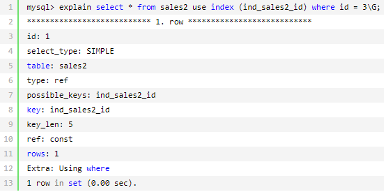

- IGNORE INDEX

  如果用户只是单纯地想让 MySQL 忽略一个或者多个索引，则可以使用 IGNORE INDEX 作为 HINT。

  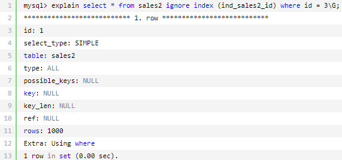

- FORCE INDEX

  为强制 MySQL 使用一个特定的索引，可在查询中使用 FORCE INDEX 作为 HINT。例如，当不强制使用索引的时候，因为 id 的值都是大于 0 的，因此 MySQL 会默认进行全表扫描，而不使用索引,如下所示：

  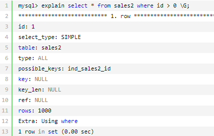

  但是，当使用 FORCE INDEX 进行提示时，即便使用索引的效率不是最高，MySQL 还是选择使用了索引，这是 MySQL 留给用户的一个自行选择执行计划的权力。加入 FORCE INDEX 提示后再次执行上面的 SQL：

  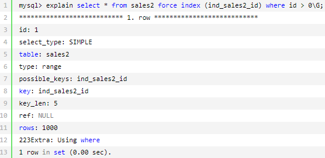

  执行计划中使用了 FORCE INDEX 后的索引。

