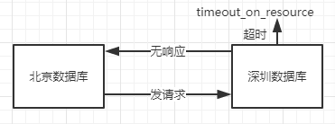

## PL/SQL基础

**PL/SQL**操作oracle数据库效率最高，是学习存储过程，存储函数，触发器的前提。打印hello world：

~~~plsql
SQL> declare
       --说明部分（变量，光标或者例外）
     begin
       -- 程序体
	 dbms_output.put_line('hello world');
	 end;
	 /  --表示pl/sql完成并执行

--打开输出开关
SQL> set serveroutput on;
     /  --执行
~~~

<!--more -->

### 一、PL/SQL概念

**PL/SQL（procedure language/sql）**是oracle对sql语言的过程化扩展

> SQL语言：数据操纵
>
> 过程语言：数据处理
>
> 组成pl/sql：简单、高效、灵活、实用

不同的数据库对sql的扩展

> oracle ：pl/sql
>
> DB2：sql/pl
>
> SQL Server：Transac_SQL（T-SQL）

### 二、PL/SQL基础语法

~~~~plsql
SQL> declare
       --说明部分
	 begin
	   --语句序列（DML语句）
	 exception
	   --例外处理语句
	 end;
	 /
~~~~

#### 1. 变量定义

1. 定义基本变量

   ~~~plsql
   --类型
   char, varchar2, date, number, boolean, long
   --例：
   varl char(15);
   married boolean := true;
   psal number(7,2);
   ~~~

2. 引用型变量

   ~~~plsql
   --例：
   my_name emp.ename % type;
   ~~~

3. 记录型变量

   可以理解为是个数组，数组中的每个元素为列

   ~~~plsql
   --例：
   emp_rec emp % rowtype;--行类型
   --记录型变量的引用
   emp_rec.ename := 'ADAMS';
   ~~~

4. 例子

   查询并打印7839的姓名和薪水

   ~~~plsql
   --定义引用型变量
   SQL> declare 
        --pename varchar2(20); --基本变量
   	 --psal number; --基本变量
    	 pename emp.ename % type;
   	 psal emp.sal % type;
   	 begin
   	 --得到7839的姓名和薪水
   	 select ename,sal into pename,psal from emp where empno = '7839';
   	 --打印姓名和薪水
   	 dbms_output.put_line(pename||'的薪水是'||psal);
   	 end;
   	 /
   ~~~

   ~~~plsql
   --定义记录型变量实现上面的例子
   SQL> declare
   	 emp_rec emp % rowtype;
   	 begin
   	 select * into emp_rec from emp where empno = '7839';
   	 dbms_output.put_line(emp_rec.ename||'的薪水是'||emp_rec.sal);
   	 end;
   	 /
   ~~~

#### 2. if语句

~~~plsql
--例：判断用户键盘输入的数字
SQL> accept num prompt "请输入一个数字";
     declare 
	 --num：地址值，含义是在该地址上保存了输入的值
	 pnum number := &num;--&是地址符
	 begin
	 	if pnum = 0 then dbms_output.put_line("输入0");
		elsif pnum = 1 then dbms_output.put_line("输入1");
		else dbms_output.put_line("其他");
		end if;
	 end;
	 /
~~~

#### 3. 循环语句

1. 形式1

   ~~~plsql
   SQL> while total <= 2500 loop
   	 ...
   	 total := total+salary;
   	 end loop;
   ~~~

   例：使用while循环打印1-10

   ~~~plsql
   SQL> declare
   	 	pnum number := 1;
   	 begin
   		while pnum <= 10 loop
   			dbms_output.put_line(pnum);
   			pnum := pnum+1;
   		end loop;
   	 end;
   	 /
   ~~~

2. 形式2

   ~~~plsql
   SQL> loop
   	 exit [when conditions];--当条件成立时退出循环
   	 ...
   	 end loop;
   ~~~

   例：

   ~~~plsql
   SQL> declare
   	 	pnum number := 1;
   	 begin
   		loop
   		exit when pnum >10;
   			dbms_output.put_line(pnum);
   			pnum := pnum+1;
   		end loop;
   	 end;
   	 /
   ~~~

3. 形式3

   ~~~plsql
   SQL> for i in 1...3 loop --必须是连续区间
   	 ...
   	 end loop;
   ~~~

   例：

   ~~~plsql
   SQL> declare
   	 	pnum number := 1;
   	 begin
   		for pnum in 1...10 loop
   			dbms_output.put_line(pnum);
   		end loop;
   	 end;
   	 /
   ~~~

### 三、光标

**光标**就是一个结果集（result set）。例：

~~~plsql
select job into ptilte from emp;
--job是一个结果集合，不能直接赋给ptilte，too many rows。所以引入光标
~~~

#### 1. 光标的语法

~~~plsql
SQL> cursor 光标名 [(参数名 参数类型,...)]
	 is select 语句;
--例：
SQL> cursor cl is select ename from emp;
~~~

从光标中取值：

~~~plsql
--打开光标
open cl;
--取一行光标的值
fetch cl into pename;
--关闭光标
close cl;--关闭光标，释放资源
~~~

#### 2. 光标的属性

~~~plsql
%found;--fetch取到记录则为true
%notfound;--
%isopen;--光标是否打开
%rowcount;--影响的行数，不是总行数
~~~

例：查询并打印员工的姓名和薪水

~~~plsql
SQL> set serveroutput on;
	 declare
		cursor cemp is select ename,sal from emp;
		--为光标定义对应的变量
		pename emp.ename % type;
		psal emp.sal % type;
	 begin
		open cemp;
		loop
			fetch cemp into pename,psal;
			exit when cemp % notfound; --当取不到记录时退出循环
			dbms_output.put_line(pename||'的薪水是'||psal);--fetch不一定能取到记录
		end loop;
		close cemp;
	 end;
	 /
~~~

#### 3. 案例：给员工涨工资

~~~plsql
--给员工涨工资，总裁1000，经理800，其他400
SQL> declare
		cursor cemp is select pempno,pjob from emp;
		--为光标定义对应的变量
		pempno emp.empno % type;
		pjob emp.empjob % type;
	 begin
		--rollback
		open cemp;
		loop
			fetch cemp into pempno,pjob;
			exit when cemp % notfound; --当取不到记录时退出循环
			if pjob = 'zongcai' then update emp set sal=sal+1000 where empno = pempno;
			elsif pjob = 'jingli' then update emp set sal=sal+800 where empno = pempno;
			else update emp set sal=sal+400 where empno = pempno;
			end if;
		end loop;
		close cemp;
		commit;--当对数据库数据发生改变时需要提交
		--对于oracle默认的事物隔离级别是read committed
	 end;
	 /
~~~

#### 4. 光标数的限制

默认情况下，oracle数据库只允许在同一个会话中打开300个光标

1. 查看参数值

   ~~~plsql
   SQL> conn sys/orcl as sysdba;
   	 show parameter cursor;
   ~~~

2. 修改光标数的限制

   ~~~plsql
   SQL> alter system set open_cursor = 400 scope = both;
   --scope取值
   both;--两者都更改（当前实例/改参数文件）
   memory;--只更改当前实例，不更改参数文件
   spfile;--只更改参数文件，不更改当前实例（需要重启数据库）
   ~~~

#### 5. 带参数的光标

例：查询某个部门中员工的姓名

~~~plsql
SQL> declare
		cursor cemp(dno number) is select ename from emp where deptno = dno;
		pename emp.ename % type;
	 begin
		open cemp(10);
		loop
			fetch cemp into pename;
			exit when cemp % notfound;
			dbms_output.put_line(pename);
		end loop;
		close cemp;
	 end;
	 /
~~~

### 四、例外

例外是程序设计语言提供的一种功能，用来增强程序的健壮性和容错性。系统例外：

| no_data_found       | 没有找到数据                  |
| ------------------- | ----------------------- |
| too_many_rows       | select...into语句匹配多个行    |
| zero_divide         | 被零除                     |
| value_error         | 算术或转换错误                 |
| timeout_on_resource | 在等待资源时发生超时（典型场景：分布式数据库） |

#### 1. 系统例外之no_data_found

~~~plsql
SQL> declare
		pename emp.ename % type;
	 begin
		select ename into pename from emp where empno = 123;
	 exception
		when no_data_found then dbms_output.put_line("没有找到员工");
		when others then dbms_output.put_line("其他例外");
	 end;
	 /
~~~

#### 2. 系统例外之too_many_rows 

~~~plsql
SQL> declare
		pename emp.ename % type;
	 begin
		--查询所有10号部门的员工
		select ename into pename from emp where deptno = 10;
	 exception
		when too_many_rows then dbms_output.put_line("select into 匹配了多行");
		when others then dbms_output.put_line("其他例外");
	 end;
	 /
~~~

#### 3. 系统例外之zero_divide

~~~plsql
SQL> declare
		pnum number;
	 begin
		pnum := 10/0;
	 exception
		when zero_divide then dbms_output.put_line("0不能做除数");
		when others then dbms_output.put_line("其他例外");
	 end;
	 /
~~~

#### 4. 系统例外之value_error

~~~plsql
SQL> declare
		pnum number;
	 begin
		pnum := 'abc';
	 exception
		when value_error then dbms_output.put_line("转换错误");
		when others then dbms_output.put_line("其他例外");
	 end;
	 /
~~~

#### 5. 系统例外之timeout_on_resource

#### 6. 自定义例外

定义变量，类型是exception，使用raise抛出自定义例外

~~~plsql
SQL> declare
		cursor cemp is select ename from emp where deptno = 50;
		pename emp.ename % type;
		--自定义例外
		no_emp_found exception;
	 begin
		open cemp;
          loop
            fetch cemp into pename;
            if cemp % notfound then raise no_emp_found;
            end if;
          end loop;
		--oracle自动启动pmon（processmonitor 进程监视器）
        --自动释放资源（当抛出异常时，语句直接跳到exception，所以光标没有正确关闭）
		close cemp;
	 exception
		when no_emp_found 
		--一般会将异常存入表中
		then insert into emp values("fetch语句没有获得数据或数据已经处理完");
		when others then dbms_output.put_line("其他例外");
		close cemp;
	 end;
	 /
~~~

### 五、PL/SQL综合案例

#### 1. 统计每年入职的员工数

~~~plsql
SQL> declare
		cursor cemp is select to_char(hiredate,'yyyy') from emp;
		phiredate varchar(4); --员工入职年份
		count16 number := 0; --员工数
		count17 number := 0; 
		countnum number := 0;
	 begin
		open cemp;
          loop
            fetch cemp into phiredate;
			exit when cemp % notfound;
            if phiredate = '2016' then count16 := count16 + 1;
			elsif phiredate = '2017' then count17 := count17 + 1;
			else countnum := countnum + 1;
            end if;
          end loop;
		close cemp;
		dbms_output.put_line("16年入职人数："|| count16);
		dbms_output.put_line("17年入职人数："|| count17);
		dbms_output.put_line("其他年份入职人数："|| countnum);
	 end;
	 /
~~~

#### 2. 员工涨工资

从最低工资涨起，每人涨10%，但工资总额不能超过5万元，计算涨工资的人数（次数）和涨后的工资总额

~~~plsql
SQL> declare
		cursor cemp is select empno,sal from emp order by sal;
		pempno emp.empno % type;
		psal emp.sal % type;
		countemp number := 0;--涨工资的次数
		saltotal number;
	 begin
		select sum(sal) into saltotal from emp;--得到工资总额初始值
		open cemp;
          loop
			exit when saltotal > 50000;--退出条件，工资总额初始值大于50000
            fetch cemp into pempno,psal;
			exit when cemp % notfound;
            --涨工资
			update emp set sal = sal*1.1 where empno = pempno;
			countemp := countemp+1;--这里指涨工资的次数，人数的话还需要判断这个人涨工资后是否还进行过涨工资
			saltotal ：= saltotal+psal*0.1;
			----在涨工资后做判断，工资总额大于50000时不进行涨工资操作
			if saltotal > 50000 then update emp set sal = sal/1.1 where empno = pempno;
			saltotal ：= saltotal-psal*0.1;
          end loop;
		close cemp;
		commit;
		dbms_output.put_line("涨工资次数数："|| countemp ||",涨后的工资总额：" || saltotal);
	 end;
	 /
~~~

分析：涨后的工资总额

1. select sum(sal) into saltotal from emp;
2. 涨后的工资总额 = 涨前的工资总额 + sal*0.1
3. **因为不是每个人都会涨，所以需要得到工资总额初始值，一开始得不到涨后的工资总额**
4. 注意rollback的使用方法

#### 3. 涉及两张表的统计员工工资

实现按部门分段（6000以上、[6000,3000]、3000以下）统计各工资段的人数以及各个部门的工作总额，不涉及多表查询

- 创建表保存统计结果

  ~~~plsql
  SQL> create table msg
       (
       	deptno number,--部门号
          count1 number,--<3000
          count2 number,--[3000,6000]
          count3 number,-->6000
          saltotal number--工资总额
       )
  ~~~

~~~plsql
SQL> declare
		cursor cdept is select deptno from dept;--部门光标
		pdeptno dept.deptno % type;
		cursor cemp(dno number) is select sal from emp where deptno = dno;--员工薪水光标
		psal emp.sal % type;
		count1 number;
		count2 number;
		count3 number;
		saltotal number;
	 begin
		open cdept;
		  loop
			fetch cdept into pdeptno;
			exit when cemp % notfound;
			--初始化工作
			count1 := 0; count2 := 0; count3 := 0;
			--得到部门的工资总额
			select sum(sal) into saltotal from emp where deptno = pdeptno;
          open cemp(pdeptno);
            loop
              fetch cemp into psal;
              exit when cemp % notfound;
              if psal < 3000 then count1 := count1+1;
              elsif psal >= 3000 and psal <= 6000 then count2 := count2+1;
              else count3 := count3+1;
              end if;
            end loop;
          close cemp;
          --保存当前部门的结果（退后进行部门统计）
          insert into msg values (pdeptno,count1,count2,count3,nvl(saltotal,0))
		  --nvl,预空函数，当saltotal为null时值为0
          end loop;
		  close cdept;
          commit;
          dbms_output.put_line("统计完成");
	 end;
	 /
~~~

#### 4. 成绩统计

按系名分段统计（<60，[60,85]，>85）”大学物理“课程各分段的学生人数以及各系学生的平均成绩。涉及多表查询（子查询）

##### 1. 分析

1. sql语句

   - 得到哪些系

     ~~~plsql
     SQL> select dno,dname from dep;
     --光标--循环--退出条件：notfound
     ~~~

   - 得到系中选了”大学物理“课程学生的成绩

     ~~~plsql
     SQL> select grade from sc where cno = (
     	 select cno from course where cname = ? --课程名
     	 )
     	 and sno in (
          select sno from student where dno = ? --系名
          );
     --带参数的光标--循环--退出条件：notfound
     ~~~

2. 变量

   - 初始值
   - 最终值如何得到

3. 每个分段的人数

   count1，count2，count3初始化的位置，第一个循环内，第二个循环外

4. 每个系选了”大学物理“学生的平均成绩

   - 算术运算

   - 查数据库

     ~~~plsql
     SQL> select avg(grade) into avggrade from sc where cno = (
     	 select cno from course where cname = ?
          )
     	 and sno in (
          select sno from student where dno = ?
          );
     ~~~

5. 性能问题

   - 算术运算比较好
   - 能不查数据库就不查数据库，查询数据库耗时大

##### 2. 程序

1. 创建msg1保存结果

   ~~~plsql
   SQL> create table msg1
        (
        	coursename varchar2(20),--课程名称
           dname varchar2(20),--系名
           count1 number,--<60
           count2 number,--[60,85]
           count3 number,-->85
           avggrade number--平均成绩
        )
   ~~~

2. 成绩统计

~~~plsql
SQL> declare
		--系的光标
		cursor cdept is select dno,dname from dep;
		pdno dep.dno % type;
		pdname dep.dname % type;
		--成绩光标
		cursor cgrade(coursename varchar2,depno number) is select grade from sc where cno = (
               select cno from course where cname = coursename) and sno in (
               select sno from student where dno = depno
               );
		pgrade sc.grade % type;
		--每个分段的人数
		count1 number;
		count2 number;
		count3 number;
		--每个系选秀了""大学物理"学生的平均成绩
		avggrade number;
		--课程名称
		pcoursename varchar2 := '大学物理';
	 begin
		open cdept;
		  loop
			--取一个系的信息
			fetch cdept into pdno,pdname;
			exit when cemp % notfound;
			--初始化工作
			count1 := 0; count2 := 0; count3 := 0;
			--系的平均成绩
			select avg(grade) into avggrade from sc where cno = (
            select cno from course where cname = pcoursename) and sno in (
            select sno from student where dno = pdno);
			--取系中选修了""大学物理"的学生成绩
			open cgrade(pcoursename,pdno);
            loop
              fetch cgrade into pgrade; --取一个学生的成绩
              exit when cgrade % notfound;
              if pgrade < 60 then count1 := count1+1;
              elsif psal >= 60 and psal <= 85 then count2 := count2+1;
              else count3 := count3+1;
              end if;
            end loop;
          close cgrade;
          --保存当前结果
          insert into msg1 values (pcoursename,pdname,count1,count2,count3,avggrade);
          end loop;
		  close cdept;
          commit;
          dbms_output.put_line("统计完成");
	 end;
	 /
~~~

