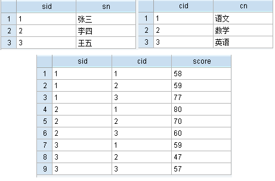

### 一、常用分组函数

~~~sql
SQL> select avg(sal),sum(sal),max(sal),min(sal) from emp;
	 select count() from emp; --计数
	 select count(distinct deptno) from emp;

	 --vm_concat：行转列
	 select deptno 部门号,vm_concat(ename) 部门中员工的姓名 from emp group by deptno;
	 set linesize 200; --设置行列的宽度
~~~

<!-- more -->

### 二、分组函数与空值

分组函数会自动忽略空值，NVL函数使分组函数无法忽略空值：

~~~sql
SQL> select count(*),count(nvl(coum,0)) from emp;
~~~

### 三、group by子句

1. 多个列分组

   - oracle中在select列表中所有未包含在组函数中的列都应该包含在group by子句中。例：

     ~~~sql
     SQL> select a,b,c,avg(d) from emp group by a,b,c; --错误代码：ORA-00937
     ~~~

   - 包含在group by中的列不必包含在select列表中

2. group by语句的增强

   用于报表，小计，总计时，group by  rollup(a,b)等价于：

   > group by a,b
   >
   > group by a
   >
   > group by null

   ~~~sql
   SQL> select deptno,job,sum(sal) from emp group by deptno,job;--按照部门，职位统计工资总额
   	 +
   	 select deptno,sum(sal) from emp group by deptno;--按照部门统计工资总额 --小计
   	 +
   	 select sum(sal) from emp; --统计工资总额 --总计
   	 ||
   	 select deptno,job,sum(sal) from emp group by rollup(deptno,job);
   ~~~

3. 页面显示设置

   ~~~sql
   SQL> break on deptno skip 2;--部门号只显示一次，不同部门号之间空两行
   	 set pagesize 30;--设置页面大小，每页显示30条记录
   ~~~

### 四、having子句

过滤分组。例：求平均工资大于2000的部门：

~~~sql
SQL> select deptno,avg(sal) from emp group by deptno having avg(sal) > 2000;
~~~

where 与having区别：

- where后不可以使用分组函数，having可以，当不使用分组函数时，两者相同
- having 先分组，再过滤
- where先过滤，再分组，效率高，使分组记录数大大降低
- SQL优化：通用时使用where

### 五、order by子句

可以按照列、别名、表达式、序号进行排序，desc降序，asc升序，通常在sql语句最后。

### 六、分组函数的嵌套

求部门平均工资的最大值：

~~~sql
SQL> select max(avg(sal)) from emp group by deptno;
~~~

### 七、SQL*PLUS的报表功能

~~~sql
SQL> title col 15 '我的报表' col 35 sql.pno;--title设置表名称，col 35表示空35个列，sql.pno表示报表页码
	 col deptno heading 部门号;--设置报表别名
	 break on deptno skip 1; --部门号分隔，相隔一行
--注：如果在select语句中设置，则只针对本次查询有效，单独设置，则本次会话有效
~~~
### 八、 案例

三张表：学生表、课程表、成绩表。如下：

问题1：列出有两门（含）以上不及格课程的学生名单及其平均成绩

~~~sql
--主要思想是按照学生分组，使用case when搜索函数
SELECT s.sid,s.sn,avg(sc.score) 平均成绩 FROM s,sc 
where s.sid = sc.sid 
group by s.sid,s.sn 
having count(case when sc.score < 60 then 1 end) >= 2
--case when用法：
--简单Case函数
CASE sex
WHEN '1' THEN '男'
WHEN '2' THEN '女'
ELSE '其他' END
--Case搜索函数
CASE WHEN sex = '1' THEN '男'
WHEN sex = '2' THEN '女'
ELSE '其他' END
~~~

问题2：1号课程比2号课程成绩高的所有学生名单

~~~sql
--主要思想是用成绩表自身做一次连接，一张使用科目1，另一张使用科目2
SELECT sid,sn FROM s where sid in(
	SELECT sc1.sid FROM sc sc1
	LEFT JOIN sc sc2 on sc1.sid = sc2.sid 
	where sc1.cid = 1 and sc2.cid = 2 and sc1.score > sc2.score
)
~~~

