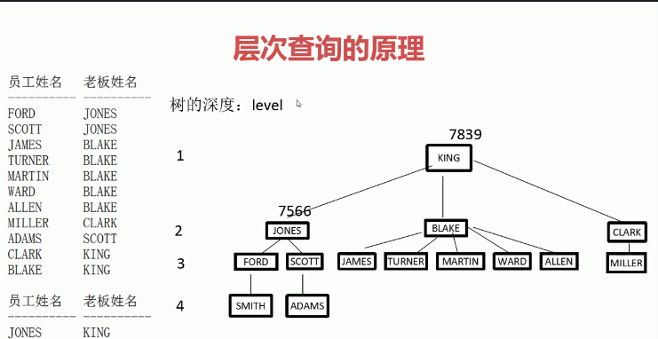

## SQL表连接

多表查询分为 内连接、外连接和交叉连接。现在有表A和表B：

| TableA |      | TableB |      |
| ------ | ---- | ------ | ---- |
| id     | name | id     | age  |
| 1      | n1   | 1      | 18   |
| 2      | n2   | 2      | 20   |
| 4      | n4   | 3      | 19   |

<!-- more -->

### 一、外连接

外连接分为**左连接**（left join 或left outer join）、**右连接**（right join 或者 right outer join）、和**全外部连接** （full join 或者 full outer join）

 #### 1. 左外连接

**左连接**的结果就是left join子句中的左表的所有行，而不仅仅是连接列所匹配的行，如果左表中的某行在右表中没有匹配，则在相关联的结果行中右表的所有选择列均为空值（NULL）

~~~sql
select * from TableA left join TableB on TableA.id = TableB.id;
~~~

结果：TableA(基表)都显示，TableB(外表)第三行条件不匹配，都为null

| id   | name | id   | age  |
| ---- | ---- | ---- | ---- |
| 1    | n1   | 1    | 18   |
| 2    | n2   | 2    | 20   |
| 4    | n4   | null | null |

#### 2. 右外连接

**右连接**就是和左连接相反

~~~sql
select * from TableA right join TableB on TableA.id = TableB.id;
~~~

结果：TableB(基表)都显示，TableA(外表)第三行条件不匹配，都为null

| id   | name | id   | age  |
| ---- | ---- | ---- | ---- |
| 1    | n1   | 1    | 18   |
| 2    | n2   | 2    | 20   |
| null | null | 3    | 19   |

#### 3. 全外连接

显示左右表中的所有行，当某一个表中没有匹配的行时，则另一个表的选择列表列显示空值（NULL）如果有则显示全部数据

~~~sql
select * from TableA full join TableB on TableA.id = TableB.id;
~~~

结果：TableA和TableB都显示，条件不匹配的都为null

| id   | name | id   | age  |
| ---- | ---- | ---- | ---- |
| 1    | n1   | 1    | 18   |
| 2    | n2   | 2    | 20   |
| null | null | 3    | 19   |
| 4    | n4   | null | null |

### 二、内连接

**内连接**（join 或者inner join）是用比较运算符比较要连接的列的值，不匹配的行不被显示

~~~sql
select * from TableA join TableB on TableA.id = TableB.id;
~~~

结果：只返回条件匹配的行

| id   | name | id   | age  |
| ---- | ---- | ---- | ---- |
| 1    | n1   | 1    | 18   |
| 2    | n2   | 2    | 20   |

等价于：

~~~sql
select * from TableA,TableB where TableA.id = TableB.id;
~~~

~~~sql
select * from TableA cross join TableB where TableA.id = TableB.id;
--cross join 后只能用where不能用on
~~~

### 三、交叉连接

**交叉连接**（cross join）没有where条件的交叉连接产生连接表的笛卡尔积

~~~sql
select * from TableA cross join TableB;
~~~

结果：返回笛卡儿积

| id   | name | id   | age  |
| ---- | ---- | ---- | ---- |
| 1    | n1   | 1    | 18   |
| 2    | n2   | 1    | 18   |
| 4    | n4   | 1    | 18   |
| 1    | n1   | 2    | 20   |
| 2    | n2   | 2    | 20   |
| 4    | n4   | 2    | 20   |
| 1    | n1   | 3    | 19   |
| 2    | n2   | 3    | 19   |
| 4    | n4   | 3    | 19   |

等价于：

~~~sql
select * from TableA,TableB;
~~~

### 四、合并

**合并**（union和union all）用于合并多个select语句的结果集

> union：消除重复行
>
> union all：不消除重复行
>
> 注：使用union时，两张表查询的结果有相同的列，并且列的类型相同

### 五、自然连接

**自然连接**（natural join）也叫相等连接，两张表通过natural join连接的时候，相当于有个隐含的WHERE子句，对两张表中同名的对应列相比较看是否相等

~~~sql
select * from TableA natural join TableB;
~~~

等价于：

~~~sql
select * from TableA , TableB where TableA.depno = TableB.depno;
~~~

### 六、不相等连接

两个表中的相关的两列进行不等连接，比较符号一般为**>,<,...**，**BETWEEN.. AND..**

~~~sql
SELECT EMPNO,ENAME,SAL,GRADE FROM SALGRADE,EMP WHERE EMP.SAL BETWEEN LOSAL AND HISAL;
~~~

### 七、自连接

自连接是数据库中经常要用的连接方式，使用自连接可以将自身表的一个镜像当作另一个表来对待，从而能够得到一些特殊的数据

> 例：有一个学生表Table，里面有学号、功课编号和学生成绩三个字段。用一个SQL查询语句得出每门功课成绩最好的前两名

| 学号nnum | 功课编号pnum | 成绩score |
| ------ | -------- | ------- |
| 1      | 1        | 99      |
| 2      | 1        | 98      |
| 3      | 1        | 100     |
| 4      | 2        | 88      |
| 5      | 2        | 87      |
| 6      | 2        | 88      |
| 7      | 3        | 99      |
| 8      | 3        | 88      |
| 9      | 3        | 100     |

~~~sql
SELECT DISTINCT Table1.*
FROM Table Table1 
INNER JOIN Table Table2 ON Table1.nnum IN(
SELECT TOP 2 Table.nnum
FROM Table
WHERE Table.pnum = Table1.pnum
ORDER BY score DESC)
~~~

### 八、自连接存在的问题

自连接会产生笛卡儿积，不适合操作大表。如：查询员工姓名和员工老板的姓名：

~~~sql
SQL> select e.ename 员工姓名, b.ename 老板姓名
	 from emp e, emp b
	 where e.mgr = b.empno --员工的老板号等于老板的员工号
~~~

解决方法：层次查询（单表查询）：

~~~sql
SQL> select level,empno,ename,sal,mgr --level是伪例
	 from emp
	 connect by prior empno = mgr --上一层的员工号等于老板号，prior是关键字，表示上一层
	 start with mgr is null --开始条件，只有根节点可以这样表示，start with empno = 7839
	 order by level; --按照level排序
~~~

自连接和层次查询优缺点：

- 自连接得到的结果直观，不适合操作大表
- 层次查询是单表查询，不会得到笛卡尔积。得到结果不直观

### 九、SQL连接和多表查询的区别

无区别，写法不同而已

### 十、on 和 where 的区别

基本没区别，在执行顺序上on比where先执行