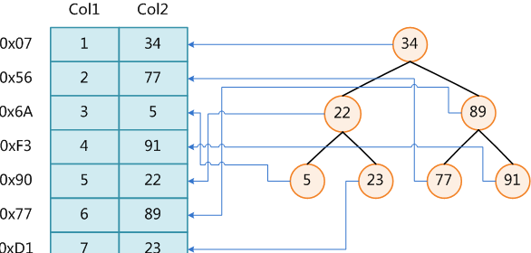
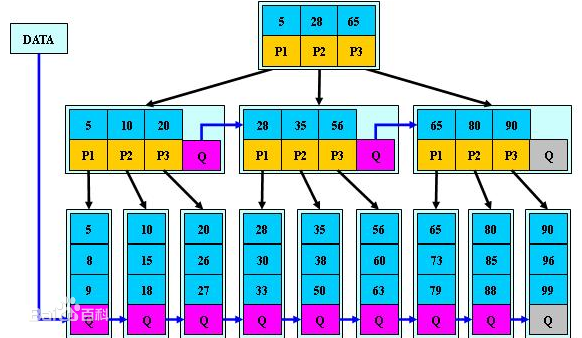

数据库索引是数据库管理系统中一个排序的数据结构，以协助快速查询、更新数据库表中数据。索引的实现通常使用**B树**及其变种**B+树**。

下图展示了一种可能的索引方式。左边是数据表，一共有两列七条记录，最左边的是数据记录的物理地址（注意逻辑上相邻的记录在磁盘上也并不是一定物理相邻的）。为了加快Col2的查找，可以维护一个右边所示的二叉查找树，每个节点分别包含索引键值和一个指向对应数据记录物理地址的指针，这样就可以运用二叉查找在O(log2n)的复杂度内获取到相应数据。

<!-- more -->

## 一、局部性原理与磁盘预读

由于存储介质的特性，磁盘本身存取就比主存慢很多，再加上机械运动耗费，磁盘的存取速度往往是主存的几百分分之一，因此为了提高效率，要尽量减少磁盘I/O。为了达到这个目的，磁盘往往不是严格按需读取，而是每次都会预读，即使只需要一个字节，磁盘也会从这个位置开始，顺序向后读取一定长度的数据放入内存。这样做的理论依据是计算机科学中著名的**局部性原理**：**当一个数据被用到时，其附近的数据也通常会马上被使用。程序运行期间所需要的数据通常比较集中。**

由于磁盘顺序读取的效率很高（不需要寻道时间，只需很少的旋转时间），因此对于具有局部性的程序来说，预读可以提高I/O效率。

预读的长度一般为页（page）的整倍数。页是计算机管理存储器的逻辑块，硬件及操作系统往往将主存和磁盘存储区分割为连续的大小相等的块，每个存储块称为一页（在许多操作系统中，页得大小通常为4k），主存和磁盘以页为单位交换数据。当程序要读取的数据不在主存中时，会触发一个缺页异常，此时系统会向磁盘发出读盘信号，磁盘会找到数据的起始位置并向后连续读取一页或几页载入内存中，然后异常返回，程序继续运行。

## 二、B-/+Tree索引的性能分析

先从B-Tree分析，根据B-Tree的定义，可知检索一次最多需要访问h个节点。数据库系统的设计者巧妙利用了磁盘预读原理，将一个节点的大小设为等于一个页，这样每个节点只需要一次I/O就可以完全载入。为了达到这个目的，在实际实现B-Tree还需要使用如下技巧：

每次新建节点时，直接申请一个页的空间，这样就保证一个节点物理上也存储在一个页里，加之计算机存储分配都是按页对齐的，就实现了一个node只需一次I/O。

**B-Tree中一次检索最多需要h-1次I/O（根节点常驻内存），渐进复杂度为O(h)=O(logdN)。**一般实际应用中，出度d是非常大的数字，通常超过100，因此h非常小（通常不超过3）。

而红黑树这种结构，h明显要深的多。由于逻辑上很近的节点（父子）物理上可能很远，无法利用局部性，所以红黑树的I/O渐进复杂度也为O(h)，效率明显比B-Tree差很多。

**B＋tree **是一个n叉树，每个节点有多个叶子节点，一颗B+树包含根节点，内部节点，叶子节点。根节点可能是一个叶子节点，也可能是一个包含两个或两个以上叶子节点的节点。B＋tree的性质：

1. n棵子tree的节点包含n个关键字，不用来保存数据而是保存数据的索引。
2. 所有的叶子结点中包含了全部关键字的信息，及指向含这些关键字记录的指针，且叶子结点本身依关键字的大小自小而大顺序链接。
3. 所有的非终端结点可以看成是索引部分，结点中仅含其子树中的最大（或最小）关键字。

B＋tree结构原型图大概如下：

由于B+tree的性质， 它通常被用于数据库和操作系统的文件系统中。NTFS, ReiserFS, NSS, XFS, JFS, ReFS 和BFS等文件系统都在使用B+树作为元数据索引，因为B+ 树的特点是能够保持数据稳定有序，其插入与修改拥有较稳定的对数时间复杂度（B+ 树元素自底向上插入）。

## 三、SQLS数据访问

### SQLS访问没有建立索引的数据表

SQLS在接到查询请求时，首先会分析sysindexes表中一个叫做索引标志符（INDID：Index ID）的字段的值，如果该值为0，表示这是一张数据表而不是索引表，SQLS就会使用FirstIAM找到该表的IAM页链，也就是所有数据页集合。对于没有索引的表，SQLS在查询时会执行一次全表扫描，即使在第一行找到记录，也会从头到尾扫描一遍。

### SQLS访问建立了非聚集索引的数据表

非聚集索引可以建多个，具有B树结构，其叶级节点不包含数据页，只包含索引行。假定一个表中只有非聚集索引，则每个索引行包含了非聚集索引键值以及行定位符（ROW ID），它们指向具有该键值的数据行，每一个RID由文件ID、页编号和在页中行的编号组成。

当INDID的值在2至250之间时，意味着表中存在非聚集索引页，此时，SQLS调用root字段的值指向非聚集索引B树的root，在其中查找与被查询最相近的值，根据这个值找到在非叶级节点中的页号，然后顺藤摸瓜在叶级节点相应的页面中找到该值的RID，最后根据这个RID在Heap中定位所在的页和行并返回到查询端。例如：在Lastname上建立了非聚集索引，执行

~~~plsql
select * from member where Lastname = 'OTA'
~~~

查询过程是：

1. SQLS查询INDID的值为2；--例如图书馆第X排
2. 立即从根出发，在非叶级节点中定位最接近"OTA"的值“Martin”，并查到其位于叶级页面的第61页；
3. 仅在叶级页面的第61页的“Martin”下搜寻"OTA"的RID为N：706:4，表示Lastname字段中名为“OTA”的记录位于堆的第706页的第4行，N表示文件的ID值，与数据无关；
4. 根据上述信息，SQLS将信息找出并显示在前台。视表的数据大小，整个查询过程从百分之几毫秒到数毫秒之间。

### SQLS访问建立了聚集索引的数据表

在聚集索引中，数据所在的数据页是叶级，索引数据所在的索引也是非叶级。查询原理与非聚集索引相似，但由于记录是按照聚集索引中索引键值进行排序的。也就是说聚集索引的索引键值就是具体的数据页。例：在Lastname字段上建立了聚集索引，则执行：

~~~plsql
select * from member where Lastname = 'OTA'
~~~

查询过程是：

1. SQLS查询INDID值为1，这是在系统中只建立了聚集索引的标志；
2. 立即从根出发，在非叶级节点中定位最接近"OTA"的值“Martin”，并查到其位于叶级页面的第120页；
3. 在位于叶级页面第120页的Martin下搜寻到“OTA”条目，而这一条目就是数据记录本身；
4. 将该记录返回客户端。

由于同一张表中同时只能按照一种顺序排列，所以聚集索引只能建立一个，并且建立聚集索引需要至少相当于源表120%的附加空间，以存放源表的副本和索引中间页。

### SQLS访问既有非聚集索引又有聚集索引的数据表

就像在图书馆中，前台卡片柜中可以有不同类别的图书索引卡，然而每张卡片上都载明了那个特殊编号，并不是书籍存放的具体位置。这样在最大程度上既照顾了数据检索的快捷性，又使索引的日常维护变得更加可行，这是最为科学的检索方法。

也就是说，在只建立了非聚集索引的情况下，每个叶级节点指明了记录的行定位符（RID）；而在既有聚集索引又有非聚集索引的情况下，每个叶级节点所指向的是该聚集索引的索引键值，即数据记录本身。例：聚集索引建立在Lastname，非聚集索引建立在Firstname上，则执行：

~~~plsql
select * from member where firstname = 'Mike'
~~~

查询过程：

1. SQLS查询INDID的值为2；
2. 立即从根出发，在Firstname非聚集索引的非叶级节点中定位最接近"Mike"的值“Jose”条目；
3. 从Jose条目下的叶级页面中查到Mike逻辑位置，不是RID而是聚集索引的指针；
4. 根据这一指针所指示位置，直接进入位于Lastname的聚集索引中的叶级页面中到达Mike数据记录本身；
5. 将该记录返回客户端。

当数据发生更新时，我们只负责对聚集索引的键值维护，而不必考虑非聚集索引，我们只要在ID类的字段上建立聚集索引，而在其他经常需要查询的字段上建立非聚集索引。这样可以体验到索引带来的灵活与快捷，又相对避免了维护索引所导致的大量的额外资源消耗。

## 四、索引的管理与优化

在海量数据的情况下，如果合理的建立了索引，则会大大加强sql的执行查询、对结果进行排序、分组的操作效率。但是索引也有一些先天的不足，系统要占大约为表的1.2倍的硬盘和内存空间来保存索引，更新数据的时候，系统必须要有额外的时间来同时对索引进行更新，以维持数据和索引的一致性。所以建立索引一定要在**加快查询速度**和**降低修改速度**之间做好平衡。SQLS维护索引消耗的资源，以及面对索引的管理与优化可以从下面六个方面入手：

### 页分裂

微软MOC教导我们：当一个数据量达到8K容量，如果此时发生插入 或更新数据的操作，将导致页的分裂：

1. 有聚集索引的情况下：聚集索引将被插入和更新的行指向特定的页，该页由聚集索引关键字决定。
2. 只有堆的情况下：只要有空间就可以插入新的行，但是如果我们对行数据的更新需要更多的空间，以致大于当前页的可用空间，行就被移到新的页中，并且在原位置留下一个转发指针，指向被移动的新行，如果具有转发指针的行又被移动了，那么原来的指针将重新指向新的位置。
3. 如果堆中有非聚集索引，那么尽管插入和更新操作在堆中不会发生页分裂，但是在非聚集索引上仍然产生页分裂。

无论有无索引，大约一半的数据将保留在老页面，而另一半数据将放入新的页面，并且新页面可能被分配到任何可用的页。所以频繁页分裂，后果很严重，将是物理表产生大量数据碎片，导致直接造成I/O效率的急剧下降，最后，需要重建索引。

### 填充因子

在创建索引时，可以为这个索引指定一个**填充因子**，以便在索引的每个叶级页面上保留一定百分比的空间，将来数据可以进行扩充和减少页分裂。填充因子是从0到100的百分比数值，设为100时表示将数据页填满，只有当不会对数据进行更改时（只读）才用此值。值越小则数据页上的空闲空间越大，这样可以减少在索引增长过程中进行页分裂的需要，但这一操作需要占用更多的硬盘空间。

填充因子只在创建索引时执行，索引创建以后，当表中进行数据的添加、删除或更新操作时，是不会保持填充因子的，因此当表中的数据进行了较大的变动，这时可以从容的重建索引，重新指定填充因子，重新分布数据。

填充因子指定不当，就会降低数据库的读取的性能，其降低量与填充因子设置值成反比。例如：当填充因子的值为50，数据库的读取性能就会降低两倍。

### 两道数学题

当建立了众多的索引，在查询工作中SQLS就只能按照“最高指示”用索引处理每一个提交的查询呢？实际上SQLS几乎完全是“自主”的决定是否使用索引或使用哪一个索引。下面看两个例子：

如果某表的一条记录在磁盘上占用1000字节（1K）的话，我们对其中10字节的一个字段建立索引，那么该记录对应的索引大小只有10字节（0.01K）。SQLS的最小空间分配单元是页（page），一个页面在磁盘上占用8K空间，所以一页只能存储8条记录，但可以存储800条索引。现在我们要从一个有800条记录的表中检索符合某个条件的记录，如果没有索引的话，我们需要遍历8000条X1000字节/8K字节=1000个页面才能够找到结果。如果在检索字段上有上述索引的话，那么我们可以在8000条X10字节/8K字节=10个页面中就能检索到满足条件的索引块，然后根据索引块上的指针逐一找到结果数据块，这样I/O访问量肯定要少得多。

然而有时用索引比不上不用索引快。

同上，如果要无条件检索全部记录（不用where语句），不用索引的话需要访问8000条X1000字节/8K字节=1000个页面；而使用索引的话，首先检索索引，访问8000条X10字节/8K字节=10个页面得到索引检索结果，再根据索引结果去对应数据页面，由于是检索全部数据，所以需要再访问8000条X1000字节/8K字节=1000个页面将全部数据读取出来，一共访问了1010个页面，这显然不如不用索引快。

SQLS内部有一套完整的数据索引优化技术，在上述情况下，SQLS会自动使用表扫描的方法检索数据而不会使用任何索引。SQLS知道什么时候用索引，什么时候不用索引是因为SQLS除了维护数据信息外，还维护着数据统计信息。

### 统计信息

在企业管理器-->Database-->Northwind数据库-->单击“属性”-->选择“Options”选项卡，观察“Settings”下的各项复选项，从Settings中我们可以看到，在数据库中，SQLS将默认的自动创建和更新统计信息，这些统计信息包括数据密度和分布信息，正是它们帮助SQLS确定最佳的查询策略：建立查询计划和是否使用索引以及使用什么样的索引。

在创建索引时，SQLS会创建分布数据页来存放有关索引的两种统计信息：分布表和密度表。查询优化器使用这些统计信息估算使用该索引进行查询的成本（Cost），并在此基础上判断引用对某个特定查询是否有用。

随着表中的数据发生变化，SQLS自动定期更新这些统计信息。统计更新的频率取决于字段或索引中的数据量以及数据更改量。例如：对于一万条记录的表，当1000个索引值发生改变时该表的统计信息可能需要更新。

### 索引的人工维护

当数据变化达到某一程度时将会影响到索引的使用，这时需要对索引进行维护。随着数据行的插入、删除和数据页的分裂，有些索引页可能只包含几页数据，另外应用在执行大量I/O的时候，重建非聚集索引可以维护I/O的效率。重建索引实际上是重现组织B树。需要重建索引的情况有：

1. 数据和使用模式大幅度变化；
2. 排序的顺序发生改变；
3. 要进行大量插入操作或已经完成；
4. 使用I/O查询的磁盘读次数比预料的要多；
5. 由于大量数据修改，使得数据页和索引页没有充分使用而导致空间的使用超出估算；
6. dbcc检查出索引有问题

### 索引的使用原则

先认识下索引的两个重要属性：唯一性索引和复合性索引。

**唯一性索引**保证在索引列中的全部数据是唯一的，不会包含冗余数据。如果表中已经有一个主键约束或者唯一性约束，那么当创建表或者修改表时，SQLS自动创建一个唯一性索引。但出于必须保证唯一性，那么应该创建主键约束或者唯一性约束，而不是创建一个唯一性索引。

**复合索引**就是一个索引创建在两个列或者多个列上。在搜索时，当两个或者多个列作为一个关键值时，最好在这些列上创建复合索引。当创建复合索引时，应该考虑这些规则：

- 最多可以把16个列合并成一个单独的复合索引，构成复合索引的列的总长度不能超过900字节；
- 在复合索引中，所有列必须来自同一张表，不能跨表建立复合列；
- 在复合索引中，列的排列顺序是非常重要的，原则上，应该首先定义最唯一的列；
- 为了是查询优化器使用复合索引，查询语句中的where子句必须参考复合索引中第一列。

综上总结下索引的使用原则：

1. 逻辑主键使用唯一的成组索引，对系统键（作为存储过程）采用唯一的非成组索引，对任何外键列采用非成组索引。考虑数据库的空间有多大，表如何进行访问，还有这些访问是否主要用作读写；
2. 不要索引memo/note字段，不要索引大型字段（有很多字符），这样作会让索引占用太多的存储空间；
3. 不要索引常用的小型表；
4. 不要为小型数据表设置过多的索引，如果经常有插入和删除操作就更不要设置索引，因为SQLS对插入和删除提供的索引维护可能比扫描表空间消耗的时间更多。

查询是一个物理过程，表面上是SQLS在东跑西跑，其实真正大部分压马路的工作是由磁盘输入输出系统（I/O）完成，全表扫描需要从磁盘上读取每一个数据页，如果有索引指向数据值，则I/O读几次磁盘就可以。但是在随着发生的增、删、改操作中，索引的存在会大大增加工作量，因此，合理的索引设计是建立在对各种查询的分析和预测上的，只有正确地使用索引与程序结合起来，才能产生最佳的优化方案。

