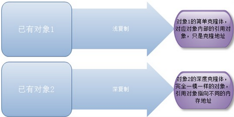

## 介绍

用原型实例指定创建对象的种类，并且通过拷贝这些原型创建新的对象。 Prototype原型模式是一种创建型设计模式，Prototype模式允许一个对象再创建另外一个可定制的对象，根本无需知道任何如何创建的细节,工作原理是：通过将一个原型对象传给那个要发动创建的对象，这个要发动创建的对象通过请求原型对象拷贝它们自己来实施创建。它主要面对的问题是：“某些结构复杂的对象”的创建工作；由于需求的变化，这些对象经常面临着剧烈的变化，但是他们却拥有比较稳定一致的接口。

原型模式虽然是创建型的模式，但是与工程模式没有关系，从名字即可看出，该模式的思想就是将一个对象作为原型，对其进行复制、克隆，产生一个和原对象类似的新对象。通过对象的复制，进行讲解。

在Java中，复制对象是通过clone()实现的，先创建一个原型类：

~~~java
public class Prototype implements Cloneable {  
    public Object clone() throws CloneNotSupportedException {  
        Prototype proto = (Prototype) super.clone();  
        return proto;  
    }  
}  
~~~

<!--more -->

很简单，一个原型类，只需要实现Cloneable接口，覆写clone方法，此处clone方法可以改成任意的名称，因为Cloneable接口是个空接口，你可以任意定义实现类的方法名，如cloneA或者cloneB，因为此处的重点是super.clone()这句话，super.clone()调用的是Object的clone()方法，而在Object类中，clone()是native的。

原型模式最大的特点是克隆一个现有的对象，这个克隆的结果有2种，**一种是是浅复制，另一种是深复制**，创建型模式一般是用来创建一个新的对象，然后我们使用这个对象完成一些对象的操作，通过原型模式可以快速的创建一个对象而不需要提供专门的new()操作就可以快速完成对象的创建，这无疑是一种非常有效的方式，快速的创建一个新的对象。

结合对象的浅复制和深复制来说一下，首先需要了解对象深、浅复制的概念：

- **浅复制 **将一个对象复制后，基本数据类型的变量都会重新创建，而引用类型，指向的还是原对象所指向的。
- **深复制：**将一个对象复制后，不论是基本数据类型还有引用类型，都是重新创建的。简单来说，就是深复制进行了完全彻底的复制，而浅复制不彻底。

原型模式原理图：

一个深浅复制的例子1：

~~~java
public class Prototype implements Cloneable, Serializable {  
    private static final long serialVersionUID = 1L;  
    private String string;  
    private SerializableObject obj;  
  
    /* 浅复制 需要实现Cloneable接口 */  
    public Object clone() throws CloneNotSupportedException {  
        Prototype proto = (Prototype) super.clone();  
        return proto;  
    }  
  
    /* 深复制 需要实现Cloneable和Serializable接口 */  
    public Object deepClone() throws IOException, ClassNotFoundException {  
        /* 写入当前对象的二进制流 */  
        ByteArrayOutputStream bos = new ByteArrayOutputStream();  
        ObjectOutputStream oos = new ObjectOutputStream(bos);  
        oos.writeObject(this);  
  
        /* 读出二进制流产生的新对象 */  
        ByteArrayInputStream bis = new ByteArrayInputStream(bos.toByteArray());  
        ObjectInputStream ois = new ObjectInputStream(bis);  
        return ois.readObject();  
    }  
  
    public String getString() {  
        return string;  
    }  
  
    public void setString(String string) {  
        this.string = string;  
    }  
  
    public SerializableObject getObj() {  
        return obj;  
    }  
  
    public void setObj(SerializableObject obj) {  
        this.obj = obj;  
    }   
}  
  
class SerializableObject implements Serializable {  
    private static final long serialVersionUID = 1L;  
}  
~~~

要实现深复制，需要采用流的形式读入当前对象的二进制输入，再写出二进制数据对应的对象。

测试类:

~~~java
public class Test {
	public static void main(String[] args)throws CloneNotSupportedException,ClassNotFoundException ,IOException{
		Prototype pt=new Prototype();
		SerializableObject obj=new SerializableObject();
		pt.setObj(obj);
		pt.setStr("Hello World");
		System.out.println("使用浅克隆方法进行创建对象");
		Prototype pt1=(Prototype)pt.clone();
		System.out.println("=============================");
		System.out.println("比较pt和pt1的str的值：");
		System.out.println(pt.getStr());
		System.out.println(pt1.getStr());
		System.out.println("修改pt1对象中str的值后，比较pt和pt1的str的值：");
		pt1.setStr("你好，世界");
		System.out.println(pt.getStr());
		System.out.println(pt1.getStr());
		System.out.println("============================");
		System.out.println("比较pt和pt1中temp对象的值");
		System.out.println(pt.getObj());
		System.out.println(pt1.getObj());
		System.out.println("使用深克隆方法进行创建对象");
		System.out.println("============================");
		pt1=(Prototype)pt.deepClone();
		System.out.println(pt.getObj());
		System.out.println(pt1.getObj());
	}
}
~~~

测试结果：

~~~java
/*
使用浅克隆方法进行创建对象
=============================
比较pt和pt1的str的值：
Hello World
Hello World
修改pt1对象中str的值后，比较pt和pt1的str的值：
Hello World
你好，世界
============================
比较pt和pt1中temp对象的值
Temp@affc70
Temp@affc70
使用深克隆方法进行创建对象
============================
Temp@affc70
Temp@15d56d5
*/
~~~

从上面的输出结果我们可以看出使用Object.clone()方法只能浅层次的克隆，即只能对那些成员变量是基本类型或String类型的对象进行克隆，对哪些成员变量是类类型的对象进行克隆要使用到对象的序列化，不然克隆克隆出来的Prototype对象都共享同一个obj实例。

## 模型分析

Java语言提供的clone()方法将对象复制了一份并返回给调用者。一般而言，clone()方法满足：

1. 对任何的对象x，都有x.clone() !=x，即克隆对象与原对象不是同一个对象。
2. 对任何的对象x，都有x.clone().getClass()==x.getClass()，即克隆对象与原对象的类型一样。
3.  如果对象x的equals()方法定义恰当，那么x.clone().equals(x)应该成立。

浅拷贝：一定要实现Cloneable接口（否则CloneNotSupportedException异常）。

深拷贝；实现Cloneable 和Serializable接口。

## 原型模式优缺点

1. 优点
   - 当创建新的对象实例较为复杂时，使用原型模式可以简化对象的创建过程，通过一个已有实例可以提高新实例的创建效率。
   - 可以动态增加或减少产品类。 
   - 原型模式提供了简化的创建结构。 
   - 可以使用深克隆的方式保存对象的状态。
2. 缺点
   - 需要为每一个类配备一个克隆方法，而且这个克隆方法需要对类的功能进行通盘考虑，这对全新的类来说不是很难，但对已有的类进行改造时，不一定是件容易的事，必须修改其源代码，违背了**开闭原则**。
   - 在实现深克隆时需要编写较为复杂的代码。

## 总结

原型模式作为创建型模式中的最特殊的一个模式，具体的创建过程，是由对象本身提供，这样我们在很多的场景下，我们可以很方便的快速的构建新的对象，就像前面分析讲解的几类场景中，可能我们通过使用对象的克隆，比通过其他几类的创建型模式，效果要好的多，而且代价也小很多。

打个比方，原型模式对于系统的扩展，可以做到无缝的扩展，为什么这么说呢？比如其他的创建型工厂，如果新增一个对象类型，那么我们不管是修改配置文件的方式，还是修改代码的形式，无疑我们都是需要进行修改的，对于我们大家通用的公共应用来说这无疑是危险的，那么通过原型模式，则可以解决这样的问题，因为类型本身实现这样的方法即可，但是也有一定的缺点，每个对象都实现这样的方法，无疑是很大的工作量，但是在某些特殊的环境下，或者实际的项目中，可能原型模式是好的选择。