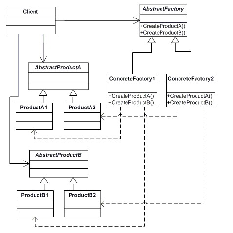
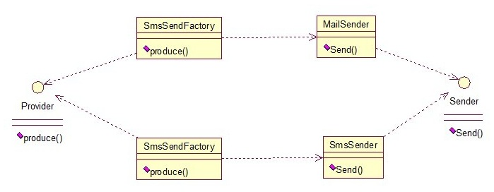
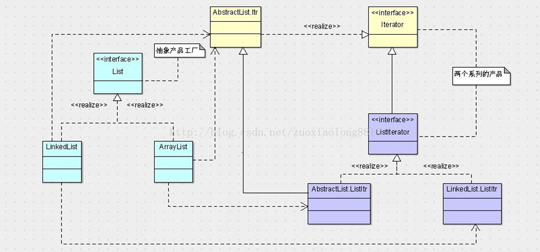
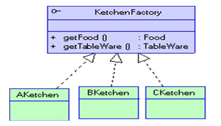
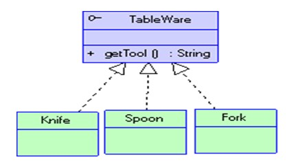
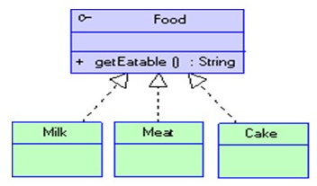

## 介绍

**工厂方法模式**有一个问题就是，类的创建依赖工厂类，也就是说，如果想要拓展程序，必须对工厂类进行修改，这违背了闭包原则

**抽象工厂模式**  创建多个工厂类，这样一旦需要增加新的功能，直接增加新的工厂类就可以了，不需要修改之前的代码.提供一个创建一系列相关或相互依赖对象的接口，而无须指定它们具体的类

<!--more -->

抽象工厂模式的结构：

1. 抽象工厂（Abstract Factory）角色
2. 具体工厂（Concrete Factory）角色
3. 抽象产品（Abstract Product）角色
4. 具体产品（Concrete Product）角色

***

同样一个发短信或发邮件的例子：

关系图：

接口：

~~~java
public interface Sender {  
    public void Send();  
}
~~~

实现类：

~~~java
public class MailSender implements Sender {  
    @Override  
    public void Send() {  
        System.out.println("this is mailsender!");  
    }  
}  
~~~

~~~java
public class SmsSender implements Sender {  
    @Override  
    public void Send() {  
        System.out.println("this is sms sender!");  
    }  
}  
~~~

工厂类实现的接口：

~~~java
public interface Provider {  
    public Sender produce();  
}  
~~~

工厂类：一个实现对应一个工厂

~~~java
public class SendMailFactory implements Provider {        
    @Override  
    public Sender produce(){  
        return new MailSender();  
    }  
}  
~~~

~~~java
public class SendSmsFactory implements Provider{  
    @Override  
    public Sender produce() {  
        return new SmsSender();  
    }  
}  
~~~

测试类：

~~~java
public class Test {  
    public static void main(String[] args) {  
        Provider provider = new SendMailFactory();  
        Sender sender = provider.produce();  
        sender.Send();  
    }  
}  
//输出：this is mailsender!
~~~

其实这个模式的好处就是，如果你现在想增加一个功能：发及时信息，则只需做一个实现类，实现Sender接口，同时做一个工厂类，实现Provider接口，就OK了，无需去改动现成的代码。这样做，拓展性较好

## 模式扩展

上面的例子就是抽象工厂模式的退化 

当抽象工厂模式中每一个具体工厂类只创建一个产品对象，也就是只存在一个产品等级结构时，抽象工厂模式退化成工厂方法模式

当工厂方法模式中抽象工厂与具体工厂合并，提供一个统一的工厂来创建产品对象，并将创建对象的工厂方法设计为静态方法时，工厂方法模式退化成简单工厂模式

下面看一个多产品的抽象工厂

抽象类：

~~~java
public abstract class AbstractFactory{
    public abstract MailSender mailSend();
    public abstract SmsSender smsSend();
}
~~~

工厂类：

~~~java
//工厂1同时存在产品A和产品B
public class ConcreteFactory1 extends AbstractFactory{
    public MailSender mailSend(){
        return new MailSender();
    }
    public SmsSender smsSend(){
        return new SmsSender();
    } 
}

//工厂2同时也可以存在产品A和产品B
~~~

实现类继承的抽象类：

~~~java
public abstract class Sender{
	public abstract void send();
}
~~~

实现类：

~~~java
public class MailSender extends Sender {  
    @Override  
    public void Send() {  
        System.out.println("this is mailsender!");  
    }  
}  
~~~

~~~java
public class SmsSender extends Sender {  
    @Override  
    public void Send() {  
        System.out.println("this is sms sender!");  
    }  
}  
~~~

测试类：

~~~java
public class Test {  
    public static void main(String[] args) {  
        ConcreteFactory1 concreteFactory1 = new ConcreteFactory1();  
        MailSender mailSend = concreteFactory1.mailSend(); 
        SmsSender smsSend = concreteFactory1.smsSend();
        mailSend.Send(); 
        smsSend.Send();
    }  
}  
//输出：this is mailsender!
//输出：this is sms sender!
~~~

## 模式应用

待深入理解

---

1. Iterator与ListIterator，前者只能向后移动，后者前后移动，两种迭代器产品
2. List是抽象工厂的角色，它有两个制造产品的方法，iterator和listIterator，相当于Creator
3. ListIterator和Iterator都是抽象产品，相当于ProductA和ProductB。其中ListIterator有两个实现类，分别是AbstractList.ListItr和LinkedList.ListItr，相当于ProductA1和ProductA2。Iterator的实现类为AbstractList.Itr，相当于ProductB1，但是没有B2
4. LinkedList是其中一个具体的工厂类，相当于ConcreteCreator1，实现抽象工厂List，它制造的两个具体产品分别是LinkedList.ListItr和AbstractList.ListItr
5. 同样的，ArrayList也是一个具体的工厂类，相当于ConcreteCreator2，实现抽象工厂List，它制造的两个具体产品分别是AbstractList.ListItr和AbstractList.Itr
6. Iterable接口是List的父接口，所以它只负责一个产品Iterator的制造，所以是工厂方法模式，而List接口扩展了Iterable接口，又添加了一个制造产品的方法，即又添加了一个系列的产品，所以就成为了抽象工厂模式
7. ArrayList和LinkedList分别是List接口的两种实现，前者是基于数组操作，后者是基于链表。两者都可以产生Iterator和ListIterator而Iterator的实现都是在AbstractList中实现的，而对于ListIterator的实现却不相同，AbstractList.ListItr是基于数组的操作，LinkedList.ListItr是基于链表的操作方式

## 模式优缺点

1. 优点
   - 抽象工厂模式隔离了具体类的生成，使得客户并不需要知道什么被创建。由于这种隔离，更换一个具体工厂就变得相对容易。所有的具体工厂都实现了抽象工厂中定义的那些公共接口，因此只需改变具体工厂的实例，就可以在某种程度上改变整个软件系统的行为。另外，应用抽象工厂模式可以实现高内聚低耦合的设计目的，因此抽象工厂模式得到了广泛的应用
   - 当一个产品族中的多个对象被设计成一起工作时，它能够保证客户端始终只使用同一个产品族中的对象。这对一些需要根据当前环境来决定其行为的软件系统来说，是一种非常实用的设计模式
   - 增加新的具体工厂和产品族很方便，无须修改已有系统，符合**开闭原则**
2. 缺点
   - 在添加新的产品对象时，难以扩展抽象工厂来生产新种类的产品，这是因为在抽象工厂角色中规定了所有可能被创建的产品集合，要支持新种类的产品就意味着要对该接口进行扩展，而这将涉及到对抽象工厂角色及其所有子类的修改，显然会带来较大的不便
   - 开闭原则的倾斜性（增加新的工厂和产品族容易，增加新的产品等级结构麻烦）

## 抽象工厂模式使用场景

- 一个系统不应当依赖于产品类实例如何被创建、组合和表达的细节，这对于所有形态的工厂模式都是重要的。
- 这个系统有多于一个的产品族，而系统只消费其中某一产品族。
- 同属于同一个产品族的产品是在一起使用的，这一约束必须在系统的设计中体现出来。
- 系统提供一个产品类的库，所有的产品以同样的接口出现，从而使客户端不依赖于实现。

## 抽象工厂模式与工厂方法模式区别

- 工厂方法模式针对的是一个产品等级结构，而抽象工厂模式则需要面对多个产品等级结构，一个工厂等级结构可以负责多个不同产品等级结构中的产品对象的创建。
- 当一个工厂等级结构可以创建出分属于不同产品等级结构的一个产品族中的所有对象时，抽象工厂模式比工厂方法模式更为简单、有效率。

## 举例

生产餐具和相应食物的工厂，有两个车间，其中一个车间用以生产餐具，一个车间用以生产相应的食物。当消费者消费时，只需要向相应的具体工厂请求具体餐具和具体食物便可以使用餐具消费食物。

在本例子中有3个具体工厂AKitchen， BKitchen， CKitchen，分别生产牛奶和汤匙、面包和刀、肉和叉子。牛奶、面包和肉都实现了食物接口。汤匙、刀和叉子都实现了餐具接口

抽象工厂和具体工厂：

抽象餐具与具体餐具：

抽象食物与具体食物：

抽象工厂的接口：

~~~java
public interface KitchenFactory{
   public Food getFood();
   public TableWare getTableWare();
}
~~~

抽象餐具的接口：

~~~java
public interface TableWare{
 public String getTool();
}
~~~

抽象食物的接口：

~~~java
public interface Food{
   public String getEatable();
}
~~~

具体工厂：以AKitchen为例

~~~java
public class AKitchen implements KitchenFactory{
   public Food getFood(){
      return new Milk();
   }

   public TableWare getTableWare(){
      return new Spoon();
   }
}
~~~

具体餐具：以spoon为例

~~~java
public class Spoonimplements TableWare{ 
   public String getTool() {
      return "spoon";
   }
}
~~~

具体食物：以milk为例

~~~java
public class Milkimplements Food{
   public String getEatable(){
      return "milk";
   }
}
~~~

测试代码：

~~~java
public class Client{
   public void eat(KitchenFactory k){
      System.out.println("A person eat "+k.getFood().getEatable()
             +" with "+k.getTableWare().getTool()+"!");
   }

   public static void main(String[] args){
      Client client=new Client();
      KitchenFactory kf =new AKitchen();
      client.eat(kf);
      kf=new BKitchen();
      client.eat(kf);
      kf=new CKitchen();
      client.eat(kf);
   }
}
~~~

