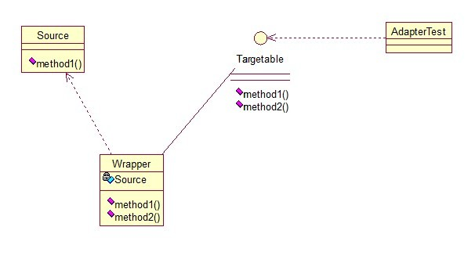

## 介绍

**适配器模式(Adapter Pattern) **：将一个接口转换成客户希望的另一个接口，适配器模式使接口不兼容的那些类可以一起工作，其别名为包装器(Wrapper)。适配器模式既可以作为类结构型模式，也可以作为对象结构型模式。

适配器模式将某个类的接口转换成客户端期望的另一个接口表示，目的是消除由于接口不匹配所造成的类的兼容性问题。

主要分为三类：

- 类的适配器模式
- 对象的适配器模式
- 接口的适配器模式

<!-- more -->

**类适配器模式**

核心思想是：有一个Source类，拥有一个方法，待适配，目标接口时Targetable，通过Adapter类，将Source的功能扩展到Targetable里。

类图：

Source类：

~~~java
public class Source {  
    public void method1() {  
        System.out.println("this is original method!");  
    }  
}  
~~~

Targetable接口：

~~~java
public interface Targetable {  
    /* 与原类中的方法相同 */  
    public void method1();  
  
    /* 新类的方法 */  
    public void method2();  
}  
~~~

Adapter类：

~~~java
public class Adapter extends Source implements Targetable {  
    @Override  
    public void method2() {  
        System.out.println("this is the targetable method!");  
    }  
}  
~~~

测试类：

~~~java
public class AdapterTest {  
    public static void main(String[] args) {  
        Targetable target = new Adapter();  
        target.method1();  
        target.method2();  
    }  
}  
//输出：
//this is original method!
//this is the targetable method!
~~~

这样Targetable接口的实现类就具有了Source类的功能。

优点：

- 由于适配器类是适配者类的子类，因此可以在适配器类中置换一些适配者的方法，使得适配器的灵活性更强。

缺点：

- 适配器模式是补救措施，所以在系统设计过程中请忘掉这个设计模式，这个模式只是在你无可奈何时的补救方式

**对象适配器模式**

基本思路和类的适配器模式相同，只是将Adapter类作修改，这次不继承Source类，而是持有Source类的实例，以达到解决兼容性的问题。

类图：

只需要修改Adapter类的源码即可：

~~~java
public class Wrapper implements Targetable {  
    private Source source;  
      
    public Wrapper(Source source){  
        super();  
        this.source = source;  
    } 
  
    @Override  
    public void method2() {  
        System.out.println("this is the targetable method!");  
    }  
  
    @Override  
    public void method1() {  
        source.method1();  
    }  
}  
~~~

测试类：

~~~java
public class AdapterTest {  
    public static void main(String[] args) {  
        Source source = new Source();  
        Targetable target = new Wrapper(source);  
        target.method1();  
        target.method2();  
    }  
}  
~~~

优点：

- 一个对象适配器可以把多个不同的适配者适配到同一个目标，也就是说，同一个适配器可以把适配者类和它的子类都适配到目标接口。

缺点：

- 与类适配器模式相比，要想置换适配者类的方法就不容易。如果一定要置换掉适配者类的一个或多个方法，就只好先做一个适配者类的子类，将适配者类的方法置换掉，然后再把适配者类的子类当做真正的适配者进行适配，实现过程较为复杂。

**接口适配器模式**

接口的适配器是这样的：有时我们写的一个接口中有多个抽象方法，当我们写该接口的实现类时，必须实现该接口的所有方法，这明显有时比较浪费，因为并不是所有的方法都是我们需要的，有时只需要某一些，此处为了解决这个问题，我们引入了接口的适配器模式，借助于一个抽象类，该抽象类实现了该接口，实现了所有的方法，而我们不和原始的接口打交道，只和该抽象类取得联系，所以我们写一个类，继承该抽象类，重写我们需要的方法就行。

类图：

Sourceable接口：

~~~java
public interface Sourceable {   
    public void method1();  
    public void method2();  
}  
~~~

Wrapper2抽象类：

~~~java
public abstract class Wrapper2 implements Sourceable{   
    public void method1(){}  
    public void method2(){}  
}  
~~~

SourceSub1 类：

~~~java
public class SourceSub1 extends Wrapper2 {  
    public void method1(){  
        System.out.println("the sourceable interface's first Sub1!");  
    }  
}  
~~~

SourceSub2 类：

~~~java
public class SourceSub2 extends Wrapper2 {  
    public void method2(){  
        System.out.println("the sourceable interface's second Sub2!");  
    }  
}  
~~~

测试类：

~~~java
public class WrapperTest {  
    public static void main(String[] args) {  
        Sourceable source1 = new SourceSub1();  
        Sourceable source2 = new SourceSub2();  
          
        source1.method1();  //the sourceable interface's first Sub1!
        source1.method2();  
        source2.method1();  
        source2.method2();  //the sourceable interface's second Sub2!
    }  
}  
~~~

总结一下三种适配器模式的应用场景：

- 类的适配器模式：当希望将**一个类**转换成满足**另一个新接口**的类时，可以使用类的适配器模式，创建一个新类，继承原有的类，实现新的接口即可。
- 对象的适配器模式：当希望将一个对象转换成满足另一个新接口的对象时，可以创建一个Wrapper类，持有原类的一个实例，在Wrapper类的方法中，调用实例的方法就行。
- 接口的适配器模式：当不希望实现一个接口中所有的方法时，可以创建一个抽象类Wrapper，实现所有方法，我们写别的类的时候，继承抽象类即可。

## 扩展

 ### 1. 模式动机

- 在适配器模式中可以定义一个包装类，包装不兼容接口的对象，这个包装类指的就是适配器(Adapter)，它所包装的对象就是适配者(Adaptee)，即被适配的类。
- 适配器提供客户类需要的接口，适配器的实现就是把客户类的请求转化为对适配者的相应接口的调用。也就是说：当客户类调用适配器的方法时，在适配器类的内部将调用适配者类的方法，而这个过程对客户类是透明的，客户类并不直接访问适配者类。因此，适配器可以使由于接口不兼容而不能交互的类可以一起工作。这就是适配器模式的模式动机。

### 2. 模式结构

- Target：目标抽象类或接口
- Adapter：适配器类（用来实现接口或继承Source源类）
- Adaptee：适配者类（Source源类）
- Client：客户类（测试类）

### 3. 模式应用

- ~~~java
  Arrays.asList(T a);
  ~~~

- 抽象类实现接口，选择性实现接口的方法。

