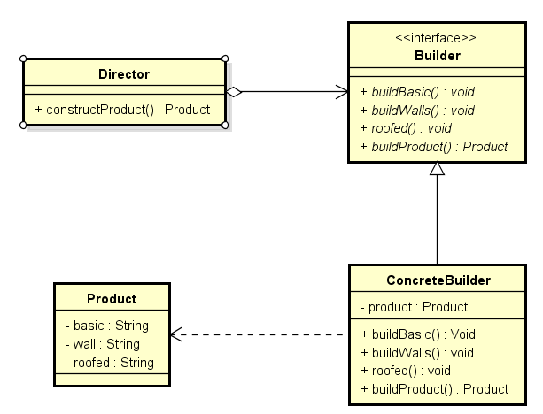

## 介绍

**工厂类模式**提供的是创建单个类的模式，而**建造者模式**则是将各种产品集中起来进行管理，用来创建复合对象，所谓复合对象就是指某个类具有不同的属性，其实建造者模式就是前面抽象工厂模式和最后的Test结合起来得到的。

还和前面一样，一个Sender接口，两个实现类MailSender和SmsSender。

建造者类:

~~~java
public class Builder {   
    private List<Sender> list = new ArrayList<Sender>();    
    public void produceMailSender(int count){  
        for(int i=0; i<count; i++){  
            list.add(new MailSender());  
        }  
    }  
      
    public void produceSmsSender(int count){  
        for(int i=0; i<count; i++){  
            list.add(new SmsSender());  
        }  
    }  
}  
~~~

<!--more -->

测试类：

~~~java
public class Test {  
    public static void main(String[] args) {  
        Builder builder = new Builder();  
        builder.produceMailSender(10);  
    }  
}  
~~~

从这点看出，建造者模式将很多功能集成到一个类里，这个类可以创造出比较复杂的东西。所以与工程模式的区别就是：工厂模式关注的是创建单个产品，而建造者模式则关注创建符合对象，多个部分。因此，是选择工厂模式还是建造者模式，依实际情况而定。

## 扩展

### 1. 使用场景

无论是在现实世界中还是在软件系统中，都存在一些复杂的对象，它们拥有多个组成部分，如汽车，它包括车轮、方向盘、发送机等各种部件。而对于大多数用户而言，无须知道这些部件的装配细节，也几乎不会使用单独某个部件，而是使用一辆完整的汽车，可以通过建造者模式对其进行设计与描述，建造者模式可以将部件和其组装过程分开，一步一步创建一个复杂的对象。用户只需要指定复杂对象的类型就可以得到该对象，而无须知道其内部的具体构造细节。

**意图：**将一个复杂对象的构建与其表示相分离，使得同样的构建过程可以创建不同的表示。

### 2. 模式定义

- 建造者模式(Builder Pattern)：将一个复杂对象的构建与它的表示分离，使得同样的构建过程可以创建不同的表示
- 建造者模式是一步一步创建一个复杂的对象，它允许用户只通过指定复杂对象的类型和内容就可以构建它们，用户不需要知道内部的具体构建细节。建造者模式属于对象创建型模式。建造者模式又可以称为生成器模式。

### 3. 模式结构

- 建造者模式包含如下角色：
  - Builder：抽象建造者

    > 给出一个抽象接口，以规范产品对象的各个组成成分的建造。这个接口规定要实现复杂对象的哪些部分的创建，并不涉及具体的对象部件的创建。

  - ConcreteBuilder：具体建造者

    > 实现Builder接口，针对不同的商业逻辑，具体化复杂对象的各部分的创建。 在建造过程完成后，提供产品的实例。

  - Director：指挥者

    > 调用具体建造者来创建复杂对象的各个部分，在指导者中不涉及具体产品的信息，只负责保证对象各部分完整创建或按某种顺序创建。

  - Product：产品角色

    > 要创建的复杂对象。

### 4. 模式代码示例

具体的产品Product：

~~~java
public class Product {
    private String basic;//地基
    
    private String wall;//墙
    
    private String roofed;//楼顶

    public String getBasic() {
        return basic;
    }

    public void setBasic(String basic) {
        this.basic = basic;
    }

    public String getWall() {
        return wall;
    }

    public void setWall(String wall) {
        this.wall = wall;
    }

    public String getRoofed() {
        return roofed;
    }

    public void setRoofed(String roofed) {
        this.roofed = roofed;
    }
    
}
~~~

抽象建造者类：

~~~java
public interface Builder {

    /**
     * 打基础
     */
    public void  buildBasic();
    
    /**
     * 砌墙
     */
    public void  buildWalls();
    
    /**
     * 封顶
     */
    public void  roofed();
    
    /**
     * 造房子
     * @return
     */
    public Product buildProduct();
}
~~~

指挥者类：

~~~java
public class Director {
    
    public Product constructProduct(ConcreteBuilder concreteBuilder){
        concreteBuilder.buildBasic();
        concreteBuilder.buildWalls();
        concreteBuilder.roofed();
        return concreteBuilder.buildProduct();
    }
}
~~~

具体建造者类：

~~~java
public class ConcreteBuilder implements Builder{  
    private Product product;
    
    public ConcreteBuilder(){
        product=new Product();
    }
    
    @Override
    public void buildBasic() {
        product.setBasic("打好基础");
    }

    @Override
    public void buildWalls() {
        product.setWall("砌墙");
    }

    @Override
    public void roofed() {
        product.setRoofed("封顶大吉");
    }
  
    @Override
    public Product buildProduct() {
        return product;
    }
}
~~~

测试类：

~~~java
public class Test{
    public static void main(String[] args){
        Builder builder = new ConcreteBuilder();
  		Director director = new Director(builder);
        Product product = director.constructProduct();
    }
}
~~~

### 5. 模式应用

#### 1. StringBuffer

### 6. 适用范围

1. 需要生成的产品对象有复杂的内部结构。
2. 需要生成的产品对象的属性相互依赖，建造者模式可以强迫生成顺序。
3. 在对象创建过程中会使用到系统中的一些其他对象，这些对象在产品对象的创建过程中不易得到。

### 7. 效果

1. 建造者模式的使用时的产品的内部表象可以独立的变化。使用建造者模式可以使客户端不必知道产品内部组成的细节。
2. 每一个Builder都相对独立，而与其他的Builder无关。
3. 模式所建造的最终产品易于控制。

## 模式优缺点

### 1. 优点

- 在建造者模式中，客户端不必知道产品内部组成的细节，将产品本身与产品的创建过程解耦，使得相同的创建过程可以创建不同的产品对象。
- 可以更加精细地控制产品的创建过程。将复杂产品的创建步骤分解在不同的方法中，使得创建过程更加清晰，也更方便使用程序来控制创建过程。

### 2. 缺点

- 建造者模式所创建的产品一般具有较多的共同点，其组成部分相似，如果产品之间的差异性很大，则不适合使用建造者模式，因此其使用范围受到一定的限制。
- 如果产品的内部变化复杂，可能会导致需要定义很多具体建造者类来实现这种变化，导致系统变得很庞大

## 与抽象工厂模式比较

- 与抽象工厂模式相比，建造者模式返回一个组装好的完整产品，而抽象工厂模式返回一系列相关的产品，这些产品位于不同的产品等级结构，构成了一个产品族。
- 在抽象工厂模式中，客户端实例化工厂类，然后调用工厂方法获取所需产品对象，而在建造者模式中，客户端可以不直接调用建造者的相关方法，而是通过指挥者类来指导如何生成对象，包括对象的组装过程和建造步骤，它侧重于一步步构造一个复杂对象，返回一个完整的对象。
- 如果将抽象工厂模式看成汽车配件生产工厂，生产一个产品族的产品，那么建造者模式就是一个汽车组装工厂，通过对部件的组装可以返回一辆完整的汽车。  

## 举例

下面我们来看一下经典创建者模式的一个实现形式，这里以上面讲述的服装的过程作为例子来说明下创建者模式的原理和思想

具体产品类：

~~~java
public class Product {
	ArrayList<String> parts = new ArrayList<String>();
	public void add(String part){
		parts.add(part);
	}
  
	public void show(){
		System.out.println("产品创建------------");
		for(String part : parts){
			System.out.println(part);
		}
	}
}
~~~

抽象建造者类：

~~~java
public abstract class Builder {
	public abstract void BuildPartA();
	public abstract void BuildPartB();
	public abstract Product getResult();
}
~~~

具体建造者类：

~~~java
//具体建造者类1
public class ConcreteBuilder1 extends Builder{
	private Product product = new Product();
	@Override
	public void BuildPartA() {
		product.add("部件A");
	}
  
	@Override
	public void BuildPartB() {
		product.add("部件B");
	}

	@Override
	public Product getResult() {
		return product;
	}
}

//具体建造者类2
public class ConcreteBuilder2 extends Builder{
	private Product product = new Product();
	@Override
	public void BuildPartA() {
		product.add("部件x");
	}

	@Override
	public void BuildPartB() {
		product.add("部件y");
	}

	@Override
	public Product getResult() {
		return product;
	}
}
~~~

指挥者类：

~~~java
public class Director {
	public void Construct(Builder builder){
		builder.BuildPartA();
		builder.BuildPartB();
	}
}
~~~

测试类：

~~~java
public class TestBuilder {
	public static void main(String[] args) {
		Director director = new Director();
		Builder b1 = new ConcreteBuilder1();
		Builder b2 = new ConcreteBuilder2();
		director.Construct(b1);
		Product p1 = b1.getResult();
		p1.show();
		director.Construct(b2);
		Product p2 = b2.getResult();
		p2.show();
	}
}

~~~

上面的代码给出了经典创建者模式的核心代码形式，那么针对上面无疑有以下的几个缺点：

1. IBuilder接口必须定义完整的组装流程，一旦定义就不能随意的动态修改。
2. Builder与具体的对象之间有一定的依赖关系，当然这里可以通过接口来解耦来实现灵活性。
3. Builder必须知道具体的流程。

针对上面的几个问题，通过配置文件或者其他的形式来提供灵活性。