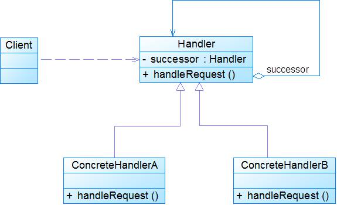

## 介绍

职责链模式(Chain of Responsibility Pattern)：避免请求发送者与接收者耦合在一起，让多个对象都有可能接收请求，将这些对象连接成一条链，并且沿着这条链传递请求，直到有对象处理它为止。它是一种对象行为型模式。

责任链模式，有多个对象，每个对象持有对下一个对象的引用，这样就会形成一条链，请求在这条链上传递，直到某一对象决定处理该请求。但是发出者并不清楚到底最终那个对象会处理该请求，所以，责任链模式可以实现，在隐瞒客户端的情况下，对系统进行动态的调整。

关系图：

Abstracthandler类提供了get和set方法，方便MyHandle类设置和修改引用对象，MyHandle类是核心，实例化后生成一系列相互持有的对象，构成一条链。

<!-- more -->

接口：

~~~java
public interface Handler {  
    public void operator();  
}  
~~~

抽象类：

~~~java
public abstract class AbstractHandler {    
    private Handler handler;  
  
    public Handler getHandler() {  
        return handler;  
    }  
  
    public void setHandler(Handler handler) {  
        this.handler = handler;  
    }      
}  
~~~

实现类：

~~~java
public class MyHandler extends AbstractHandler implements Handler {  
    private String name;  
 
    public MyHandler(String name) {  
        this.name = name;  
    }  
  
    @Override  
    public void operator() {  
        System.out.println(name+"deal!");  
        if(getHandler()!=null){  
            getHandler().operator();  
        }  
    }  
}  
~~~

测试类：

~~~java
public class Test {  
    public static void main(String[] args) {  
        MyHandler h1 = new MyHandler("h1");  
        MyHandler h2 = new MyHandler("h2");  
        MyHandler h3 = new MyHandler("h3");  
  
        h1.setHandler(h2);  
        h2.setHandler(h3);  
  
        h1.operator();  
    }  
}  
//输出：
/*
h1deal!
h2deal!
h3deal!
*/
~~~

此处强调一点就是，链接上的请求可以是一条链，可以是一个树，还可以是一个环，模式本身不约束这个，同时，在一个时刻，命令只允许由一个对象传给另一个对象，而不允许传给多个对象。

## 扩展

### 1. 模式动机

- 职责链可以是一条直线、一个环或者一个树形结构，最常见的职责链是直线型，即沿着一条单向的链来传递请求。
- 链上的每一个对象都是请求处理者，职责链模式可以将请求的处理者组织成一条链，并使请求沿着链传递，由链上的处理者对请求进行相应的处理，客户端无须关心请求的处理细节以及请求的传递，只需将请求发送到链上即可，将请求的发送者和请求的处理者解耦。

### 2. 模式结构

职责链模式包含如下角色：

- Handler: 抽象处理者
- ConcreteHandler: 具体处理者
- Client: 客户类

### 3. 模式分析

- 在职责链模式里，很多对象由每一个对象对其下家的引用而连接起来形成一条链。
- 请求在这条链上传递，直到链上的某一个对象处理此请求为止。
- 发出这个请求的客户端并不知道链上的哪一个对象最终处理这个请求，这使得系统可以在不影响客户端的情况下动态地重新组织链和分配责任。

典型的抽象处理者代码：

~~~java
public abstract class Handler{
	protected Handler successor;
	
	public void setSuccessor(Handler successor){
		this.successor=successor;
	}
	
	public abstract void handleRequest(String request);
}
~~~

具体处理者代码：

~~~java
public class ConcreteHandler extends Handler{
	public void handleRequest(String request){
		if(请求request满足条件){
			......  //处理请求；
		}else{
			this.successor.handleRequest(request); //转发请求
		}
	}
} 
~~~

### 4. 适用场景

- 有多个对象可以处理同一个请求，具体哪个对象处理该请求由运行时刻自动确定。
- 在不明确指定接收者的情况下，向多个对象中的一个提交一个请求。
- 可动态指定一组对象处理请求。

### 5. 模式应用

1. Java中的异常处理机制。
2. JavaScript事件浮升机制。

### 6. 模式扩展

纯与不纯的职责链模式：

- 一个纯的职责链模式要求一个具体处理者对象只能在两个行为中选择一个：一个是承担责任，另一个是把责任推给下家。不允许出现某一个具体处理者对象在承担了一部分责任后又将责任向下传的情况。
- 在一个纯的职责链模式里面，一个请求必须被某一个处理者对象所接收；在一个不纯的职责链模式里面，一个请求可以最终不被任何接收端对象所接收。

### 7. 模式优缺点

1. 优点

   - 降低耦合度。
   - 可简化对象的相互连接。
   - 增强给对象指派职责的灵活性。
   - 增加新的请求处理类很方便

2. 缺点

   - 不能保证请求一定被接收。
   - 系统性能将受到一定影响，而且在进行代码调试时不太方便；可能会造成循环调用。

   ​

