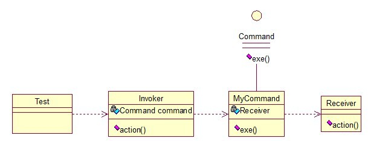

## 介绍

**命令模式(Command Pattern)：**将一个请求封装为一个对象，从而使我们可用不同的请求对客户进行参数化；对请求排队或者记录请求日志，以及支持可撤销的操作。命令模式是一种对象行为型模式，其别名为动作(Action)模式或事务(Transaction)模式。

命令模式很好理解，举个例子，司令员下令让士兵去干件事情，从整个事情的角度来考虑，司令员的作用是，发出口令，口令经过传递，传到了士兵耳朵里，士兵去执行。这个过程好在，三者相互解耦，任何一方都不用去依赖其他人，只需要做好自己的事儿就行，司令员要的是结果，不会去关注到底士兵是怎么实现的。

关系图：

<!--more -->

Invoker是调用者（司令员），Receiver是被调用者（士兵），MyCommand是命令，实现了Command接口，持有接收对象。

接口：

~~~java
public interface Command {  
    public void exe();  
}  
~~~

实现类：

~~~java
public class MyCommand implements Command {   
    private Receiver receiver;  
      
    public MyCommand(Receiver receiver) {  
        this.receiver = receiver;  
    }  
  
    @Override  
    public void exe() {  
        receiver.action();  
    }  
}  
~~~

调用者：

~~~java
public class Invoker {    
    private Command command;  
      
    public Invoker(Command command) {  
        this.command = command;  
    }  
  
    public void action(){  
        command.exe();  
    }  
}  
~~~

被调用者：

~~~java
public class Receiver {  
    public void action(){  
        System.out.println("command received!");  
    }  
}  
~~~

测试类：

~~~java
public class Test {  
    public static void main(String[] args) {  
        Receiver receiver = new Receiver();  
        Command cmd = new MyCommand(receiver);  
        Invoker invoker = new Invoker(cmd);  
        invoker.action();  
    }  
}  
//输出：command received!
~~~

命令模式的目的就是达到命令的发出者和执行者之间解耦，实现请求和执行分开，熟悉Struts的同学应该知道，Struts其实就是一种将请求和呈现分离的技术，其中必然涉及命令模式的思想！

## 扩展

### 1. 模式动机

- 在软件设计中，我们经常需要向某些对象发送请求，但是并不知道请求的接收者是谁，也不知道被请求的操作是哪个，我们只需在程序运行时指定具体的请求接收者即可，此时，可以使用命令模式来进行设计，使得请求发送者与请求接收者消除彼此之间的耦合，让对象之间的调用关系更加灵活。
- 命令模式可以对发送者和接收者完全解耦，发送者与接收者之间没有直接引用关系，发送请求的对象只需要知道如何发送请求，而不必知道如何完成请求。

### 2. 模式结构

命令模式包含如下角色：

- Command: 抽象命令类

  > 声明执行操作的接口。有java接口或者抽象类来实现。

- Concrete Command: 具体命令类

  > 将一个接收者对象绑定于一个动作；调用接收者相应的操作，以实现命令角色声明的执行操作的接口。

- Invoker: 调用者

  > 调用命令对象执行这个请求。

- Receiver: 接收者

  > 知道如何实施与执行一个请求相关的操作。任何类都可能作为一个接收者。

- Client:客户类

  > 创建一个具体命令对象（并可以设定它的接收者）。

### 3. 模式分析

- 命令模式的本质是对命令进行封装，将发出命令的责任和执行命令的责任分割开。
- 命令模式使请求本身成为一个对象，这个对象和其他对象一样可以被存储和传递。
- 命令模式的关键在于引入了抽象命令接口，且发送者针对抽象命令接口编程，只有实现了抽象命令接口的具体命令才能与接收者相关联。

典型的抽象命令类代码：

~~~java
public abstract class Command {
	public abstract void execute();
} 
~~~

典型调用者类代码：

~~~java
public class Invoker {
	private Command command;
	
	public Invoker(Command command) {
		this.command=command;
	}
	
	public void setCommand(Command command) {
		this.command=command;
	}
	
	//业务方法，用于调用命令类的方法
	public void call() {
		command.execute();
	}
} 
~~~

典型的具体命令类代码：

~~~java
public class ConcreteCommand extends Command {
	private Receiver receiver;
	public void execute() {
		receiver.action();
	}
} 
~~~

典型的请求接收者代码：

~~~java
public class Receiver {
	public void action() {
		//具体操作
	}
} 
~~~

### 4. 适用场景

- 系统需要将请求调用者和请求接收者解耦，使得调用者和接收者不直接交互。
- 系统需要在不同的时间指定请求、将请求排队和执行请求。
- 系统需要支持命令的撤销(Undo)操作和恢复(Redo)操作。
- 系统需要将一组操作组合在一起，即支持宏命令。

### 5. 模式应用

1. Java语言使用命令模式实现AWT/Swing GUI的委派事件模型 (Delegation Event Model, DEM)。

   > 在AWT/Swing中，Frame、Button等界面组件是请求发送者，而AWT提供的事件监听器接口和事件适配器类是抽象命令接口，用户可以自己写抽象命令接口的子类来实现事件处理，即实现具体命令类，而在具体命令类中可以调用业务处理方法来实现该事件的处理。对于界面组件而言，只需要了解命令接口即可，无须关心接口的实现，组件类并不关心实际操作，而操作由用户来实现。

2. 很多系统都提供了宏命令功能，如UNIX平台下的Shell编程，可以将多条命令封装在一个命令对象中，只需要一条简单的命令即可执行一个命令序列。

### 6. 模式扩展

1. 撤销操作

   - 结构图

     

   - 实现

     ~~~java
     abstract class AbstractCommand {
     	public abstract int execute(int value);
     	public abstract int undo();
     }

     class ConcreteCommand extends AbstractCommand {
     	private Adder adder = new Adder();
     	private int value;
     		
     	public int execute(int value) {
     		this.value=value;
     		return adder.add(value);
     	}
     	
     	public int undo() {
     		return adder.add(-value);
     	}
     }

     class CalculatorForm {
     	private AbstractCommand command;
     	
     	public void setCommand(AbstractCommand command) {
     		this.command=command;
     	}
     	
     	public void compute(int value) {
     		int i = command.execute(value);
     		System.out.println("执行运算，运算结果为：" + i);
     	}
     	
     	public void undo() {
     		int i = command.undo();
     		System.out.println("执行撤销，运算结果为：" + i);
     	}
     }

     class Adder {
     	private int num=0;
     	
     	public int add(int value) {
     		num+=value;
     		return num;
     	}
     }

     class Client {
     	public static void main(String args[]) {
     		CalculatorForm form = new CalculatorForm();
     		ConcreteCommand command = new ConcreteCommand();
     		form.setCommand(command);
     		
     		form.compute(10);
     		form.compute(5);
     		form.compute(10);
     		form.undo();
     	}
     }
     ~~~

2. 宏命令又称为组合命令，它是命令模式和组合模式联用的产物。宏命令也是一个具体命令，不过它包含了对其他命令对象的引用，在调用宏命令的execute()方法时，将递归调用它所包含的每个成员命令的execute()方法，一个宏命令的成员对象可以是简单命令，还可以继续是宏命令。执行一个宏命令将执行多个具体命令，从而实现对命令的批处理。

### 7. 模式优缺点

1. 优点
   - 降低系统的耦合度。
   - 新的命令可以很容易地加入到系统中。
   - 可以比较容易地设计一个命令队列和宏命令（组合命令）。
   - 可以方便地实现对请求的Undo和Redo。
2. 缺点
   - 使用命令模式可能会导致某些系统有过多的具体命令类。因为针对每一个命令都需要设计一个具体命令类，因此某些系统可能需要大量具体命令类，这将影响命令模式的使用。

