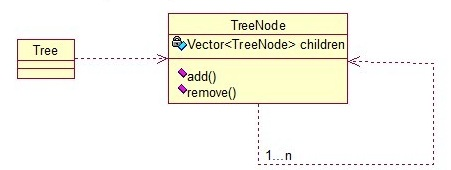
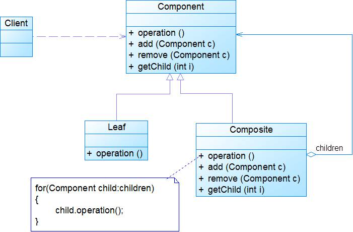
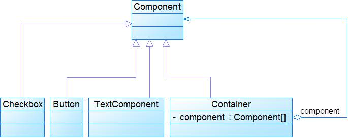
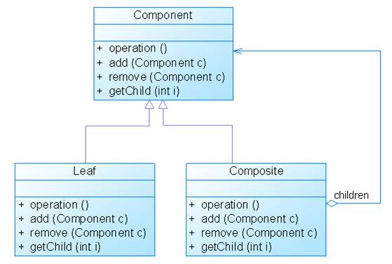
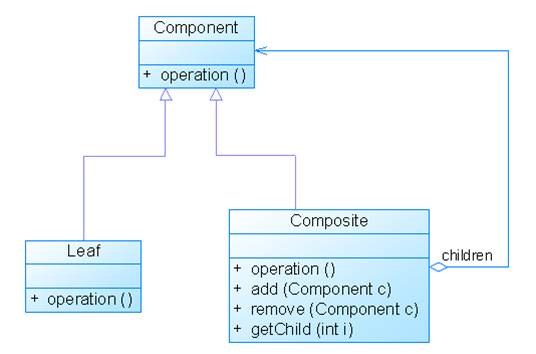

## 介绍

**组合模式(Composite Pattern)：**组合多个对象形成树形结构以表示**整体-部分**的结构层次。组合模式对单个对象（即叶子对象）和组合对象（即容器对象）的使用具有一致性。使用场景：将多个对象组合在一起进行操作，常用于表示树形结构中，例如二叉树，数等。

关系图：

<!-- more -->

示例代码：

~~~java
public class TreeNode {  
      
    private String name;  
    private TreeNode parent;  
    private Vector<TreeNode> children = new Vector<TreeNode>();  
      
    public TreeNode(String name){  
        this.name = name;  
    }  
  
    public String getName() {  
        return name;  
    }  
  
    public void setName(String name) {  
        this.name = name;  
    }  
  
    public TreeNode getParent() {  
        return parent;  
    }  
  
    public void setParent(TreeNode parent) {  
        this.parent = parent;  
    }  
      
    //添加孩子节点  
    public void add(TreeNode node){  
        children.add(node);  
    }  
      
    //删除孩子节点  
    public void remove(TreeNode node){  
        children.remove(node);  
    }  
      
    //取得孩子节点  
    public Enumeration<TreeNode> getChildren(){  
        return children.elements();  
    }  
}  
~~~

测试代码：

~~~java
public class Tree {   
    TreeNode root = null;  
    public Tree(String name) {  
        root = new TreeNode(name);  
    }  
  
    public static void main(String[] args) {  
        Tree tree = new Tree("A");  
        TreeNode nodeB = new TreeNode("B");  
        TreeNode nodeC = new TreeNode("C");  
          
        nodeB.add(nodeC);  
        tree.root.add(nodeB);  
        System.out.println("build the tree finished!");  
    }  
}  
~~~

## 扩展

### 1. 模式动机 

- 对于树形结构，当容器对象（如文件夹）的某一个方法被调用时，将遍历整个树形结构，寻找也包含这个方法的成员对象（可以是容器对象，也可以是叶子对象，如子文件夹和文件）并调用执行（递归调用）。
- 组合模式描述了如何将容器对象和叶子对象进行递归组合，使得用户在使用时无须对它们进行区分，可以一致地对待容器对象和叶子对象。

### 2. 模式结构 

组合模式包含如下角色：

- Component: 抽象构件
- Leaf: 叶子构件
- Composite: 容器构件
- Client: 客户类

### 3. 模式分析

- 组合模式的关键是定义了一个抽象构件类，它既可以代表叶子，又可以代表容器，而客户端针对该抽象构件类进行编程，无须知道它到底表示的是叶子还是容器，可以对其进行统一处理。
- 同时容器对象与抽象构件类之间还建立一个聚合关联关系，在容器对象中既可以包含叶子，也可以包含容器，以此实现递归组合，形成一个树形结构。

抽象构件代码示例：

~~~java
public abstract class Component{
	public abstract void add(Component c);
	public abstract void remove(Component c);
	public abstract Component getChild(int i);
	public abstract void operation(); 
} 
~~~

叶子构件代码示例：

~~~java
public class Leaf extends Component{
	public void add(Component c){ //异常处理或错误提示 }	
		
	public void remove(Component c){ //异常处理或错误提示 }
	
	public Component getChild(int i){ //异常处理或错误提示 }
	
	public void operation(){
		//实现代码
	} 
} 
~~~

容器构件示例代码：

~~~java
public class Composite extends Component{
	private ArrayList list = new ArrayList();
	
	public void add(Component c){
		list.add(c);
	}
	
	public void remove(Component c){
		list.remove(c);
	}
	
	public Component getChild(int i){
		(Component)list.get(i);
	}
	
	public void operation(){
		for(Object obj:list){
			((Component)obj).operation();
		}
	} 	
} 
~~~

### 4. 使用场景

- 需要表示一个对象整体或部分层次，在具有整体和部分的层次结构中，希望通过一种方式忽略整体与部分的差异，可以一致地对待它们。
- 让客户能够忽略不同对象层次的变化，客户端可以针对抽象构件编程，无须关心对象层次结构的细节。
- 对象的结构是动态的并且复杂程度不一样，但客户需要一致地处理它们

### 5. 模式应用

- XML文档解析

- 操作系统中的目录结构是一个树形结构，因此在对文件和文件夹进行操作时可以应用组合模式，例如杀毒软件在查毒或杀毒时，既可以针对一个具体文件，也可以针对一个目录。如果是对目录查毒或杀毒，将递归处理目录中的每一个子目录和文件。

- JDK的AWT/Swing是组合模式在Java类库中的一个典型实际应用

  

### 6. 模式扩展

- 透明组合模式

  

- 安全组合模式

  

### 7. 模式优缺点

1. 优点
   - 可以清楚地定义分层次的复杂对象，表示对象的全部或部分层次，使得增加新构件也更容易。
   - 客户端调用简单，客户端可以一致的使用组合结构或其中单个对象。
   - 定义了包含叶子对象和容器对象的类层次结构，叶子对象可以被组合成更复杂的容器对象，而这个容器对象又可以被组合，这样不断递归下去，可以形成复杂的树形结构。
   - 更容易在组合体内加入对象构件，客户端不必因为加入了新的对象构件而更改原有代码。
2. 缺点
   - 使设计变得更加抽象，对象的业务规则如果很复杂，则实现组合模式具有很大挑战性，而且不是所有的方法都与叶子对象子类都有关联。
   - 增加新构件时可能会产生一些问题，很难对容器中的构件类型进行限制。