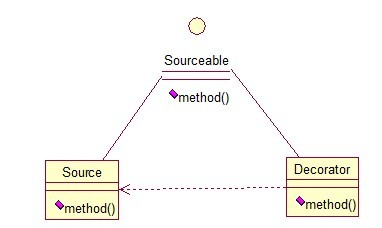

## 介绍

**装饰模式**就是给一个对象增加一些新的功能，而且是动态的，要求装饰对象和被装饰对象实现同一个接口，装饰对象持有被装饰对象的实例。

关系图：

Source类是被装饰类，Decorator类是一个装饰类，可以为Source类动态的添加一些功能。

<!--more -->

接口：

~~~java
public interface Sourceable {  
    public void method();  
}  
~~~

被装饰类：

~~~java
public class Source implements Sourceable { 
    @Override  
    public void method() {  
        System.out.println("the original method!");  
    }  
}  
~~~

装饰类：

~~~java
public class Decorator implements Sourceable {  
    private Sourceable source;  
    public Decorator(Sourceable source){  
        super();  
        this.source = source;  
    }  
  
    @Override  
    public void method() {  
        System.out.println("before decorator!");  
        source.method();  
        System.out.println("after decorator!");  
    }  
}  
~~~

测试类：

~~~java
public class DecoratorTest {  
    public static void main(String[] args) {  
        Sourceable source = new Source();  
        Sourceable obj = new Decorator(source);  
        obj.method();  
    }  
}  
//输出：
//before decorator!
//the original method!
//after decorator!
~~~

在不改变被装饰类的前提下，通过装饰类装饰被装饰类的每个方法，实现功能增强。

装饰模式应用场景：

- 需要扩展一个类的功能。
- 动态的为一个对象增加功能，而且还能动态撤销。（继承不能做到这一点，继承的功能是静态的，不能动态增删。）

缺点：

- 产生过多相似的对象，不易排错。

适配器模式和装饰模式的区别：

- 适配器模式的旧类**没有实现目标接口**，为了重用旧类的代码，将旧类或者旧类的对象包裹在适配器中，调用的依旧是旧类的代码。
- 装饰器模式的旧类本身**已经实现了目标接口**，只是为了动态拓展类的功能，（如在调用方法的前后输出日志等），用装饰器类包裹旧类，调用旧类的代码。