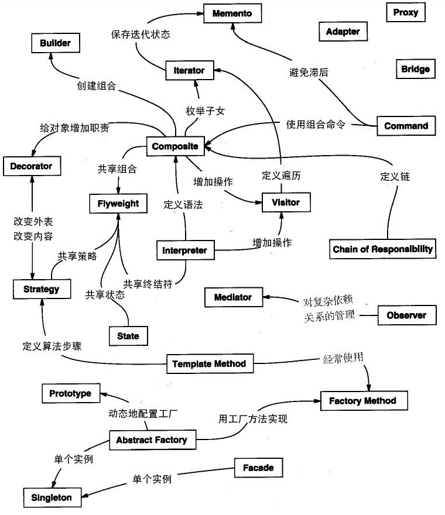

## 设计模式

原文：[Java之美[从菜鸟到高手演变]之设计模式](http://blog.csdn.net/zhangerqing/article/details/8194653)

参考：[Java开发中的23种设计模式详解](http://www.cnblogs.com/maowang1991/archive/2013/04/15/3023236.html)

设计模式（Design pattern）是一套被反复使用、多数人知晓的、经过分类编目的、代码设计经验的总结。使用设计模式是为了可重用代码、让代码更容易被他人理解、保证代码可靠性。设计模式间关系：

<!--more -->

### 一、设计模式分类

#### 1. 创建型模式

**创建型模式(Creational Pattern)**对类的实例化过程进行了抽象，能够将软件模块中对象的创建和对象的使用分离。为了使软件的结构更加清晰，外界对于这些对象只需要知道它们共同的接口，而不清楚其具体的实现细节，使整个系统的设计更加符合单一职责原则

创建型模式主要用于创建对象。共五种：工厂方法模式、抽象工厂模式、单例模式、建造者模式、原型模式。其中**工厂方法模式**称为类模式，其它称为对象模式

#### 2. 结构型模式

**结构型模式(Structural Pattern)**描述如何将类或者对象结合在一起形成更大的结构，就像搭积木，可以通过简单积木的组合形成复杂的、功能更为强大的结构

结构型模式主要用于处理类或对象的组合。共七种：适配器模式、装饰器模式、代理模式、外观模式、桥接模式、组合模式、享元模式。其中**（类）适配器模式**称为类模式，其它称为对象模式

#### 3. 行为型模式

行为型模式分为类行为型模式和对象行为型模式两种:

- 类行为型模式：类的行为型模式使用继承关系在几个类之间分配行为，类行为型模式主要通过多态等方式来分配父类与子类的职责。
- 对象行为型模式：对象的行为型模式则使用对象的聚合关联关系来分配行为，对象行为型模式主要是通过对象关联等方式来分配两个或多个类的职责。根据“合成复用原则”，系统中要尽量使用关联关系来取代继承关系，因此大部分行为型设计模式都属于对象行为型设计模式。

**行为型模式(behavioral pattern)**主要用于描述对类或对象怎样交互和怎样分配职责。共十一种：策略模式、模板方法模式、观察者模式、迭代子模式、责任链模式、命令模式、备忘录模式、状态模式、访问者模式、中介者模式、解释器模式

其中**解释器模式** 和**模板方法模式**称为类模式，其它称为对象模式

其实还有两类：**并发型模式**和**线程池模式**

### 二、设计模式六大原则

#### 1. 开闭原则（Open Close Principle）

开闭原则就是说**对扩展开放，对修改关闭**。在程序需要进行拓展的时候，不能去修改原有的代码，实现一个热插拔的效果。所以一句话概括就是：为了使程序的扩展性好，易于维护和升级。想要达到这样的效果，我们需要使用接口和抽象类

#### 2. 里氏代换原则（Liskov Substitution Principle） 

里氏代换原则面向对象设计的基本原则之一。 里氏代换原则中说，任何基类可以出现的地方，子类一定可以出现。 LSP是继承复用的基石，只有当衍生类可以替换掉基类，软件单位的功能不受到影响时，基类才能真正被复用，而衍生类也能够在基类的基础上增加新的行为。

**定义1：如果对每一个类型为 T1的对象 o1，都有类型为 T2 的对象o2，使得以 T1定义的所有程序 P 在所有的对象 o1 都代换成 o2 时，程序 P 的行为没有发生变化，那么类型 T2 是类型 T1 的子类型。**

**定义2：子类型必须能够替换掉它们的父类型。**

里氏替换原则通俗的来讲就是：子类可以扩展父类的功能，但不能改变父类原有的功能。它包含以下4层含义：

1. 子类可以实现父类的抽象方法，但不能覆盖父类的非抽象方法。
2. 子类中可以增加自己特有的方法。
3. 当子类的方法重载父类的方法时，方法的前置条件（即方法的形参）要比父类方法的输入参数更宽松。
4. 当子类的方法实现父类的抽象方法时，方法的后置条件（即方法的返回值）要比父类更严格。

里氏代换原则是对**开-闭原则**的补充。实现**开-闭原则**的关键步骤就是抽象化。而基类与子类的继承关系就是抽象化的具体实现，所以里氏代换原则是对实现抽象化的具体步骤的规范。

#### 3. 依赖倒转原则（Dependence Inversion Principle） 

这个是开闭原则的基础，具体内容：真对接口编程，依赖于抽象而不依赖于具体

**定义：高层模块不应该依赖低层模块，二者都应该依赖其抽象；抽象不应该依赖细节；细节应该依赖抽象。即针对接口编程，不要针对实现编程**

依赖倒转其实就是谁也不要依靠谁，除了约定的接口，大家都可以灵活自如。依赖倒转可以说是面向对象设计的标志，用哪种语言来编写程序不重要，如果编写时考虑的都是如何针对抽象编程而不是针对细节编程，即程序中所有的依赖关系都是终止于抽象类或者接口，那就是面向对象的设计，反之那就是过程化的设计了。如果设计的各个部件或类相互依赖，这样就是耦合度高，难以维护和扩展，这也就体现不出面向对象的好处了。

#### 4. 接口隔离原则（Interface Segregation Principle） 

这个原则的意思是：使用多个隔离的接口，比使用单个接口要好。还是一个降低类之间的耦合度的意思，从这儿我们看出，其实设计模式就是一个软件的设计思想，从大型软件[架构](http://lib.csdn.net/base/architecture)出发，为了升级和维护方便。所以上文中多次出现：降低依赖，降低耦合

采用接口隔离原则对接口进行约束时，要注意以下几点：

1. 接口尽量小，但是要有限度。对接口进行细化可以提高程序设计灵活性是不挣的事实，但是如果过小，则会造成接口数量过多，使设计复杂化。所以一定要适度。
2. 为依赖接口的类定制服务，只暴露给调用的类它需要的方法，它不需要的方法则隐藏起来。只有专注地为一个模块提供定制服务，才能建立最小的依赖关系。
3. 提高内聚，减少对外交互。使接口用最少的方法去完成最多的事情。

接口隔离原则和单一职责原则

1. 单一职责原则原注重的是职责；而接口隔离原则注重对接口依赖的隔离。
2. 单一职责原则主要是约束类，其次才是接口和方法，它针对的是程序中的实现和细节；而接口隔离原则主要约束接口接口，主要针对抽象，针对程序整体框架的构建

#### 5. 迪米特法则（Demeter Principle） 

最少知道原则：一个实体应当尽量少的与其他实体之间发生相互作用，使得系统功能模块相对独立。

迪米特法则其根本思想，是强调了类之间的松耦合，类之间的耦合越弱,越有利于复用，一个处在弱耦合的类被修改，不会对有关系的类造成影响，也就是说，信息的隐藏促进了软件的复用。

#### 6. 合成复用原则（Composite Reuse Principle） 

原则是尽量使用合成/聚合的方式，而不是使用继承关系达到复用的目的。

该原则就是在一个新的对象里面使用一些已有的对象，使之成为新对象的一部分：新的对象通过向这些对象的委派达到复用已有功能的目的。
其实这里最终要的地方就是区分“has-a”和“is-a”的区别。相对于合成和聚合，
继承的缺点在于：父类的方法全部暴露给子类。父类如果发生变化，子类也得发生变化。聚合的复用的时候就对另外的类依赖的比较的少。
合成/聚合复用

1. 优点：

> - 新对象存取成分对象的唯一方法是通过成分对象的接口；
> - 这种复用是黑箱复用，因为成分对象的内部细节是新对象所看不见的；
> - 这种复用支持包装；
> - 这种复用所需的依赖较少；
> - 每一个新的类可以将焦点集中在一个任务上；
> - 这种复用可以在运行时动态进行，新对象可以使用合成/聚合关系将新的责任委派到合适的对象。

2.  缺点：

> - 通过这种方式复用建造的系统会有较多的对象需要管理。

继承复用

1. 优点：

> - 新的实现较为容易，因为基类的大部分功能可以通过继承关系自动进入派生类；

> - 修改或扩展继承而来的实现较为容易。

2. 缺点：

> - 继承复用破坏包装，因为继承将基类的实现细节暴露给派生类，这种复用也称为白箱复用；
> - 如果基类的实现发生改变，那么派生类的实现也不得不发生改变；
> - 从基类继承而来的实现是静态的，不可能在运行时发生改变，不够灵活。

#### 7. 单一职责原则（Single Responsibility Principle）

**定义：不要存在多于一个导致类变更的原因。通俗的说，即一个类只负责一项职责，应该仅有一个引起它变化的原因**

虽然单一职责原则如此简单，并且被认为是常识，但是即便是经验丰富的程序员写出的程序，也会有违背这一原则的代码存在。为什么会出现这种现象呢？因为有职责扩散。所谓职责扩散，就是因为某种原因，职责P被分化为粒度更细的职责P1和P2。

遵循单一职责原的优点有：

1. 可以降低类的复杂度，一个类只负责一项职责，其逻辑肯定要比负责多项职责简单的多；
2. 提高类的可读性，提高系统的可维护性；
3. 变更引起的风险降低，变更是必然的，如果单一职责原则遵守的好，当修改一个功能时，可以显著降低对其他功能的影响。

需要说明的一点是单一职责原则不只是面向对象编程思想所特有的，只要是模块化的程序设计，都需要遵循这一重要原则。

### 三、设计模式优点

- 设计模式使人们可以更加简单方便地复用成功的设计和体系结构，将已证实的技术表述成设计模式也会使新系统开发者更加容易理解其设计思路。设计模式使得重用成功的设计更加容易，并避免那些导致不可重用的设计方案
- 设计模式使得设计方案更加灵活，且易于修改。
- 设计模式的使用将提高软件系统的开发效率和软件质量，且在一定程度上节约设计成本。
- 设计模式有助于我们更深入地理解面向对象思想，一方面可以帮助初学者更加方便地阅读和学习现有类库与其他系统中的源代码，另一方面还可以提高软件的设计水平和代码质量