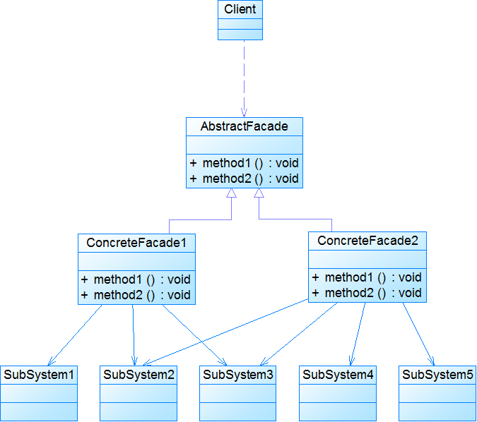

## 介绍

**外观模式(Facade Pattern)：**外部与一个子系统的通信必须通过一个统一的外观对象进行，为子系统中的一组接口提供一个一致的界面，外观模式定义了一个高层接口，这个接口使得这一子系统更加容易使用。外观模式又称为门面模式，它是一种对象结构型模式

外观模式是为了解决类与类之家的依赖关系的，像spring一样，可以将类和类之间的关系配置到配置文件中，而外观模式就是将他们的关系放在一个Facade类中，降低了类类之间的耦合度，该模式中没有涉及到接口。我们以一个计算机的启动过程为例。

类图：

<!-- more -->

实现类：CPU

~~~java
public class CPU {    
    public void startup(){  
        System.out.println("cpu startup!");  
    }  
      
    public void shutdown(){  
        System.out.println("cpu shutdown!");  
    }  
}  
~~~

实现类：Memory

~~~java
public class Memory {      
    public void startup(){  
        System.out.println("memory startup!");  
    }  
      
    public void shutdown(){  
        System.out.println("memory shutdown!");  
    }  
}  
~~~

实现类：Disk

~~~java
public class Disk {    
    public void startup(){  
        System.out.println("disk startup!");  
    }  
      
    public void shutdown(){  
        System.out.println("disk shutdown!");  
    }  
}  
~~~

实现类：

~~~java
public class Computer {  
    private CPU cpu;  
    private Memory memory;  
    private Disk disk;  
      
    public Computer(){  
        cpu = new CPU();  
        memory = new Memory();  
        disk = new Disk();  
    }  
      
    public void startup(){  
        System.out.println("start the computer!");  
        cpu.startup();  
        memory.startup();  
        disk.startup();  
        System.out.println("start computer finished!");  
    }  
      
    public void shutdown(){  
        System.out.println("begin to close the computer!");  
        cpu.shutdown();  
        memory.shutdown();  
        disk.shutdown();  
        System.out.println("computer closed!");  
    }  
}  
~~~

测试类：

~~~java
public class User {  
    public static void main(String[] args) {  
        Computer computer = new Computer();  
        computer.startup();  
        computer.shutdown();  
    }  
} 
//输出：
/*
start the computer!
cpu startup!
memory startup!
disk startup!
start computer finished!
begin to close the computer!
cpu shutdown!
memory shutdown!
disk shutdown!
computer closed!
*/
~~~

引入外观角色之后，用户只需要直接与外观角色交互，用户与子系统之间的复杂关系由外观角色来实现，从而降低了系统的耦合度。

如果我们没有Computer类，那么，CPU、Memory、Disk他们之间将会相互持有实例，产生关系，这样会造成严重的依赖，修改一个类，可能会带来其他类的修改，这不是我们想要看到的，有了Computer类，他们之间的关系被放在了Computer类里，这样就起到了解耦的作用，这，就是外观模式。

## 扩展

### 1. 模式结构

- Facade：外观角色
- SubSystem：子系统角色

### 2. 模式适用场景

- 当要为一个复杂子系统提供一个简单接口时可以使用外观模式。该接口可以满足大多数用户的需求，而且用户也可以越过外观类直接访问子系统。
- 客户程序与多个子系统之间存在很大的依赖性。引入外观类将子系统与客户以及其他子系统解耦，可以提高子系统的独立性和可移植性。
- 在层次化结构中，可以使用外观模式定义系统中每一层的入口，层与层之间不直接产生联系，而通过外观类建立联系，降低层之间的耦合度。

### 3. 模式应用

- JDBCFacade

  ~~~java
  public class JDBCFacade {
      private Connection conn=null;
      private Statement statement=null;
      public void open(String driver,String jdbcUrl,String userName,String userPwd) {
         ......
      }
      public int executeUpdate(String sql) {
          ......
      }
      public ResultSet executeQuery(String sql) {
          ......
      }
      public void close() {
          ......
      }
  }
  ~~~

### 4. 模式优缺点

1. 优点
   - 对客户屏蔽子系统组件，减少了客户处理的对象数目并使得子系统使用起来更加容易。通过引入外观模式，客户代码将变得很简单，与之关联的对象也很少。
   - 实现了子系统与客户之间的松耦合关系，这使得子系统的组件变化不会影响到调用它的客户类，只需要调整外观类即可。
   - 降低了大型软件系统中的编译依赖性，并简化了系统在不同平台之间的移植过程，因为编译一个子系统一般不需要编译所有其他的子系统。一个子系统的修改对其他子系统没有任何影响，而且子系统内部变化也不会影响到外观对象。
   - 只是提供了一个访问子系统的统一入口，并不影响用户直接使用子系统类
2. 缺点
   - 不能很好地限制客户使用子系统类，如果对客户访问子系统类做太多的限制则减少了可变性和灵活性。
   - 在不引入抽象外观类的情况下，增加新的子系统可能需要修改外观类或客户端的源代码，违背了**开闭原则**。

### 5. 外观模式与迪米特法则

- 根据“单一职责原则”，在软件中将一个系统划分为若干个子系统有利于降低整个系统的复杂性，一个常见的设计目标是使子系统间的通信和相互依赖关系达到最小，而达到该目标的途径之一就是引入一个外观对象，它为子系统的访问提供了一个简单而单一的入口。
- 外观模式也是“迪米特法则”的体现，通过引入一个新的外观类可以降低原有系统的复杂度，同时降低客户类与子系统类的耦合度。
- 外观模式创造出一个外观对象，将客户端所涉及的属于一个子系统的协作伙伴的数量减到最少，使得客户端与子系统内部的对象的相互作用被外观对象所取代。外观类充当了客户类与子系统类之间的“第三者”，降低了客户类与子系统类之间的耦合度，外观模式就是实现代码重构以便达到“迪米特法则”要求的一个强有力的武器。

### 6. 注意事项

1. 一个系统有多个外观类

   - 在外观模式中，通常只需要一个外观类，并且此外观类只有一个实例，换言之它是一个单例类。在很多情况下为了节约系统资源，一般将外观类设计为单例类。当然这并不意味着在整个系统里只能有一个外观类，在一个系统中可以设计多个外观类，每个外观类都负责和一些特定的子系统交互，向用户提供相应的业务功能。

2. 不要试图通过外观类为子系统增加新行为 

   - 不要通过继承一个外观类在子系统中加入新的行为，这种做法是错误的。外观模式的用意是为子系统提供一个集中化和简化的沟通渠道，而不是向子系统加入新的行为，新的行为的增加应该通过修改原有子系统类或增加新的子系统类来实现，不能通过外观类来实现。

3. 抽象外观类的引入 

   - 类图：

     

   - 外观模式最大的缺点在于违背了“开闭原则”，当增加新的子系统或者移除子系统时需要修改外观类，可以通过引入抽象外观类在一定程度上解决该问题，客户端针对抽象外观类进行编程。对于新的业务需求，不修改原有外观类，而对应增加一个新的具体外观类，由新的具体外观类来关联新的子系统对象，同时通过修改配置文件来达到不修改源代码并更换外观类的目的。