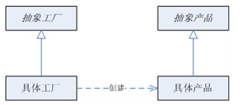

## 工厂方法模式

### 分类

**工厂方法模式分为四种：**

- 简单工厂模式
- 多个工厂方法模式
- 静态工厂方法模式
- 工厂方法模式

其中前三种都属于简单工厂模式，又叫做静态工厂方法模式，但不属于23种GOF设计模式之一。

<!--more -->

### 一、简单工厂模式

---

**简单工厂模式**就是建立一个工厂类，对实现了同一接口的一些类进行实例的创建。

简单工厂模式存在三个组成部分：

- 工厂角色

  > 在简单工厂模式中，工厂类是一个具体的实现类，在系统设计中工厂类负责实际对象的创建工作。
  >
  > 工厂类（Factory）的特点是：它知道系统中都存在哪些能够创建对象的具体类（ConcreteProduct），也知道该如何将创建的对象，以某种能够屏蔽具体类实现细节的方式（AbstractProduct）提供给所需要的其他角色来使用该对象提供的数据和服务。

- 抽象产品角色

  > 抽象产品角色是具体的产品的抽象。抽象就是将产品的共性抽取出来，可以直接暴露给客户端（需要使用具体产品的角色）。
  >
  > 抽象产品角色，在实际系统中可以定义为接口或者抽象类。

- 具体产品角色

  > 具体产品实现类一定是抽象产品类的实现或扩展。

举例：一个发送邮件和短信的例子

关系图：

二者的共同接口：

~~~java
public interface Sender {  
    public void Send();  
}  
~~~

实现类：

~~~java
public class MailSender implements Sender {  
    @Override  
    public void Send() {  
        System.out.println("this is mailsender!");  
    }  
}  
~~~

~~~java
public class SmsSender implements Sender {  
    @Override  
    public void Send() {  
        System.out.println("this is sms sender!");  
    }  
}  
~~~

工厂类：

~~~java
public class SendFactory {  
    public Sender produce(String type) {  
        if ("mail".equals(type)) {  
            return new MailSender();  
        } else if ("sms".equals(type)) {  
            return new SmsSender();  
        } else {  
            System.out.println("请输入正确的类型!");  
            return null;  
        }  
    }  
}  
~~~

测试类：

~~~java
public class FactoryTest {  
    public static void main(String[] args) {  
        SendFactory factory = new SendFactory();  
        Sender sender = factory.produce("sms");  
        sender.Send();  
    }  
}  
//输出：this is sms sender!
~~~

### 二、多个工厂方法模式

---

**多个工厂方法模式**是对普通工厂方法模式的改进，在普通工厂方法模式中，如果传递的字符串出错，则不能正确创建对象，而多个工厂方法模式是提供多个工厂方法，分别创建对象

关系图：

工厂类：

~~~java
public class SendFactory {   
	public Sender produceMail(){  
        return new MailSender();  
    }  
      
    public Sender produceSms(){  
        return new SmsSender();  
    }  
}  
~~~

测试类：

~~~java
public class FactoryTest {  
    public static void main(String[] args) {  
        SendFactory factory = new SendFactory();  
        Sender sender = factory.produceMail();  
        sender.Send();  
    }  
}  
//输出：this is mailsender!
~~~

### 三、静态工厂方法模式

---

**静态工厂方法模式**将上面的多个工厂方法模式里的方法置为静态的，不需要创建实例，直接调用即可

工厂类：

~~~java
public class SendFactory {    
    public static Sender produceMail(){  
        return new MailSender();  
    }  
      
    public static Sender produceSms(){  
        return new SmsSender();  
    }  
}  
~~~

测试类：

~~~java
public class FactoryTest {  
    public static void main(String[] args) {      
        Sender sender = SendFactory.produceMail();  
        sender.Send();  
    }  
}  
//输出：this is mailsender!
~~~

模式应用：以上三种称为简单工厂模式

~~~java
//在JDK类库中广泛使用了简单工厂模式，如工具类java.text.DateFormat，它用于格式化一个本地日期或者时间
//简单工厂特例，工厂角色与抽象产品角色合并为一个类，DateFormat
public final static DateFormat getDateInstance();
public final static DateFormat getDateInstance(int style);
public final static DateFormat getDateInstance(int style,Locale locale);
~~~

模式优缺点：

1. 优点
   - 将对象的创建和对象本身业务处理分离可以降低系统的耦合度，使得两者修改起来都相对容易
   - 在调用工厂类的工厂方法时，由于工厂方法是静态方法，可通过类名直接调用，而且只需要传入一个简单的参数即可
   - 在实际开发中，还可以在调用时将所传入的参数保存在XML等格式的配置文件中，修改参数时无须修改任何Java源代码
   - 简单工厂模式的要点在于：当你需要什么，只需要传入一个正确的参数，就可以获取你所需要的对象，而无须知道其创建细节
2. 缺点
   - 简单工厂模式最大的问题在于工厂类的职责相对过重，增加新的产品需要修改工厂类的判断逻辑，这一点与开闭原则是相违背的
   - 在简单工厂模式中，只提供了一个工厂类，该工厂类处于对产品类进行实例化的中心位置，它知道每一个产品对象的创建细节，并决定何时实例化哪一个产品类。简单工厂模式最大的缺点是当有新产品要加入到系统中时，必须修改工厂类，加入必要的处理逻辑，这违背了**开闭原则**
   - 在简单工厂模式中，所有的产品都是由同一个工厂创建，工厂类职责较重，业务逻辑较为复杂，具体产品与工厂类之间的耦合度高，严重影响了系统的灵活性和扩展性。而多态工厂类模式可以很好地解决这一问题

### 四、工厂方法模式

---

**工厂方法模式**又称多态工厂(Polymorphic Factory)模式，它属于类创建型模式。在工厂方法模式中，工厂父类负责定义创建产品对象的公共接口，而工厂子类则负责生成具体的产品对象，这样做的目的是将产品类的实例化操作延迟到工厂子类中完成，即通过工厂子类来确定究竟应该实例化哪一个具体产品类。

工厂方法模式的结构：

1. 抽象工厂(Creator)角色

   > 是工厂方法模式的核心，与应用程序无关。任何在模式中创建的对象的工厂类必须实现这个接口。 　

2. 具体工厂(Concrete Creator)角色

   > 这是实现抽象工厂接口的具体工厂类，包含与应用程序密切相关的逻辑，并且受到应用程序调用以创建产品对象。

3. 抽象产品(Product)角色

   > 工厂方法模式所创建的对象的超类型，也就是产品对象的共同父类或共同拥有的接口。

4. 具体产品(Concrete Product)角色

   > 这个角色实现了抽象产品角色所定义的接口。某具体产品有专门的具体工厂创建，它们之间往往一一对应。

抽象工厂类：

~~~java
public abstract class SendFactory{
    public abstract AbstractSend getSendMethod();
}
~~~

具体工厂子类：

~~~java
//邮件工厂
public class MailSendFactory extends SendFactory{
    public AbstractSend getSendMethod(){
        return new MailSender();
    }
} 

//短信工厂
public class SmsSendFactory extends SendFactory{
    public AbstractSend getSendMethod(){
        return new SmsSender();
    }
} 
~~~

实现类：

~~~java
//邮件实现类
public class MailSender {   
    public void Send() {  
        System.out.println("this is mailsender!");  
    }  
}  

//短信实现类
public class SmsSender {  
    public void Send() {  
        System.out.println("this is sms sender!");  
    }  
}  
~~~

测试类：

~~~java
public class FactoryTest {  
    public static void main(String[] args) {      
        SendFactory factory;
		AbstractSend sendMethod;
		factory=new MailSendFactory();
		sendMethod =factory.getSendMethod();
		sendMethod.send(); 
    }  
} 
//输出：this is mailsender!
~~~

很明显可以看到，SendFactory工厂类变成了SendFactory抽象类，而继承此抽象类的分别是MailSendFactory和SmsSendFactory等等具体的工厂类。
这样做有什么好处呢？很明显，这样做就完全OCP了。如果需要再加入（或扩展）产品类（比如加多个“发微信”）的话就不再需要修改工厂类了，而只需相应的再添加一个继承了工厂抽象类的具体工厂类即可。

模式应用：

~~~java
//JDBC中的工厂方法(没有多个具体工厂，特例)
Connection conn=DriverManager.getConnection("jdbc:microsoft:sqlserver://localhost:1433; DatabaseName=DB;user=sa;password=");
Statement statement=conn.createStatement();
ResultSet rs=statement.executeQuery("select * from UserInfo");
~~~

模式优缺点：

1. 优点：
   - 在工厂方法模式中，工厂方法用来创建客户所需要的产品，同时还向客户隐藏了哪种具体产品类将被实例化这一细节，用户只需要关心所需产品对应的工厂，无须关心创建细节，甚至无须知道具体产品类的类名
   - 基于工厂角色和产品角色的多态性设计是工厂方法模式的关键。它能够使工厂可以自主确定创建何种产品对象，而如何创建这个对象的细节则完全封装在具体工厂内部。工厂方法模式之所以又被称为多态工厂模式，是因为所有的具体工厂类都具有同一抽象父类
   - 使用工厂方法模式的另一个优点是在系统中加入新产品时，无须修改抽象工厂和抽象产品提供的接口，无须修改客户端，也无须修改其他的具体工厂和具体产品，而只要添加一个具体工厂和具体产品就可以了。这样，系统的可扩展性也就变得非常好，完全符合**开闭原则**
2. 缺点：
   - 在添加新产品时，需要编写新的具体产品类，而且还要提供与之对应的具体工厂类，系统中类的个数将成对增加，在一定程度上增加了系统的复杂度，有更多的类需要编译和运行，会给系统带来一些额外的开销
   - 由于考虑到系统的可扩展性，需要引入抽象层，在客户端代码中均使用抽象层进行定义，增加了系统的抽象性和理解难度，且在实现时可能需要用到DOM、反射等技术，增加了系统的实现难度

### 总结

总体来说，工厂方法模式适合：凡是出现了大量的产品需要创建，并且具有共同的接口时，可以通过工厂方法模式进行创建。

在简单工厂模式的三种模式中，第一种如果传入的字符串有误，不能正确创建对象，第三种相对于第二种，不需要实例化工厂类，所以，大多数情况下，我们会选用第三种——静态工厂方法模式

