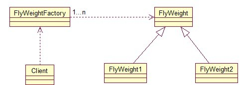
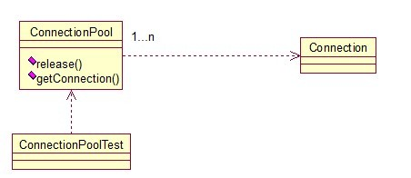

## 介绍

**享元模式(Flyweight Pattern)：**运用共享技术有效地支持大量细粒度对象的复用。系统只使用少量的对象，而这些对象都很相似，状态变化很小，可以实现对象的多次复用。由于享元模式要求能够共享的对象必须是细粒度对象，因此它又称为轻量级模式，它是一种对象结构型模式。

享元模式的主要目的是实现对象的共享，即共享池，当系统中对象多的时候可以减少内存的开销，通常与工厂模式一起使用。

FlyWeightFactory负责创建和管理享元单元，当一个客户端请求时，工厂需要检查当前对象池中是否有符合条件的对象，如果有，就返回已经存在的对象，如果没有，则创建一个新对象，FlyWeight是超类。一提到共享池，我们很容易联想到Java里面的JDBC连接池，想想每个连接的特点，我们不难总结出：适用于作共享的一些个对象，他们有一些共有的属性，就拿数据库连接池来说，url、driverClassName、username、password及dbname，这些属性对于每个连接来说都是一样的，所以就适合用享元模式来处理，建一个工厂类，将上述类似属性作为内部数据，其它的作为外部数据，在方法调用时，当做参数传进来，这样就节省了空间，减少了实例的数量。

<!-- more -->

举例：数据库连接池

~~~java
public class ConnectionPool {    
    private Vector<Connection> pool;  
      
    /*公有属性*/  
    private String url = "jdbc:mysql://localhost:3306/test";  
    private String username = "root";  
    private String password = "root";  
    private String driverClassName = "com.mysql.jdbc.Driver";  
  
    private int poolSize = 100;  
    private static ConnectionPool instance = null;  
    Connection conn = null;  
  
    /*构造方法，做一些初始化工作*/  
    private ConnectionPool() {  
        pool = new Vector<Connection>(poolSize);  
  
        for (int i = 0; i < poolSize; i++) {  
            try {  
                Class.forName(driverClassName);  
                conn = DriverManager.getConnection(url, username, password);  
                pool.add(conn);  
            } catch (ClassNotFoundException e) {  
                e.printStackTrace();  
            } catch (SQLException e) {  
                e.printStackTrace();  
            }  
        }  
    }  
  
    /* 返回连接到连接池 */  
    public synchronized void release() {  
        pool.add(conn);  
    }  
  
    /* 返回连接池中的一个数据库连接 */  
    public synchronized Connection getConnection() {  
        if (pool.size() > 0) {  
            Connection conn = pool.get(0);  
            pool.remove(conn);  
            return conn;  
        } else {  
            return null;  
        }  
    }  
} 
~~~

## 扩展

### 1. 模式动机

- 享元模式通过共享技术实现相同或相似对象的重用。
- 可以很好地解决一些灵活性或可扩展性问题。

### 2.模式分析 

- 享元模式是一个考虑系统性能的设计模式，通过使用享元模式可以节约内存空间，提高系统的性能。

- 享元模式的核心在于享元工厂类，享元工厂类的作用在于提供一个用于存储享元对象的享元池，用户需要对象时，首先从享元池中获取，如果享元池中不存在，则创建一个新的享元对象返回给用户，并在享元池中保存该新增对象。

  ~~~java
  //典型的享元工厂类代码
  public class FlyweightFactory{
  	private HashMap flyweights = new HashMap();
  	
  	public Flyweight getFlyweight(String key){
  		if(flyweights.containsKey(key)){
  			return (Flyweight)flyweights.get(key);
  		}else{
  			Flyweight fw = new ConcreteFlyweight();
  			flyweights.put(key,fw);
  			return fw;
  		}
  	}
  } 

  //典型的享元类代码
  public class Flyweight{
          //内部状态作为成员属性
  	private String intrinsicState;
  	
  	public Flyweight(String intrinsicState){
  		this.intrinsicState = intrinsicState;
  	}
  	
  	public void operation(String extrinsicState){
  		......
  	}	
  }
  ~~~

- 享元模式以共享的方式高效地支持大量的细粒度对象，享元对象能做到共享的关键是区分内部状态(Internal State)和外部状态(External State)。

  > 1. 内部状态是存储在享元对象内部并且不会随环境改变而改变的状态，因此内部状态可以共享。
  > 2. 外部状态是随环境改变而改变的、不可以共享的状态。享元对象的外部状态必须由客户端保存，并在享元对象被创建之后，在需要使用的时候再传入到享元对象内部。一个外部状态与另一个外部状态之间是相互独立的。 

### 3. 模式结构

享元模式包含如下角色：

- Flyweight: 抽象享元类
- ConcreteFlyweight: 具体享元类
- UnsharedConcreteFlyweight: 非共享具体享元类
- FlyweightFactory: 享元工厂类

### 4. 模式扩展

1. 单纯享元模式

   在单纯享元模式中，所有的享元对象都是可以共享的，即所有抽象享元类的子类都可共享，不存在非共享具体享元类。

   

2. 复合享元模式 

   将一些单纯享元使用组合模式加以组合，可以形成复合享元对象，这样的复合享元对象本身不能共享，但是它们可以分解成单纯享元对象，而后者则可以共享。

   

3. 享元模式与其他模式的联用 

   - 在享元模式的享元工厂类中通常提供一个静态的工厂方法用于返回享元对象，使用简单工厂模式来生成享元对象。
   - 在一个系统中，通常只有唯一一个享元工厂，因此享元工厂类可以使用单例模式进行设计。
   - 享元模式可以结合组合模式形成复合享元模式，统一对享元对象设置外部状态。

### 5. 适用场景

- 一个系统有大量相同或者相似的对象，由于这类对象的大量使用，造成内存的大量耗费。
- 对象的大部分状态都可以外部化，可以将这些外部状态传入对象中。
- 使用享元模式需要维护一个存储享元对象的享元池，而这需要耗费资源，因此，应当在多次重复使用享元对象时才值得使用享元模式。

### 6.模式应用 

- 字符串连接池

- Integer类的valueOf方法

  ~~~java
  //IntegerCache将常用整数-128~127做了缓存处理
  public static Integer valueOf(int i) {
          if (i >= IntegerCache.low && i <= IntegerCache.high)
              return IntegerCache.cache[i + (-IntegerCache.low)];
          return new Integer(i);
      }
  ~~~

### 7. 模式优缺点

1. 优点
   - 享元模式的优点在于它可以极大减少内存中对象的数量，使得相同对象或相似对象在内存中只保存一份。
   - 享元模式的外部状态相对独立，而且不会影响其内部状态，从而使得享元对象可以在不同的环境中被共享。
2. 缺点
   - 享元模式使得系统更加复杂，需要分离出内部状态和外部状态，这使得程序的逻辑复杂化。
   - 为了使对象可以共享，享元模式需要将享元对象的状态外部化，而读取外部状态使得运行时间变长。

