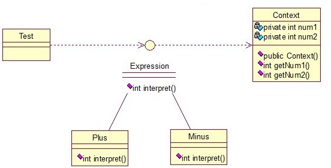
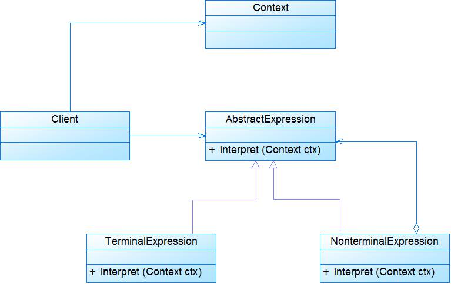
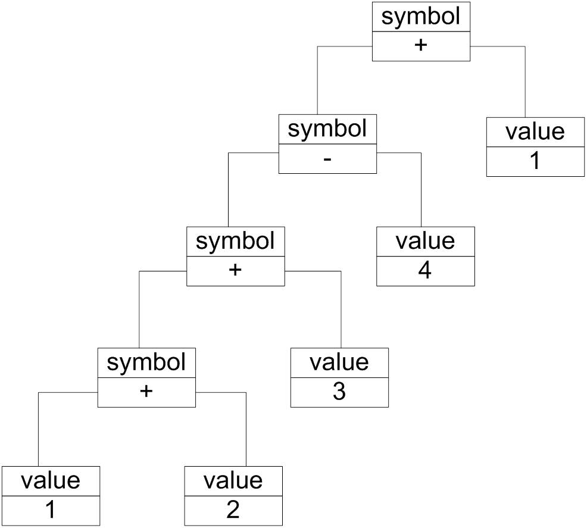

## 介绍

**解释器模式(Interpreter Pattern) ：**定义语言的文法，并且建立一个解释器来解释该语言中的句子，这里的语言意思是使用规定格式和语法的代码，它是一种类行为型模式。

解释器模式一般主要应用在OOP开发中的编译器的开发中，所以适用面比较窄。

关系图：

<!-- more -->

Context类是一个上下文环境类，Plus和Minus分别是用来计算的实现。

接口：

~~~java
public interface Expression {  
    public int interpret(Context context);  
}  
~~~

实现类：

~~~java
public class Plus implements Expression {  
    @Override  
    public int interpret(Context context) {  
        return context.getNum1()+context.getNum2();  
    }  
}  
~~~

~~~java
public class Minus implements Expression {  
    @Override  
    public int interpret(Context context) {  
        return context.getNum1()-context.getNum2();  
    }  
}  
~~~

上下文类：

~~~java
public class Context {     
    private int num1;  
    private int num2;  
      
    public Context(int num1, int num2) {  
        this.num1 = num1;  
        this.num2 = num2;  
    }  
      
    public int getNum1() {  
        return num1;  
    }  
    public void setNum1(int num1) {  
        this.num1 = num1;  
    }  
    public int getNum2() {  
        return num2;  
    }  
    public void setNum2(int num2) {  
        this.num2 = num2;  
    }     
}  
~~~

测试类：

~~~java
public class Test {  
    public static void main(String[] args) {  
        // 计算9+2-8的值  
        int result = new Minus().interpret((new Context(new Plus()  
                .interpret(new Context(9, 2)), 8)));  
        System.out.println(result);  
    }  
}  
//输出：3
~~~

## 扩展

### 1. 模式动机

- 如果在系统中某一特定类型的问题发生的频率很高，此时可以考虑将这些问题的实例表述为一个语言中的句子，因此可以构建一个解释器，该解释器通过解释这些句子来解决这些问题。
- 解释器模式描述了如何构成一个简单的语言解释器，主要应用在使用面向对象语言开发的编译器中。

### 2. 模式结构

解释器模式包含如下角色：

- AbstractExpression: 抽象表达式
- TerminalExpression: 终结符表达式
- NonterminalExpression: 非终结符表达式
- Context: 环境类
- Client: 客户类

### 3. 模式分析

- 解释器模式描述了如何为简单的语言定义一个文法，如何在该语言中表示一个句子，以及如何解释这些句子。

- 文法规则实例：

  > - expression ::= value | symbol
  > - symbol ::= expression '+'expression | expression '-' expression
  > - value ::= an integer //一个整数值

- 在文法规则定义中可以使用一些符号来表示不同的含义，如使用**|**表示或，使用**{**和**}**表示组合，使用*****表示出现0次或多次等，其中使用频率最高的符号是表示或关系的**|**。

- 除了使用文法规则来定义一个语言，在解释器模式中还可以通过一种称之为抽象语法树(Abstract Syntax Tree, AST)的图形方式来直观地表示语言的构成，每一棵抽象语法树对应一个语言实例。

  

- 抽象语法树描述了如何构成一个复杂的句子，通过对抽象语法树的分析，可以识别出语言中的终结符和非终结符类。

- 在解释器模式中，每一种终结符和非终结符都有一个具体类与之对应，正因为使用类来表示每一个语法规则，使得系统具有较好的扩展性和灵活性。

典型的抽象表达式类代码：

~~~java
public abstract class AbstractExpression {
	public abstract void interpret(Context ctx);
} 
~~~

典型的终结符表达式类实现代码：

~~~java
public class TerminalExpression extends AbstractExpression {
	public void interpret(Context ctx) {
		//对于终结符表达式的解释操作
	}
} 
~~~

典型的非终结符表达式类实现代码：

~~~java
public class NonterminalExpression extends AbstractExpression {
	private AbstractExpression left;
	private AbstractExpression right;
	
	public NonterminalExpression(AbstractExpression left,AbstractExpression right) {
		this.left=left;
		this.right=right;
	}
	
	public void interpret(Context ctx) {
		//递归调用每一个组成部分的interpret()方法
		//在递归调用时指定组成部分的连接方式，即非终结符的功能
	}	
} 
~~~

典型的环境类实现代码：

~~~java
public class Context {
    private HashMap map = new HashMap();
    public void assign(String key, String value) {
        //往环境类中设值
    }
	public String lookup(String key) {
        //获取存储在环境类中的值
    }
} 
~~~

### 4. 适用场景

- 可以将一个需要解释执行的语言中的句子表示为一个抽象语法树。
- 一些重复出现的问题可以用一种简单的语言来进行表达。
- 文法较为简单。
- 效率不是关键问题。

### 5. 模式应用

1. 解释器模式在使用面向对象语言实现的编译器中得到了广泛的应用，如Smalltalk语言的编译器。
2. 目前有一些基于Java抽象语法树的源代码处理工具，如在Eclipse中就提供了Eclipse AST，它是Eclipse JDT的一个重要组成部分，用来表示Java语言的语法结构，用户可以通过扩展其功能，创建自己的文法规则。
3. 可以使用解释器模式，通过C++、Java、C#等面向对象语言开发简单的编译器，如数学表达式解析器、正则表达式解析器等，用于增强这些语言的功能，使之增加一些新的文法规则，用于解释一些特定类型的语句。

### 6. 模式扩展

数学表达式解析器：

- 在实际项目开发中如果需要解析数学公式，无须再运用解释器模式进行设计，可以直接使用一些第三方解析工具包，它们可以统称为数学表达式解析器(Math Expression Parser, MEP)，如**Expression4J**、**Jep**、**JbcParser**、**Symja**、**Math Expression String Parser(MESP)**等来取代解释器模式，它们可以方便地解释一些较为复杂的文法，功能强大，且使用简单，效率较好。
- [Expression4J](http://www.expression4j.org/)是一个基于Java的开源框架，它用于对数学表达式进行操作，是一个数学公式解析器，在Expression4J中可以将数学表达式存储在字符串对象中。Expression4J是高度定制的，用户可以自定义文法，其主要功能包括实数和复数的基本数学运算，支持基本数学函数、复杂函数以及用户使用Java语言自定义的函数和文法，还可以定义函数目录（函数集）、支持XML配置文件等。
- [Jep](http://www.singularsys.com/jep/)是一个用于解析和求解数学表达式的Java类库。通过使用Jep提供的包，我们可以输入一个以字符串表示的任意数学公式，然后立即对其进行求解。Jep支持用户自定义变量、常量和自定义函数，同时还包含了大量通用的数学函数和常量。

### 7. 模式优缺点

1. 优点
   - 易于改变和扩展文法。
   - 易于实现文法。
   - 增加了新的解释表达式的方式。
2. 缺点
   - 对于复杂文法难以维护。
   - 执行效率较低。
   - 应用场景很有限。

