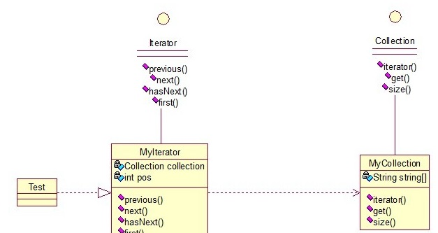
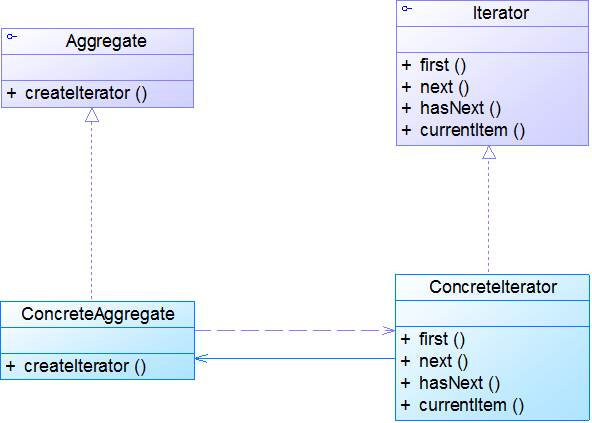
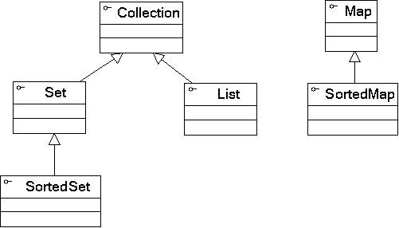

## 介绍

**迭代器模式(Iterator Pattern) ：**提供一种方法来访问聚合对象，而不用暴露这个对象的内部表示，其别名为游标(Cursor)。迭代器模式是一种对象行为型模式。

迭代器模式就是顺序访问聚集中的对象，一般来说，集合中非常常见。这句话包含两层意思：一是需要遍历的对象，即聚集对象，二是迭代器对象，用于对聚集对象进行遍历访问。

关系图：

这个思路和我们常用的一模一样，MyCollection中定义了集合的一些操作，MyIterator中定义了一系列迭代操作，且持有Collection实例。

<!--more -->

两个接口：

~~~java
public interface Collection {     
    public Iterator iterator();  
      
    /*取得集合元素*/  
    public Object get(int i);  
      
    /*取得集合大小*/  
    public int size();  
}  
~~~

~~~java
public interface Iterator {  
    //前移  
    public Object previous();  
      
    //后移  
    public Object next();  
    public boolean hasNext();  
      
    //取得第一个元素  
    public Object first();  
}  
~~~

两个实现：

~~~java
public class MyCollection implements Collection {  
    public String string[] = {"A","B","C","D","E"};  
    @Override  
    public Iterator iterator() {  
        return new MyIterator(this);  
    }  
  
    @Override  
    public Object get(int i) {  
        return string[i];  
    }  
  
    @Override  
    public int size() {  
        return string.length;  
    }  
}  
~~~

~~~java
public class MyIterator implements Iterator {  
  
    private Collection collection;  
    private int pos = -1;  
      
    public MyIterator(Collection collection){  
        this.collection = collection;  
    }  
      
    @Override  
    public Object previous() {  
        if(pos > 0){  
            pos--;  
        }  
        return collection.get(pos);  
    }  
  
    @Override  
    public Object next() {  
        if(pos<collection.size()-1){  
            pos++;  
        }  
        return collection.get(pos);  
    }  
  
    @Override  
    public boolean hasNext() {  
        if(pos<collection.size()-1){  
            return true;  
        }else{  
            return false;  
        }  
    }  
  
    @Override  
    public Object first() {  
        pos = 0;  
        return collection.get(pos);  
    }  
  
}  
~~~

测试类：

~~~java
public class Test {  
    public static void main(String[] args) {  
        Collection collection = new MyCollection();  
        Iterator it = collection.iterator();  
          
        while(it.hasNext()){  
            System.out.println(it.next());  
        }  
    }  
}  
//输出：A B C D E
~~~

## 扩展

### 1. 模式动机

- 一个聚合对象，如一个列表(List)或者一个集合(Set)，应该提供一种方法来让别人可以访问它的元素，而又不需要暴露它的内部结构。
- 针对不同的需要，可能还要以不同的方式遍历整个聚合对象，但是我们并不希望在聚合对象的抽象层接口中充斥着各种不同遍历的操作。
- 在迭代器模式中，提供一个外部的迭代器来对聚合对象进行访问和遍历，迭代器定义了一个访问该聚合元素的接口，并且可以跟踪当前遍历的元素，了解哪些元素已经遍历过而哪些没有。

### 2. 模式结构

迭代器模式包含如下角色：

- Iterator: 抽象迭代器
- ConcreteIterator: 具体迭代器
- Aggregate: 抽象聚合类
- ConcreteAggregate: 具体聚合类

### 3. 模式分析

- 聚合是一个管理和组织数据对象的数据结构。聚合对象主要拥有两个职责：一是存储内部数据；二是遍历内部数据。 
- 将遍历聚合对象中数据的行为提取出来，封装到一个迭代器中，通过专门的迭代器来遍历聚合对象的内部数据，这就是迭代器模式的本质。迭代器模式是“单一职责原则”的完美体现。
- 在迭代器模式中应用了工厂方法模式，聚合类充当工厂类，而迭代器充当产品类，由于定义了抽象层，系统的扩展性很好，在客户端可以针对抽象聚合类和抽象迭代器进行编程。
- java编程语言的类库都已经实现了迭代器模式，因此在实际使用中我们很少自定义迭代器，只需要直接使用Java语言中已定义好的迭代器即可。

### 4. 适用场景

- 访问一个聚合对象的内容而无须暴露它的内部表示。
- 需要为聚合对象提供多种遍历方式。
- 为遍历不同的聚合结构提供一个统一的接口。

### 5. 模式应用

JDK1.2 引入了新的Java聚合框架Collections

- Collection是所有Java聚合类的根接口。
- 在JDK类库中，Collection的iterator()方法返回一个java.util.Iterator类型的对象，而其子接口java.util.List的listIterator()方法返回一个java.util.ListIterator类型的对象，ListIterator是Iterator的子类。它们构成了Java语言对迭代器模式的支持，Java语言的java.util.Iterator接口就是迭代器模式的应用。

### 6. 模式扩展

Java迭代器，•在JDK中，Iterator接口具有如下3个基本方法：

1. Object next()：通过反复调用next()方法可以逐个访问聚合中的元素。
2. boolean hasNext()：hasNext()方法用于判断聚合对象中是否还存在下一个元素，为了不抛出异常，必须在调用next()之前先调用hasNext()。如果迭代对象仍然拥有可供访问的元素，那么hasNext()返回true。
3. void remove()：用于删除上次调用next()时所返回的元素

~~~java
Iterator iterator = collection.iterator();   //collection是已实例化的集合对象
iterator.next();	 	// 跳过第一个元素
iterator.remove(); 	    // 删除第一个元素

iterator.remove();
iterator.next();  //该语句不能去掉
iterator.remove(); 
~~~

### 7. 模式优缺点

1. 优点

   - 它支持以不同的方式遍历一个聚合对象。
   - 迭代器简化了聚合类。
   - 在同一个聚合上可以有多个遍历。
   - 在迭代器模式中，增加新的聚合类和迭代器类都很方便，无须修改原有代码，满足**开闭原则**的要求。

2. 缺点

   - 由于迭代器模式将存储数据和遍历数据的职责分离，增加新的聚合类需要对应增加新的迭代器类，类的个数成对增加，这在一定程度上增加了系统的复杂性。

   ​

