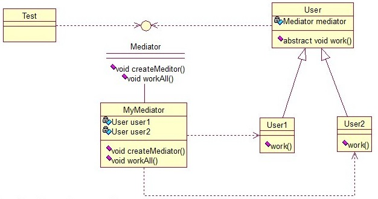
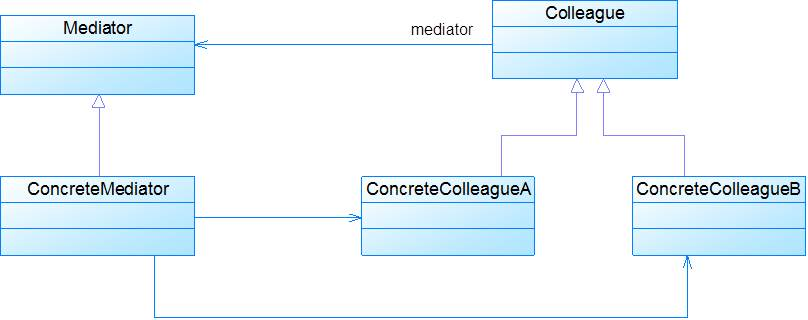

## 介绍

**中介者模式(Mediator Pattern)定义：**用一个中介对象来封装一系列的对象交互，中介者使各对象不需要显式地相互引用，从而使其耦合松散，而且可以独立地改变它们之间的交互。中介者模式又称为调停者模式，它是一种对象行为型模式。

中介者模式也是用来降低类类之间的耦合的，因为如果类类之间有依赖关系的话，不利于功能的拓展和维护，因为只要修改一个对象，其它关联的对象都得进行修改。如果使用中介者模式，只需关心和Mediator类的关系，具体类类之间的关系及调度交给Mediator就行，这有点像spring容器的作用。

关系图：

<!-- more -->

User类统一接口，User1和User2分别是不同的对象，二者之间有关联，如果不采用中介者模式，则需要二者相互持有引用，这样二者的耦合度很高，为了解耦，引入了Mediator类，提供统一接口，MyMediator为其实现类，里面持有User1和User2的实例，用来实现对User1和User2的控制。这样User1和User2两个对象相互独立，他们只需要保持好和Mediator之间的关系就行，剩下的全由MyMediator类来维护。

接口：

~~~java
public interface Mediator {  
    public void createMediator();  
    public void workAll();  
}  
~~~

实现类：

~~~java
public class MyMediator implements Mediator {  
    private User user1;  
    private User user2;  
      
    public User getUser1() {  
        return user1;  
    }  
  
    public User getUser2() {  
        return user2;  
    }  
  
    @Override  
    public void createMediator() {  
        user1 = new User1(this);  
        user2 = new User2(this);  
    }  
  
    @Override  
    public void workAll() {  
        user1.work();  
        user2.work();  
    }  
}  
~~~

抽象类：

~~~java
public abstract class User {   
    private Mediator mediator;  
      
    public Mediator getMediator(){  
        return mediator;  
    }  
      
    public User(Mediator mediator) {  
        this.mediator = mediator;  
    }  
  
    public abstract void work();  
}  
~~~

实现类1：

~~~java
public class User1 extends User {  
    public User1(Mediator mediator){  
        super(mediator);  
    }  
      
    @Override  
    public void work() {  
        System.out.println("user1 exe!");  
    }  
}  
~~~

实现类2：

~~~java
public class User2 extends User {  
    public User2(Mediator mediator){  
        super(mediator);  
    }  
      
    @Override  
    public void work() {  
        System.out.println("user2 exe!");  
    }  
}  
~~~

测试类：

~~~java
public class Test {  
    public static void main(String[] args) {  
        Mediator mediator = new MyMediator();  
        mediator.createMediator();  
        mediator.workAll();  
    }  
}  
//输出
/*
user1 exe!
user2 exe!
*/
~~~

## 扩展

### 1. 模式动机

- 在面向对象的软件设计与开发过程中，根据“单一职责原则”，我们应该尽量将对象细化，使其只负责或呈现单一的责。
- 对于一个模块，可能由很多对象构成，而且这些对象之间可能存在相互的引用，为了减少对象两两之间复杂的引用关系，使之成为一个松耦合的系统，我们需要使用中介者模式。

### 2. 模式结构

中介者模式包含如下角色：

- Mediator: 抽象中介者
- ConcreteMediator: 具体中介者
- Colleague: 抽象同事类
- ConcreteColleague: 具体同事类

### 3. 模式分析

中介者承担两方面的职责：

- 中转作用（结构性）：通过中介者提供的中转作用，各个同事对象就不再需要显式引用其他同事，当需要和其他同事进行通信时，通过中介者即可。该中转作用属于中介者在结构上的支持。
- 协调作用（行为性）：中介者可以更进一步的对同事之间的关系进行封装，同事可以一致地和中介者进行交互，而不需要指明中介者需要具体怎么做，中介者根据封装在自身内部的协调逻辑，对同事的请求进行进一步处理，将同事成员之间的关系行为进行分离和封装。该协调作用属于中介者在行为上的支持。

典型的抽象中介者类代码：

~~~java
public abstract class Mediator {
	protected ArrayList colleagues;
	public void register(Colleague colleague) {
		colleagues.add(colleague);
	}
	
	public abstract void operation();
}

~~~

典型的具体中介者类代码：

~~~java
public class ConcreteMediator extends Mediator {
	public void operation() {
		//......
		((Colleague)(colleagues.get(0))).method1();
		//......
	}
} 
~~~

典型的抽象同事类代码：

~~~java
public abstract class Colleague {
	protected Mediator mediator;
	
	public Colleague(Mediator mediator) {
		this.mediator=mediator;
	}
	
	public abstract void method1();
	
	public abstract void method2();
} 

~~~

典型的具体同事类代码：

~~~java
public class ConcreteColleague extends Colleague {
	public ConcreteColleague(Mediator mediator) {
		super(mediator);
	}
	
	public void method1() {
		//......
	}
	
	public void method2() {
		mediator.operation1();
	}
} 
~~~

### 4. 适用场景

- 系统中对象之间存在复杂的引用关系，产生的相互依赖关系结构混乱且难以理解。
- 一个对象由于引用了其他很多对象并且直接和这些对象通信，导致难以复用该对象。
- 想通过一个中间类来封装多个类中的行为，而又不想生成太多的子类。可以通过引入中介者类来实现，在中介者中定义对象交互的公共行为，如果需要改变行为则可以增加新的中介者类。

### 5. 模式应用

1. 中介者模式在事件驱动类软件中应用比较多，在设计GUI应用程序时，组件之间可能存在较为复杂的交互关系，一个组件的改变将影响与之相关的其他组件，此时可以使用中介者模式来对组件进行协调。
2. MVC是Java EE 的一个基本模式，此时控制器Controller 作为一种中介者，它负责控制视图对象View和模型对象Model之间的交互。如在Struts中，Action就可以作为JSP页面与业务对象之间的中介者。

### 6. 模式扩展

1. 中介者模式与迪米特法则
   - 在中介者模式中，通过创造出一个中介者对象，将系统中有关的对象所引用的其他对象数目减少到最少，使得一个对象与其同事之间的相互作用被这个对象与中介者对象之间的相互作用所取代。因此，中介者模式就是迪米特法则的一个典型应用。
2. 中介者模式与GUI开发 
   - 中介者模式可以方便地应用于图形界面(GUI)开发中，在比较复杂的界面中可能存在多个界面组件之间的交互关系。
   - 对于这些复杂的交互关系，有时候我们可以引入一个中介者类，将这些交互的组件作为具体的同事类，将它们之间的引用和控制关系交由中介者负责，在一定程度上简化系统的交互，这也是中介者模式的常见应用之一。

### 7. 模式优缺点

1. 优点
   - 简化了对象之间的交互。
   - 将各同事解耦。
   - 减少子类生成。
   - 可以简化各同事类的设计和实现。
2. 缺点
   - 在具体中介者类中包含了同事之间的交互细节，可能会导致具体中介者类非常复杂，使得系统难以维护。

