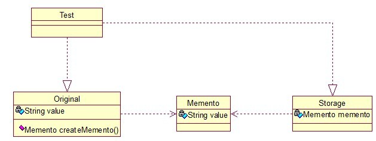

## 介绍

**备忘录模式(Memento Pattern)：**在不破坏封装的前提下，捕获一个对象的内部状态，并在该对象之外保存这个状态，这样可以在以后将对象恢复到原先保存的状态。它是一种对象行为型模式，其别名为Token。

主要目的是保存一个对象的某个状态，以便在适当的时候恢复对象，通俗的讲下：假设有原始类A，A中有各种属性，A可以决定需要备份的属性，备忘录类B是用来存储A的一些内部状态，类C呢，就是一个用来存储备忘录的，且只能存储，不能修改等操作。

关系图：

<!-- more -->

Original类是原始类，里面有需要保存的属性value及创建一个备忘录类，用来保存value值。Memento类是备忘录类，Storage类是存储备忘录的类，持有Memento类的实例，该模式很好理解。

原始类：

~~~java
public class Original {     
    private String value;  
      
    public String getValue() {  
        return value;  
    }  
  
    public void setValue(String value) {  
        this.value = value;  
    }  
  
    public Original(String value) {  
        this.value = value;  
    }  
  
    public Memento createMemento(){  
        return new Memento(value);  
    }  
      
    public void restoreMemento(Memento memento){  
        this.value = memento.getValue();  
    }  
}  
~~~

备忘录类：

~~~java
public class Memento {  
    private String value;  
  
    public Memento(String value) {  
        this.value = value;  
    }  
  
    public String getValue() {  
        return value;  
    }  
  
    public void setValue(String value) {  
        this.value = value;  
    }  
}  
~~~

存储类：

~~~java
public class Storage {  
    private Memento memento;  
      
    public Storage(Memento memento) {  
        this.memento = memento;  
    }  
  
    public Memento getMemento() {  
        return memento;  
    }  
  
    public void setMemento(Memento memento) {  
        this.memento = memento;  
    }  
}  
~~~

测试类：

~~~java
public class Test {   
    public static void main(String[] args) {       
        // 创建原始类  
        Original origi = new Original("egg");  
  
        // 创建备忘录  
        Storage storage = new Storage(origi.createMemento());  
  
        // 修改原始类的状态  
        System.out.println("初始化状态为：" + origi.getValue());  
        origi.setValue("niu");  
        System.out.println("修改后的状态为：" + origi.getValue());  
  
        // 回复原始类的状态  
        origi.restoreMemento(storage.getMemento());  
        System.out.println("恢复后的状态为：" + origi.getValue());  
    }  
}  
//输出：
/*
初始化状态为：egg
修改后的状态为：niu
恢复后的状态为：egg
*/
~~~

## 扩展

### 1. 模式动机

- 在应用软件的开发过程中，很多时候我们都需要记录一个对象的内部状态。
- 在具体实现过程中，为了允许用户取消不确定的操作或从错误中恢复过来，需要实现备份点和撤销机制，而要实现这些机制，必须事先将状态信息保存在某处，这样才能将对象恢复到它们原先的状态。
- 现在大多数软件都有撤销(Undo)的功能，快捷键一般都是Ctrl+Z。备忘录模式是一种给我们的软件提供后悔药的机制，通过它可以使系统恢复到某一特定的历史状态。

### 2. 模式结构

备忘录模式包含如下角色：

- Originator: 原发器
- Memento: 备忘录
- Caretaker: 负责人

### 3. 模式分析

- 由于在备忘录中存储的是原发器的中间状态，因此需要防止原发器以外的其他对象访问备忘录。
- 为了实现对备忘录对象的封装，需要对备忘录的调用进行控制：
  1. 对于原发器而言，它可以调用备忘录的所有信息，允许原发器访问返回到先前状态所需的所有数据。
  2. 对于负责人而言，只负责备忘录的保存并将备忘录传递给其他对象。
  3. 对于其他对象而言，只需要从负责人处取出备忘录对象并将原发器对象的状态恢复，而无须关心备忘录的保存细节。
- 理想的情况是只允许生成该备忘录的那个原发器访问备忘录的内部状态。

典型的原发器类代码：

~~~java
public class Originator {
　　private String state;
　　public Originator(){}
　　// 创建一个备忘录对象
　　public Memento createMemento(){
　　　　return new Memento(this);
　　}
　　// 根据备忘录对象恢复原发器状态
　　public void restoreMemento(Memento m) {
　　　　 state = m.state;
    }
    public void setState(String state) {
    	this.state=state;
    }
    public String getState() {
    	return this.state;
    }
}
~~~

典型的备忘录类代码：

~~~java
class Memento {
　　private String state;
　　public Memento(Originator o){
　　　　state = o.state;
    }
    public void setState(String state) {
    	this.state=state;
    }
    public String getState() {
    	return this.state;
    }
} 
~~~

典型的负责人类代码：

~~~java
public class Caretaker {
	private Memento memento;
	public Memento getMemento() {
		return memento;
	}
	public void setMemento(Memento memento) {
		this.memento=memento;
	}
} 
~~~

### 4. 适用场景

- 保存一个对象在某一个时刻的状态或部分状态，这样以后需要时它能够恢复到先前的状态。
- 如果用一个接口来让其他对象得到这些状态，将会暴露对象的实现细节并破坏对象的封装性，一个对象不希望外界直接访问其内部状态，通过负责人可以间接访问其内部状态。

### 5. 模式应用

1. 撤销操作

   > 但是当软件关闭再打开时不能再进行撤销操作，也就是说不能再回到关闭软件前的状态，实际上这中间就使用到了备忘录模式，在编辑文件的同时可以保存一些内部状态，这些状态在软件关闭时从内存销毁，当然这些状态的保存也不是无限的，很多软件只提供有限次的撤销操作。

2. 回滚操作

   > 数据库管理系统DBMS所提供的事务管理应用了备忘录模式，当数据库某事务中一条数据操作语句执行失败时，整个事务将进行回滚操作，系统回到事务执行之前的状态。

### 6. 模式扩展

1. 备忘录的封装性
   - 为了确保备忘录的封装性，除了原发器外，其他类是不能也不应该访问备忘录类的。
   - C++可以用friend关键字，使原发器类和备忘录类成为友元类，互相之间可以访问对象的一些私有的属性。
   - 在Java语言中可以将两个类放在一个包中，使它们之间满足默认的包内可见性，也可以将备忘录类作为原发器类的内部类，使得只有原发器才可以访问备忘录中的数据，其他对象都无法使用备忘录中的数据。
2. 多备份实现 
   - 在负责人中定义一个集合对象来存储多个状态，而且可以方便地返回到某一历史状态。
   - 在备份对象时可以做一些记号，这些记号称为检查点(Check Point)。在使用HashMap等实现时可以使用Key来设置检查点。

### 7. 模式优缺点

1. 优点
   - 提供了一种状态恢复的实现机制，使得用户可以方便地回到一个特定的历史步骤，当新的状态无效或者存在问题时，可以使用先前存储起来的备忘录将状态复原。
   - 实现了信息的封装，一个备忘录对象是一种原发器对象的表示，不会被其他代码改动，这种模式简化了原发器对象，备忘录只保存原发器的状态，采用堆栈来存储备忘录对象可以实现多次撤销操作，可以通过在负责人中定义集合对象来存储多个备忘录。
2. 缺点
   - 资源消耗过大，如果类的成员变量太多，就不可避免占用大量的内存，而且每保存一次对象的状态都需要消耗内存资源，如果知道这一点大家就容易理解为什么一些提供了撤销功能的软件在运行时所需的内存和硬盘空间比较大了。

