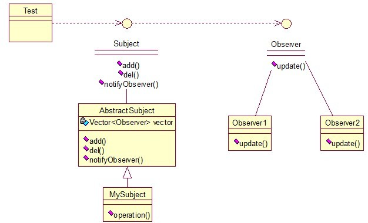
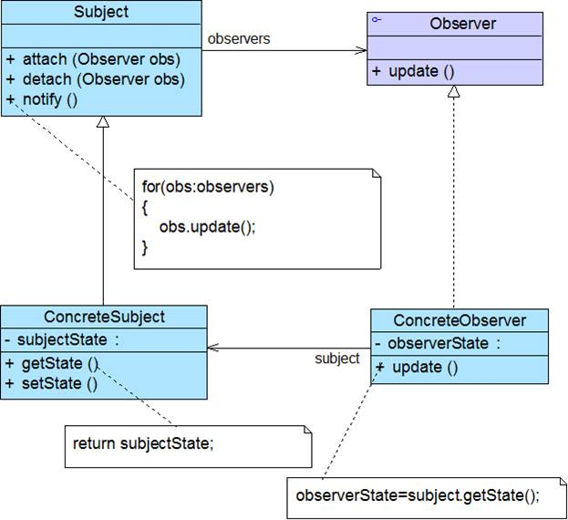
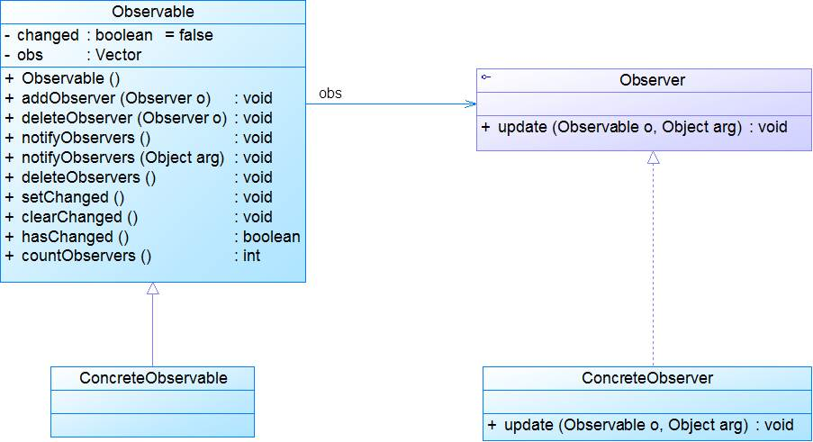
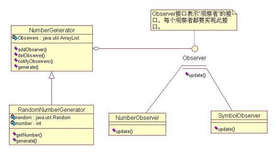

## 介绍

**观察者模式(Observer Pattern)：**定义对象间的一种一对多依赖关系，使得每当一个对象状态发生改变时，其相关依赖对象皆得到通知并被自动更新。观察者模式又叫做发布-订阅（Publish/Subscribe）模式、模型-视图（Model/View）模式、源-监听器（Source/Listener）模式或从属者（Dependents）模式。观察者模式是一种对象行为型模式。

观察者模式很好理解，类似于邮件订阅和RSS订阅，当我们浏览一些博客或wiki时，经常会看到RSS图标，就这的意思是，当你订阅了该文章，如果后续有更新，会及时通知你。其实，简单来讲就一句话：当一个对象变化时，其它依赖该对象的对象都会收到通知，并且随着变化！对象之间是一种一对多的关系。

关系图：

MySubject类就是我们的主对象，Observer1和Observer2是依赖于MySubject的对象，当MySubject变化时，Observer1和Observer2必然变化。AbstractSubject类中定义着需要监控的对象列表，可以对其进行修改：增加或删除被监控对象，且当MySubject变化时，负责通知在列表内存在的对象。

<!-- more -->

Observer接口:

~~~java
public interface Observer {  
    public void update();  
}  
~~~

两个实现类：

~~~java
public class Observer1 implements Observer {   
    @Override  
    public void update() {  
        System.out.println("observer1 has received!");  
    }  
}  
~~~

~~~java
public class Observer2 implements Observer {   
    @Override  
    public void update() {  
        System.out.println("observer2 has received!");  
    }  
}  
~~~

Subject接口及实现类：

~~~java
public interface Subject {    
    /*增加观察者*/  
    public void add(Observer observer);  
      
    /*删除观察者*/  
    public void del(Observer observer);  
      
    /*通知所有的观察者*/  
    public void notifyObservers();  
      
    /*自身的操作*/  
    public void operation();  
}  
~~~

~~~java
//抽象类AbstractSubject定义Subject接口的通用方法
public abstract class AbstractSubject implements Subject {  
    private Vector<Observer> vector = new Vector<Observer>();  
    @Override  
    public void add(Observer observer) {  
        vector.add(observer);  
    }  
  
    @Override  
    public void del(Observer observer) {  
        vector.remove(observer);  
    }  
  
    @Override  
    public void notifyObservers() {  
        Enumeration<Observer> enumo = vector.elements();  
        while(enumo.hasMoreElements()){  
            enumo.nextElement().update();  
        }  
    }  
}  
~~~

~~~java
//MySubject实现自身不同的方法
public class MySubject extends AbstractSubject {    
    @Override  
    public void operation() {  
        System.out.println("update self!");  
        notifyObservers();  
    }   
}  
~~~

测试类：

~~~java
public class ObserverTest {  
    public static void main(String[] args) {  
        Subject sub = new MySubject();  
        sub.add(new Observer1());  
        sub.add(new Observer2());       
        sub.operation();  
    }  
}  
//输出：
/*
update self!
observer1 has received!
observer2 has received!
*/
~~~

## 扩展

### 1. 模式动机

- 建立一种对象与对象之间的依赖关系，一个对象发生改变时将自动通知其他对象，其他对象将相应做出反应。在此，发生改变的对象称为观察目标，而被通知的对象称为观察者，一个观察目标可以对应多个观察者，而且这些观察者之间没有相互联系，可以根据需要增加和删除观察者，使得系统更易于扩展。

### 2. 模式结构 

观察者模式包含如下角色：

- Subject: 抽象目标

  > 目标角色知道它的观察者，可以有任意多个观察者观察同一个目标。并且提供注册和删除观察者对象的接口。目标角色往往由抽象类或者接口来实现。

- ConcreteSubject: 具体目标

  > 将有关状态存入各个Concrete Observer对象。当它的状态发生改变时, 向它的各个观察者发出通知。

- Observer: 抽象观察者

  > 为那些在目标发生改变时需要获得通知的对象定义一个更新接口。抽象观察者角色主要由抽象类或者接口来实现。

- ConcreteObserver: 具体观察者

  > 存储有关状态，这些状态应与目标的状态保持一致。实现Observer的更新接口以使自身状态与目标的状态保持一致。在本角色内也可以维护一个指向Concrete Subject对象的引用。

### 3. 模式分析

- 这一模式中的关键对象是观察目标和观察者，一个目标可以有任意数目的与之相依赖的观察者，一旦目标的状态发生改变，所有的观察者都将得到通知。

  ​

抽象目标类代码：

~~~java
public abstract class Subject {
    protected ArrayList observers = new ArrayList();
	public abstract void attach(Observer observer);
	public abstract void detach(Observer observer);
	public abstract void notify();
} 
~~~

具体目标类代码：

~~~java
public class ConcreteSubject extends Subject {
	public void attach(Observer observer) {
		observers.add(observer);
	}
	
	public void detach(Observer observer) {
		observers.remove(observer);
	}
	
	public void notify() {
		for(Object obs:observers) {
			((Observer)obs).update();
		}
	}	
} 
~~~

抽象观察者代码：

~~~java
public interface Observer {
	public void update();
} 

~~~

具体观察者代码

~~~java
public class ConcreteObserver implements Observer {
	public void update() {
		//具体更新代码
	}
} 
~~~

测试代码：

~~~java
public class Test {
  public static void main(String[] args) {
    Subject subject = new ConcreteSubject();
    Observer observer = new ConcreteObserver();
    subject.attach(observer);
    subject.notify(); 
  }
}
~~~

### 4. 适用场景 

- 一个抽象模型有两个方面，其中一个方面依赖于另一个方面。将这些方面封装在独立的对象中使它们可以各自独立地改变和复用。
- 一个对象的改变将导致其他一个或多个对象也发生改变，而不知道具体有多少对象将发生改变，可以降低对象之间的耦合度。
- 一个对象必须通知其他对象，而并不知道这些对象是谁。
- 需要在系统中创建一个触发链，可以使用观察者模式创建一种链式触发机制。

### 5. 模式应用

1. 委派事件模型
   - JDK1.1版本及以后的各个版本中，事件处理模型采用基于观察者模式的委派事件模型(Delegation
     Event Model, DEM)
   - 在DEM中，事件的发布者称为事件源(Event Source)，而订阅者叫做事件监听器(Event Listener)，在这个过程中还可以通过事件对象(Event Object)来传递与事件相关的信息，可以在事件监听者的实现类中实现事件处理，因此事件监听对象又可以称为事件处理对象。
   - 事件源对象、事件监听对象（事件处理对象）和事件对象构成了Java事件处理模型的三要素。
   - 除了AWT中的事件处理之外，Java语言解析XML的技术SAX2以及Servlet技术的事件处理机制都基于DEM，它们都是观察者模式的应用。
2. 软件开发中
   - 如某电子商务网站可以在执行发送操作后给用户多个发送商品打折信息。
   - 某团队战斗游戏中某队友牺牲将给所有成员提示等。
   - 凡是涉及到一对一或者一对多的对象交互场景都可以使用观察者模式。

### 6. 模式扩展

1. Java语言提供的对观察者模式的支持 

   在JDK的java.util包中，提供了Observable类以及Observer接口。

   

2. MVC模式 

   观察者模式可以用来实现MVC模式，观察者模式中的观察目标就是MVC模式中的模型(Model)，而观察者就是MVC中的视图(View)，控制器(Controller)充当两者之间的中介者(Mediator)。当模型层的数据发生改变时，视图层将自动改变其显示内容。

### 7. 模式优缺点

1. 优点
   - 观察者模式可以实现表示层和数据逻辑层的分离，并定义了稳定的消息更新传递机制，抽象了更新接口，使得可以有各种各样不同的表示层作为具体观察者角色。
   - 观察者模式在观察目标和观察者之间建立一个抽象的耦合。
   - 观察者模式支持广播通信。
   - 观察者模式符合**开闭原则**的要求。
2. 缺点
   - 如果一个观察目标对象有很多直接和间接的观察者的话，将所有的观察者都通知到会花费很多时间。
   - 如果在观察者和观察目标之间有循环依赖的话，观察目标会触发它们之间进行循环调用，可能导致系统崩溃。
   - 观察者模式没有相应的机制让观察者知道所观察的目标对象是怎么发生变化的，而仅仅只是知道观察目标发生了变化。

## 举例

一个随机数产生对象和两个观察者，这两个观察者都在随机数产生对象那里注册了，意思说如果你产生了新的数字，就通知我一声。

结构图：

类说明：

| 名称                    | 功能说明                |
| --------------------- | ------------------- |
| Observer              | 观察者接口，要成为观察者必须实现此接口 |
| NumberGenerator       | 产生数值的抽象类            |
| RandomNumberGenerator | 产生随机数的类             |
| NumberObserver        | 数字观察者，会打印出变化的数字     |
| SymbolObserver        | 符号观察者，打印N个符号        |

Observer接口：

~~~java
public interface Observer {
	public abstract void update(NumberGenerator generator);
}
~~~

NumberGenerator抽象类：

~~~java
public abstract class NumberGenerator {
	private ArrayList observers = new ArrayList(); //存储Observer
	
    /** 添加观察者*/
	public void addObserver(Observer observer) {
		observers.add(observer);
	}
	
    /** 删除观察者*/
	public void delObserver(Observer observer) {
		observers.remove(observer);
	}
  
	/** 通知所有观察者*/
	public void notifyObservers() {
		Iterator it = observers.iterator();
		while(it.hasNext()) {
			Observer o =(Observer) it.next();
			o.update(this);//this相当于上面提到的邮局名
		}
	}
	public abstract int getNumber();//获取数字
	public abstract void generate();//产生数字
}
~~~

RandomNumberGenerator类：

~~~java
public class RandomNumberGenerator extends NumberGenerator{
	private Random random = new Random();//随机数产生器
	private int number; //用于存放数字
	
    public void generate() {
		for(int i=0 ; i < 5; i++) {
		number = random.nextInt(10);//产生10以内的随机数
		notifyObservers(); //有新产生的数字，通知所有注册的观察者
		}
	}
	
    /** 获得数字*/
	public int getNumber() {
		return number;
	}
}
~~~

NumberObserver：数字观察者

~~~java
public class NumberObserver implements Observer{
	public void update(NumberGenerator generator) {
		System.out.println("NumberObserver:"+ generator.getNumber());
		try {
			Thread.sleep(1000 * 3); //为了能清楚的看到输出，休眠3秒钟。
		}catch(InterruptedException e) {
			e.printStackTrace();
		}
	}
}
~~~

SymbolObserver：符号观察者

~~~java
public class SymbolObserver implements Observer{
	public void update(NumberGenerator generator) {
		System.out.print("SymbolObserver:");
		int count = generator.getNumber();
		for(int i = 0 ; i < count; i ++) {
			System.out.print("*^_^* ");
		}
		System.out.println("");
		try {
			Thread.sleep(1000 * 3);
		}catch(InterruptedException e){
			e.printStackTrace();
		}
	}
}
~~~

测试类：

~~~java
public class Test {
	public static void main(String[] args) {
		//实例化数字产生对象
		NumberGenerator generator = new RandomNumberGenerator();
		//实例化观察者
		Observer observer1 = new NumberObserver();
		Observer observer2 = new SymbolObserver();
		//注册观察者
		generator.addObserver(observer1);
		generator.addObserver(observer2);
		generator.generate(); //产生数字
	}
}
~~~

测试结果：

~~~java
/*
NumberObserver:5
SymbolObserver:*^_^* *^_^* *^_^* *^_^* *^_^* 
NumberObserver:5
SymbolObserver:*^_^* *^_^* *^_^* *^_^* *^_^* 
NumberObserver:9
SymbolObserver:*^_^* *^_^* *^_^* *^_^* *^_^* *^_^* *^_^* *^_^* *^_^* 
NumberObserver:7
SymbolObserver:*^_^* *^_^* *^_^* *^_^* *^_^* *^_^* *^_^* 
NumberObserver:7
SymbolObserver:*^_^* *^_^* *^_^* *^_^* *^_^* *^_^* *^_^* 
*/
~~~

