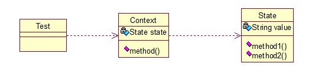
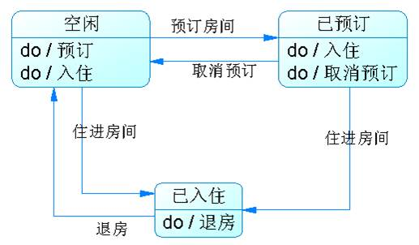

## 介绍

**状态模式(State Pattern) ：**允许一个对象在其内部状态改变时改变它的行为，对外看起来似乎修改了它的类。其别名为状态对象(Objects for States)，状态模式是一种对象行为型模式。

核心思想就是：当对象的状态改变时，同时改变其行为，很好理解！就拿QQ来说，有几种状态，在线、隐身、忙碌等，每个状态对应不同的操作，而且你的好友也能看到你的状态，所以，状态模式就两点：

1. 可以通过改变状态来获得不同的行为。
2. 你的好友能同时看到你的变化。

关系图：

<!-- more -->

State类是个状态类，Context类可以实现切换。

状态类：

~~~java
public class State {   
    private String value;  
      
    public String getValue() {  
        return value;  
    }  
  
    public void setValue(String value) {  
        this.value = value;  
    }  
  
    public void method1(){  
        System.out.println("execute the first opt!");  
    }  
      
    public void method2(){  
        System.out.println("execute the second opt!");  
    }  
}  
~~~

切换类：

~~~java
 public class Context {  
    private State state;  
  
    public Context(State state) {  
        this.state = state;  
    }  
  
    public State getState() {  
        return state;  
    }  
  
    public void setState(State state) {  
        this.state = state;  
    }  
  
    public void method() {  
        if (state.getValue().equals("state1")) {  
            state.method1();  
        } else if (state.getValue().equals("state2")) {  
            state.method2();  
        }  
    }  
}  
~~~

测试类：

~~~java
public class Test {  
    public static void main(String[] args) {  
        State state = new State();  
        Context context = new Context(state);  
          
        //设置第一种状态  
        state.setValue("state1");  
        context.method();  
          
        //设置第二种状态  
        state.setValue("state2");  
        context.method();  
    }  
}  
//输出：
/*
execute the first opt!
execute the second opt!
*/
~~~

根据这个特性，状态模式在日常开发中用的挺多的，尤其是做网站的时候，我们有时希望根据对象的某一属性，区别开他们的一些功能，比如说简单的权限控制等。

## 扩展

### 1. 模式动机

- 一个对象的行为取决于一个或多个动态变化的属性，这样的属性叫做状态，这样的对象叫做有状态的 (stateful)对象。

### 2. 模式结构

状态模式包含如下角色：

- Context: 环境类
- State: 抽象状态类
- ConcreteState: 具体状态类

### 3. 模式分析

- 状态模式描述了对象状态的变化以及对象如何在每一种状态下表现出不同的行为。

- 状态模式的关键是引入了一个抽象类来专门表示对象的状态，这个类我们叫做抽象状态类，而对象的每一种具体状态类都继承了该类，并在不同具体状态类中实现了不同状态的行为，包括各种状态之间的转换。

- 房间入住用状态模式改进的例子

  需求：

  

  流程代码：

  ~~~java
  if(state=="空闲") {
  	if(预订房间) {
  		预订操作;
  		state="已预订";
  	}else if(住进房间) {
  		入住操作;
  		state="已入住";
  	}
  }
  else if(state=="已预订") {
  	if(住进房间) {
  		入住操作;
  		state="已入住";
  	}else if(取消预订) {
  		取消操作;
  		state="空闲";
  	}
  }
  ~~~

  状态模式：

  

  ~~~java
  //重构之后的“空闲状态类”示例代码
  if(预订房间) {
  	//预订操作;
  	context.setState(new 已预订状态类());
  }else if(住进房间) {
  	//入住操作;
  	context.setState(new 已入住状态类());
  }
  ~~~

- 在状态模式结构中需要理解环境类与抽象状态类的作用：

  - 环境类实际上就是拥有状态的对象，环境类有时候可以充当状态管理器(State Manager)的角色，可以在环境类中对状态进行切换操作。
  - 抽象状态类可以是抽象类，也可以是接口，不同状态类就是继承这个父类的不同子类，状态类的产生是由于环境类存在多个状态，同时还满足两个条件：这些状态经常需要切换，在不同的状态下对象的行为不同。因此可以将不同对象下的行为单独提取出来封装在具体的状态类中，使得环境类对象在其内部状态改变时可以改变它的行为，对象看起来似乎修改了它的类，而实际上是由于切换到不同的具体状态类实现的。由于环境类可以设置为任一具体状态类，因此它针对抽象状态类进行编程，在程序运行时可以将任一具体状态类的对象设置到环境类中，从而使得环境类可以改变内部状态，并且改变行为。

### 4. 适用场景

- 对象的行为依赖于它的状态（属性）并且可以根据它的状态改变而改变它的相关行为。
- 代码中包含大量与对象状态有关的条件语句，这些条件语句的出现，会导致代码的可维护性和灵活性变差，不能方便地增加和删除状态，使客户类与类库之间的耦合增强。在这些条件语句中包含了对象的行为，而且这些条件对应于对象的各种状态。

### 5. 模式应用

- 状态模式在工作流或游戏等类型的软件中得以广泛使用，甚至可以用于这些系统的核心功能设计，如在政府OA办公系统中，一个批文的状态有多种：尚未办理；正在办理；正在批示；正在审核；已经完成等各种状态，而且批文状态不同时对批文的操作也有所差异。使用状态模式可以描述工作流对象（如批文）的状态转换以及不同状态下它所具有的行为。
- 在目前主流的RPG（Role Play Game，角色扮演游戏）中，使用状态模式可以对游戏角色进行控制，游戏角色的升级伴随着其状态的变化和行为的变化。对于游戏程序本身也可以通过状态模式进行总控，一个游戏活动包括开始、运行、结束等状态，通过对状态的控制可以控制系统的行为，决定游戏的各个方面，因此可以使用状态模式对整个游戏的架构进行设计与实现。

### 6. 模式扩展

1. 共享状态

   - 在有些情况下多个环境对象需要共享同一个状态，如果希望在系统中实现多个环境对象实例共享一个或多个状态对象，那么需要将这些状态对象定义为环境的静态成员对象。

     ~~~java
     class Switch {
     	private static State state,onState,offState;
     	private String name;
     	
     	public Switch(String name) {
     		this.name=name;
     		onState=new OnState();
     		offState=new OffState();
     		state=onState;
     	}
     	
     	public void setState(State state) {
     		this.state=state;
     	}
     	
     	public void on() {
     		System.out.print(name);
     		state.on(this);
     	}
     	
     	public void off() {
     		System.out.print(name);
     		state.off(this);
     	}
     	
     	public static State getState(String type) {
     		if(type.equalsIgnoreCase("on")) {
     			return onState;
     		}else {
     			return offState;
     		}
     	}
     }

     abstract class State {
     	public abstract void on(Switch s);
     	public abstract void off(Switch s);
     }

     class OnState extends State {
     	public void on(Switch s) {
     		System.out.println("已经打开！");
     	}
     	
     	public void off(Switch s) {
     		System.out.println("关闭！");
     		s.setState(Switch.getState("off"));
     		
     	}
     }

     class OffState extends State {
     	public void on(Switch s) {
     		System.out.println("打开！");
     		s.setState(Switch.getState("on"));
     	}
     	
     	public void off(Switch s) {
     		System.out.println("已经关闭！");
     	}
     }

     class Client {
     	public static void main(String args[]) {
     		Switch s1,s2;
     		s1=new Switch("开关1");
     		s2=new Switch("开关2");
     		
     		s1.on();
     		s2.on();
     		s1.off();
     		s2.off();
     		s2.on();
     		s1.on();	
     	}
     }
     ~~~

2. 简单状态模式与可切换状态的状态模式：

   - 简单状态模式是指状态都相互独立，状态之间无须进行转换的状态模式，这是最简单的一种状态模式。对于这种状态模式，每个状态类都封装与状态相关的操作，而无须关心状态的切换，可以在客户端直接实例化状态类，然后将状态对象设置到环境类中。如果是这种简单的状态模式，它遵循“开闭原则”，在客户端可以针对抽象状态类进行编程，而将具体状态类写到配置文件中，同时增加新的状态类对原有系统也不造成任何影响。
   - 大多数的状态模式都是可以切换状态的状态模式，在实现状态切换时，在具体状态类内部需要调用环境类Context的setState()方法进行状态的转换操作，在具体状态类中可以调用到环境类的方法，因此状态类与环境类之间通常还存在关联关系或者依赖关系。通过在状态类中引用环境类的对象来回调环境类的setState()方法实现状态的切换。在这种可以切换状态的状态模式中，增加新的状态类可能需要修改其他某些状态类甚至环境类的源代码，否则系统无法切换到新增状态。

### 7. 模式优缺点

1. 优点
   - 封装了转换规则。
   - 枚举可能的状态，在枚举状态之前需要确定状态种类。
   - 将所有与某个状态有关的行为放到一个类中，并且可以方便地增加新的状态，只需要改变对象状态即可改变对象的行为。
   - 允许状态转换逻辑与状态对象合成一体，而不是某一个巨大的条件语句块。
   - 可以让多个环境对象共享一个状态对象，从而减少系统中对象的个数。
2. 缺点
   - 状态模式的使用必然会增加系统类和对象的个数。
   - 状态模式的结构与实现都较为复杂，如果使用不当将导致程序结构和代码的混乱。
   - 状态模式对**开闭原则**的支持并不太好，对于可以切换状态的状态模式，增加新的状态类需要修改那些负责状态转换的源代码，否则无法切换到新增状态；而且修改某个状态类的行为也需修改对应类的源代码。

