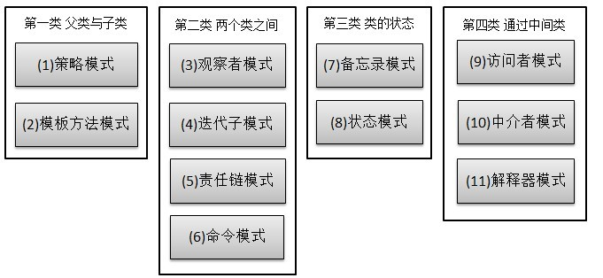

下面开始行为型模式。11种行为型模式的关系：

## 介绍

**策略模式(Strategy Pattern)：**定义了一系列算法，并将每个算法封装起来，使他们可以相互替换，且算法的变化不会影响到使用算法的客户。需要设计一个接口，为一系列实现类提供统一的方法，多个实现类实现该接口，设计一个抽象类（可有可无，属于辅助类），提供辅助函数。策略模式是一种对象行为型模式。

<!--more -->

关系图如下：

统一接口：

~~~java
public interface ICalculator {  
    public int calculate(String exp);  
}  
~~~

辅助类：

~~~java
public abstract class AbstractCalculator {  
      
    public int[] split(String exp,String opt){  
        String array[] = exp.split(opt);  
        int arrayInt[] = new int[2];  
        arrayInt[0] = Integer.parseInt(array[0]);  
        arrayInt[1] = Integer.parseInt(array[1]);  
        return arrayInt;  
    }  
}  
~~~

三个实现类：

~~~java
public class Plus extends AbstractCalculator implements ICalculator {   
    @Override  
    public int calculate(String exp) {  
        int arrayInt[] = split(exp,"\\+");  
        return arrayInt[0]+arrayInt[1];  
    }  
}  
~~~

~~~java
public class Minus extends AbstractCalculator implements ICalculator {  
    @Override  
    public int calculate(String exp) {  
        int arrayInt[] = split(exp,"-");  
        return arrayInt[0]-arrayInt[1];  
    }  
  
}  
~~~

~~~java
public class Multiply extends AbstractCalculator implements ICalculator {  
  
    @Override  
    public int calculate(String exp) {  
        int arrayInt[] = split(exp,"\\*");  
        return arrayInt[0]*arrayInt[1];  
    }  
}  
~~~

测试类：

~~~java
public class StrategyTest {  
    public static void main(String[] args) {  
        String exp = "2+8";  
        ICalculator cal = new Plus();  
        int result = cal.calculate(exp);  
        System.out.println(result);  
    }  
}  
~~~

策略模式的决定权在用户，系统本身提供不同算法的实现，新增或者删除算法，对各种算法做封装。因此，策略模式多用在算法决策系统中，外部用户只需要决定用哪个算法即可。

## 扩展

### 1.模式动机 

- 完成一项任务，往往可以有多种不同的方式，每一种方式称为一个策略，我们可以根据环境或者条件的不同选择不同的策略来完成该项任务。
- 定义一些独立的类来封装不同的算法，每一个类封装一个具体的算法，在这里，每一个封装算法的类我们都可以称之为策略(Strategy)，为了保证这些策略的一致性，一般会用一个抽象的策略类来做算法的定义，而具体每种算法则对应于一个具体策略类。

### 2. 模式结构

策略模式包含如下角色：

- Context: 环境类
- Strategy: 抽象策略类
- ConcreteStrategy: 具体策略类

### 3. 模式分析

- 策略模式是对算法的封装，它把算法的责任和算法本身分割开，委派给不同的对象管理。策略模式通常把一个系列的算法封装到一系列的策略类里面，作为一个抽象策略类的子类。用一句话来说，就是**准备一组算法，并将每一个算法封装起来，使得它们可以互换**。

不使用策略模式的代码：

~~~java
public class Context{
    public void algorithm(String type)  {
        if(type == "strategyA"){
            //算法A
        }
        else if(type == "strategyB"){
            //算法B
        }
        else if(type == "strategyC"){
            //算法C
        }
    }
} 
~~~

重构之后的抽象策略类：

~~~java
public abstract class AbstractStrategy{
    public abstract void algorithm();  
} 
~~~

重构之后的具体策略类：

~~~java
public class ConcreteStrategyA extends AbstractStrategy{
    public void algorithm(){
        //算法A
    }
} 
~~~

重构之后的环境类：

~~~java
public class Context{
    private AbstractStrategy strategy;
    public void setStrategy(AbstractStrategy strategy){
        this.strategy= strategy;
    }
    public void algorithm(){
        strategy.algorithm();
    }
} 
~~~

测试代码：

~~~java
public class Test{
  public static void main(String[] args){
    AbstractStrategy strategy;
    Context context = new Context();
	strategy = new ConcreteStrategyA();
	context.setStrategy(strategy);
	context.algorithm();
  }
}
~~~

### 4. 适用场景

- 如果在一个系统里面有许多类，它们之间的区别仅在于它们的行为，那么使用策略模式可以动态地让一个对象在许多行为中选择一种行为。
- 一个系统需要动态地在几种算法中选择一种。
- 如果一个对象有很多的行为，如果不用恰当的模式，这些行为就只好使用多重的条件选择语句来实现。
- 不希望客户端知道复杂的、与算法相关的数据结构，在具体策略类中封装算法和相关的数据结构，提高算法的保密性与安全性。

### 5. 模式应用

- JavaSE的容器布局管理就是策略模式应用的一个经典实例。

  

### 6. 模式扩展

策略模式与状态模式 

- 可以通过环境类状态的个数来决定是使用策略模式还是状态模式。
- 策略模式的环境类自己选择一个具体策略类，具体策略类无须关心环境类；而状态模式的环境类由于外在因素需要放进一个具体状态中，以便通过其方法实现状态的切换，因此环境类和状态类之间存在一种双向的关联关系。
- 使用策略模式时，客户端需要知道所选的具体策略是哪一个，而使用状态模式时，客户端无须关心具体状态，环境类的状态会根据用户的操作自动转换。
- 如果系统中某个类的对象存在多种状态，不同状态下行为有差异，而且这些状态之间可以发生转换时使用状态模式；如果系统中某个类的某一行为存在多种实现方式，而且这些实现方式可以互换时使用策略模式。

### 7. 模式优缺点

1. 优点
   - 策略模式提供了对“开闭原则”的完美支持，用户可以在不修改原有系统的基础上选择算法或行为，也可以灵活地增加新的算法或行为。
   - 策略模式提供了管理相关的算法族的办法。
   - 策略模式提供了可以替换继承关系的办法。
   - 使用策略模式可以避免使用多重条件转移语句。
2. 缺点
   - 客户端必须知道所有的策略类，并自行决定使用哪一个策略类。
   - 策略模式将造成产生很多策略类，可以通过使用享元模式在一定程度上减少对象的数量。

## 举例

设计一个贩卖各类书籍的电子商务网站的购物车系统。折扣是根据以下的几个算法中的一个进行的：

- 算法一：对初级会员没有折扣。
- 算法二：对中级会员提供10%的促销折扣。
- 算法三：对高级会员提供20%的促销折扣。

结构图：

抽象折扣类：

~~~java
public interface MemberStrategy {
    /**
     * 计算图书的价格
     * @param booksPrice    图书的原价
     * @return    计算出打折后的价格
     */
    public double calcPrice(double booksPrice);
}
~~~

初级会员折扣类：

~~~java
public class PrimaryMemberStrategy implements MemberStrategy {
    @Override
    public double calcPrice(double booksPrice) {        
        System.out.println("对于初级会员的没有折扣");
        return booksPrice;
    }
}
~~~

中级会员折扣类：

~~~java
public class IntermediateMemberStrategy implements MemberStrategy {
    @Override
    public double calcPrice(double booksPrice) {
        System.out.println("对于中级会员的折扣为10%");
        return booksPrice * 0.9;
    }
}
~~~

高级会员折扣类：

~~~java
public class AdvancedMemberStrategy implements MemberStrategy {
    @Override
    public double calcPrice(double booksPrice) {     
        System.out.println("对于高级会员的折扣为20%");
        return booksPrice * 0.8;
    }
}
~~~

价格类：

~~~java
public class Price {
    //持有一个具体的策略对象
    private MemberStrategy strategy;
    /**
     * 构造函数，传入一个具体的策略对象
     * @param strategy    具体的策略对象
     */
    public Price(MemberStrategy strategy){
        this.strategy = strategy;
    }
    
    /**
     * 计算图书的价格
     * @param booksPrice    图书的原价
     * @return    计算出打折后的价格
     */
    public double quote(double booksPrice){
        return this.strategy.calcPrice(booksPrice);
    }
}
~~~

测试类：

~~~java
public class Client {
    public static void main(String[] args) {
        //选择并创建需要使用的策略对象
        MemberStrategy strategy = new AdvancedMemberStrategy();
        //创建环境
        Price price = new Price(strategy);
        //计算价格
        double quote = price.quote(300);
        System.out.println("图书的最终价格为：" + quote);
    }
}
~~~

