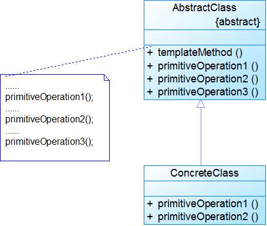

## 介绍

**模板方法模式(Template Method Pattern)：**定义一个操作中算法的骨架，而将一些步骤延迟到子类中，模板方法使得子类可以不改变一个算法的结构即可重定义该算法的某些特定步骤。模板方法是一种类行为型模式。

模板方法模式就是指：一个抽象类中，有一个主方法，再定义1...n个方法，可以是抽象的，也可以是实际的方法，定义一个类，继承该抽象类，重写抽象方法，通过调用抽象类，实现对子类的调用。

先看个关系图：

就是在AbstractCalculator类中定义一个主方法calculate，calculate()调用spilt()等，Plus和Minus分别继承AbstractCalculator类，通过对AbstractCalculator的调用实现对子类的调用。

<!-- more -->

抽象类：

~~~java
public abstract class AbstractCalculator {    
    /*主方法，实现对本类其它方法的调用*/  
    public final int calculate(String exp,String opt){  
        int array[] = split(exp,opt);  
        return calculate(array[0],array[1]);  
    }  
      
    /*被子类重写的方法*/  
    abstract public int calculate(int num1,int num2);  
      
    public int[] split(String exp,String opt){  
        String array[] = exp.split(opt);  
        int arrayInt[] = new int[2];  
        arrayInt[0] = Integer.parseInt(array[0]);  
        arrayInt[1] = Integer.parseInt(array[1]);  
        return arrayInt;  
    }  
}  
~~~

子类：

~~~java
public class Plus extends AbstractCalculator {  
    @Override  
    public int calculate(int num1,int num2) {  
        return num1 + num2;  
    }  
}  
~~~

测试类：

~~~java
public class StrategyTest {  
    public static void main(String[] args) {  
        String exp = "8+8";  
        AbstractCalculator cal = new Plus();  
        int result = cal.calculate(exp, "\\+");  
        System.out.println(result);  
    }  
}  
~~~

程序的执行过程：首先将exp和"\\+"做参数，调用AbstractCalculator类里的calculate(String,String)方法，在calculate(String,String)里调用同类的split()，之后再调用calculate(int ,int)方法，从这个方法进入到子类中，执行完return num1 + num2后，将值返回到AbstractCalculator类，赋给result，打印出来。

## 扩展

### 1.模式动机 

- 模板方法模式是基于继承的代码复用基本技术，模板方法模式的结构和用法也是面向对象设计的核心之一。在模板方法模式中，可以将相同的代码放在父类中，而将不同的方法实现放在不同的子类中。
- 在模板方法模式中，我们需要准备一个抽象类，将部分逻辑以具体方法以及具体构造函数的形式实现，然后声明一些抽象方法来让子类实现剩余的逻辑。不同的子类可以以不同的方式实现这些抽象方法，从而对剩余的逻辑有不同的实现，这就是模板方法模式的用意。模板方法模式体现了面向对象的诸多重要思想，是一种使用频率较高的模式。

### 2.模式结构 

模板方法模式包含如下角色：

- AbstractClass: 抽象类 
- ConcreteClass: 具体子类 

### 3. 模式分析

- 模板方法模式是一种类的行为型模式，在它的结构图中只有类之间的继承关系，没有对象关联关系。

- 实现这些具体逻辑步骤的方法称为基本方法(Primitive Method)，而将这些基本法方法汇总起来的方法称为模板方法(Template Method)。

  > 模板方法：一个模板方法是定义在抽象类中的、把基本操作方法组合在一起形成一个总算法或一个总行为的方法。
  >
  > 基本方法：基本方法是实现算法各个步骤的方法，是模板方法的组成部分。
  >
  > - 抽象方法(Abstract Method)
  > - 具体方法(Concrete Method)
  > - 钩子方法(Hook Method)

典型抽象类代码：

~~~java
public abstract class AbstractClass{
    public void templateMethod() {  //模板方法
        primitiveOperation1();
        primitiveOperation2();
        primitiveOperation3();
    }
    public void primitiveOperation1() {    //基本方法—具体方法
        //实现代码
    }
    public abstract void primitiveOperation2();    //基本方法—抽象方法
    
    public void primitiveOperation3() {    //基本方法—钩子方法
    
    }
} 
~~~

典型的具体子类代码：

~~~java
public class ConcreteClass extends AbstractClass{
     public void primitiveOperation2() {
        //实现代码
    }
    public void primitiveOperation3() {
        //实现代码
    }
} 

~~~

- 在模板方法模式中，由于面向对象的多态性，子类对象在运行时将覆盖父类对象，子类中定义的方法也将覆盖父类中定义的方法，因此程序在运行时，具体子类的基本方法将覆盖父类中定义的基本方法，子类的钩子方法也将覆盖父类的钩子方法，从而可以通过在子类中实现的钩子方法对父类方法的执行进行约束，实现子类对父类行为的反向控制。

### 4. 适用场景

- 一次性实现一个算法的不变的部分，并将可变的行为留给子类来实现。
- 各子类中公共的行为应被提取出来并集中到一个公共父类中以避免代码重复。
- 对一些复杂的算法进行分割，将其算法中固定不变的部分设计为模板方法和父类具体方法，而一些可以改变的细节由其子类来实现。
- 控制子类的扩展。

### 5. 模式应用

- 模板方法模式广泛应用于框架设计（如Spring，Struts等）中，以确保父类控制处理流程的逻辑顺序（如框架的初始化）。

- Java单元测试工具JUnit中的TestCase类的设计：

  ~~~java
  public void runBare() throws Throwable {
  　setUp();
  　try {
  　　runTest();
  　}
  　finally {
  　　tearDown();
  　}
  }
  ~~~

### 6. 模式扩展

- 模板方法模式鼓励我们恰当使用继承，此模式可以用来改写一些拥有相同功能的相关类，将可复用的一般性的行为代码移到父类里面，而将特殊化的行为代码移到子类里面。这也进一步说明，虽然继承复用存在一些问题，但是在某些情况下还是可以给开发人员带来方便，模板方法模式就是体现继承优势的模式之一。

- 在模板方法模式中，好莱坞原则体现在：子类不需要调用父类，而通过父类来调用子类，将某些步骤的实现写在子类中，由父类来控制整个过程。

- 钩子方法

  1. 钩子方法的引入使得子类可以控制父类的行为。

  2. 最简单的钩子方法就是空方法，也可以在钩子方法中定义一个默认的实现，如果子类不覆盖钩子方法，则执行父类的默认实现代码。

  3. 比较复杂一点的钩子方法可以对其他方法进行约束，这种钩子方法通常返回一个boolean类型，即返回true或false，用来判断是否执行某一个基本方法。

     ~~~java
     public abstract class HookDemo {
     	public abstract void getData();
     	
         public void convertData() {
     		System.out.println("通用的数据转换操作。");
     	}
     	
     	public abstract void displayData();

         public void process() {
             getData();
             if(isValid()) {
                 convertData();	
             }
        	    displayData();
         }
         
         public boolean isValid() {
         	return true;
         }
     } 

     class SubHookDemo extends HookDemo {
     	public void getData() {
     		System.out.println("从XML配置文件中获取数据。");
     	}
     	
     	public void displayData() {
     		System.out.println("以柱状图显示数据。");
     	}
     	
     	public boolean isValid() {
         	return false;
         }	
     }

     class Client {
     	public static void main(String a[]) {
     		HookDemo hd;	
     		hd=new SubHookDemo();
     		hd.process();
     	}
     }
     ~~~

### 7. 模式优缺点

1. 优点

   - 模板方法模式在一个类中形式化地定义算法，而由它的子类实现细节的处理。

   - 模板方法模式是一种代码复用的基本技术。

   - 模板方法模式导致一种反向的控制结构，通过一个父类调用其子类的操作，通过对子类的扩展增加新的行为，

     符合**开闭原则**。

2. 缺点

   - 每个不同的实现都需要定义一个子类，这会导致类的个数增加，系统更加庞大，设计也更加抽象，但是更加符合**单一职责原则**，使得类的内聚性得以提高。

