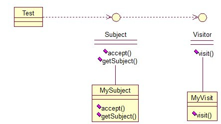

## 介绍

**访问者模式(Visitor Pattern)：**表示一个作用于某对象结构中的各元素的操作，它使我们可以在不改变各元素的类的前提下定义作用于这些元素的新操作。访问者模式是一种对象行为型模式。

简单来说，访问者模式就是一种分离对象数据结构与行为的方法，通过这种分离，可达到为一个被访问者动态添加新的操作而无需做其它的修改的效果。

关系图：

<!-- more -->

Visitor接口：存放要访问的对象

~~~java
public interface Visitor {  
    public void visit(Subject sub);  
}
~~~

实现类：

~~~java
public class MyVisitor implements Visitor {  
    @Override  
    public void visit(Subject sub) {  
        System.out.println("visit the subject："+sub.getSubject());  
    }  
}  
~~~

Subject接口：accept方法，接受将要访问它的对象，getSubject()获取将要被访问的属性

~~~java
public interface Subject {  
    public void accept(Visitor visitor);  
    public String getSubject();  
}  
~~~

实现类：

~~~java
public class MySubject implements Subject {  
    @Override  
    public void accept(Visitor visitor) {  
        visitor.visit(this);  
    }  
  
    @Override  
    public String getSubject() {  
        return "love";  
    }  
}  
~~~

测试类：

~~~java
public class Test {  
    public static void main(String[] args) {     
        Visitor visitor = new MyVisitor();  
        Subject sub = new MySubject();  
        sub.accept(visitor);      
    }  
}  
//输出：visit the subject：love
~~~

该模式适用场景：如果我们想为一个现有的类增加新功能，不得不考虑几个事情：

1. 新功能会不会与现有功能出现兼容性问题？
2. 以后会不会再需要添加？
3. 如果类不允许修改代码怎么办？

面对这些问题，最好的解决方法就是使用访问者模式，访问者模式适用于数据结构相对稳定的系统，把数据结构和算法解耦

## 扩展

### 1. 模式动机

- 在实际使用时，对同一集合对象的操作并不是唯一的，对相同的元素对象可能存在多种不同的操作方式。而且这些操作方式并不稳定，可能还需要增加新的操作，以满足新的业务需求。此时，访问者模式就是一个值得考虑的解决方案。
- 访问者模式的目的是封装一些施加于某种数据结构元素之上的操作，一旦这些操作需要修改的话，接受这个操作的数据结构可以保持不变。为不同类型的元素提供多种访问操作方式，且可以在不修改原有系统的情况下增加新的操作方式。

### 2. 模式结构

访问者模式包含如下角色：

- Vistor: 抽象访问者
- ConcreteVisitor: 具体访问者
- Element: 抽象元素
- ConcreteElement: 具体元素 
- ObjectStructure: 对象结构

### 3. 模式分析

- 访问者模式中对象结构存储了不同类型的元素对象，以供不同访问者访问。
- 访问者模式包括两个层次结构，一个是访问者层次结构，提供了抽象访问者和具体访问者，一个是元素层次结构，提供了抽象元素和具体元素。
- 相同的访问者可以以不同的方式访问不同的元素，相同的元素可以接受不同访问者以不同访问方式访问。在访问者模式中，增加新的访问者无须修改原有系统，系统具有较好的可扩展性

典型的抽象访问者类代码：

~~~java
public abstract class Visitor {
	public abstract void visit(ConcreteElementA elementA);
	public abstract void visit(ConcreteElementB elementB);
	public void visit(ConcreteElementC elementC) {
		//元素ConcreteElementC操作代码
	}
} 
~~~

典型的具体访问者类代码：

~~~java
public class ConcreteVisitor extends Visitor {
	public void visit(ConcreteElementA elementA) {
		//元素ConcreteElementA操作代码
	}
	public void visit(ConcreteElementB elementB) {
		//元素ConcreteElementB操作代码
	}
} 
~~~

典型的抽象元素类代码：

~~~java
public interface Element {
	public void accept(Visitor visitor);
} 

~~~

具体元素类代码：

~~~java
public class ConcreteElementA implements Element {
	public void accept(Visitor visitor) {
		visitor.visit(this);
	}
	
	public void operationA() {
		//业务方法
	}
} 
~~~

典型的对象结构类代码：

~~~java
public class ObjectStructure {
	private ArrayList list=new ArrayList();
	public void accept(Visitor visitor) {
		Iterator i=list.iterator();
		
		while(i.hasNext()) {
			((Element)i.next()).accept(visitor);	
		}
	}
	public void addElement(Element element) {
		list.add(element);
	}
	public void removeElement(Element element) {
		list.remove(element);
	}
} 
~~~

### 4. 适用场景

- 一个对象结构包含很多类型的对象，希望对这些对象实施一些依赖其具体类型的操作。在访问者中针对每一种具体的类型都提供了一个访问操作，不同类型的对象可以有不同的访问操作。
- 需要对一个对象结构中的对象进行很多不同的并且不相关的操作，而需要避免让这些操作污染这些对象的类，也不希望在增加新操作时修改这些类。访问者模式使得我们可以将相关的访问操作集中起来定义在访问者类中，对象结构可以被多个不同的访问者类所使用，将对象本身与对象的访问操作分离。
- 对象结构中对象对应的类很少改变，但经常需要在此对象结构上定义新的操作。

### 5. 模式应用

1. 在一些编译器的设计中运用了访问者模式，程序代码是被访问的对象，它包括变量定义、变量赋值、逻辑运算、算术运算等语句，编译器需要对代码进行分析，如检查变量是否定义、变量是否赋值、算术运算是否合法等，可以将不同的操作封装在不同的类中，如检查变量定义的类、检查变量赋值的类、检查算术运算是否合法的类，这些类就是具体访问者，可以访问程序代码中不同类型的语句。在编译过程中除了代码分析外，还包含代码优化、空间分配和代码生成等部分，也可以将每一个不同编译阶段的操作封装到了跟该阶段有关的一个访问者类中。

2. 在常用的Java XML处理技术DOM4J中，可以通过访问者模式的方式来读取并解析XML文档，VisitorSupport是DOM4J提供的Visitor接口的默认适配器，具体访问者只需继承VisitorSupport类即可。

   ~~~java
   public class MyVisitor extends VisitorSupport {
       public void visit(Element element) {
           System.out.println(element.getName());
       }
       public void visit(Attribute attr) {
           System.out.println(attr.getName());
       }
   }
   ~~~

### 6. 模式扩展

1. 与其他模式联用
   - 由于访问者模式需要对对象结构进行操作，而对象结构本身是一个元素对象的集合，因此访问者模式经常需要与迭代器模式联用，在对象结构中使用迭代器来遍历元素对象。
   - 在访问者模式中，元素对象可能存在容器对象和叶子对象，因此可以结合组合模式来进行设计。
2. 访问者模式以一种倾斜的方式支持开闭原则，增加新的访问者方便，但是增加新的元素很困难。

### 7. 模式优缺点

1. 优点
   - 使得增加新的访问操作变得很容易。
   - 将有关元素对象的访问行为集中到一个访问者对象中，而不是分散到一个个的元素类中。
   - 可以跨过类的等级结构访问属于不同的等级结构的元素类。
   - 让用户能够在不修改现有类层次结构的情况下，定义该类层次结构的操作。
2. 缺点
   - 增加新的元素类很困难。在访问者模式中，每增加一个新的元素类都意味着要在抽象访问者角色中增加一个新的抽象操作，并在每一个具体访问者类中增加相应的具体操作，违背了**开闭原则**的要求。
   - 破坏封装。访问者模式要求访问者对象访问并调用每一个元素对象的操作，这意味着元素对象有时候必须暴露一些自己的内部操作和内部状态，否则无法供访问者访问。

