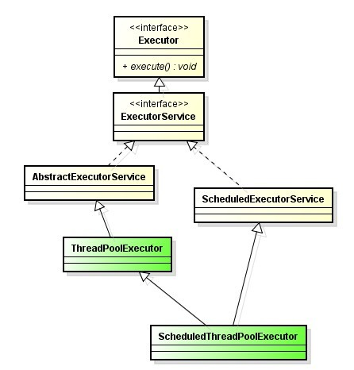

## java线程池简介

我们使用线程的时候就去创建一个线程，这样实现起来非常简便，但是就会有一个问题：如果并发的线程数量很多，并且每个线程都是执行一个时间很短的任务就结束了，这样频繁创建线程就会大大降低系统的效率，因为频繁创建线程和销毁线程需要时间。那么有没有一种办法使得线程可以复用，就是执行完一个任务，并不被销毁，而是可以继续执行其他的任务？在Java中可以通过线程池来达到这样的效果。Jdk1.5之后加入了`java.util.concurrent`包，这个包中主要介绍java中线程以及线程池的使用。

线程池是维护了一批线程来处理用户提交的任务，达到线程复用的目的。

<!-- more -->

### 线程池的作用

线程池作用就是限制系统中执行线程的数量。根据系统的环境情况，可以自动或手动设置线程数量，达到运行的最佳效果；少了浪费了系统资源，多了造成系统拥挤效率不高。用线程池控制线程数量，其他线程排队等候。一个任务执行完毕，再从队列的中取最前面的任务开始执行。若队列中没有等待进程，线程池的这一资源处于等待。当一个新任务需要运行时，如果线程池中有等待的工作线程，就可以开始运行了；否则进入等待队列。

### 为什么使用线程池

1. 减少了创建和销毁线程的次数，每个工作线程都可以被重复利用，可执行多个任务。
2. 可以根据系统的承受能力，调整线程池中工作线线程的数目，防止因为消耗过多的内存，而把服务器累趴下(每个线程需要大约1MB内存，线程开的越多，消耗的内存也就越大，最后死机)。

## 线程池接口

Java里面线程池的顶级接口是`Executor`，但是严格意义上讲`Executor`并不是一个线程池，而只是一个执行线程的工具。真正的线程池接口是`ExecutorService`。

比较重要的几个类：

| ExecutorService             | 真正的线程池接口。                                |
| :-------------------------- | :--------------------------------------- |
| ScheduledExecutorService    | 能和Timer/TimerTask类似，解决那些需要任务重复执行的问题。     |
| ThreadPoolExecutor          | ExecutorService的默认实现。                    |
| ScheduledThreadPoolExecutor | 继承ThreadPoolExecutor的ScheduledExecutorService接口实现，周期性任务调度的类实现。 |

线程池有关类之间的关系：



首先：是ThreadPoolExecutor继承AbstractExecutorService，并且有四个构造方法。

~~~java
public class ThreadPoolExecutor extends AbstractExecutorService {
  //...
}
~~~

再是AbstractExecutorService实现ExecutorService：

~~~java
public abstract class AbstractExecutorService implements ExecutorService {
  //...
}
~~~

接着看ExecutorService接口的实现：

~~~java
public interface ExecutorService extends Executor {
    void shutdown();
    boolean isShutdown();
    boolean isTerminated();
	//...
}
~~~

最后是Executor接口：

~~~java
public interface Executor {
    void execute(Runnable command);
}
~~~

Executor是一个顶层接口，在它里面只声明了一个方法execute(Runnable)，返回值为void，参数为Runnable类型，从字面意思可以理解，就是用来执行传进去的任务的；

然后ExecutorService接口继承了Executor接口，并声明了一些方法：submit、invokeAll、invokeAny以及shutDown等；

抽象类AbstractExecutorService实现了ExecutorService接口，基本实现了ExecutorService中声明的所有方法；

然后ThreadPoolExecutor继承了类AbstractExecutorService。

在ThreadPoolExecutor类中有几个非常重要的方法：

~~~java
//execute()方法实际上是Executor中声明的方法，在ThreadPoolExecutor进行了具体的实现，这个方法是ThreadPoolExecutor的核心方法，通过这个方法可以向线程池提交一个任务，交由线程池去执行。

//submit()方法是在ExecutorService中声明的方法，在AbstractExecutorService就已经有了具体的实现，在ThreadPoolExecutor中并没有对其进行重写，这个方法也是用来向线程池提交任务的，但是它和execute()方法不同，它能够返回任务执行的结果，去看submit()方法的实现，会发现它实际上还是调用的execute()方法，只不过它利用了Future来获取任务执行结果（Future相关内容将在下一篇讲述）。

//shutdown()和shutdownNow()是用来关闭线程池的。
~~~

## 四种常见线程池

Java通过Executors提供了四种线程池，这四种线程池都是直接或间接配置ThreadPoolExecutor的参数实现的，在Executors类里面提供了一些静态工厂，生成一些常用的线程池。

### newSingleThreadExecutor

创建一个单线程的线程池。这个线程池只有一个线程在工作，也就是相当于单线程串行执行所有任务。如果这个唯一的线程因为异常结束，那么会有一个新的线程来替代它。此线程池保证所有任务的执行顺序按照任务的提交顺序执行。

1. 有且仅有一个工作线程执行任务
2. 所有任务按照指定顺序执行，即遵循队列的入队出队规则
3. 适用：一个任务一个任务执行的场景

创建方法：

~~~java
ExecutorService singleThreadPool = Executors.newSingleThreadPool();
~~~

源码：

~~~java
public static ExecutorService newSingleThreadExecutor() {
        //线程池中只有一个线程进行任务执行，其他的都放入阻塞队列
        //外面包装的FinalizableDelegatedExecutorService类实现了finalize方法，在JVM垃圾回收的时候会关闭线程池
        return new FinalizableDelegatedExecutorService
            (new ThreadPoolExecutor(1, 1,
                                    0L, TimeUnit.MILLISECONDS,
                                    new LinkedBlockingQueue<Runnable>()));
}
~~~

示例：

~~~java
public class MyTask implements Runnable{
	@Override
    public void run() {
		try {
			Thread.sleep(1000);
		} catch (InterruptedException e) {
			e.printStackTrace();
		}
        System.out.println(Thread.currentThread().getName() + "正在执行。。。");
    }
}
~~~

~~~java
public class TestSingleThreadExecutor {
	public static void main(String[] args) {
		//创建一个可重用固定线程数的线程池
        ExecutorService pool = Executors. newSingleThreadExecutor();
        //创建实现了Runnable接口对象，Thread对象当然也实现了Runnable接口
        Runnable t1 = new MyTask();
        Runnable t2 = new MyTask();
        Runnable t3 = new MyTask();
        Runnable t4 = new MyTask();
        Runnable t5 = new MyTask();
        //将线程放入池中进行执行
        pool.execute(t1);
        pool.execute(t2);
        pool.execute(t3);
        pool.execute(t4);
        pool.execute(t5);
        //关闭线程池
        pool.shutdown();
	}
}
~~~

输出结果：

~~~java
pool-1-thread-1正在执行。。。
pool-1-thread-1正在执行。。。
pool-1-thread-1正在执行。。。
pool-1-thread-1正在执行。。。
pool-1-thread-1正在执行。。。
~~~

### newFixedThreadPool

创建固定大小的线程池。每次提交一个任务就创建一个线程，直到线程达到线程池的最大数量。线程池的大小一旦达到最大值就会保持不变，如果某个线程因为执行异常而结束，那么线程池会补充一个新线程。

1. 可控制线程最大并发数（同时执行的线程数）
2. 超出的线程会在队列中等待
3. 适用：执行长期的任务，性能好很多

创建方法：

~~~java
//nThreads => 最大线程数即maximumPoolSize
ExecutorService fixedThreadPool = Executors.newFixedThreadPool(int nThreads);

//threadFactory => 创建线程的方法
ExecutorService fixedThreadPool = Executors.newFixedThreadPool(int nThreads, ThreadFactory threadFactory);
~~~

源码：

~~~java
public static ExecutorService newFixedThreadPool(int nThreads) {
        //corePoolSize跟maximumPoolSize值一样，同时传入一个无界阻塞队列
        //根据上面分析的woker回收逻辑，该线程池的线程会维持在指定线程数，不会进行回收
        return new ThreadPoolExecutor(nThreads, nThreads,
                                      0L, TimeUnit.MILLISECONDS,
                                      new LinkedBlockingQueue<Runnable>());
}
~~~

示例：

~~~java
public class TestFixedThreadPool {
	public static void main(String[] args) {
		//创建一个可重用固定线程数的线程池
        ExecutorService pool = Executors.newFixedThreadPool(2);
        //创建实现了Runnable接口对象，Thread对象当然也实现了Runnable接口
        Runnable t1 = new MyTask();
        Runnable t2 = new MyTask();
        Runnable t3 = new MyTask();
        Runnable t4 = new MyTask();
        Runnable t5 = new MyTask();
        //将线程放入池中进行执行
        pool.execute(t1);
        pool.execute(t2);
        pool.execute(t3);
        pool.execute(t4);
        pool.execute(t5);
        //关闭线程池
        pool.shutdown();
	}
}
~~~

输出结果：

~~~java
pool-1-thread-1正在执行。。。
pool-1-thread-2正在执行。。。
pool-1-thread-1正在执行。。。
pool-1-thread-2正在执行。。。
pool-1-thread-1正在执行。。。
~~~

### newCachedThreadPool

创建一个可缓存的线程池。如果线程池的大小超过了处理任务所需要的线程，那么就会回收部分空闲（60秒不执行任务）的线程，当任务数增加时，此线程池又可以智能的添加新线程来处理任务。此线程池不会对线程数量做限制，线程池大小完全依赖于操作系统（或者说JVM）能够创建的最大线程数量。

1. 线程数无限制
2. 有空闲线程则复用空闲线程，若无空闲线程则新建线程
3. 一定程序减少频繁创建/销毁线程，减少系统开销
4. 适用：执行很多短期异步的小程序或者负载较轻的服务器

创建方法：

~~~java
ExecutorService cachedThreadPool = Executors.newCachedThreadPool();
~~~

源码：

~~~java
public static ExecutorService newCachedThreadPool() {
        //这个线程池corePoolSize为0，maximumPoolSize为Integer.MAX_VALUE，意思也就是说来一个任务就创建一个woker，回收时间是60s
        return new ThreadPoolExecutor(0, Integer.MAX_VALUE,
                                      60L, TimeUnit.SECONDS,
                                      new SynchronousQueue<Runnable>());
}
~~~

示例：

~~~java
public class TestCachedThreadPool {
	public static void main(String[] args) {
		//创建一个可重用固定线程数的线程池
        ExecutorService pool = Executors.newCachedThreadPool();
        //创建实现了Runnable接口对象，Thread对象当然也实现了Runnable接口
        Runnable t1 = new MyTask();
        Runnable t2 = new MyTask();
        Runnable t3 = new MyTask();
        Runnable t4 = new MyTask();
        Runnable t5 = new MyTask();
        //将线程放入池中进行执行
        pool.execute(t1);
        pool.execute(t2);
        pool.execute(t3);
        pool.execute(t4);
        pool.execute(t5);
        //关闭线程池
        pool.shutdown();
	}
}
~~~

输出结果：

~~~java
pool-1-thread-2正在执行。。。
pool-1-thread-4正在执行。。。
pool-1-thread-3正在执行。。。
pool-1-thread-1正在执行。。。
pool-1-thread-5正在执行。。。
~~~

### newScheduledThreadPool

定长线程池。此线程池支持定时以及周期性执行任务的需求。

1. 适用：周期性执行任务的场景

创建方法：

~~~java
//nThreads => 最大线程数即maximumPoolSize
ExecutorService scheduledThreadPool = Executors.newScheduledThreadPool(int corePoolSize);
~~~

源码：

~~~java
public static ScheduledExecutorService newScheduledThreadPool(int corePoolSize) {
    return new ScheduledThreadPoolExecutor(corePoolSize);
}

//ScheduledThreadPoolExecutor():
public ScheduledThreadPoolExecutor(int corePoolSize) {
    super(corePoolSize, Integer.MAX_VALUE,
          DEFAULT_KEEPALIVE_MILLIS, MILLISECONDS,
          new DelayedWorkQueue());
}
~~~

示例：

~~~java
public class TestScheduledThreadPoolExecutor {
    public static void main(String[] args) {
        ScheduledThreadPoolExecutor exec = new ScheduledThreadPoolExecutor(1);
        exec.scheduleAtFixedRate(new Runnable() {//每隔一段时间就触发异常
                      @Override
                      public void run() {
                           //throw new RuntimeException();
                           System.out.println("================");
                      }
                  }, 1000, 5000, TimeUnit.MILLISECONDS);
      
        exec.scheduleAtFixedRate(new Runnable() {//每隔一段时间打印系统时间，证明两者是互不影响的
                      @Override
                      public void run() {
                           System.out.println(System.nanoTime());
                      }
                  }, 1000, 2000, TimeUnit.MILLISECONDS);
    }
}
~~~

输出结果：

~~~java
================
4590850263504
4592850370330
================
4594850481968
4596850560885
4598850893874
================
~~~

## ThreadPoolExecutor详解

### ThreadPoolExecutor提供了四个构造函数：

~~~java
//五个参数的构造函数
public ThreadPoolExecutor(int corePoolSize,
                          int maximumPoolSize,
                          long keepAliveTime,
                          TimeUnit unit,
                          BlockingQueue<Runnable> workQueue)

//六个参数的构造函数-1
public ThreadPoolExecutor(int corePoolSize,
                          int maximumPoolSize,
                          long keepAliveTime,
                          TimeUnit unit,
                          BlockingQueue<Runnable> workQueue,
                          ThreadFactory threadFactory)

//六个参数的构造函数-2
public ThreadPoolExecutor(int corePoolSize,
                          int maximumPoolSize,
                          long keepAliveTime,
                          TimeUnit unit,
                          BlockingQueue<Runnable> workQueue,
                          RejectedExecutionHandler handler)

//七个参数的构造函数
public ThreadPoolExecutor(int corePoolSize,
                          int maximumPoolSize,
                          long keepAliveTime,
                          TimeUnit unit,
                          BlockingQueue<Runnable> workQueue,
                          ThreadFactory threadFactory,
                          RejectedExecutionHandler handler)
~~~

- **int corePoolSize** => 该线程池中**核心线程数最大值**

  线程池新建线程的时候，如果当前线程总数小于corePoolSize，则新建的是核心线程，如果超过corePoolSize，则新建的是非核心线程

  核心线程默认情况下会一直存活在线程池中，即使这个核心线程啥也不干(闲置状态)。

  如果指定ThreadPoolExecutor的allowCoreThreadTimeOut这个属性为true，那么核心线程如果不干活(闲置状态)的话，超过一定时间(时长下面参数决定)，就会被销毁掉。

  很好理解吧，正常情况下你不干活我也养你，因为我总有用到你的时候，但有时候特殊情况(比如我自己都养不起了)，那你不干活我就要把你干掉了。

- **int maximumPoolSize** => 该线程池中**线程总数最大值**

  线程总数 = 核心线程数 + 非核心线程数。

- **long keepAliveTime** => 该线程池中**非核心线程闲置超时时长**

  一个非核心线程，如果不干活(闲置状态)的时长超过这个参数所设定的时长，就会被销毁掉。如果设置allowCoreThreadTimeOut = true，则会作用于核心线程。

  jdk中的解释是：当线程数大于核心时，此为终止前多余的空闲线程等待新任务的最长时间。什么意思？接着上面的解释，后来向老板派来的工人始终是借来的，俗话说有借就有还，但这里的问题就是什么时候还了，如果借来的工人刚完成一个任务就还回去，后来发现任务还有，那岂不是又要去借？这一来一往，老板肯定头也大死了。

  合理的策略：既然借了，那就多借一会儿。直到`某一段时间`后，发现再也用不到这些工人时，便可以还回去了。这里的某一段时间便是keepAliveTime的含义，TimeUnit为keepAliveTime值的度量。

- **TimeUnit unit** => keepAliveTime的单位

  TimeUnit是一个枚举类型，其包括：

  1. NANOSECONDS ： 1微毫秒 = 1微秒 / 1000
  2. MICROSECONDS ： 1微秒 = 1毫秒 / 1000
  3. MILLISECONDS ： 1毫秒 = 1秒 /1000
  4. SECONDS ： 秒
  5. MINUTES ： 分
  6. HOURS ： 小时
  7. DAYS ： 天

- **BlockingQueue<Runnable> workQueue** => 该线程池中的任务队列：维护着等待执行的Runnable对象

  当所有的核心线程都在干活时，新添加的任务会被添加到这个队列中等待处理，如果队列满了，则新建非核心线程执行任务。

  常用的workQueue类型：

  1. **SynchronousQueue：**这个队列接收到任务的时候，会直接提交给线程处理，而不保留它，如果所有线程都在工作怎么办？那就新建一个线程来处理这个任务！所以为了保证不出现<线程数达到了maximumPoolSize而不能新建线程>的错误，使用这个类型队列的时候，maximumPoolSize一般指定成Integer.MAX_VALUE，即无限大。
  2. **LinkedBlockingQueue：**这个队列接收到任务的时候，如果当前线程数小于核心线程数，则新建线程(核心线程)处理任务；如果当前线程数等于核心线程数，则进入队列等待。由于这个队列没有最大值限制，即所有超过核心线程数的任务都将被添加到队列中，这也就导致了maximumPoolSize的设定失效，因为总线程数永远不会超过corePoolSize。
  3. **ArrayBlockingQueue：**可以限定队列的长度，接收到任务的时候，如果没有达到corePoolSize的值，则新建线程(核心线程)执行任务，如果达到了，则入队等候，如果队列已满，则新建线程(非核心线程)执行任务，又如果总线程数到了maximumPoolSize，并且队列也满了，则发生错误。
  4. **DelayQueue：**队列内元素必须实现Delayed接口，这就意味着你传进去的任务必须先实现Delayed接口。这个队列接收到任务时，首先先入队，只有达到了指定的延时时间，才会执行任务。
  5. **PriorityBlockingQueue：**优先级阻塞队列，该实现类需要自己实现一个继承了 Comparator 接口的类， 在插入资源时会按照自定义的排序规则来对资源数组进行排序。 其中值大的排在数组后面 ，取值时从数组头开始取。

  排队有三种通用策略：

  1. **直接提交。**工作队列的默认选项是 `SynchronousQueue`，它将任务直接提交给线程而不保持它们。在此，如果不存在可用于立即运行任务的线程，则试图把任务加入队列将失败，因此会构造一个新的线程。此策略可以避免在处理可能具有内部依赖性的请求集时出现锁。直接提交通常要求无界 `maximumPoolSizes` 以避免拒绝新提交的任务。当命令以超过队列所能处理的平均数连续到达时，此策略允许无界线程具有增长的可能性。
  2. **无界队列。**使用无界队列（例如，不具有预定义容量的 `LinkedBlockingQueue`）将导致在所有 `corePoolSize` 线程都忙时新任务在队列中等待。这样，创建的线程就不会超过 `corePoolSize`。（因此，`maximumPoolSize`的值也就无效了。）当每个任务完全独立于其他任务，即任务执行互不影响时，适合于使用无界队列；例如，在 Web页服务器中。这种排队可用于处理瞬态突发请求，当命令以超过队列所能处理的平均数连续到达时，此策略允许无界线程具有增长的可能性。
  3. **有界队列。**当使用有限的 `maximumPoolSizes`时，有界队列（如 `ArrayBlockingQueue`）有助于防止资源耗尽，但是可能较难调整和控制。队列大小和最大池大小可能需要相互折衷：使用大型队列和小型池可以最大限度地降低 CPU 使用率、操作系统资源和上下文切换开销，但是可能导致人工降低吞吐量。如果任务频繁阻塞（例如，如果它们是 I/O边界），则系统可能为超过您许可的更多线程安排时间。使用小型队列通常要求较大的池大小，CPU使用率较高，但是可能遇到不可接受的调度开销，这样也会降低吞吐量。  

  BlockingQueue的选择：

  **例子一：使用直接提交策略，也即SynchronousQueue。**首先SynchronousQueue是无界的，也就是说他存数任务的能力是没有限制的，但是由于该Queue本身的特性，**在某次添加元素后必须等待其他线程取走后才能继续添加**。在这里不是核心线程便是新创建的线程，但是我们试想一样下，下面的场景。我们使用一下参数构造ThreadPoolExecutor：

  ```java
  new ThreadPoolExecutor(   
                  2, 3, 30, TimeUnit.SECONDS,    
                  new  SynchronousQueue<Runnable>(),    
                  new RecorderThreadFactory("CookieRecorderPool"),    
                  new ThreadPoolExecutor.CallerRunsPolicy());  

  new ThreadPoolExecutor(
                  2, 3, 30, TimeUnit.SECONDS,
                  new SynchronousQueue<Runnable>(),
                  new RecorderThreadFactory("CookieRecorderPool"),
                  new ThreadPoolExecutor.CallerRunsPolicy());
  ```

  当核心线程已经有2个正在运行。

  1. 此时继续来了一个任务（A），根据前面介绍的如果运行的线程等于或多于 corePoolSize，则 Executor始终首选将请求加入队列，**而不添加新的线程**。所以A被添加到queue中。
  2. 又来了一个任务（B），且核心2个线程还没有忙完，接下来首先尝试1中描述，但是由于使用的SynchronousQueue，所以一定无法加入进去。
  3. 此时便满足了上面提到的如果无法将请求加入队列，则创建新的线程，除非创建此线程超出maximumPoolSize，在这种情况下，任务将被拒绝。所以必然会新建一个线程来运行这个任务。
  4. 暂时还可以，但是如果这三个任务都还没完成，连续来了两个任务，第一个添加入queue中，后一个呢？queue中无法插入，而线程数达到了maximumPoolSize，所以只好执行异常策略了。

  所以在使用SynchronousQueue通常要求maximumPoolSize是无界的，这样就可以避免上述情况发生（如果希望限制就直接使用有界队列）。对于使用SynchronousQueue的作用jdk中写的很清楚：**此策略可以避免在处理可能具有内部依赖性的请求集时出现锁**。意思就是，如果你的任务A1，A2有内部关联，A1需要先运行，那么先提交A1，再提交A2，当使用SynchronousQueue我们可以保证，A1必定先被执行，在A1没有被执行前，A2不可能添加入queue中。

  **例子二：使用无界队列策略，即LinkedBlockingQueue**

  这个就拿**newFixedThreadPool**来说，根据前文提到的规则：

  如果运行的线程少于 corePoolSize，则 Executor 始终首选添加新的线程，而不进行排队。那么当任务继续增加，会发生什么呢？

  如果运行的线程等于或多于 corePoolSize，则 Executor 始终首选将请求加入队列，而不添加新的线程。OK，此时任务变加入队列之中了，那什么时候才会添加新线程呢？

  如果无法将请求加入队列，则创建新的线程，除非创建此线程超出 maximumPoolSize，在这种情况下，任务将被拒绝。这里就很有意思了，可能会出现无法加入队列吗？不像SynchronousQueue那样有其自身的特点，对于无界队列来说，总是可以加入的（资源耗尽，当然另当别论）。换句说，永远也不会触发产生新的线程！corePoolSize大小的线程数会一直运行，忙完当前的，就从队列中拿任务开始运行。所以要防止任务疯长，比如任务运行的时间比较长，而添加任务的速度远远超过处理任务的时间，而且还不断增加，不一会儿就爆了。

  **例子三：有界队列，使用ArrayBlockingQueue。**

  这个是最为复杂的使用，所以JDK不推荐使用也有些道理。与上面的相比，最大的特点便是可以防止资源耗尽的情况发生。

  举例来说，请看如下构造方法：

  ```java
  new ThreadPoolExecutor(   
                 2, 4, 30, TimeUnit.SECONDS,    
                 new ArrayBlockingQueue<Runnable>(2),    
                 new RecorderThreadFactory("CookieRecorderPool"),    
                 new ThreadPoolExecutor.CallerRunsPolicy());  

  new ThreadPoolExecutor(
                 2, 4, 30, TimeUnit.SECONDS,
                 new ArrayBlockingQueue<Runnable>(2),
                 new RecorderThreadFactory("CookieRecorderPool"),
                 new ThreadPoolExecutor.CallerRunsPolicy());
  ```

  假设，所有的任务都永远无法执行完。对于首先来的A，B来说直接运行，接下来，如果来了C，D，他们会被放到queue中，如果接下来再来E，F，则增加线程运行E，F。但是如果再来任务，队列无法再接受了，线程数也到达最大的限制了，所以就会使用拒绝策略来处理。

- **ThreadFactory threadFactory** => 创建线程的方式

  这是一个接口，你new他的时候需要实现他的`Thread newThread(Runnable r)`方法，一般用不上。

  应该知道AsyncTask是对线程池的封装，这里直接放一个AsyncTask新建线程池的threadFactory参数源码：

  ~~~java
  new ThreadFactory() {
      private final AtomicInteger mCount = new AtomicInteger(1);    
      public Thread new Thread(Runnable r) {
          return new Thread(r,"AsyncTask #" + mCount.getAndIncrement());
      }
  }
  //就给线程起了个名
  ~~~

- **RejectedExecutionHandler handler** => 抛出异常专用

  另一种情况便是，即使向老板借了工人，但是任务还是继续过来，还是忙不过来，这时整个队伍只好拒绝接受了。

  `RejectedExecutionHandler`接口提供了对于拒绝任务的处理的自定方法的机会。在ThreadPoolExecutor中已经默认包含了4中策略，因为源码非常简单，这里直接贴出来。

  1. CallerRunsPolicy

     线程调用运行该任务的 execute 本身。此策略提供简单的反馈控制机制，能够减缓新任务的提交速度。

     ```java
     public void rejectedExecution(Runnable r, ThreadPoolExecutor e) {   
            if (!e.isShutdown()) {   
                 r.run();   
            }   
     }  

     public void rejectedExecution(Runnable r, ThreadPoolExecutor e) {
            if (!e.isShutdown()) {
                 r.run();
            }
     }
     ```

     这个策略显然不想放弃执行任务。但是由于池中已经没有任何资源了，那么就直接使用调用该execute的线程本身来执行。

  2. AbortPolicy 

     处理程序遭到拒绝将抛出运行时RejectedExecutionException，丢弃任务。

     ```java
     public void rejectedExecution(Runnable r, ThreadPoolExecutor e) {   
             throw new RejectedExecutionException();   
     }  

     public void rejectedExecution(Runnable r, ThreadPoolExecutor e) {
             throw new RejectedExecutionException();
     }
     ```

  3. DiscardPolicy 

     不能执行的任务将被删除。

     ```java
     public void rejectedExecution(Runnable r, ThreadPoolExecutor e) {   

     }  

     public void rejectedExecution(Runnable r, ThreadPoolExecutor e) {

     }
     ```

     这种策略和AbortPolicy几乎一样，也是丢弃任务，只不过他不抛出异常。

  4. DiscardOldestPolicy

     如果执行程序尚未关闭，则位于工作队列头部的任务将被删除，然后重试执行程序（如果再次失败，则重复此过程）。

     ```java
     public void rejectedExecution(Runnable r, ThreadPoolExecutor e) {   
             if (!e.isShutdown()) {   
                  e.getQueue().poll();   
                  e.execute(r);   
              }   
     }  

     public void rejectedExecution(Runnable r, ThreadPoolExecutor e) {
             if (!e.isShutdown()) {
                  e.getQueue().poll();
                  e.execute(r);
              }
     }
     ```

     该策略就稍微复杂一些，在pool没有关闭的前提下首先丢掉缓存在队列中的最早的任务，然后重新尝试运行该任务。这个策略需要适当小心。设想：如果其他线程都还在运行，那么新来任务踢掉旧任务，缓存在queue中，再来一个任务又会踢掉queue中最老任务。

### 向ThreadPoolExecutor添加任务：

通过`ThreadPoolExecutor.execute(Runnable command)`方法即可向线程池内添加一个任务。

### ThreadPoolExecutor的策略

当一个任务被添加进线程池时：

1. 线程数量未达到corePoolSize，则新建一个线程(核心线程)执行任务
2. 线程数量达到了corePools，则将任务移入队列等待
3. 队列已满，新建线程(非核心线程)执行任务
4. 队列已满，总线程数又达到了maximumPoolSize，就会由上面那位星期天(RejectedExecutionHandler)抛出异常

## 总结

`keepAliveTime`和`maximumPoolSize`及`BlockingQueue`的类型均有关系。如果`BlockingQueue`是无界的，那么永远不会触发`maximumPoolSize`，自然`keepAliveTime`也就没有了意义。

反之，如果核心数较小，有界`BlockingQueue`数值又较小，同时`keepAliveTime`又设的很小，如果任务频繁，那么系统就会频繁的申请回收线程。


