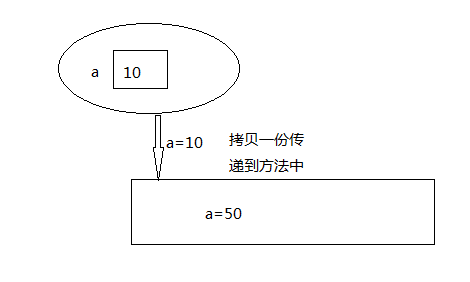
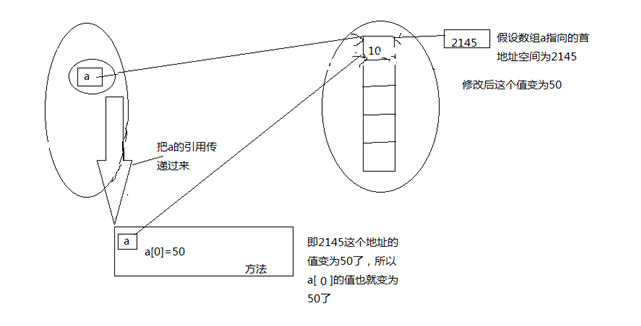
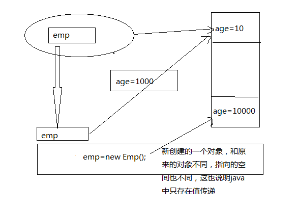

## 前言

关于Java传参时是引用传递还是值传递，一直是一个讨论比较多的话题，下面总结一下这个问题。Java中数据类型分为两大类，**基本类型和对象类型**。相应的，变量也有两种类型：基本类型和引用类型。

基本类型的变量保存原始值，即它代表的值就是数值本身；

而引用类型的变量保存引用值，`引用值`指向内存空间的地址，代表了某个对象的引用，而不是对象本身，对象本身存放在这个引用值所表示的地址的位置。

**基本类型包括：byte,short,int,long,char,float,double,Boolean**

**引用类型包括：类类型，接口类型和数组。**

<!-- more -->

## 变量的基本类型和引用类型的区别

基本数据类型在声明时系统就给它分配空间：

~~~java
int a;
a=10; //正确，因为声明a时就分配了空间
~~~

引用则不同，它声明时只给变量分配了引用空间，而不分配数据空间：

~~~java
Date date;//执行实例化，开辟数据空间存放Date对象，然后把空间的首地址传给date变量 
//date=new Date();
//如果注释掉上一步操作
//The local variable date may not have been initialized
//也就是说对象的数据空间没有分配
date.getDate();
~~~

看一下下面的初始化过程，**注意"引用"也是占用空间的，一个空Object对象的引用大小大概是4byte**：

~~~java
Date a,b; //在内存开辟两个引用空间
a = new Date();//开辟存储Date对象的数据空间，并把该空间的首地址赋给a
b = a; //将a存储空间中的地址写到b的存储空间中
~~~

## 值传递和引用传递

这里要用实际参数和形式参数的概念来帮助理解：

- 形式参数：定义方法时写的参数。
- 实际参数：调用方法时写的具体数值。

### 值传递

方法调用时，实际参数把它的值传递给对应的形式参数，函数接收的是原始值的一个copy，**此时内存中存在两个相等的基本类型，即实际参数和形式参数，后面方法中的操作都是对形参这个值的修改，不影响实际参数的值**。

~~~java
public class Test {
    public static void change(int a){
        a=50;
    }
    public static void main(String[] args) {
        int a=10;
        System.out.println(a);
        change(a);
        System.out.println(a);
    }
}
~~~

很显然输出的 是10，10。传递的是值得一份拷贝，这份拷贝与原来的值没什么关系。内存分析：

### 引用传递

也称为传地址。方法调用时，实际参数的引用(地址，而不是参数的值)被传递给方法中相对应的形式参数，函数接收的是原始值的内存地址；**在方法执行中，形参和实参内容相同，指向同一块内存地址，方法执行中对引用的操作将会影响到实际对象**。

~~~java
public class Test {
    public static void change(int []a){
        a[0]=50;
    }
    public static void main(String[] args) {
        int []a={10,20};
        System.out.println(a[0]);
        change(a);
        System.out.println(a[0]);
    }
}
~~~

显然输出结果为10   50。实际传递的是引用的地址值。内存分析：

再看一个引用传递的例子：

~~~java
class Emp {
    public int age;
}
public class Test {
    public static void change(Emp emp)
    {
        emp.age = 50;
        emp = new Emp();//再创建一个对象
        emp.age=100;
    }
    
    public static void main(String[] args) {
        Emp emp = new Emp();
        emp.age = 100;
        System.out.println(emp.age);
        change(emp);
        System.out.println(emp.age);
        System.out.println(emp.age);
    }
}
~~~

输出为：100  50  50。内存分析：

### String类型传递

这里要特殊考虑String，以及Integer、Double等几个基本类型包装类，它们都是immutable类型，因为没有提供自身修改的函数，每次操作都是新生成一个对象，所以要特殊对待，可以认为是和基本数据类型相似，传值操作。

先看一个String和StringBuffer的例子：

~~~java
public class ReferencePkValue1 {
    public static void main(String[] args){
        ReferencePkValue1 pk=new ReferencePkValue1();
        //String类似基本类型，值传递，不会改变实际参数的值
        String test1="Hello";
        pk.change(test1);
        System.out.println(test1);
         
        //StringBuffer和StringBuilder等是引用传递
        StringBuffer test2=new StringBuffer("Hello");
        pk.change(test2);
         
        System.out.println(test2.toString());
    }
     
    public void change(String str){
        str=str+"world";
    }
     
    public void change(StringBuffer str){
        str.append("world");
    }
}
// Hello   
// Helloworld   
// 对String和StringBuffer的操作产生了不同的结果
~~~

**String, Integer, Double等immutable的类型特殊处理，可以理解为传值，最后的操作不会修改实参对象。**

~~~java
public static void main(String[] args) {
    String str = "AAA";
    change(str);
    System.out.println(str);
}   
public static void change(String s) {
    s = "abc";
}
// AAA
~~~

String是一个类，类是引用数据类型，做为参数传递的时候，应该是引用传递。但是从结果看起来却是值传递。原因：

String的API中有这么一句话：`their values cannot be changed after they are created`， 意思是：String的值在创建之后不能被更改。 API中还有一段：

~~~java
String str = "abc"; 
//等效于： 
char data[] = {'a', 'b', 'c'}; 
String str = new String(data);

/*流程
1. 主函数进栈，str1初始化。
2. 调用change方法，change( )进栈，将str1的地址值，复制一份给s。
3. change方法中，重现创建了一个String对象”abc”，并将s指向了新的地址值。
4. change方法运行完毕，s所指向的地址值已经改变。
5. change方法弹栈。
6. 主函数弹栈。
*/
~~~

也就是说：对String对象str的任何修改 等同于 重新创建一个对象，并将新的地址值赋值给str。String对象做为参数传递时，走的依然是引用传递，只不过String这个类比较特殊。 **String对象一旦创建，内容不可更改。每一次内容的更改都是重现创建出来的新对象**。 当change方法执行完毕时，s所指向的地址值已经改变。而s本来的地址值就是copy过来的副本，所以并不能改变str1的值。

String类型类似情况：

~~~java
public void call(Test t) { 
	Test t2 = new Test(); 
	t2.setName("cba'); 
	t.setName("abc"); 
	t = t2 ; 
} 

public static void main(String[] arg) { 
	Test obj = new Test(); 
	call (obj) ; 
	System.out.println("obj"+obj.getName()); 
}
//obj: abc
~~~

java并没有c++中指针、地址的概念，它只有句柄（handler）的概念。

总共构建了两个Test对象，假设称main方法构建的对象为`对象1`，call方法构建的对象为`对象2`， 在main方法中，变量obj获得了`对象1`的句柄， 在参数传递中，变量obj把这个句柄传递给变量t， 在call方法中，变量t首先改变了`对象1`的属性，然后变量t又获得了`对象2`的句柄（但obj仍然是`对象1`的句柄）， call方法返回后，由于`对象2`失去了唯一的句柄，不可避免的进入垃圾收集器的视线。而obj仍然是`对象1`的句柄，由于`对象1`的属性已经被重新设置，所以我们可以看到打印出来的结果是`abc`。 

所以：**在Java中方法参数的传递，对象是传递引用，基本数据类型是传递值。**对于值类型的参数来说，传递的是值的拷贝。对于引用类型的参数来说，传递的是引用本身的拷贝。

## 值传递和引用传递的区别

总结：值传递和引用传递的区别在于引用传递是否对对象的属性进行修改操作，若无修改操作，则类似于“值传递”，对形参的修改不会影响实参；若对对象的属性进行了修改操作，因为引用本身和引用的拷贝指向同一块地址，所以修改操作会影响到实际对象。