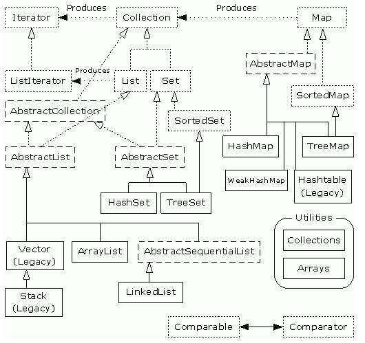
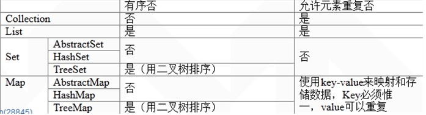

## JAVA基础之集合框架

面向对象对事物的体现都是以对象的形式，集合为了方便对多个对象进行操作，对对象进行存储的最常用的一种方式。集合就是存放对象的容器。

数组也可以存储对象，但数组长度是固定的，集合的长度可变；数组也可以存储基本数据类型，集合只能存储对象（通过存储数组对象[]实现存储基本数据类型）。

<!-- more -->

容器划分：

| 数组                         | 同类型 arr[0]...arr[i]                      |
| -------------------------- | ---------------------------------------- |
| StringBuffer/StringBuilder | 类型、个数无所谓，最终必须转成字符串才可以用（"lisi",true,6）--->  "lisitrue6" |
| 对象                         | 数据多用对象存   "李四"，23  --->  new Person("李四"，23) |
| 集合                         | 对象多了就用集合存                                |

### 集合框架体系

1. 集合中的结构和几个实现类：

   

2. collection特有的方法retainall表示取交集，将不同的删除，而removeall是将相同的删除

3. SortedSet和SortedMap接口对元素按指定规则排序，SortedMap是对key列进行排序

### Iterator迭代器

1. Iterator接口就是对所有collection容器进行元素取出的公共接口

2. 实现原理：内部类实现（一个事物直接访问另一个事物的内部属性）

3. 用法：

   ~~~java
   Iterator it = coll.iterator();
   while(it.hasNext()){
     //it对象在while外面，占内存
   }
   //for循环使用
   for(Iterator it = coll.iterator();it.hasNext();){
     
   }
   ~~~

4. 该对象必须依赖于具体容器，因为每一个容器的数据结构都不同。所以该迭代器对象是在容器中进行内部实现的。对于使用容器者而言，具体的实现不重要，只要通过容器获取到该实现的迭代器的对象即可，也就是容器的iterator方法

### Collection接口

**Collection 接口**用于表示任何对象或元素组。想要尽可能以常规方式处理一组元素时，就使用这一接口。Collection不提供get()方法。如果要遍历Collectin中的元素，就必须用Iterator。Collection为单列集合。该接口的常规操作：

1. 单元素添加、删除操作：

   ~~~java
   boolean add(Object o);//将对象添加给集合
   boolean remove(Object o);//如果集合中有与o相匹配的对象，则删除对象o
   ~~~

2. 查询操作：

   ~~~java
   int size();//返回当前集合中元素的数量
   boolean isEmpty();//判断集合中是否有任何元素
   boolean contains(Object o);//查找集合中是否含有对象o
   Iterator iterator();//返回一个迭代器，用来访问集合中的各个元素
   ~~~

3. 组操作 ：作用于元素组或整个集合

   ~~~java
   boolean containsAll(Collection c);// 查找集合中是否含有集合c 中所有元素
   boolean addAll(Collection c);//将集合c 中所有元素添加给该集合
   void clear();//删除集合中所有元素
   void removeAll(Collection c);//从集合中删除集合c 中的所有元素
   void retainAll(Collection c);//从集合中删除集合c 中不包含的元素
   ~~~

4. Collection转换为Object数组 ：

   ~~~java
   Object[] toArray();//返回一个内含集合所有元素的array
   Object[] toArray(Object[] a);//返回一个内含集合所有元素的array。运行期返回的array和参数a的型别相同，需要转换为正确型别。
   ~~~

### List集合

list是一个有序的，元素可重复的面向位置操作的集合，元素都有索引，list的特点就是可以操作角标

1. List的基本操作：

   ~~~java
   //增
   void add(int index, Object element);//在指定位置index上添加元素element
   boolean addAll(int index, Collection c);//将集合c的所有元素添加到指定位置index
   //删
   Object remove(int index);//删除指定位置上的元素
   //改
   Object set(int index, Object element);//用元素element取代位置index上的元素，并且返回旧的元素
   //获取
   Object get(int index);//返回List中指定位置的元素
   int indexOf(Object o);//返回第一个出现元素o的位置，否则返回-1
   int lastIndexOf(Object o);//返回最后一个出现元素o的位置，否则返回-1
   List subList(int fromIndex, int toIndex);//返回从指定位置fromIndex（包含）到toIndex（不包含）范围中各个元素的列表视图
   //处理集合的子集
   ListIterator listIterator();//返回一个列表迭代器，用来访问列表中的元素
   ListIterator listIterator(int index);//返回一个列表迭代器，用来从指定位置index开始访问列表中的元素
   ~~~

2. 对子列表的更改（如 add()、remove() 和 set() 调用）对底层 List 也有影响。ArrayList 和 LinkedList 都实现 Cloneable 接口，都提供了两个构造函数，一个无参的，一个接受另一个Collection

####  ListIterator接口

1. ListIterator是List的实现子接口。当集合和迭代器同时操作元素时，会抛出ConcurrentModificationException，所以这时需要使用list内部迭代器

   ~~~java
   Iterator it = list.iterator();
   while(it.hasNext()){
     Object obj = it.next();
     if(obj.equals("abc1")){
       list.add("abc2");//增加了集合长度，但迭代器还是安装之前的长度迭代
       //而且collection的迭代器没有add方法
     }
   }
   ~~~

   Iterator的方法：hasNext()，next()，remove()--->返回迭代器最后一个元素

2. 使用Iterator接口的子接口ListIterator完成迭代器中元素的更多操作

   ~~~java
   ListIterator it = list.listIterator();//获取列表迭代器对象，从头开始遍历；listIterator(int index)从指定位置开始遍历
   while(it.hasNext()){
      Object obj = it.next();
     if(obj.equals("abc1")){
       it.add("abc2");//使用迭代器添加，它可以实现在迭代过程中对元素的增删改查，只有list集合具备该迭代功能
       //listIterator的其他方法
       //previous() 返回列表中的前一个元素
       //hasPrevious() 逆向遍历
       //...
     }
   }
   ~~~

#### List常用子类

只有Vector是同步的

##### Vector

内部是数组数据结构，长度可变，同步的，线程安全的，效率慢（100%延长数组长度）

ArrayList替代了Vector；Iterator替代了Enumeration，Enumeration使用：

~~~java
Enumeration en = v.elements();
while(en.hasMoreElements()){
  Object obj = en.nextElement();
}
~~~

Enumeration接口与Iterator接口的功能是一样的，只是Iterator多了clear方法

##### ArrayList

内部是数组数据结构，不同步的，**查询**效率高

ArrayList类封装了一个动态再分配的Object[]数组。每个ArrayList对象有一个capacity。这个capacity表示存储列表中元素的数组的容量。当元素添加到ArrayList时，它的capacity在常量时间内自动增加。在向一个ArrayList对象添加大量元素的程序中，可使用ensureCapacity方法增加capacity。这可以减少增加重分配的数量：

~~~java
void ensureCapacity(int minCapacity);// 将ArrayList对象容量增加minCapacity
void trimToSize();// 整理ArrayList对象容量为列表当前大小。程序可使用这个操作减少ArrayList对象存储空间。
void removeRange(int fromIndex, int toIndex);// 移除列表中索引在 fromIndex（包括）和 toIndex（不包括）之间的所有元素。
//如果fromIndex与toIndex相当，则此操作无效
~~~

存储的自定义对象，在取出的时候进行强转，不强转可能输出的是哈希值

ArrayList判断元素是否相同用的equals方法

##### LinkedList

内部是链表数据结构，不同步，**增删**元素速度快，主要处理列表两端元素的方法

~~~java
//使用这些新方法，可以把 LinkedList 当作一个堆栈、队列或其它面向端点的数据结构
void addFirst(Object o);//将对象o添加到列表的开头
boolean offerFirst(Object o);//在此列表的开头插入指定的元素。
Object getFirst();//返回列表开头的元素
Object peekFirst();//获取但不移除此列表的第一个元素；如果此列表为空，则返回 null。
Object removeFirst();//删除并且返回列表开头的元素
Object pollFirst();//获取并移除此列表的第一个元素；如果此列表为空，则返回 null。
LinkedList();//构建一个空的链接列表
LinkedList(Collection c);//构建一个链接列表，并且添加集合c的所有元素
~~~

练习：

> 使用LinkedList模拟一个堆栈或队列的数据结构
>
> 堆栈：先进后出   FILO
>
> 队列：先进先出   FIFO

~~~java
calss DuiLie{
  private LinkedList link;
  public DuiLie(){
    link = new LinkedList();
  }
  public void myAdd(Object obj){
    link.addLast(obj);
    //link.addFirst(obj);addFirst，removeFirst相同就是堆栈，相反就是队列
  }
  public Object myGet(){
    return link.removeFirst();
  }
  public boolean isNull(){
    return link.isEmpty();
  }
}
~~~

测试类：

~~~java
public class LinkedTest{
  public static void main(String[] args){
    DuiLie dl = new DuiLie();
    dl.myAdd("a");
    dl.myAdd("b");
    dl.myAdd("c");
    dl.myAdd("d");
    while(!dl.isNull()){
      syso(dl.myGet());
    }
  }
}
~~~

### Set集合

元素无序并且不可重复，取元素只能迭代Iterator，Set接口中的方法和Collection中的一致。它的常用具体实现有HashSet和TreeSet类。HashSet能快速定位一个元素，但是你放到HashSet中的对象需要实现 hashCode()方法，它使用了哈希码的算法。而TreeSet则将放入其中的元素按序存放，这就要求你放入其中的对象是可排序的，这就用 到了集合框架提供的另外两个实用类Comparable和Comparator。一个类是可排序的，它就应该实现Comparable接口。有时多个类具 有相同的排序算法，那就不需要在每分别重复定义相同的排序算法，只要实现Comparator接口即可。

##### 哈希表

Hash表是一种数据结构，用来查找对象。Hash表为每个对象计算出一个整数，称为Hash Code(哈希码)。Hash表是个链接式列表的阵列。每个列表称为一个buckets(哈希表元)。对象位置的计算index = HashCode % buckets (HashCode为对象哈希码，buckets为哈希表元总数)

当你添加元素时，有时你会遇到已经填充了元素的哈希表元，这种情况称为Hash Collisions(哈希冲突)。这时，你必须判断该元素是否已经存在于该哈希表中。如果哈希码是合理地随机分布的，并且哈希表元的数量足够大，那么哈希冲突的数量就会减少。同时，你也可以通过设定一个初始的哈希表元数量来更好地控制哈 希表的运行。初始哈希表元的数量为　buckets = size * 150% + 1 (size为预期元素的数量)。如果哈希 表中的元素放得太满，就必须进行rehashing(再哈希)。再哈希使哈希表元数增倍，并将原有的对象重新导入新的哈希表元中，而原始的哈希表元被删 除。load factor(加载因子)决定何时要对哈希表进行再哈希。在Java编程语言中，加载因子默认值为0.75，默认哈希表元为101。

##### Comparable

在“集合框架”中有两种比较接口：Comparable接口和Comparator接口。像String和Integer等Java内建类实现 Comparable接口以提供一定排序方式，但这样只能实现该接口一次。对于那些没有实现Comparable接口的类、或者自定义的类，您可以通过 Comparator接口来定义您自己的比较方式

在java.lang包中，Comparable接口适用于一个类有自然顺序的时候。假定对象集合是同一类型，该接口允许把集合排序成自然顺序。

1. int compareTo(Object o): 比较当前实例对象与对象o，如果位于对象o之前，返回负值，如果两个对象在排序中位置相同，则返回0，如果位于对象o后面，则返回正值

2. 8种基本类型自然排序

   | 类                                        | 排序                 |
   | ---------------------------------------- | ------------------ |
   | BigDecimal,BigInteger,Byte, Double, Float,Integer,Long,Short | 按数字大小排序            |
   | Character                                | 按 Unicode 值的数字大小排序 |
   | String                                   | 按字符串中字符 Unicode值排序 |

3. 利用Comparable接口创建您自己的类的排序顺序，只是实现compareTo()方法的问题。通常就是依赖几个数据成员的自然排序。同时类也应该覆盖equals()和hashCode()以确保两个相等的对象返回同一个哈希码

##### Comparator

若一个类不能用于实现java.lang.Comparable，或者你不喜欢缺省的Comparable行为并想提供自己的排序顺序(可能多种排序方式)，你可以实现Comparator接口，从而定义一个比较器

1. int compare(Object o1, Object o2): 对两个对象o1和o2进行比较，如果o1位于o2的前面，则返回负值，如果在排序顺序中认为o1和o2是相同的，返回0，如果o1位于o2的后面，则返回正值

2. boolean equals(Object obj): 指示对象obj是否和比较器相等。

   > 该方法覆写Object的equals()方法，检查的是Comparator实现的等同性，不是处于比较状态下的对象。

##### HashSet

内部数据结构是哈希表，不同步的，哈比表确定两个元素是否相同的逻辑：

> 1. 判断两个元素的哈希值是否相同，如果相同再判断两个对象的内容是否相同
> 2. 判断哈希值用hashCode方法，判断内容用equals方法

1. 两个小细节（重写hashCode和equals方法）

   - 保证哈希值唯一

     ~~~java
     public int hashCode(){
       return name.hashCode()+age*x;//*一个数
     }
     ~~~

   - 提高equals效率

     ~~~java
     public boolean equals(Object obj){
       if(this == obj) return true;//当是同一个对象时直接返回true
       if(!(obj instanceof Person)){
         throw new ClassCastException("类型错误");
       }
       Person p = (Person)obj;
       return this.name.equals(p.name)&&this.age==p.age;
     }
     ~~~

2. 构造方法：

-  HashSet(): 构建一个空的哈希集
-  HashSet(Collection c): 构建一个哈希集，并且添加集合c中所有元素
-  HashSet(int initialCapacity): 构建一个拥有特定容量的空哈希集
-  HashSet(int initialCapacity, float loadFactor): 构建一个拥有特定容量和加载因子的空哈希集。LoadFactor是0.0至1.0之间的一个数

##### TreeSet

基于TreeMap的NavigableSet实现，是不同布的，使用元素的自然顺序排序，或根据创建set时提供的comparator进行排序，具体取决于使用的构造函数

1. 存储自定义对象

   - 自定义类需要实现comparable接口，此接口强行实现它的每个类的对象进行整体排序，这种排序称为类的自然排序，类的compareTo方法称为自然比较方法。
   - compareTo方法也来自comparable接口，只要对象进行比较，就实现此接口
   - 对象比较返回int（正，0，负），0为相同
   - 引用类型强转前都必须进行健壮性判断，否则会抛ClassCastException

2. TreeSet判断元素唯一性

   TreeSet判断元素唯一性的方式就是根据比较方法的返回结果，0表示相同，与hashCode和equals方法无关，相同则不存

######  TreeSet对元素进行排序的方式

- 让元素自身具备比较功能，就需要实现comparable接口，覆盖compareTo方法

~~~java
//compareTo方法举例
public int compareTo(Object o){
  Person p = (Person)o;
  int temp = this.age-p.age;
  return temp == 0?this.name.compareTo(p,name):temp;//此处的compareTo是String类的方法
}
~~~

- 如果不要按照对象中具备的自然顺序进行排序，或对象不具备自然顺序，则可以使用comparator接口（compar和equals方法），让集合自身具备比较功能

~~~java
//定义一个类实现Comparator接口，将该类对象作为参数传递给TreeSet集合的构造函数
public class ComparatorByName implements Comparator{
 // ...
}
TreeSet ts = new TreeSet(new ComparatorByName());
//覆盖compare方法
public int compare(Object o1,Object o2){
  Person p1 = (Person)o1;
  Person p2 = (Person)o2;
  int temp = p1.getName().comparaTo(p2.getName());
  return temp == 0?p1.getAge()-p2.getAge():temp;
}
~~~

3. TreeSet构造函数

- TreeSet():构建一个空的树集
- TreeSet(Collection c): 构建一个树集，并且添加集合c中所有元素
- TreeSet(Comparator c): 构建一个树集，并且使用特定的比较器对其元素进行排序
- TreeSet(SortedSet s): 构建一个树集，添加有序集合s中所有元素，并且使用与有序集合s相同的比较器排序
- comparator比较器没有任何数据，它只是比较方法的存放器。这种对象有时称为函数对象。函数对象通常在“运行过程中”被定义为匿名内部类的一个实例。

##### LinkedHashSet

具有可预知迭代顺序的set接口的哈希表和链接列表实现，按照元素的插入顺序迭代，希表元中的各个元素是通过双重链接式列表链接在一起的

1. 构造方法：

- LinkedHashSet(): 构建一个空的链接式哈希集
- LinkedHashSet(Collection c): 构建一个链接式哈希集，并且添加集合c中所有元素
- LinkedHashSet(int initialCapacity): 构建一个拥有特定容量的空链接式哈希集
- LinkedHashSet(int initialCapacity, float loadFactor): 构建一个拥有特定容量和加载因子的空链接式哈希集
- 为优化HashSet空间的使用，您可以调优初始容量和负载因子。TreeSet不包含调优选项，因为树总是平衡的

2. 注意：

- 如果在s.contains(e)返回true之后立即调用s.add(e)，则元素e会被重新插入到Set集合中
- 所以有了这个子类，List和Set的区别从有序无序重点转移到了元素的唯一性

##### SortedSet

“集合框架”提供了个特殊的Set接口：SortedSet，它保持元素的有序顺序。SortedSet接口为集的视图(子集)和它的两端（即头和尾） 提供了访问方法。当您处理列表的子集时，更改视图会反映到源集。此外，更改源集也会反映在子集上。发生这种情况的原因在于视图由两端的元素而不是下标元素 指定，所以如果您想要一个特殊的高端元素（toElement）在子集中，您必须找到下一个元素

1. 添加到SortedSet实现类的元素必须实现Comparable接口，否则您必须给它的构造函数提供一个Comparator接口的实现。TreeSet类是它的唯一一份实现
2. 因为集必须包含唯一的项，如果添加元素时比较两个元素导致了0返回值（通过Comparable的compareTo方法或Comparator 的compare方法），那么新元素就没有添加进去。如果两个元素相等，那还好。但如果它们不相等的话，您接下来就应该修改比较方法，让比较方法和 equals() 的效果一致。
3. SortedSet的一些方法：
   - Comparator comparator(): 返回对元素进行排序时使用的比较器，如果使用Comparable接口的compareTo()方法对元素进行比较，则返回null
   - Object first(): 返回有序集合中第一个(最低)元素
   - Object last(): 返回有序集合中最后一个(最高)元素
   - SortedSet subSet(Object fromElement, Object toElement): 返回从fromElement(包括)至toElement(不包括)范围内元素的SortedSet视图(子集)
   - SortedSet headSet(Object toElement): 返回SortedSet的一个视图，其内各元素皆小于toElement
   - SortedSet tailSet(Object fromElement): 返回SortedSet的一个视图，其内各元素皆大于或等于fromElement

###### AbstractSet抽象类

AbstractSet类覆盖了Object类的equals()和hashCode()方法，以确保两个相等的集返回相同的哈希码。若两个集大小相等 且包含相同元素，则这两个集相等。按定义，集的哈希码是集中元素哈希码的总和。因此，不论集的内部顺序如何，两个相等的集会有相同的哈希码

### Map集合

**Map**是一种把键对象和值对象进行关联的容器，键必须唯一，值可以重复。Map有两种比较常用的实现：HashMap和TreeMap。HashMap也用到了哈希码的算法，以便快速查找一个键，TreeMap则是对键按序存放，因此它便有一些扩展的方法，比如firstKey()，lastKey()等，还可以从TreeMap中指定一个范围以取得其子Map。Map为双列集合。常见操作：

~~~java
//添加
value put(k,v);//返回前一个和k关联的值，如果没有则返回null
	//将互相关联的一个关键字与一个值放入该映像。如果该关键字已经存在，那么与此关键字相关的新值将取代旧值。方法返回关键字的旧值。
	//如果关键字原先并不存在，则返回null
//删除
void clear();
value remove(k);
//判断
boolean containsKey(k);
boolean containsValue(v);
boolean isEmpty();
//获取
value get(k);//没有该键则返回null
int size();
~~~

#### 视图操作 ：处理映像中键/值对组

1. keySet：返回映像中所有关键字（k）的视图集

   因为映射中键的集合是唯一的，用Set支持。可以从视图中删除元素，同时，关键字和它的值将从源映像中被删除，但不能添加任何元素。

   ~~~java
   Set<Integer> keySet = map.keySet();
   Iterator<Integer> it = keySet.iterator();
   ~~~

2. entrySet：返回Map.Entry对象的视图集，即映像中的关键字/值对

   因为映射是唯一的，用Set支持。还可以从视图中删除元素，同时，这些元素将从源映像中被删除，但是不能添加任何元素。

   通过map转成set就可以迭代。entrySet方法将键值的映射关系作为对象存储到了set集合中，而这个映射关系类型就是map.Entry

   ~~~java
   Set<Map.Entry<Integer,String>> entrySet = map.entrySet();
   Iterator<Map.Entry<Integer,String>> it = entrySet.iterator();
   while(it.hasNext()){
     Map.Entry<Integer,String> entry = it.next();
     Integer key = entry.getKey();
     String value = entry.getValue();
   }
   ~~~

3. values：返回映像中所有值的视图集

   Collection values()因为映射中值的集合不是唯一的，用Collection支持。可以从视图中删除元素，同时，值和它的关键字将从源映像中被删除，但是不能添加任何元素。

   ~~~java 
   Collection<String> values = map.values();
   Iterator<String> it = values.iterator();
   ~~~

#### Map.Entry接口

通过这个集合的迭代器，您可以获得每一个条目(唯一获取方式)的键或值并对值进行更改。当条目通过迭代器返回后，除非是迭代器自身的remove()方 法或者迭代器返回的条目的setValue()方法，其余对源Map外部的修改都会导致此条目集变得无效，同时产生条目行为未定义。基本操作：

1. Object getKey(): 返回条目的关键字
2. Object getValue(): 返回条目的值
3. Object setValue(Object value): 将相关映像中的值改为value，并且返回旧值

#### SortedMap接口

集合框架提供了个特殊的Map接口：SortedMap，它用来保持键的有序顺序

1. SortedMap接口为映像的视图(子集)，包括两个端点提供了访问方法。除了排序是作用于映射的键以外，处理SortedMap和处理SortedSet一样
2. 添加到SortedMap实现类的元素必须实现Comparable接口，否则您必须给它的构造函数提供一个Comparator接口的实现。TreeMap类是它的唯一一份实现
3. 因为对于映射来说，每个键只能对应一个值，如果在添加一个键/值对时比较两个键产生了0返回值（通过Comparable的compareTo方法或通过Comparator的compare方法），那么，原始键对应值被新的值替代。如果两个元素不相等，就应该修改比较方法，让比较方法和 equals() 的效果一致
4. 基本操作：

- Comparator comparator(): 返回对关键字进行排序时使用的比较器，如果使用Comparable接口的compareTo()方法对关键字进行比较，则返回null
- Object firstKey(): 返回映像中第一个(最低)关键字
- Object lastKey(): 返回映像中最后一个(最高)关键字
- SortedMap subMap(Object fromKey, Object toKey): 返回从fromKey(包括)至toKey(不包括)范围内元素的SortedMap视图(子集)
- SortedMap headMap(Object toKey): 返回SortedMap的一个视图，其内各元素的key皆小于toKey
- SortedSet tailMap(Object fromKey): 返回SortedMap的一个视图，其内各元素的key皆大于或等于fromKey

#### AbstractMap抽象类

和其它抽象集合实现相似，AbstractMap 类覆盖了equals()和hashCode()方法以确保两个相等映射返回相同的哈希码。如果两个映射大小相等、包含同样的键且每个键在这两个映射中对 应的值都相同，则这两个映射相等。映射的哈希码是映射元素哈希码的总和，其中每个元素是Map.Entry接口的一个实现。因此，不论映射内部顺序如何， 两个相等映射会报告相同的哈希码。

#### HashTable

内部结构是哈希表，同步的(Vector是单列，对应的双列是HashTable）

1. 任何非null作为键和值
2. 子类properties：用来存储键值对型的配置文件信息，可以和IO技术结合

#### HashMap

内部结构是哈希表，不同步的，允许null作为键和值

1. 在Map 中插入、删除和定位元素，HashMap 是最好的选择
2. 使用HashMap要求添加的键类明确定义了hashCode()和 equals()的实现
3. 为了优化HashMap空间的使用，可以调优初始容量和负载因子
4. 基本操作：

- HashMap(): 构建一个空的哈希映像
- HashMap(Map m): 构建一个哈希映像，并且添加映像m的所有映射
- HashMap(int initialCapacity): 构建一个拥有特定容量的空的哈希映像
- HashMap(int initialCapacity, float loadFactor): 构建一个拥有特定容量和加载因子的空的哈希映像

#### TreeMap

内部结构是二叉树，基于红黑树的NavigableMap实现，不同步的

1. 可以对map集合中的键进行排序，根据键的自然顺序排序或提供的comparator方法排序，具体取决于使用的构造函数。
2. TreeMap实现SortedMap接口
3. 按自然顺序或自定义顺序遍历键，TreeMap会更好
4. TreeMap没有调优选项，因为该树总处于平衡状态。
5. 基本操作：

- TreeMap():构建一个空的映像树
- TreeMap(Map m): 构建一个映像树，并且添加映像m中所有元素
- TreeMap(Comparator c): 构建一个映像树，并且使用特定的比较器对关键字进行排序
- TreeMap(SortedMap s): 构建一个映像树，添加映像树s中所有映射，并且使用与有序映像s相同的比较器排序

#### LinkedHashMap

LinkedHashMap扩展HashMap，以插入顺序将关键字/值对添加进链接哈希映像中。像LinkedHashSet一样，LinkedHashMap内部也采用双重链接式列表

1. 基本操作：

-  LinkedHashMap(): 构建一个空链接哈希映像

- LinkedHashMap(Map m): 构建一个链接哈希映像,并且添加映像m中所有映射

- LinkedHashMap(int initialCapacity): 构建一个拥有特定容量的空的链接哈希映像

- LinkedHashMap(int initialCapacity, float loadFactor): 构建一个拥有特定容量和加载因子的空的链接哈希映像

- LinkedHashMap(int initialCapacity, float loadFactor,boolean accessOrder): 构建一个拥有特定容量、加载因子和访问顺序排序的空的链接哈希映像

  > 1. 如果将accessOrder设置为true,那么链接哈希映像将使用访问顺序而不是插入顺序来迭代各个映像
  > 2. 每次调用get或者put方法时，相关的映射便从它的当前位置上删除，然后放到链接式映像列表的结尾处（只有链接式映像列表中的位置才会受到影响，哈希表元则不受影响。哈希表映射总是待在对应于关键字的哈希码的哈希表元中）
  > 3. 该特性对于实现高速缓存的“删除最近最少使用”的原则很有用。例如，你可以希望将最常访问的映射保存在内存中，并且从数据库中读取不经常访问的对象。 当你在表中找不到某个映射，并且该表中的映射已经放得非常满时，你可以让迭代器进入该表，将它枚举的开头几个映射删除掉。这些是最近最少使用的映射

- protected boolean removeEldestEntry(Map.Entry eldest): 如果你想删除最老的映射，则覆盖该方法，以便返回true

  > 1. 当某个映射已经添加给映像之后，便调用该方法。它的默认实现方法返回false，表示默认条件 下老的映射没有被删除
  > 2. 你可以重新定义本方法，以便有选择地在最老的映射符合某个条件，或者映像超过了某个大小时，返回true。

### 集合框架总结

集合框架中还有两个很实用的公用 类：Collections和Arrays。Collections提供了对一个Collection容器进行诸如排序、复制、查找和填充等一些非常有用 的方法，Arrays则是对一个数组进行类似的操作

####  Collections

都是静态方法。具体操作：

~~~java
//1.排序（自然排序）
Collections.sort(list);//原理：static<T extends Comparable<? super T>> void sort(List<T> list)
//2.排序（指定比较器）
Collections.sort(list,new comparatorA);//原理：static<T> void sort(List<T> list,Comparable<? super T> c);
//3.指定位置交换元素
Collections.swap(list,i,j);
//4.折半(前提是有序，可用sort先排序)
int index = Collections.binarySearch(list,"aaa");//index==-num,负表示没找到，num表示应该插入的位置
//5.最值
Collections.max(list);
Collections.max(list,new comparatorByLength());
//6.逆序
TreeSet<String> ts = new TreeSet<String>(Collections.reverseOrder());
//7.替换
Collections.replaceAll(list,oldv,newv);
//8.随机元素
Collections.shuffle(list);
//9.将非同步方法转同步方法
Collections.synchronizedCollection(Collection<T> c); //list/set/map
/* *** 原理:给非同步的集合加锁 *** */
class MyCollection{
  public static List synList(List list){
    return new MyList(list);
  }
  private class MyList implements List{
    private List list;
    private static final Object lock = new Object();
    MyList(List list){
      this.list = list;
    }
    public boolean add (Object obj){
      synchronized(lock){
        return list.add(obj);
      }
    }
    //remove方法同上add方法
  }
}
~~~

####  Arrays

集合框架的工具类，都是静态方法

1. toString方法

   > Arrays.toString(arr)；

   ~~~java
   //toString的经典实现
   public static String myToString(int[] arr){
     int imax = arr.length-1;
     if(imax == -1) return "[]";
     StringBuilder b = new StringBuilder();
     b.append('[');
     for(int i=0;;i++){//省略条件判断，提高效率
       b.append(a[i]);
       if(i == imax){
         return b.append(']').toString();
       }else{
         b.append(",");
       }
     }
   }
   ~~~

2. asList方法

   将数组转成集合，可以使用集合中的方法操作数组元素

   > Arrays.asList(arr)；
   >
   > 注：数组长度固定，所以集合的增删方法不适用，否则抛unSupportedOperationException

   1. 如果数组中的元素是对象，那么转成集合时直接将数组中的元素作为集合中的元素进行存储

   2. 如果数组中的元素是基本数据类型，那么会将该数组作为集合中的对象进行存储，例：

      ~~~java
      int[] arr = {1,2,3,4,5};
      List<int[]> list = Arrays.asList(arr);
      ~~~

3. toArray方法

   集合转数组，使用collection接口中的toArray方法，可以对集合中的元素操作的方法进行限定，不允许增删。toArray方法需要

#### 集合小结

1. array：类似数组，查询快（有角标）
2. link：链表，增删快，add、get、remove + first、last方法
3. hash：哈希表，唯一性，需要覆盖hashCode和equals方法
4. tree：二叉树，排序，两个接口comparable和comparator

