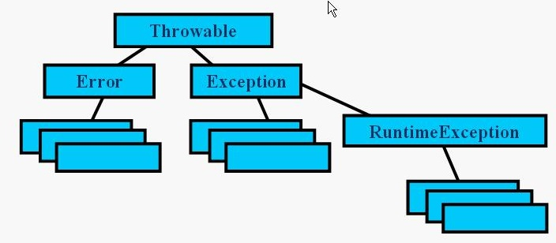

##  JAVA基础之异常体系

异常是运行期出现的错误。异常的层次：

~~~java
java.lang.Object
java.lang.Throwable
java.lang.Exception
java.lang.RuntimeException
java.lang.Error
java.lang.ThreadDeath
~~~

<!-- more -->

### 一、异常的概念

java异常是java提供的用于处理程序中错误的一种机制。java程序的执行过程中如果出现异常事件，java会自动生成一个异常对象，该异常对象封装了异常事件的信息并提交给java运行时系统，这个过程称为抛出（throw）异常。当javajava运行时系统接受到异常对象时，会寻找能处理这一异常的代码并把当前异常对象交给其处理，这一过程称为捕获（catch）异常

### 二、异常的分类

#### Throwable

Throwable 类是 Java 语言中所有错误或异常的超类。只有当对象是此类(或其子类之一)的实例时，才能通过 Java 虚拟机或者 Java throw 语句抛出。类似地，只有此类或其子类之一才可以是 catch 子句中的参数类型

两个子类的实例，Error 和 Exception，通常用于指示发生了异常情况。通常，这些实例是在异常情况的上下文中新近创建的，因此包含了相关的信息(比如堆栈跟踪数据)。

#### Exception

Exception 类及其子类是 Throwable 的一种形式，它指出了合理的应用程序想要捕获的条件，表示程序本身可以处理的异常

1. 运行时异常

   RuntimeException类及其子类都被称为运行时异常，这种异常的特点是Java编译器不去检查它，也就是说，当程序中可能出现这类异常时，即使没有用try...catch语句捕获它，也没有用throws字句声明抛出它，还是会编译通过

2. 受检查异常

   除了RuntimeException类及其子类外，其他的Exception类及其子类都属于受检查异常，这种异常的特点是要么用try...catch捕获处理，要么用throws语句声明抛出，否则编译不会通过

3. 两者的区别

   - 运行时异常表示无法让程序恢复运行的异常，导致这种异常的原因通常是由于执行了错误的操作。一旦出现错误，建议让程序终止。
   - 受检查异常表示程序可以处理的异常。如果抛出异常的方法本身不处理或者不能处理它，那么方法的调用者就必须去处理该异常，否则调用会出错，连编译也无法通过。当然，这两种异常都是可以通过程序来捕获并处理的

#### Error

称为错误，由java虚拟机生成并抛出，包括动态链接失败，虚拟机错误等，程序对其不做处理

#### Runtime Exception

一类特殊的异常，如：除以0、数组下标越界等，可以处理也可以不处理，用户的显示声明或捕获对程序的可读性和运行效率影响大，因此由系统自动检测并将他们交给缺省的异常处理程序。

#### ThreadDeath

调用 Thread 类中带有零参数的 stop 方法时，受害线程将抛出一个 ThreadDeath 实例。

仅当应用程序在被异步终止后必须清除时才应该捕获这个类的实例。如果 ThreadDeath 被一个方法捕获，那么将它重新抛出非常重要，因为这样才能让该线程真正终止。如果没有捕获 ThreadDeath，则顶级错误处理程序不会输出消息。

虽然 ThreadDeath 类是“正常出现”的，但它只能是 Error 的子类而不是 Exception 的子类，因为许多应用程序捕获所有出现的 Exception，然后又将其放弃

### 三、异常的捕获和处理

当方法抛出的异常不是Runtime Exception时，则必须捕获处理，finally语句不管有没有异常都会执行

#### Catch语句

~~~java
getMessage();//用来得到有关异常事件的信息
printStackTrace();//用来跟踪异常事件发生时执行堆栈的内容
~~~

#### Finally语句

finally语句为异常处理提供的统一的出口，无论try指定的程序是否抛出异常，finally都会执行。通常在finally中进行资源的清楚工作，如：关闭打开的文件，清除临时文件等

### 四、自定义异常

1. 通过继承java.lang.Exception类声明自己的异常类
2. 在方法适当的位置生成自定义异常的实例，并用throw语句抛出
3. 在方法的声明部分用throws语句声明该方法可能抛出的异常

异常与重写的关系：

>  重写方法需要抛出与原方法所抛出异常类型一致的异常或不抛异常

~~~java
public void test2() throws MyException{
　　... 
　　try { 
　　... 
　　} catch (MyException e) { 
　　throw e; //捕获了异常，然后又和盘托出，没有意义
　　} 
　　}
~~~

### 五、示例代码

~~~java
import java.io.*
public class TestEx {
	public static void main(String[] args) {	
		try {
			new TestEx().f2();
		} catch (IOException e) {
			e.printStackTrace();
		}
		
		/*
		int[] arr = {1, 2, 3};
		System.out.println(arr[2]);
		try {
			System.out.println(2/0); //用0做了除数，会抛出java.lang.ArithmeticException的异常
		} catch (ArithmeticException e) {
			System.out.println("系统正在维护,请与管理员联系");
			e.printStackTrace();
		}
		*/
		
		//TestEx te = new TestEx();
		//te.m(0);
		
		/*
		try {
			new TestEx().m(0);
		} catch (ArithmeticException ae) {
			ae.printStackTrace();
			System.out.println("出错了");
		}
		*/	
		FileInputStream in = null;
		
    try {
        in = new FileInputStream("myfile.txt");
        int b;
        b = in.read();
        while (b != -1) {
            System.out.print((char) b);
            b = in.read();
        }
    } catch (FileNotFoundException e) {
      System.out.println(e.getMessage());
     	
    } catch (IOException e) {
    	e.printStackTrace(); 
      
    } finally {
    	try {
      	in.close();
      } catch (IOException e) {
      	e.printStackTrace();
      }
    }
	}
	
	void m(int i) throws ArithmeticException {
		if(i==0) 
			throw new ArithmeticException("被除数为0");
	}
	
	void f() throws FileNotFoundException , IOException {
		FileInputStream in = new FileInputStream("myfile.txt");
    int b;
    b = in.read();
    while (b != -1) {
        System.out.print((char) b);
        b = in.read();
    }
	}
	void f2() throws IOException {
		/*
		try {
			f();
		} catch (FileNotFoundException e) {
			System.out.println(e.getMessage());
		} catch (IOException e) {
			e.printStackTrace();
		}
		*/
		f();
	}
}
~~~

### 六、异常转型和异常链

1. 异常转型

   异常转型，实际上就是捕获到异常后，将异常以新的类型的异常再抛出，这样做一般为了异常的信息更直观。比如：

   ~~~java
   public void run() throws MyException{
   　　... 
   　　try{ 
   　　... 
   　　}catch(IOException e){ 
   　　... 
   　　throw new MyException(); 
   　　}finally{ 
   　　... 
   　　} 
   　　}
   ~~~

2. 异常链

   异常链，在JDK1.4以后版本中，Throwable类支持异常链机制。Throwable 包含了其线程创建时线程执行堆栈的快照。它还包含了给出有关错误更多信息的消息字符串。最后，它还可以包含 cause(原因)：另一个导致此 throwable 抛出的 throwable。它也称为异常链 设施，因为 cause 自身也会有 cause，依此类推，就形成了异常链，每个异常都是由另一个异常引起的。

   通俗的说，异常链就是把原始的异常包装为新的异常类，并在新的异常类中封装了原始异常类，这样做的目的在于找到异常的根本原因。

   ~~~java
   //通过Throwable的两个构造方法可以创建自定义的包含异常原因的异常类型：
   Throwable(String message, Throwable cause);//构造一个带指定详细消息和 cause 的新 throwable。
   Throwable(Throwable cause);//构造一个带指定 cause 和 (cause==null ? null :cause.toString())(它通常包含类和 cause 的详细消息)的详细消息的新 throwable。

   getCause();//返回此 throwable 的 cause;如果 cause 不存在或未知，则返回 null。
   initCause(Throwable cause);//将此 throwable 的 cause 初始化为指定值。

   //在Throwable的子类Exception中，也有类似的指定异常原因的构造方法：

   Exception(String message, Throwable cause);//构造带指定详细消息和原因的新异常。
   Exception(Throwable cause);//根据指定的原因和 (cause==null ? null : cause.toString()) 的详细消息构造新异常
   //因此，可以通过扩展Exception类来构造带有异常原因的新的异常类。
   ~~~

### 七、Java异常处理的原则和技巧

1. 避免过大的try块，不要把不会出现异常的代码放到try块里面，尽量保持一个try块对应一个或多个异常
2. 细化异常的类型，不要不管什么类型的异常都写成Excetpion
3. catch块尽量保持一个块捕获一类异常，不要忽略捕获的异常，捕获到后要么处理，要么转译，要么重新抛出新类型的异常
4. 不要把自己能处理的异常抛给别人
5. 不要用try...catch参与控制程序流程，异常控制的根本目的是处理程序的非正常情况。

