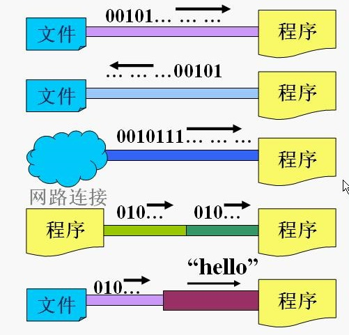
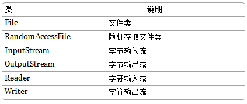
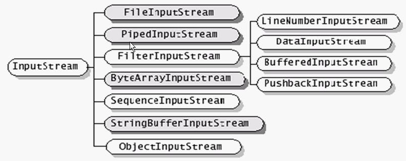
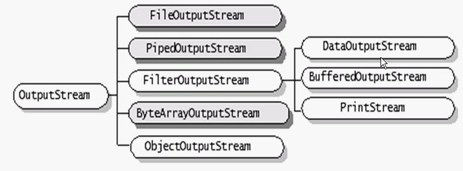
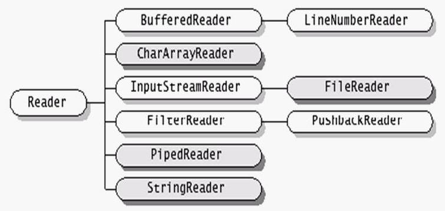
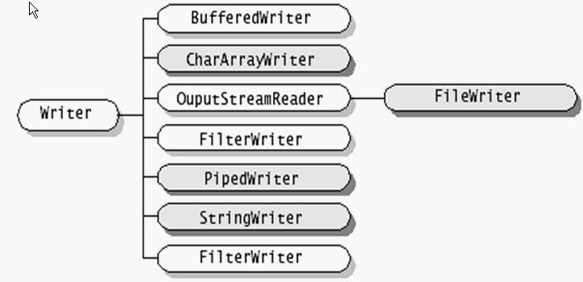
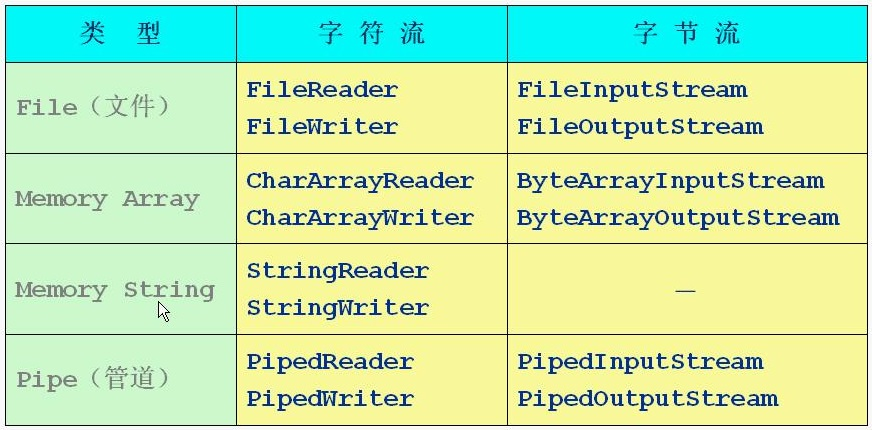
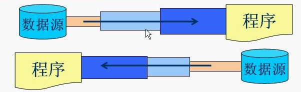
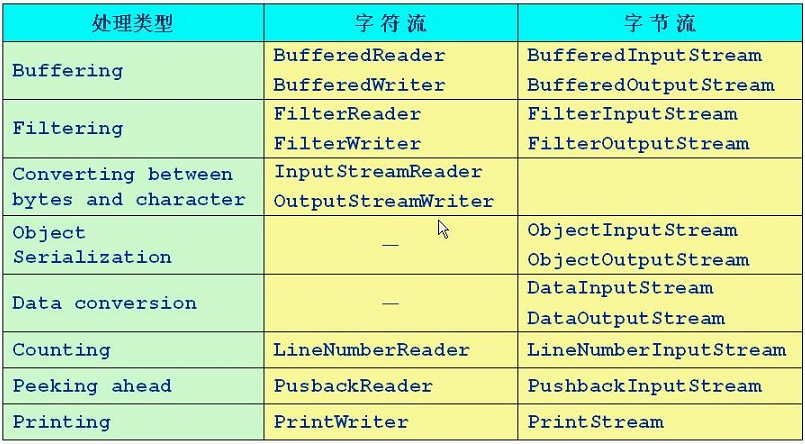

## JAVA基础之IO流

流是一组有顺序的，有起点和终点的字节集合，是对数据传输的总称或抽象。即数据在两设备间的传输称为流，**流的本质是数据传输，根据数据传输特性将流抽象为各种类，方便更直观的进行数据操作。**下面是整个数据流结构：

<!-- more -->

### 一、java流的输入输出原理

在java程序中，对于数据的输入输出操作以流（Stream）方式进行。

java有关流操作的类或接口：

### 二、流的分类

- 根据处理数据类型的不同分为：字符流和字节流
- 根据数据流向不同分为：输入流和输出流
- 按照功能不同分为：节点流和处理流

|      | 字节流          | 字符流    |
| ---- | ------------ | ------ |
| 输入流  | InputStream  | Reader |
| 输出流  | OutputStream | Writer |

J2SDK所提供的所有流类型位于包java.io内都分别集成自以上四种抽象流类型

### 三、输入流和输出流

对输入流只能进行读操作，对输出流只能进行写操作，程序中需要根据待传输数据的不同特性而使用不同的流。 输入流和输出流是站在程序的角度划分的

####  InputStream 

1. 输入字节流InputStream ：（深色的为节点流，浅色为处理流）
   - 继承自InputStream 的类都是用于向程序输入数据，数据单位为字节（8bit）
   - InputStream 是所有的输入字节流的父类，它是一个抽象类
   - ByteArrayInputStream、StringBufferInputStream、FileInputStream 是三种基本的介质流，它们分别从Byte 数组、StringBuffer、和本地文件中读取数据。PipedInputStream 是从与其它线程共用的管道中读取数据
   - ObjectInputStream 和所有FilterInputStream 的子类都是装饰流（装饰器模式的主角）

2. InputStream 常用方法：

   ~~~java
   //读取一个字节，并以整数形式返回（0-255），输入流末尾返回-1
   int read() throws IOException
   //读取一系列字节，并存储到一个数组buffer，返回实际读取的字节数
   int read(byte[] buffer) throws IOException
   //读取length个字节，从offset开始，返回实际读取的字节数
   int read(byte[] buffer,int offset,int length) throws IOException
   //关闭流，释放内存资源
   void close() throws IOException
   //跳过n个字节不读，返回实际调过的字节数
   long skip(long n) throws IOException
    
   ~~~

3. 细节：

   ~~~java
   /*字节流的read()方法读取一个字节。为什么返回的不是byte类型，而是int类型呢？
   因为read方法读到末尾时返回的是-1，而在所操作的数据中的很容易出现连续多个1的情况，而连续读到8个1，就是-1，导致读取会提前停止。所以将读到的一个字节给提升为一个int类型的数值，但是只保留原字节，并在剩余二进制位补0

   对于write方法，可以一次写入一个字节，但接收的是一个int类型数值。只写入该int类型的数值的最低一个字节（8位）
   */
   ~~~

####  OutputStream 

1. 输出字节流OutputStream : （深色的为节点流，浅色为处理流）

   - 继承自OutputStream 的类都是用于向程序输出数据，数据单位为字节（8bit）

   - OutputStream 是所有的输出字节流的父类，它是一个抽象类

   - ByteArrayOutputStream、FileOutputStream 是两种基本的介质流，它们分别向Byte 数组、和本地文件中写入数据。PipedOutputStream 是向与其它线程共用的管道中写入数据

   - ObjectOutputStream 和所有FilterOutputStream 的子类都是装饰流

     

2. OutputStream常用方法：

   ~~~java
   //向输出流中写入一个字节，该字节数据为参数b的低8位
   void write(int b) throws IOException
   //将一个字节类型的数组中的数据写入输出流
   void write(byte[] b) throws IOException
   //将一个字节类型的数组中的数据从指定位置offset开始的length个字节写入输出流
   void write(byte[] b，int offest,int length) throws IOException
   //关闭流，释放内存资源
   void close() throws IOException
   //将输出流中缓存的数据全部写出到目的地
   void flush() throws IOException
   ~~~

3. 字节流的输入输出不对应得流

   - LineNumberInputStream 主要完成从流中读取数据时，会得到相应的行号，至于什么时候分行、在哪里分行是由改类主动确定的，并不是在原始中有这样一个行号。在输出部分没有对应的部分，我们完全可以自己建立一个LineNumberOutputStream，在最初写入时会有一个基准的行号，以后每次遇到换行时会在下一行添加一个行号，看起来也是可以的。好像更不入流了。
   - PushbackInputStream 的功能是查看最后一个字节，不满意就放入缓冲区。主要用在编译器的语法、词法分析部分。输出部分的BufferedOutputStream 几乎实现相近的功能。
   - StringBufferInputStream 已经被Deprecated，本身就不应该出现在InputStream 部分，主要因为String 应该属于字符流的范围。已经被废弃了，当然输出部分也没有必要需要它了！还允许它存在只是为了保持版本的向下兼容而已。
   - SequenceInputStream 可以认为是一个工具类，将两个或者多个输入流当成一个输入流依次读取。完全可以从IO 包中去除，还完全不影响IO 包的结构，却让其更“纯洁”――纯洁的Decorator 模式。
   - PrintStream 也可以认为是一个辅助工具。主要可以向其他输出流，或者FileInputStream 写入数据，本身内部实现还是带缓冲的。本质上是对其它流的综合运用的一个工具而已。一样可以踢出IO 包！System.out 和System.out 就是PrintStream 的实例！

### 四、字节流和字符流

字符流的由来： 因为数据编码的不同，而有了对字符进行高效操作的流对象。本质其实就是基于字节流读取时，去查了指定的码表。 字节流和字符流的区别：

- 读写单位不同：字节流以字节（8bit）为单位，字符流以字符(16bit)为单位，根据码表映射字符，一次可能读多个字节
- 处理对象不同：字节流能处理所有类型的数据（如图片、avi等），而字符流只能处理字符类型的数据

结论：只要是处理纯文本数据，就优先考虑使用字符流。 除此之外都使用字节流

####  Reader 

1. 字符输入流Reader ：（深色的为节点流，浅色为处理流）
   - 继承自Reader 的类都是用于向程序输入数据，数据单位为字符（16bit）
   - Reader 是所有的输入字符流的父类，它是一个抽象类
   - CharReader、StringReader 是两种基本的介质流，它们分别将Char 数组、String中读取数据。PipedReader 是从与其它线程共用的管道中读取数据
   - BufferedReader 很明显就是一个装饰器，它和其子类负责装饰其它Reader 对象
   - FilterReader 是所有自定义具体装饰流的父类，其子类PushbackReader 对Reader 对象进行装饰，会增加一个行号
   - InputStreamReader 是一个连接字节流和字符流的桥梁，它将字节流转变为字符流。FileReader 可以说是一个达到此功能、常用的工具类，在其源代码中明显使用了将FileInputStream 转变为Reader 的方法。我们可以从这个类中得到一定的技巧。Reader 中各个类的用途和使用方法基本和InputStream 中的类使用一致

2. Reader 常用方法：

   ~~~java
   //同InputStream 
   ~~~

####  Writer

1. 字符输出流Writer：（深色的为节点流，浅色为处理流）
   - 继承自Writer的类都是用于向程序输出数据，数据单位为字符（16bit）
   - Writer 是所有的输出字符流的父类，它是一个抽象类
   - CharArrayWriter、StringWriter 是两种基本的介质流，它们分别向Char 数组、String 中写入数据。PipedWriter 是向与其它线程共用的管道中写入数据
   - BufferedWriter 是一个装饰器为Writer 提供缓冲功能
   - PrintWriter 和PrintStream 极其类似，功能和使用也非常相似
   - OutputStreamWriter 是OutputStream 到Writer 转换的桥梁，它的子类FileWriter 其实就是一个实现此功能的具体类（具体可以研究一SourceCode）。功能和使用和OutputStream 极其类似

2. Writer常用方法：

   ~~~java
   //同OutputStream
   //将一个字符串中的字符写入到输出流
   void write(String string) throws IOException
   void write(String string,int offest,int length) throws IOException
   ~~~

#### FileWriter

1. FileWriter：该类没有特有的方法只有自己的构造函数。该类特点在于：

   - 用于处理文本文件
   - 该类中有默认的编码表
   - 该类中有临时缓冲
   - 构造函数：在写入流对象初始化时，必须要有一个存储数据的目的地
   - 对于读取或者写入流对象的构造函数，以及读写方法，还有刷新关闭功能都会抛出IOException或其子类

2. 细节：在java中，当指定绝对路径时，定义目录分隔符有两种方式：

   - 反斜线但是一定要写两个

   > new FileWriter("c:\\ \demo.txt");

   - 正斜线/ 写一个即可

   > new FileWriter("c:/demo.txt");

### 五、节点流和处理流

#### 节点流

1. 节点流为可以从一个特定的数据源（节点）读写数据（如：文件，内存）

2. 节点流类型

- FileInputStream

  ~~~java
  public class TestFileInputStream{
    public static void main(String[] args){
      int b = 0;
      FileInputStream in = null;
      try{
        in = new FileInputStream("d:\\java\\io\\TestFileInputStream.java");//windows下的处理java的反斜杠，可直接使用/
        //in.available();//获取关联的文件的字节数。
      }catch(FileNotFoundException e){
        syso("找不到指定文件");
        system.exit(-1);//程序退出
      }
      
      try{
        long num = 0;
        while((b=in.read()) != -1){
          syso((char)b);
          num++;
        }
        in.close();
        syso();
        syso("共读了"+num+"个字节");
      }catch(IOException e1){
        syso("文件读取错误！");
        system.exit(-1);//程序退出
      }
    }
  }
  ~~~

  FileReader同FileInputStream

- FileOutputStream

  ~~~java
  public class TestFileOutputStream{
    public static void main(String[] args){
      int b = 0;
      FileInputStream in = null;
      FileOutputStream out = null;
      try{
        in = new FileInputStream("d:\\java\\io\\Test.java");//windows下的处理java的反斜杠，可直接使用/
        out = new FileOutputStream("d:\\java\\io\\hello.java");//当找不到文件时，系统会自动创建，但不会创建目录
        while((b=in.read()) != -1){
          out.write(b);//从Test中读出来写入hello中
        }
        in.close();
        out.close();
      }catch(FileNotFoundException e){
        syso("找不到指定文件！");
        system.exit(-1);//程序退出
      }catch(IOException e1){
        syso("文件复制错误！");
        system.exit(-1);//程序退出
      }
      syso("文件已复制！");
    }
  }
  ~~~

  FileWriter同FileOutputStream

#### 处理流

1. 处理流是连接在已存在的流（节点流或处理流）之上，通过对数据的处理为程序提供更强大的读写功能

2. 处理流类型

### 六、缓冲流

缓冲流套接在相应的节点流之上，对读写的数据提供了缓冲的功能，提高了读写的效率，同时增加了一些新的方法

~~~java
//J2SDK提供了四种	缓冲流，其常用的构造方法为：
BufferedReader(reader in);
BufferedReader(reader in,int size);//自定义缓冲区大小
BufferedWriter(Writer in);
BufferedWriter(Writer in,int size);
BufferedInputStream(InputStream in);
BufferedInputStream(InputStream in,int size);
BufferedOutputStream(OutputStream in);
BufferedOutputStream(OutputStream in,int size);
~~~

- 缓冲输入流支持其父类的mark和reset方法
- BufferedReader提供了readLine方法用于读取一行字符串（以\r或\n分隔），末尾返回null
- BufferedWriter提供了newLine用于写入一个行分隔符（跨平台的换行符）
- 对于输出的缓冲流，写出的数据会先在内存中缓存，使用flush方法会将内存中的数据立刻写出
- 在使用缓冲区对象时，要明确，缓冲的存在是为了增强流的功能而存在，所以在建立缓冲区对象时，要先有流对象存在

1. 写入缓冲区对象

   ~~~java
   //建立缓冲区对象必须把流对象作为参数传递给缓冲区的构造函数。
   BufferedWriter bufw = new BufferedWriter(new FileWriter("buf.txt"));
   bufw.write("abce");//将数据写入到了缓冲区。
   bufw.flush();//对缓冲区的数据进行刷新。将数据刷到目的地中。
   bufw.close();//关闭缓冲区，其实关闭的是被包装在内部的流对象。

   //如果文件体积不是很大
   byte[] buf = new byte[fis.available()];//创建一个刚刚好的缓冲区
   //但是这有一个弊端，就是文件过大，大小超出jvm的内容空间时，会内存溢出
   ~~~

2. 读取缓冲区对象

   ~~~java
   BufferedReader bufr = new BufferedReader(new FileReader("buf.txt"));
   String line = null;
   //按照行的形式取出数据。取出的每一个行数据不包含回车符。
   while((line=bufr.readLine())!=null)
   {
   System.out.println(line);
   }
   bufr.close();
   ~~~

3. BufferedInputStream

   ~~~java
   public class TestBufferedInputStream{
     public static void main(String[] args){
       try{
        //windows下的处理java的反斜杠，可直接使用/
        FileInputStream fis = new FileInputStream("d:\\java\\io\\hello.java");
        BufferedInputStream bis = new BufferedInputStream(fis);
         
        int c = 0;
        syso(bis.read());
        syso(bis.read());
        bis.mark(100);//标记。从100字节开始读
         
        for(int i=0;i <=10 && (c = bis.read()) != -1;i++){
          syso(c+" ");
        }
        syso();
        bis.reset();//重置到标记处
        
        for(int i=0;i <=10 && (c = bis.read()) != -1;i++){
          syso(c+" ");
        }
        bis.close();
       }catch(IOException e){
         e.printStackTrace();
       }
     }
   }
   ~~~

4. BufferedWriter

   ~~~java
   public class TestBufferedWriter{
     public static void main(String[] args){
       try{
        BufferedWriter bw = new BufferedWriter(new FileWriter("d:\\java\\io\\hello.java"));
        BufferedReader bw = new BufferedReader(new FileReader("d:\\java\\io\\hello.java"));
         
        String s = null;
        for(int i=1;i <= 100;i++){
          s = String.valueOf(Math.random());
          bw.write(s);
          bw.newLine();
        }
        bw.flush();
        while((s = br.readLine()) != null){
          syso(s);
        }
         
        bw.close();
        br.close();
       }catch(IOException e){
         e.printStackTrace();
       }
     }
   }
   ~~~

5. readLine()方法原理：

   其实缓冲区中的该方法，用的还是与缓冲区关联的流对象的read方法。只不过，每一次读到一个字符，先不进行具体操作，先进行临时存储。当读取到回车标记时，将临时容器中存储的数据一次性返回

### 七、转换流

1. 转换流的特点：

- 其是字符流和字节流之间的桥梁

- 可对读取到的字节数据经过指定编码转换成字符

- 可对读取到的字符数据经过指定编码转换成字节

- InputStreamReader 需要和 InputStream 套接

- OutputStreamWriter 需要和 OutputStream 套接

- 转换流在构造时可以指定其编码集合，例：

  > InputStream isr = new InputStreamReader(System.in,"ISO8859_1");

2. 何时使用转换流？

- 当字节和字符之间有转换动作时；
- 流操作的数据需要编码或解码时。

3. 具体的对象体现：

- InputStreamReader:字节到字符的桥梁
- OutputStreamWriter:字符到字节的桥梁

这两个流对象是字符体系中的成员，它们有转换作用，本身又是字符流，所以在构造的时候需要传入字节流对象进来。

4. 构造函数：

   ~~~java
   InputStreamReader(InputStream);//通过该构造函数初始化，使用的是本系统默认的编码表GBK。
   InputStreamReader(InputStream,String charSet);//通过该构造函数初始化，可以指定编码表。
   OutputStreamWriter(OutputStream);//通过该构造函数初始化，使用的是本系统默认的编码表GBK。
   OutputStreamWriter(OutputStream,String charSet);//通过该构造函数初始化，可以指定编码表。
   ~~~

5. InputStreamReader：

   ~~~java
   public class TestInputStreamReader{
     public static void main(String[] args){
        InputStreamReader isr = new InputStreamReader(System.in);
        Bufferedreader br = new Bufferedreader(isr);
        String s = null;
        try{
         s = br.readLine();
         while(s != null){
           if(s.equalsIgnoreCase("exit")){
             break;
           }
           System.out.println(s.toUpperCase());
           s = br.readLine();
         }
        br.close();
       }catch(IOException e){
         e.printStackTrace();
       }
     }
   }
   ~~~

6. OutputStreamWriter

   ~~~java
   public class TestOutputStreamWriter{
     public static void main(String[] args){
       try{
        OutputStreamWriter osw = new OutputStreamWriter(new FileOutputStream("d:\\java\\io\\hello.java"));
        osw.write("axsckdkjdnvkjsgfjsfhva");
        System.out.println(osw.getEncoding());//GBK--当前系统默认的编码（中文）
        osw.close();
         
         //true表示在原文件上追加，不加true则会覆盖原来的内容
        osw = new OutputStreamWriter(new FileOutputStream("d:\\java\\io\\hello.java",true),"ISO8859_1");
        osw.write("axsckdkjdnvkjsgfjsfhva");
        System.out.println(osw.getEncoding());
        
        osw.close();
       }catch(IOException e){
         e.printStackTrace();
       }
     }
   }
   ~~~

### 八、数据流

1. DataInputStream继承自InputStream，需要嵌套在InputStream上，属于处理流

2. DataOutputStream继承自OutputStream，需要嵌套在OutputStream上，属于处理流

3. DataInputStream和DataOutputStream提供了可以存取与机器无关的java原始类型数据（如：int,double等）的方法

4. 构造方法：

   ~~~java
   DataInputStream(InputStream in);
   DataOutputStream(OutputStream out);
   ~~~

5. 常用方法

   ~~~java
   //1.DataInputStream
   //操作基本数据类型的方法：
   int readInt();//一次读取四个字节，并将其转成int值。
   boolean readBoolean();//一次读取一个字节。
   short readShort();
   long readLong();
   //剩下的数据类型一样。
   String readUTF();//按照utf-8修改版读取字符。注意，它只能读writeUTF()写入的字符数据。

   //2.DataOutputStream
   //操作基本数据类型的方法:
   writeInt(int);//一次写入四个字节。
   //注意和write(int)不同。write(int)只将该整数的最低一个8位写入。剩余三个8位丢弃。
   writeBoolean(boolean);
   writeShort(short);
   writeLong(long);
   //剩下是数据类型也也一样。
   writeUTF(String);//按照utf-8修改版将字符数据进行存储。只能通过readUTF读取。
   //通常只要操作基本数据类型的数据。就需要通过DataStram进行包装。通常成对使用
   ~~~

6. DataInputStream

   ~~~java
   public class TestDataInputStream{
     public static void main(String[] args){
       ByteArrayOutputStream baos = new ByteArrayOutputStream();//字节数组
       DataOutputStream dos = new DataOutputStream(baos);
       
       try{
        dos.writeDouble(Math.random());
        dos.writeBoolean(true);
        
        ByteArrayInputStream bais = new ByteArrayInputStream(baos.toByteArray());
        System.out.println(bais.available());
        
        DataInputStream dis = new DataInputStream(bais);
        System.out.println(dis.readDouble());
        System.out.println(dis.readBoolean());
       
        dos.close();
        dis.close();
       }catch(IOException e){
         e.printStackTrace();
       }
     }
   }
   ~~~

### 九、Print流

打印流，所以只有输出流

1. PrintWriter和PrintStream提供了重载的print和println方法用于多种数据类型的输出

2. PrintWriter和PrintStream的输出操作不会抛异常，通过检测错误状态获取错误信息

3. PrintWriter和PrintStream有自动flush功能

4. 构造方法：

   ~~~java
   PrintWriter(Writer out);
   PrintWriter(Writer out,boolean autoFlush);
   PrintWriter(OutputStream out);
   PrintWriter(OutputStream out,boolean autoFlush);

   PrintStream(OutputStream out);
   PrintStream(OutputStream out,boolean autoFlush);
   ~~~

5. PrintStream

   ~~~java
   public class TestPrintStream{
     public static void main(String[] args){
       PrintStream ps = null;
       
       try{
        FileOutputStream fos = new FileOutputStream("d:\\java\\io\\hello.java");
        ps = new PrintStream(fos);
       }catch(IOException e){
         e.printStackTrace();
       }
       if(ps != null){
         System.setOut(ps);//setOut表示将out指向ps
       }
       int in = 0;
       for(char c=0;c <= 6000;c++){
          System.out.print(c+" ");
          if(in++ >= 100){
            System.out.println();
            in = 0;
          }
       }
     }
   }
   ~~~

6. PrintStream

   ~~~java
   public class TestPrintStream{
     public static void main(String[] args){
      String fileName = args[0];
      if(fileName != null){
        list(fileName,System.out);
      }
       
     public static void list(String f,PrintStream ps){
       try{
         BufferedReader br = new BufferedReader(new FileReader(f));
       String s = null;
       while((s = br.readLine()) != null){
         ps.println(s);
       }
       br.close();
       }catch(IOException e){
         ps.println("无法读取文件");
       }
     }
   }
   ~~~

7. PrintWriter

   ~~~java
   public class TestPrintWriter{
     public static void main(String[] args){
      String s = null;
      BufferedReader br = new BufferedReader(new InputStreamReader(System.in));
       
     try{
         FileWriter fw = new FileWriter("d://logfile.log",true);
         PrintWriter log = new FileWriter(fw);
         while((s = br.readLine()) != null){
           if(s.equalsIgnoreCase("exit")){
             break;
           }
           System.out.println(s.toUpperCase());
           log.println("-----");
           log.println(s.toUpperCase());
           log.flush();
         }
         log.println("---"+new Date()+"--");
         log.flush();
         log.close();
       }catch(IOException e){
         e.printStackTrace();
       }
   }
   ~~~

### 十、Object流

直接将Object（整个）写入或读出

ObjectInputStream

ObjectOutputStream

可以通过这两个流对象直接操作已有对象并将对象进行本地持久化存储。存储后的对象可以进行网络传输

~~~java
public class TestPrintWriter{
  public static void main(String[] args){
    T t = new T();
    t.k = 8;
    FileOutputStream fos = new FileOutputStream("d:\\java\\io\\hello.java");
    ObjectOutputStream oos = new ObjectOutputStream(fos);
    oos.writeObject(t);
    oos.flush();
    oos.close();
    
    FileInputStream fis = new FileInputStream("d:\\java\\io\\hello.java");
    ObjectInputStream ois = new ObjectInputStream(fis);
    T tReader = (T)ois.readObject();
    System.out.println(tReader.i+" "+tReader.j+" "+tReader.d+" "+tReader.k);
  }
}

class T implements Serializable{
  int i = 10;
  int j = 9;
  double d = 2.3;
  int k = 15;
}
~~~

#### Serializable

1. 该接口其实就是一个没有方法的标记接口。用于给类指定一个UID。
2. 该UID是通过类中的可序列化成员的数字签名运算出来的一个long型的值。只要是这些成员没有变化，那么该值每次运算都一样。
3. 该值用于判断被序列化的对象和类文件是否兼容。
4. 如果被序列化的对象需要被不同的类版本所兼容。可以在类中自定义UID。

> 定义方式：static final long serialVersionUID = 42L;

5. 注意：对应静态的成员变量，不会被序列化。对应非静态也不想被序列化的成员而言，可以通过transient关键字修饰。通常，这两个对象成对使用

#### Transient

transient修饰的成员变量在序列化时不予考虑，不进行操作

####  Externalizable

自己控制自己的序列化过程。Serializable是JDK控制的序列化过程

方法：

~~~java
//从objectInput读出来
void readExternal(objectInput in);
//把自己写出去
void writeExternal(objectOutput out);
~~~

###  十一、集合对象Properties

类似于HashTable，Properties:该集合不需要泛型，因为该集合中的键值对都是String类型

1. 常见方法：

   ~~~java
   //1.存入键值对
   setProperty(key,value);
   //2.获取指定键对应的值
   value getProperty(key);
   //3.获取集合中所有键元素
   Enumeration propertyNames();
   Set<String> stringPropertyNames();//在jdk1.6版本给该类提供一个新的方法
   //4.列出该集合中的所有键值对，可以通过参数打印流指定列出到的目的地
   list(PrintStream);
   list(PrintWriter);
   //例：
   list(System.out);//将集合中的键值对打印到控制台
   list(new PrintStream("prop.txt"));//将集合中的键值对存储到prop.txt文件中
   //5.可以将流中的规则数据加载进行集合，并称为键值对
   load(InputStream);
   load(Reader);//jdk1.6版本。提供了新的方法
   //注意：流中的数据要是"键=值" 的规则数据
   //6.可以将集合中的数据进行指定目的的存储
   store(OutputStram,String comment);
   store(Writer ,String comment);//jdk1.6版本。提供了新的方法,使用该方法存储时，会带着当时存储的时间
   ~~~

### 十二、File

该类的出现是对文件系统的中的文件以及文件夹进行对象的封装。可以通过对象的思想来操作文件以及文件夹

1. 构造函数：

   ~~~java
   File(String filename);//将一个字符串路径(相对或者绝对)封装成File对象，该路径是可存在的，也可以是不存在。
   File(String parent,String child);
   File(File parent,String child);
   ~~~

2. separator

   跨平台的目录分隔符，如：

   ~~~java
   File file = new File("c:"+File.separator+"abc"+File.separator+"a.txt");
   ~~~

3. 常见方法：

   ~~~java
   //1.创建
   boolean createNewFile()throws IOException;//创建文件，如果被创建的文件已经存在，则不创建。
   boolean mkdir();// 创建文件夹。
   boolean mkdirs();// 创建多级文件夹。
   //2.删除
   boolean delete();//可用于删除文件或者文件夹。
   //注意：对于文件夹只能删除不带内容的空文件夹，
   //对于带有内容的文件夹，不可以直接删除，必须要从里往外删除。
   void deleteOnExit():;//删除动作交给系统完成。无论是否反生异常，系统在退出时执行删除动作。
   //3.判断
   boolean canExecute();
   boolean canWrite();
   boolean canRead();
   boolean exists();//判断文件或者文件夹是否存在。
   boolean isFile();// 判断File对象中封装的是否是文件。
   boolean isDirectory();//判断File对象中封装的是否是文件夹。
   boolean isHidden();//判断文件或者文件夹是否隐藏。在获取硬盘文件或者文件夹时，
   //对于系统目录中的文件，java是无法访问的，所以在遍历，可以避免遍历隐藏文件。
   //4.获取
   getName();//获取文件或者文件夹的名称。
   getPath();//File对象中封装的路径是什么，获取的就是什么。
   getAbsolutePath();//无论File对象中封装的路径是什么，获取的都是绝对路径。
   getParent():;//获取File对象封装文件或者文件夹的父目录。
   //注意：如果封装的是相对路径，那么返回的是null.
   long length();//获取文件大小。
   longlastModified();//获取文件或者文件最后一次修改的时间。
   static File[] listRoots();//获取的是被系统中有效的盘符。
   String[] list();//获取指定目录下当前的文件以及文件夹名称。
   String[] list(Filenamefilter);//可以根据指定的过滤器，过滤后的文件及文件夹名称。
   File[] listFiles();//获取指定目录下的文件以及文件夹对象。
   //5.重命名
   renameTo(File);
   File f1 = new File("c:\\a.txt");
   File f2 = new File("c:\\b.txt");
   f1.renameTo(f2);//将c盘下的a.txt文件改名为b.txt文件。
   ~~~

### 十三、操作数组的流对象

1. 操作字节数组

   ~~~java
   ByteArrayInputStream
   ByteArrayOutputStream
   toByteArray();
   toString();
   writeTo(OutputStream);
   ~~~

2. 操作字符数组

   ~~~java
   CharArrayReader
   CharArrayWriter
   /*对于这些流，源是内存。目的也是内存。
   而且这些流并未调用系统资源。使用的就是内存中的数组。
   所以这些在使用的时候不需要close。
   操作数组的读取流在构造时，必须要明确一个数据源。所以要传入相对应的数组。
   对于操作数组的写入流，在构造函数可以使用空参数。因为它内置了一个可变长度数组作为缓冲区
   */
   ~~~

   ​

