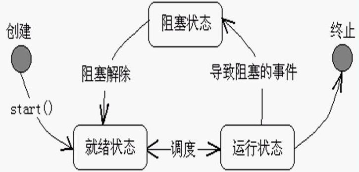
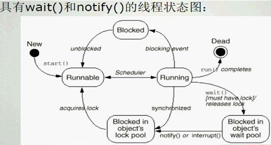
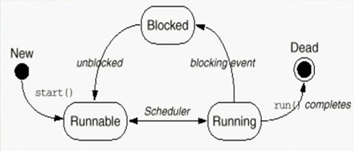
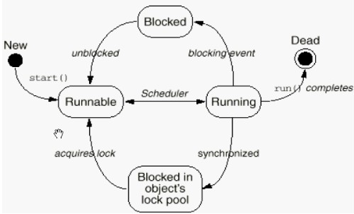

## java基础之多线程

线程是程序内的顺序控制流。一个程序里面不同的执行路径

多线程指的是在单个程序中可以同时运行多个同的线程执行不同的任务，只能使用分配给序的资源和环境

<!-- more -->

### 一、线程与进程的区别

1. 进程

   进程只是一个静态概念，机器上的一个class文件，机器上的一个exe文件等这些叫进程

2. 线程与进程的区别

   多个进程的内部数据和状态都是完全独立的,而多线程是共享一块内存空间和一组系统资源,有可能互相影响。线程本身的数据通常只有寄存器数据，以及一个程序执行时使用的堆栈，所以线程的切换比进程切换的负担要小

   - 每个进程都有独立的代码和数据空间（进程上下文），进程间的切换会有较大的开销
   - 线程可以看成是轻量级的进程，同一类线程共享代码和数据空间，每个线程有独立的运行栈和程序技术器（pc），线程切换的开销小
   - 多进程：在操作系统中能同时运行多个任务（程序）
   - 多线程：在同一应用程序中有多个顺序流同时执行

3. 多线程编程的目的

   多线程编程的目的，就是**最大限度地利用CPU资源 **，当某一线程的处理不需要占用CPU而只和I/O等资源打交道时，让需要占用CPU资源的其它线程有机会获得CPU资源。从根本上说，这就是多线程编程的最终目的

4. 细节

   - 真正的多线程是存在多个cpu多核系统中的，指的是当前时间点有多个线程同步执行
   - 对于单核CPU来说，某一时刻只能有一个线程在执行（微观串行），从宏观角度来看，多个线程在同时执行（宏观并行）
   - 单核的**多线程 **体现：因为cpu执行速度很快，它可以将多个线程在空闲时刻执行，达到多线程效果，但这不是真正的多线程
   - 对于双核或双核以上的CPU来说，可以真正做到微观并行。
   - 单进程，dos是单进程的
   - 一个进程至少要包含一个线程
   - Java中如果我们自己没有产生线程，那么系统就会给我们产生一个线程（主线程，main方法就在主线程上运行），我们的程序都是由线程来执行的

### 二、java的线程实现

java的线程是通过java.lang.Thread类来实现的。VM启动时会有main方法定义的线程。可以通过创建Thread的实例来创建新的线程。线程的实现有两种方式，**第一种方式是继承Thread类，然后重写run方法；第二种是实现Runnable接口，然后实现其run方法。**将我们希望线程执行的代码放到run方法中，然后通过start方法来启动线程，**start方法首先为线程的执行准备好系统资源，然后再去调用run方法。**当某个类继承了Thread类之后，该类就叫做一个线程类。

#### 1. 线程实现Runnable接口

1. 定义线程类实现Runnable接口

2. 创建自己的线程类对象

   ~~~java
   Thread myThread = new Thread(target);//target为Runnable接口类型
   ~~~

3. Runnable中只有一个方法：

   ~~~java
   public void run()；//用于定义线程运行体
   ~~~

4. 使用Runnable接口可以为多个线程提供共享的数据

5. 在实现Runnable接口的类的run方法定义中可以使用Thread的静态方法

   ~~~java
   public static Thread currentThread();//获取当前线程的引用
   ~~~

代码体现：

~~~java
public class TestThread {
	public static void main(String args[]) {
		Runner1 r = new Runner1();
		//r.start();
		//r.run();
		Thread t = new Thread(r);
		t.start();
		for(int i=0; i<100; i++) {
			System.out.println("Main Thread:------" + i);
		}
	}
}

class Runner1 implements Runnable {
	public void run() {
		for(int i=0; i<100; i++) {	
			System.out.println("Runner1 :" + i);
		}
	}
}
~~~

start方法和run方法的区别：

1. start方法叫启动线程，上面的代码用start方法的结果：

   

   由于start方法启动了一个线程，所以该线程和main方法交替执行

2. run方法叫方法调用，上面的代码用run方法的结果：

   

   run称为方法调用，当该方法执行完才继续进行main方法执行

#### 2. 线程实现Thread子类

1. 定义一个Thread的子类并重写其run方法

   ~~~java
   class MyThread extends Thread {
      public void run(){
        ...
      }
   }
   ~~~

2. 然后生成该类的对象

   ~~~java
   MyThread myThread = new MyThread(...);
   ~~~

代码体现：

~~~java
public class TestThread {
	public static void main(String args[]) {
		Runner1 r = new Runner1();
		r.start();
		//r.run();
		for(int i=0; i<100; i++) {
			System.out.println("Main Thread:------" + i);
		}
	}
}

class Runner1 extends Thread {
	public void run() {
		for(int i=0; i<100; i++) {	
			System.out.println("Runner1 :" + i);
		}
	}
}
~~~

#### 3. 两种实现方法细节

接口比较灵活，能使用接口最好使用接口，使用接口还可以从其他类继承，但使用继承只能单继承

#### 4. Thread

1. Thread类也实现了Runnable接口，因此实现了Runnable接口中的run方法；
2. 当生成一个线程对象时，如果没有为其设定名字，那么线程对象的名字将使用如下形式：Thread-number,该number将是自动增加的，并被所有的Thread对象所共享（因为它是static的成员变量）。
3. 当使用第一种方式来生成线程对象时，我们需要重写run方法，因为Thread类的run方法此时什么事情也不做。
4. 当使用第二种方式生成线程对象时，我们需要实现Runnable接口的run方法，然后使用new Thread（new MyThread（））（假如MyThread已经实现了Runnable接口）来生成线程对象，这时的线程对象的run方法或调就会MyThread类的run方法，这样我们自己编写的run方法就执行了。

说明：

```java
Public void run(){

If(target!=null){

Target.run();

}}
```

当使用继承Thread生成线程对象时，target为空，什么也不执行，当使用第二种方式生成时，执行target.run（），target为runnable的实例对象，即为执行重写后的方法

总结：两种生成线程对象的区别：

1. 两种方法均需执行线程的start方法为线程分配必须的系统资源、调度线程运行并执行线程的run方法
2. 在具体应用中，采用哪种方法来构造线程体要视情况而定。通常，当一个线程已继承了另一个类时，就应该用第二种方法来构造，即实现Runnable接口。

### 三、线程的状态



线程控制基本方法：

~~~java
isAlive();//判断线程是否还活着（未终止）
getPriority();//获得线程的优先级数值
setPriority();//设置线程的优先级数值
Thread.sleep();//将当前线程睡眠指定毫秒数
join();//调用某线程的该方法，将当前线程与该线程合并，即等待该线程结束，再恢复当前线程的运行
yield();//让出cpu，当前线程进入就绪队列等待调度
wait();//当前线程进入对象的wait pool
notify();//唤醒对象的wait poll中的一个线程
notifyAll();//唤醒对象的wait poll中的所有线程
~~~

#### 1. sleep方法

~~~java
public static void sleep(long millis) throwsInterruptedException{}
~~~

~~~java
public class TestInterrupt {
  public static void main(String[] args) {
    MyThread thread = new MyThread();
    thread.start();
    try {Thread.sleep(10000);}//主线程休眠10秒钟后起来
    catch (InterruptedException e) {}
    thread.interrupt(); //打断休眠
    //thread.flag = false;
  }
}

class MyThread extends Thread {
  boolean flag = true;
  public void run(){
    while(flag){
      System.out.println("==="+new Date()+"===");
      try {
        sleep(1000);//一秒钟输出一次当前时间
      } catch (InterruptedException e) {
        return;//主线程起来则该线程被打断，捕获到异常则return结束
      }
    }
  }
}
~~~

#### 2. join方法

~~~java
package Thread;

public class TestJoin {
  public static void main(String[] args) {
    MyThread2 t1 = new MyThread2("abcde");
    t1.start();
    try {
    	t1.join();
    } catch (InterruptedException e) {}
    	
    for(int i=1;i<=10;i++){
      System.out.println("i am main thread");
    }
  }
}
class MyThread2 extends Thread {
  MyThread2(String s){
  	super(s);
  }
  public void run(){
    for(int i =1;i<=10;i++){
      System.out.println("i am "+getName());
      try {
      	sleep(1000);
      } catch (InterruptedException e) {
      	return;
      }
    }
  }
}
~~~

#### 3. yield方法

~~~java
public class TestYield {
  public static void main(String[] args) {
    MyThread3 t1 = new MyThread3("t1");
    MyThread3 t2 = new MyThread3("t2");
    t1.start(); 
    t2.start();
  }
}
class MyThread3 extends Thread {
  MyThread3(String s){
    super(s);
  }
  public void run(){
    for(int i =1;i<=100;i++){
      System.out.println(getName()+": "+i);
      if(i%10==0){
        yield();
      }
    }
  }
}

~~~

#### 4. wait和notify

1. wait与notify方法都是定义在Object类中，而且是final的，因此会被所有的Java类所继承并且无法重写。这两个方法要求在调用时线程应该已经获得了对象的锁，因此对这两个方法的调用需要放在synchronized方法或块当中
2. 当线程执行了wait方法时，它会释放掉对象的锁
3. 另一个会导致线程暂停的方法就是Thread类的sleep方法，它会导致线程睡眠指定的毫秒数，但线程在睡眠的过程中是不会释放掉对象的锁的
4. notify():唤醒在此对象监视器上等待的单个线程。如果所有线程都在此对象上等待，则会选择唤醒其中一个线程。选择是任意性的，并在对实现做出决定时发生。线程通过调用其中一个 wait 方法，在对象的监视器上等待直到当前线程放弃此对象上的锁定，才能继续执行被唤醒的线程。被唤醒的线程将以常规方式与在该对象上主动同步的其他所有线程进行竞争；例如，唤醒的线程在作为锁定此对象的下一个线程方面没有可靠的特权或劣势。此方法只应由作为此对象监视器的所有者的线程来调用。通过以下三种方法之一，线程可以成为此对象监视器的所有者：

- 通过执行此对象的同步实例方法
- 通过执行在此对象上进行同步的 synchronized 语句的正文
- 对于 Class 类型的对象，可以通过执行该类的同步静态方法
- 一次只能有一个线程拥有对象的监视器。




#### 5. 关于成员变量与局部变量

1. 如果一个变量是成员变量，那么多个线程对同一个对象的成员变量进行操作时，他们对该成员变量是彼此影响的（也就是说一个线程对成员变量的改变会影响到另一个线程）
2. 如果一个变量是局部变量，那么每个线程都会有一个该局部变量的拷贝，一个线程对该局部变量的改变不会影响到其他的线程

#### 6. 线程优先级

线程优先级范围是1到10，缺省是5

~~~java
Thread.MIN_PRIORITY = 1;
Thread.MAX_PRIORITY = 10;
Thread.NORM_PRIORITY = 5;
~~~

~~~java
public class TestPriority {
	public static void main(String[] args) {
		Thread t1 = new Thread(new T1());
		Thread t2 = new Thread(new T2());
		t1.setPriority(Thread.NORM_PRIORITY + 3);
		t1.start();
		t2.start();
	}
}

class T1 implements Runnable {
	public void run() {
		for(int i=0; i<1000; i++) {
			System.out.println("T1: " + i);
		}
	}
}

class T2 implements Runnable {
	public void run() {
		for(int i=0; i<1000; i++) {
			System.out.println("------T2: " + i);
		}
	}
}
~~~

#### 7. 面试：wait和sleep的区别

1. wait时别的线程可以访问锁定对象，调用wait方法（Object的方法）时候必须锁定该对象，等待时会丢掉锁
2. sleep时别的线程不可以访问锁定对象，睡着也会抱着锁


### 四、线程的生命周期



由上图可以看出，一个线程由出生到死亡分为五个阶段：

#### 1. 创建状态

- 当用new操作符创建一个新的线程对象时，该线程处于创建状态
- 处于创建状态的线程只是一个空的线程对象，系统不为它分配资源

#### 2. 可运行状态

- 执行线程的start()方法将为线程分配必须的系统资源，安排其运行，并调用线程体—run()方法，这样就使得该线程处于可运行( Runnable )状态
- 这一状态并不是运行中状态（Running )，因为线程也许实际上并未真正运行

#### 3. 不可运行状态

当发生下列事件时，处于运行状态的线程会转入到不可运行状态

- 调用了sleep（）方法；
- 线程调用wait方法等待特定条件的满足
- 线程输入/输出阻塞

#### 4. 返回可运行状态

- 处于睡眠状态的线程在指定的时间过去后
- 如果线程在等待某一条件，另一个对象必须通过notify()或notifyAll()方法通知等待线程条件的改变
- 如果线程是因为输入/输出阻塞，等待输入/输出完成

#### 5. 消亡状态

当线程的run方法执行结束后，该线程自然消亡。

注意：

1. 停止线程的方式：不能使用Thread类的stop方法来终止线程的执行。一般要设定一个变量，在run方法中是一个循环，循环每次检查该变量，如果满足条件则继续执行，否则跳出循环，线程结束。
2. 不能依靠线程的优先级来决定线程的执行顺序。

### 五、线程同步

实现线程同步的方法就是加锁，synchronized关键字修饰，表示该对象在任意时刻只能由一个线程访问。当synchronized关键字修饰一个方法的时候，该方法叫做同步方法

多线程并发是线程同步中比较常见的现象，java多线程为了避免多线程并发解决多线程共享数据同步问题提供了**synchronized关键字**

#### synchronized关键字：

1. Java中的每个对象都有一个锁（lock）或者叫做监视器（monitor），当访问某个对象的synchronized方法时，表示将该对象上锁，此时其他任何线程都无法再去访问该synchronized方法了，直到之前的那个线程执行方法完毕后（或者是抛出了异常），那么将该对象的锁释放掉，其他线程才有可能再去访问该synchronized方法
2. 如果一个对象有多个synchronized方法，某一时刻某个线程已经进入到了某个synchronized方法，那么在该方法没有执行完毕前，其他线程是无法访问该对象的任何synchronized方法的
3. 如果某个synchronized方法是static的，那么当线程访问该方法时，它锁的并不是synchronized方法所在的对象，而是synchronized方法所在的对象所对应的Class对象，因为Java中无论一个类有多少个对象，这些对象会对应唯一一个Class对象，因此当线程分别访问同一个类的两个对象的两个static，synchronized方法时，他们的执行顺序也是顺序的，也就是说一个线程先去执行方法，执行完毕后另一个线程才开始执行
4. synchronized块，写法：

~~~java
synchronized(object)
{
//表示线程在执行的时候会对object对象上锁
}

~~~

5. synchronized方法是一种粗粒度的并发控制，某一时刻，只能有一个线程执行该synchronized方法;synchronized块则是一种细粒度的并发控制，只会将块中的代码同步，位于方法内、synchronized块之外的代码是可以被多个线程同时访问到的

同步的线程状态图：



#### 线程同步实例1

~~~java
//非线程同步
public class TestSync implements Runnable {
  Timer timer = new Timer();
  public static void main(String[] args) {
    TestSync test = new TestSync();
    Thread t1 = new Thread(test);
    Thread t2 = new Thread(test);
    t1.setName("t1"); 
    t2.setName("t2");
    t1.start(); 
    t2.start();
  }
  public void run(){
    timer.add(Thread.currentThread().getName());
  }
}

class Timer{
  private static int num = 0;
  public synchronized void add(String name){ 
	    num ++;
	    try {Thread.sleep(1);} 
	    catch (InterruptedException e) {}
	    System.out.println(name+", 你是第"+num+"个使用timer的线程");
  }
}
/*结果：
	t1, 你是第2个使用timer的线程
	t2, 你是第2个使用timer的线程
*/
~~~

#### 线程同步实例2

~~~java
//死锁
public class TestDeadLock implements Runnable {
	public int flag = 1;
	static Object o1 = new Object(), o2 = new Object();
	public void run() {
System.out.println("flag=" + flag);
		if(flag == 1) {
			synchronized(o1) {
				try {
					Thread.sleep(500);
				} catch (Exception e) {
					e.printStackTrace();
				}
				synchronized(o2) {//td1锁住o1之后，只要再锁住o2就完成了
					System.out.println("1");	
				}
			}
		}
		if(flag == 0) {
			synchronized(o2) {
				try {
					Thread.sleep(500);
				} catch (Exception e) {
					e.printStackTrace();
				}
				synchronized(o1) {//td1锁住o2之后，只要再锁住o1就完成了
					System.out.println("0");
				}
			}
		}
	}	
	
	public static void main(String[] args) {
		TestDeadLock td1 = new TestDeadLock();
		TestDeadLock td2 = new TestDeadLock();
		td1.flag = 1;
		td2.flag = 0;
		Thread t1 = new Thread(td1);
		Thread t2 = new Thread(td2);
		t1.start();
		t2.start();
		
	}
}
~~~

#### 线程同步实例3

~~~java
//面试：m1执行过程中m2能执行吗？
public class TT implements Runnable {
	int b = 100;
	public synchronized void m1() throws Exception{
		b = 1000;
		Thread.sleep(5000);
		System.out.println("b = " + b);
	}
	
	public void m2() throws Exception {
		System.out.println(b);
	}
	
	public void run() {
		try {
			m1();
		} catch(Exception e) {
			e.printStackTrace();
		}
	}
	
	public static void main(String[] args) throws Exception {
		TT tt = new TT();
		Thread t = new Thread(tt);
		t.start();
		
		tt.m2();//若输出为100则说明m2不能执行，为1000（m1改为1000）则m2可以执行
	}
}
/*结果：
	1000
*/
~~~

####  线程同步实例4

~~~java
//卧槽，晕了似懂非懂啊：m1加锁，m2加锁与不加锁的执行过程
public class TT implements Runnable {
	int b = 100;
	public synchronized void m1() throws Exception{
		b = 1000;
		Thread.sleep(5000);
		System.out.println("b = " + b);
	}
	
	//public synchronized void m2() throws Exception {//m2加锁执行过程2
    public void m2() throws Exception { //m2不加锁执行过程1
		Thread.sleep(2500);
        b = 2000;
	}
	
	public void run() {
		try {
			m1();
		} catch(Exception e) {
			e.printStackTrace();
		}
	}
	
	public static void main(String[] args) throws Exception {
		TT tt = new TT();
		Thread t = new Thread(tt);
		t.start();
		
		tt.m2();
		System.out.println(tt.b);
	}
}
/*结果：
	执行过程1---m2不加锁：m1锁定过程中m2可以执行，将b的值设为2000，所以tt.b输出2000，m1休眠之后中输出b=2000
	执行过程2---m2加锁：tt.m2()方法执行完后m1方法才执行（m1执行时m2执行不了），将b的值设为1000，所以tt.b输出1000，m1中输出b=1000
 结论：当两个方法修改同一个值时都应该加锁保持同步
*/
~~~

### 六、死锁问题

定义：线程1锁住了对象A的监视器，等待对象B的监视器，线程2锁住了对象B的监视器，等待对象A的监视器，就造成了死锁。

导致死锁的根源在于不适当地运用“synchronized”关键词来管理线程对特定对象的访问。“synchronized”关键词的作用是，确保在某个时刻只有一个线程被允许执行特定的代码块，因此，被允许执行的线程首先必须拥有对变量或对象的排他性访问权。当线程访问对象时，线程会给对象加锁

Java中每个对象都有一把锁与之对应。但Java不提供单独的lock和unlock操作。下面分析死锁的两个过程“上锁”和“锁死” 

#### 上锁

许多线程在执行中必须考虑与其他线程之间共享数据或协调执行状态，就需要同步机制。因此大多数应用程序要求线程互相通信来同步它们的动作，在 Java 程序中最简单实现同步的方法就是上锁。在 Java 编程中，所有的对象都有锁。线程可以使用synchronized 关键字来获得锁。在任一时刻对于给定的类的实例，方法或同步的代码块只能被一个线程执行。这是因为代码在执行之前要求获得对象的锁。

为了防止同时访问共享资源，线程在使用资源的前后可以给该资源上锁和开锁。给共享变量上锁就使得 Java 线程能够快速方便地通信和同步。某个线程若给一个对象上了锁，就可以知道没有其他线程能够访问该对象。即使在抢占式模型中，其他线程也不能够访问此对象，直到上锁的线程被唤醒、完成工作并开锁。那些试图访问一个上锁对象的线程通常会进入睡眠状态，直到上锁的线程开锁。一旦锁被打开，这些睡眠进程就会被唤醒并移到准备就绪队列中。

#### 锁死 

如果程序中有几个竞争资源的并发线程,那么保证均衡是很重要的。系统均衡是指每个线程在执行过程中都能充分访问有限的资源，系统中没有饿死和死锁的线程。当多个并发的线程分别试图同时占有两个锁时，会出现加锁冲突的情形。如果一个线程占有了另一个线程必需的锁，互相等待时被阻塞就有可能出现死锁。

在编写多线程代码时，笔者认为死锁是最难处理的问题之一。因为死锁可能在最意想不到的地方发生，所以查找和修正它既费时又费力。例如，常见的例子如下面这段程序

~~~java
public int sumArrays(int[] a1, int[] a2){
  int value = 0;
  int size = a1.length;
  if (size == a2.length) {
    synchronized(a1) { //1
      synchronized(a2) { //2
      for (int i=0; i<size; i++)
        value += a1[i] + a2[i];
      }
    }
  } 
  return value;
}
~~~

这段代码在求和操作中访问两个数组对象之前锁定了这两个数组对象。它形式简短，编写也适合所要执行的任务；但不幸的是，它有一个潜在的问题。这个问题就是它埋下了死锁的种子

#### ThreadLocal类

首先，ThreadLocal 不是用来解决共享对象的多线程访问问题的，一般情况下，通过ThreadLocal.set() 到线程中的对象是该线程自己使用的对象，其他线程是不需要访问的，也访问不到的。各个线程中访问的是不同的对象
另外，说ThreadLocal使得各线程能够保持各自独立的一个对象，并不是通过ThreadLocal.set()来实现的，而是通过每个线程中的new 对象 的操作来创建的对象，每个线程创建一个，不是什么对象的拷贝或副本。通过ThreadLocal.set()将这个新创建的对象的引用保存到各线程的自己的一个map中，每个线程都有这样一个map，执行ThreadLocal.get()时，各线程从自己的map中取出放进去的对象，因此取出来的是各自自己线程中的对象，ThreadLocal实例是作为map的key来使用的
如果ThreadLocal.set()进去的东西本来就是多个线程共享的同一个对象，那么多个线程的ThreadLocal.get()取得的还是这个共享对象本身，还是有并发访问问题

### 八、生产者消费者问题

~~~java
public class ProducerConsumer {
	public static void main(String[] args) {
		SyncStack ss = new SyncStack();
		Producer p = new Producer(ss);
		Consumer c = new Consumer(ss);
		new Thread(p).start();
		new Thread(p).start();
		new Thread(p).start();
		new Thread(c).start();
	}
}

class WoTou {
	int id; 
	WoTou(int id) {
		this.id = id;
	}
	public String toString() {
		return "WoTou : " + id;
	}
}

class SyncStack { //用栈（先进后出）模拟生产和吃馒头
	int index = 0;
	WoTou[] arrWT = new WoTou[6];
	
	public synchronized void push(WoTou wt) {
		while(index == arrWT.length) {
			try {
				this.wait();//当前的正在访问的这个线程wait，Object的wait方法
			} catch (InterruptedException e) {
				e.printStackTrace();
			}
		}
		this.notifyAll();		
		arrWT[index] = wt;
		index ++;
	}
	
	public synchronized WoTou pop() {
		while(index == 0) {
			try {
				this.wait();
			} catch (InterruptedException e) {
				e.printStackTrace();
			}
		}
		this.notifyAll();
		index--;
		return arrWT[index];
	}
}

class Producer implements Runnable {
	SyncStack ss = null;
	Producer(SyncStack ss) {
		this.ss = ss;
	}
	
	public void run() {
		for(int i=0; i<20; i++) {
			WoTou wt = new WoTou(i);
			ss.push(wt);
			System.out.println("生产了：" + wt);
			try {
				Thread.sleep((int)(Math.random() * 200));
			} catch (InterruptedException e) {
				e.printStackTrace();
			}			
		}
	}
}

class Consumer implements Runnable {
	SyncStack ss = null;
	Consumer(SyncStack ss) {
		this.ss = ss;
	}
	
	public void run() {
		for(int i=0; i<20; i++) {//三个生产者生产了60个，一个消费者消费了20个
			WoTou wt = ss.pop();
			System.out.println("消费了: " + wt);
			try {
				Thread.sleep((int)(Math.random() * 1000));
			} catch (InterruptedException e) {
				e.printStackTrace();
			}			
		}
	}
}
~~~


